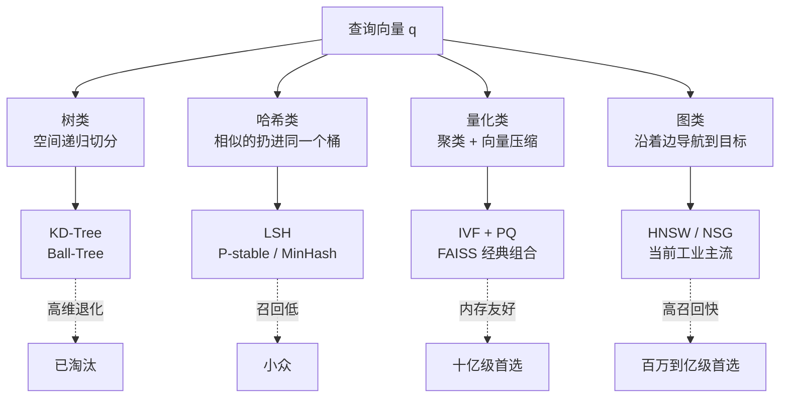
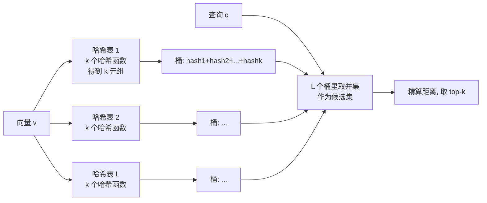
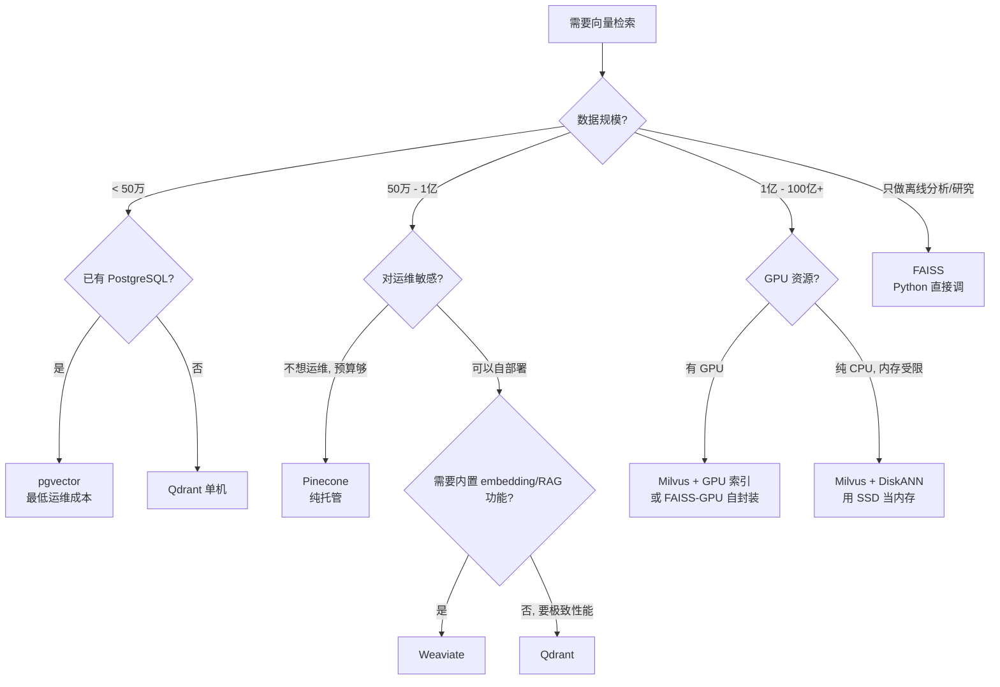
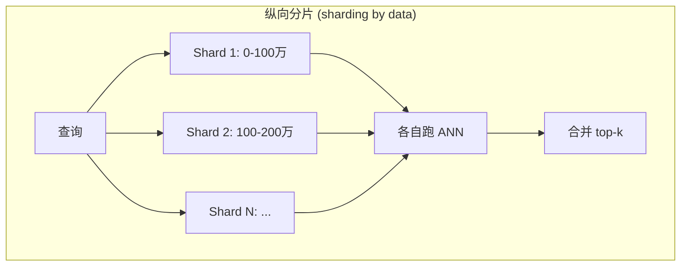
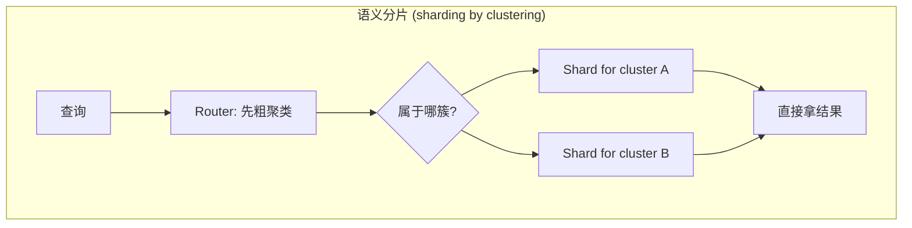
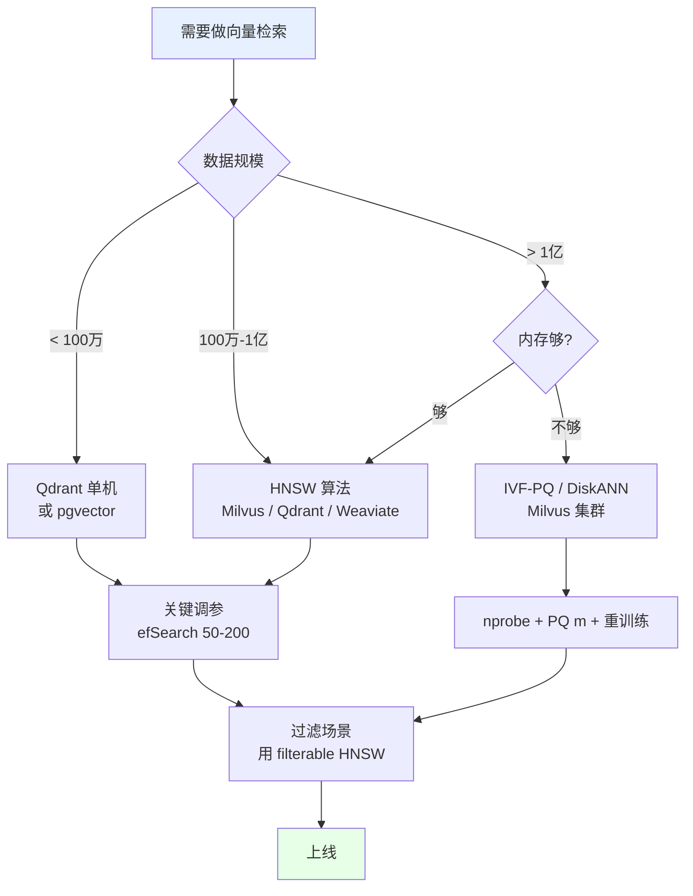

# 向量检索从入门到上手：ANN 算法的工业实战指南
> - 🎯 读完你将拥有：
> 
> 面向有计算机基础、对 ANN 零认知的读者。读完你将理解四大算法家族的本质差异、亲手实现 LSH/IVF/HNSW 的核心逻辑、能在 Milvus / Qdrant / pgvector 上跑起来一个 RAG 检索服务，并掌握工业选型和调参经验。

将自己在课堂上学到的知识以及做项目中遇到的相关知识进行提炼汇总，后续有新想法会继续更新。


## 引言：为什么 ANN 是 AI 基础设施的隐形支柱

2026 年，每一个你用过的"AI 应用"几乎都依赖向量检索：ChatGPT 的 RAG、Spotify 的"听起来像"、淘宝的以图搜图、抖音的内容推荐、人脸解锁、Notion AI 的文档搜索……都是同一个动作——**在亿级向量库里，毫秒级找出最相似的几个**。

这件事的核心难点不是"相似度怎么算"（这是数学题），而是"如何不算遍所有人就能找到最相似的"（这是工程题）。后者就是 **ANN（Approximate Nearest Neighbor Search，近似最近邻搜索）** 要解决的问题。

ANN 是一个反直觉的领域：它承认"我们找不到精确的答案，但我们能找到 99% 接近的答案，而且快 10000 倍"。这种"用一点点精度换巨量速度"的哲学，是现代 AI 基础设施能跑得起来的关键。

本文不打算把 ANN 当作"算法集合"来教。我们用一条主线把所有内容串起来：**给你一个 1 亿条向量的库，你要在 10ms 内找出最相似的 10 条——你会怎么干？**


## 第一章 地基：把"向量检索"这件事彻底说清楚

### 1.1 向量到底是什么

抛开数学定义，**向量就是一串有序的数字**。比如 `[0.31, -0.27, 0.88, ..., 0.05]`，一个 768 维的向量就是 768 个数字。

它的本质作用：**把任何东西变成一个"高维空间里的点"**。

- 一段文本被 BERT 编码成 768 维向量
- 一张图被 ResNet 编码成 2048 维向量
- 一段音频被 wav2vec 编码成 768 维向量

一旦数据被"嵌入（embed）"成向量，**判断两个东西相似不相似，就变成了判断两个点的距离远不远**。这是 AI 时代检索的底层逻辑。

### 1.2 距离度量：三个公式 + 一个反直觉点

工业上 99% 的场景只用三种距离。我们用查询向量 $q$ 和库中向量 $v$，维度为 $d$。

**欧氏距离（L2，Euclidean）**：

$$L_2(q, v) = \sqrt{\sum_{i=1}^d (q_i - v_i)^2}$$

人话：两点之间"直线距离"。适合图像特征、几何向量。

**曼哈顿距离（L1，Manhattan）**：

$$L_1(q, v) = \sum_{i=1}^d |q_i - v_i|$$

人话：像在曼哈顿街区走，只能横竖走。对异常值不敏感，少用。

**余弦距离（Cosine Distance）**：

$$\cos\_dist(q, v) = 1 - \frac{q \cdot v}{\|q\|\|v\|}$$

人话：只看两个向量"方向"是否一致，不在乎长度。文本嵌入几乎只用它。

**这里有个工业上极常见的坑**：如果你把向量都"归一化"成单位长度（$\|v\| = 1$），那么 **余弦距离和欧氏距离的排序完全等价**：

$$L_2^2(q, v) = 2 - 2(q \cdot v) = 2 \cdot \cos\_dist(q, v)$$

意思就是：**归一化以后，用点积（内积）代替距离计算，速度更快**。这就是为什么所有主流向量库（FAISS、Milvus、Qdrant）的"Inner Product (IP)"模式跑得最快——它假设你已经归一化了。

> **反直觉点 #1**：余弦相似度和欧氏距离在归一化后等价。所以工业代码里几乎所有的"向量检索"，底层算的都是点积。

### 1.3 精确 NN 为什么不可行：一个具体的数字

假设你有 10 亿条 128 维 float32 向量（一个典型的图片库规模）：

**内存占用**：$10^9 \times 128 \times 4 \text{ bytes} = 512 \text{ GB}$

**单次查询计算量**：每个向量算一次欧氏距离需要 $3d$ 次浮点运算（减、平方、加），总共 $10^9 \times 3 \times 128 \approx 3.84 \times 10^{11}$ FLOPs。

单核 CPU 大约 $10^{10}$ FLOPs/s。所以**一次查询要 38 秒**。哪怕用 GPU 加速 100 倍，也要 400ms，而且 GPU 显存放不下 512GB。

这就是为什么我们必须用 ANN：**不仅仅是速度问题，是物理上根本做不到**。

### 1.4 ANN 的两个核心指标

ANN 的一切设计都围绕**两个指标的权衡**：

**召回率 Recall@k**（你找得准不准）：

$$\text{Recall@}k = \frac{|\mathcal{A}_k(q) \cap \mathcal{G}_k(q)|}{k}$$

其中 $\mathcal{A}_k$ 是 ANN 算法返回的 top-k，$\mathcal{G}_k$ 是 ground truth（用暴力法跑出来的真实 top-k）。

举例：ground truth = `{A, B, C, D, E}`，ANN 返回 = `{A, B, X, Y, Z}`，交集 2 个，Recall@5 = 40%。

**QPS（Queries Per Second）**（你跑得有多快）：每秒能服务多少次查询。

工业上 99% 的场景：**追求 Recall@10 ≥ 95% 的前提下，QPS 越高越好**。剩下 1% 是医疗影像、金融反欺诈这种"宁可慢也要准"的场景。

### 1.5 ANN 的本质：减少候选集

所有 ANN 算法的本质都是同一句话：**通过预先建立的索引，让查询时只需要算很少一部分向量的距离，就找到答案**。

差别只在"怎么减少候选集"上。这就是接下来要讲的四大家族。


## 第二章 四大家族鸟瞰

ANN 算法的发展历史，本质就是"如何更聪明地减少候选集"的探索史。四大家族的核心思路：



| 家族 | 核心思路 | 代表算法 | 工业地位 |
|--- |--- |---|---|
| 树类 | 用超平面递归切割空间 | KD-Tree, Ball-Tree | 已淘汰（高维失效） |
| 哈希类 | 设计"相似点高概率碰撞"的哈希函数 | LSH 系列 | 小众，特定场景 |
| 量化类 | 聚类 + 压缩，用粗粒度索引 + 精排 | IVF + PQ | 十亿级 + 内存敏感场景首选 |
| 图类 | 把向量连成"高速公路网"，贪婪导航 | HNSW, NSG, DiskANN | 百万到亿级首选，工业标配 |

下面我们逐个剖析。


## 第三章 树类方法：KD-Tree 与维度灾难

### 3.1 KD-Tree 的核心思想

KD-Tree（k-dimensional tree）是把整个 d 维空间用**轴对齐的超平面**反复切两半，形成一棵二叉树。每个内部节点代表一刀切，叶子节点存少量数据点。

**构造过程**：

1. 选一个维度（一般轮流来：第 0 层切第 0 维，第 1 层切第 1 维，第 d-1 层切完后又回到第 0 维）
2. 在这个维度上取所有点的中位数，作为切分点
3. 把数据分成左右两堆，递归切下去

二维空间下的可视化：

<svg viewBox="0 0 400 300" xmlns="http://www.w3.org/2000/svg" style="background:#fafafa">
  <rect x="20" y="20" width="360" height="260" fill="none" stroke="#333"/>
  <!-- First split: vertical at x=200 -->
  <line x1="200" y1="20" x2="200" y2="280" stroke="#c00" stroke-width="2"/>
  <text x="195" y="15" fill="#c00" font-size="11">x = 5.0 (第1刀)</text>
  <!-- Second split left: horizontal -->
  <line x1="20" y1="150" x2="200" y2="150" stroke="#0066cc" stroke-width="2"/>
  <text x="22" y="145" fill="#0066cc" font-size="11">y = 4.0</text>
  <!-- Second split right: horizontal -->
  <line x1="200" y1="120" x2="380" y2="120" stroke="#0066cc" stroke-width="2"/>
  <text x="210" y="115" fill="#0066cc" font-size="11">y = 3.0</text>
  <!-- Data points -->
  <circle cx="80" cy="80" r="4" fill="#444"/>
  <circle cx="150" cy="110" r="4" fill="#444"/>
  <circle cx="100" cy="200" r="4" fill="#444"/>
  <circle cx="170" cy="240" r="4" fill="#444"/>
  <circle cx="250" cy="70" r="4" fill="#444"/>
  <circle cx="320" cy="90" r="4" fill="#444"/>
  <circle cx="280" cy="180" r="4" fill="#444"/>
  <circle cx="350" cy="230" r="4" fill="#444"/>
  <!-- Query point -->
  <circle cx="240" cy="160" r="6" fill="none" stroke="#f60" stroke-width="2.5"/>
  <text x="250" y="165" fill="#f60" font-size="12" font-weight="bold">q</text>
</svg>

### 3.2 搜索过程：下行 + 回溯 + 剪枝

查询 $q$ 时：

1. **下行**：从根开始，每层判断 $q$ 在切分平面哪一侧，往下走，直到叶子，得到一个**候选最近邻**
2. **回溯**：往回走，每个父节点检查"另一侧子树里是否可能有更近的点"
3. **剪枝**：如果 $q$ 到切分平面的距离 > 当前已知最小距离，则另一侧可以整个跳过

复杂度：在低维（$d \le 10$）下，平均 $O(\log n)$，相当快。

### 3.3 反直觉点 #2：维度灾难——KD-Tree 在高维下退化为 O(n)

> **当维度增加，KD-Tree 几乎不剪枝了，搜索退化为暴力扫描。**

为什么？两个原因：

**原因一：距离集中现象**

在高维空间中，**任意两点之间的距离都趋向于相等**。具体来说，如果在 $d$ 维单位立方体中均匀采样，最近点和最远点的距离比值会趋近于 1：

$$\lim_{d \to \infty} \frac{\max\_dist - \min\_dist}{\min\_dist} \to 0$$

这意味着"近邻"这个概念在高维下变得很模糊。KD-Tree 依赖"距离差异"来剪枝，距离都差不多就剪不动了。

**原因二：超平面到查询点的距离太小**

KD-Tree 一次只在一个维度上切。在 $d$ 维空间里，$q$ 在某一维度上离切分平面"很近"的概率非常高（其他维度的距离信息都被忽略了）。结果就是几乎每个内部节点都需要遍历两侧，回溯爆炸。

**实践结论**：KD-Tree 在 $d \le 20$ 还能用，到了 $d \ge 50$ 基本和暴力扫描一个速度。现代的嵌入向量动辄 768 维（BERT）、1536 维（OpenAI text-embedding-3-small）、3072 维（text-embedding-3-large），KD-Tree 在这种场景下完全无用。

工业中真正在用 KD-Tree 的，只剩 3D 点云（点云搜索、SLAM）、地理空间查询（2D 经纬度）这些低维场景。


## 第四章 哈希类方法：LSH（Locality-Sensitive Hashing）

### 4.1 反直觉点 #3：故意制造碰撞的哈希

我们学过的哈希（MD5、SHA-256、Python dict 的 hash）核心目标是**避免碰撞**——两个不同的 key 应该落到不同的桶。

LSH 反过来：**故意让"相似的向量"高概率落到同一个桶**，让"不相似的"低概率碰撞。然后查询时只比较"和 q 在同一个桶里"的少数候选。

### 4.2 P-stable LSH：欧氏距离下的 LSH 函数

对于欧氏距离，最常用的是 **P-stable LSH**（基于稳定分布）：

$$h_{a,b}(v) = \left\lfloor \frac{a \cdot v + b}{w} \right\rfloor$$

其中：
- $a$ 是一个从标准正态分布 $\mathcal{N}(0, 1)^d$ 随机采样的 d 维向量
- $b$ 是从 $[0, w]$ 均匀采样的偏移
- $w$ 是桶宽（一个超参数）

**几何直观**：$a \cdot v$ 是把向量 $v$ 投影到方向 $a$ 上得到一个标量。然后加偏移、除以桶宽、向下取整——本质上就是**把整个 d 维空间投影到一条线上，然后把这条线切成宽度为 $w$ 的段**。


<svg viewBox="0 0 480 240" xmlns="http://www.w3.org/2000/svg" style="background:#fafafa">
  <text x="240" y="20" text-anchor="middle" font-size="13" font-weight="bold">P-stable LSH：投影 + 分段</text>
  <!-- 高维空间表示 -->
  <ellipse cx="100" cy="130" rx="70" ry="50" fill="none" stroke="#888" stroke-dasharray="3 3"/>
  <text x="100" y="180" text-anchor="middle" font-size="11" fill="#666">高维向量空间</text>
  <!-- 几个点 -->
  <circle cx="80" cy="115" r="3" fill="#0066cc"/>
  <circle cx="95" cy="125" r="3" fill="#0066cc"/>
  <circle cx="110" cy="120" r="3" fill="#0066cc"/>
  <circle cx="140" cy="150" r="3" fill="#cc0066"/>
  <circle cx="125" cy="160" r="3" fill="#cc0066"/>
  <!-- 投影方向 a -->
  <line x1="180" y1="130" x2="280" y2="130" stroke="#666" stroke-width="1.5" marker-end="url(#arr)"/>
  <text x="225" y="120" text-anchor="middle" font-size="11" fill="#666">投影到方向 a</text>
  <!-- 一维数轴 -->
  <line x1="290" y1="170" x2="460" y2="170" stroke="#333" stroke-width="2"/>
  <!-- 桶分割 -->
  <line x1="320" y1="160" x2="320" y2="180" stroke="#c00"/>
  <line x1="360" y1="160" x2="360" y2="180" stroke="#c00"/>
  <line x1="400" y1="160" x2="400" y2="180" stroke="#c00"/>
  <line x1="440" y1="160" x2="440" y2="180" stroke="#c00"/>
  <text x="305" y="195" font-size="10" fill="#c00">桶0</text>
  <text x="340" y="195" font-size="10" fill="#c00">桶1</text>
  <text x="378" y="195" font-size="10" fill="#c00">桶2</text>
  <text x="420" y="195" font-size="10" fill="#c00">桶3</text>
  <!-- 投影后的点 -->
  <circle cx="335" cy="170" r="3" fill="#0066cc"/>
  <circle cx="340" cy="170" r="3" fill="#0066cc"/>
  <circle cx="345" cy="170" r="3" fill="#0066cc"/>
  <circle cx="415" cy="170" r="3" fill="#cc0066"/>
  <circle cx="420" cy="170" r="3" fill="#cc0066"/>
  <text x="370" y="220" text-anchor="middle" font-size="11" fill="#333">蓝点都落入桶1，红点都落入桶3</text>
  <defs>
    <marker id="arr" viewBox="0 0 10 10" refX="9" refY="5" markerWidth="6" markerHeight="6" orient="auto">
      <path d="M0,0 L10,5 L0,10 z" fill="#666"/>
    </marker>
  </defs>
</svg>


### 4.3 碰撞概率：为什么这个东西"有效"

可以推导出：两个向量距离为 $r$ 时，它们在一次 P-stable LSH 下碰撞（落入同一个桶）的概率为：

$$p(r) = \Pr[h(q) = h(v)] = 1 - 2\Phi\left(-\frac{w}{r}\right) - \frac{2}{\sqrt{2\pi}(w/r)}\left(1 - e^{-(w/r)^2/2}\right)$$

公式不重要，关键性质：**$r$ 越小（向量越近），$p$ 越大；$r$ 越大，$p$ 越小**。这就是 "Locality-Sensitive" 的精确含义。

### 4.4 放大效应：AND-OR 组合

单个哈希函数的区分度不够。LSH 用两层放大：

- **AND（同一张表里 k 个哈希函数都相同才算碰撞）**：降低假阳性，但召回也下降。一次碰撞概率变成 $p^k$。
- **OR（建 L 张哈希表，只要在任一张表里碰撞就召回）**：补回召回率。最终召回概率：$1 - (1 - p^k)^L$。

通过调 $k, L$，可以画出一条"S 形曲线"：在某个距离阈值 $r^*$ 以下高召回，以上快速衰减。



### 4.5 LSH 从零实现

```python
import numpy as np
from collections import defaultdict

class LSH:
    """P-stable LSH for L2 distance."""
    def __init__(self, dim, n_tables=8, n_hashes=8, w=4.0):
        self.dim = dim
        self.n_tables = n_tables  # L: 哈希表数
        self.n_hashes = n_hashes  # k: 每张表的哈希函数数
        self.w = w  # 桶宽
        # 每张表用一组独立的 (a, b)
        self.a = [np.random.randn(n_hashes, dim) for _ in range(n_tables)]
        self.b = [np.random.uniform(0, w, n_hashes) for _ in range(n_tables)]
        self.tables = [defaultdict(list) for _ in range(n_tables)]
        self.data = {}

    def _hash(self, v, t):
        # 投影 + 分桶
        proj = self.a[t] @ v + self.b[t]
        return tuple(np.floor(proj / self.w).astype(int))

    def insert(self, vid, v):
        self.data[vid] = v
        for t in range(self.n_tables):
            self.tables[t][self._hash(v, t)].append(vid)

    def query(self, q, k=5):
        candidates = set()
        for t in range(self.n_tables):
            candidates.update(self.tables[t].get(self._hash(q, t), []))
        # 精算
        scored = [(vid, np.linalg.norm(q - self.data[vid])) for vid in candidates]
        scored.sort(key=lambda x: x[1])
        return scored[:k]

# 用法示例
np.random.seed(42)
data = np.random.randn(10000, 128)
lsh = LSH(dim=128, n_tables=10, n_hashes=6, w=4.0)
for i, v in enumerate(data):
    lsh.insert(i, v)
q = np.random.randn(128)
print(lsh.query(q, k=5))
```

### 4.6 LSH 在工业中的现状

LSH 在 2000-2015 年是工业主流（Google、Bing 早期相似图片搜索都用 LSH 系列），但 2016 年 HNSW 论文之后，LSH 在通用向量检索上**几乎完全被图方法取代**。原因：

1. 高维下需要的哈希表数 $L$ 爆炸式增长
2. 召回-速度曲线全面输给 HNSW
3. 调参（$k, L, w$）比图方法的 $M, ef$ 更难

**LSH 现在还在用的场景**：
- **MinHash + LSH** 用于海量去重、近似集合相似度（Jaccard 相似度）。例如 Reddit 找重复帖子、爬虫去重
- **超大规模流式数据**（不停增删），LSH 比图索引更容易增量更新
- **某些特征（如二进制特征）** 用 BitSampling LSH 反而快


## 第五章 聚类 + 量化：IVF + PQ（FAISS 的精髓）

这一对组合是 Facebook FAISS 的招牌，是**十亿级、内存敏感**场景下的工业首选。

### 5.1 IVF：先聚类，再"只看一片区域"

IVF（Inverted File，倒排文件）思想：

1. **训练阶段**：把所有向量用 K-means 聚成 $\text{nlist}$ 个簇（比如 nlist = 1024 或 4096），得到每个簇的质心
2. **建索引**：把每个向量分配到最近的质心，形成倒排列表（每个簇下挂一组向量 ID）
3. **查询阶段**：先算 $q$ 到所有质心的距离，找最近的 $\text{nprobe}$ 个簇；然后**只在这些簇内的向量里**精算距离

<svg viewBox="0 0 460 280" xmlns="http://www.w3.org/2000/svg" style="background:#fafafa">
  <text x="230" y="20" text-anchor="middle" font-size="13" font-weight="bold">IVF：聚类先定位，再局部精搜</text>
  <!-- 簇1 -->
  <circle cx="100" cy="100" r="40" fill="#e6f0ff" stroke="#0066cc" stroke-width="1.5" stroke-dasharray="3 3"/>
  <circle cx="100" cy="100" r="3" fill="#0066cc"/>
  <text x="100" y="92" text-anchor="middle" font-size="11" fill="#0066cc" font-weight="bold">C1</text>
  <circle cx="85" cy="110" r="2" fill="#666"/>
  <circle cx="110" cy="115" r="2" fill="#666"/>
  <circle cx="95" cy="85" r="2" fill="#666"/>
  <circle cx="120" cy="100" r="2" fill="#666"/>
  <!-- 簇2 -->
  <circle cx="240" cy="80" r="35" fill="#fff0e6" stroke="#cc6600" stroke-width="1.5" stroke-dasharray="3 3"/>
  <circle cx="240" cy="80" r="3" fill="#cc6600"/>
  <text x="240" y="72" text-anchor="middle" font-size="11" fill="#cc6600" font-weight="bold">C2</text>
  <circle cx="225" cy="85" r="2" fill="#666"/>
  <circle cx="250" cy="90" r="2" fill="#666"/>
  <circle cx="255" cy="70" r="2" fill="#666"/>
  <!-- 簇3 (查询点附近) -->
  <circle cx="350" cy="160" r="45" fill="#e6ffe6" stroke="#00aa00" stroke-width="2"/>
  <circle cx="350" cy="160" r="3" fill="#00aa00"/>
  <text x="350" y="152" text-anchor="middle" font-size="11" fill="#00aa00" font-weight="bold">C3</text>
  <circle cx="335" cy="155" r="2" fill="#666"/>
  <circle cx="365" cy="170" r="2" fill="#666"/>
  <circle cx="345" cy="175" r="2" fill="#666"/>
  <circle cx="360" cy="145" r="2" fill="#666"/>
  <circle cx="325" cy="170" r="2" fill="#666"/>
  <!-- 簇4 -->
  <circle cx="160" cy="220" r="40" fill="#f0e6ff" stroke="#6600cc" stroke-width="1.5" stroke-dasharray="3 3"/>
  <circle cx="160" cy="220" r="3" fill="#6600cc"/>
  <text x="160" y="212" text-anchor="middle" font-size="11" fill="#6600cc" font-weight="bold">C4</text>
  <circle cx="145" cy="230" r="2" fill="#666"/>
  <circle cx="175" cy="235" r="2" fill="#666"/>
  <!-- 查询点 -->
  <circle cx="340" cy="170" r="5" fill="none" stroke="#c00" stroke-width="2.5"/>
  <text x="350" y="190" font-size="12" fill="#c00" font-weight="bold">q</text>
  <!-- 标注 -->
  <text x="230" y="265" text-anchor="middle" font-size="11" fill="#333">查询 q：找最近的 nprobe=1 个簇 C3，只算 C3 内的 5 个点（而非全库）</text>
</svg>

**反直觉点 #4**：`nprobe` 不需要很大。比如 nlist=4096、nprobe=32，意味着你只看 32/4096 ≈ 0.8% 的数据，但能拿到 95%+ 的召回。

数学直观：如果数据自然分布在很多簇里，**真正最近邻几乎一定在 q 附近的几个簇里**。你不需要扫描遥远的簇。

`nprobe` 和召回的典型权衡（基于 SIFT-1M 数据集，nlist=1024）：

| nprobe | Recall@10 | 查询时延（相对暴力的倍数） |
|--- | --- | --- |
| 1 | 70% | 0.001x |
| 8 | 92% | 0.008x |
| 32 | 98% | 0.03x |
| 128 | 99.5% | 0.13x |

### 5.2 PQ：让 1 个向量从 512 字节变成 16 字节

IVF 解决了"少看一些向量"的问题，但每个向量本身依然是 128 个 float32，10 亿条 = 512GB，内存放不下。

**PQ（Product Quantization，乘积量化）**解决"如何把每个向量压缩成几个字节"的问题。

核心思想：**把每个 d 维向量切成 m 段子向量，每段独立做 K-means 聚类（一般每段 256 个聚类中心），用聚类中心的 ID 来表示原向量**。

<svg viewBox="0 0 540 240" xmlns="http://www.w3.org/2000/svg" style="background:#fafafa">
  <text x="270" y="20" text-anchor="middle" font-size="13" font-weight="bold">PQ：把一个 128 维向量压成 8 个字节</text>
  <!-- 原向量 -->
  <rect x="20" y="50" width="500" height="30" fill="#e6f0ff" stroke="#0066cc"/>
  <text x="270" y="70" text-anchor="middle" font-size="11">原向量 v ∈ ℝ^128 (128 × 4 bytes = 512 bytes)</text>
  <!-- 切成 8 段 -->
  <text x="20" y="105" font-size="11" font-weight="bold">切成 m=8 段，每段 16 维：</text>
  <g font-size="10">
    <rect x="20" y="115" width="60" height="25" fill="#fff0e6" stroke="#cc6600"/>
    <text x="50" y="132" text-anchor="middle">v[0:16]</text>
    <rect x="82" y="115" width="60" height="25" fill="#fff0e6" stroke="#cc6600"/>
    <text x="112" y="132" text-anchor="middle">v[16:32]</text>
    <rect x="144" y="115" width="60" height="25" fill="#fff0e6" stroke="#cc6600"/>
    <text x="174" y="132" text-anchor="middle">v[32:48]</text>
    <rect x="206" y="115" width="60" height="25" fill="#fff0e6" stroke="#cc6600"/>
    <text x="236" y="132" text-anchor="middle">v[48:64]</text>
    <rect x="268" y="115" width="60" height="25" fill="#fff0e6" stroke="#cc6600"/>
    <text x="298" y="132" text-anchor="middle">v[64:80]</text>
    <rect x="330" y="115" width="60" height="25" fill="#fff0e6" stroke="#cc6600"/>
    <text x="360" y="132" text-anchor="middle">v[80:96]</text>
    <rect x="392" y="115" width="60" height="25" fill="#fff0e6" stroke="#cc6600"/>
    <text x="422" y="132" text-anchor="middle">v[96:112]</text>
    <rect x="454" y="115" width="60" height="25" fill="#fff0e6" stroke="#cc6600"/>
    <text x="484" y="132" text-anchor="middle">v[112:128]</text>
  </g>
  <!-- 每段独立 K-means -->
  <text x="20" y="165" font-size="11" font-weight="bold">每段独立 K-means(k=256)，用聚类中心 ID 替代：</text>
  <g font-size="11" font-weight="bold">
    <rect x="20" y="175" width="60" height="30" fill="#e6ffe6" stroke="#00aa00"/>
    <text x="50" y="195" text-anchor="middle">ID=37</text>
    <rect x="82" y="175" width="60" height="30" fill="#e6ffe6" stroke="#00aa00"/>
    <text x="112" y="195" text-anchor="middle">ID=129</text>
    <rect x="144" y="175" width="60" height="30" fill="#e6ffe6" stroke="#00aa00"/>
    <text x="174" y="195" text-anchor="middle">ID=4</text>
    <rect x="206" y="175" width="60" height="30" fill="#e6ffe6" stroke="#00aa00"/>
    <text x="236" y="195" text-anchor="middle">ID=201</text>
    <rect x="268" y="175" width="60" height="30" fill="#e6ffe6" stroke="#00aa00"/>
    <text x="298" y="195" text-anchor="middle">ID=88</text>
    <rect x="330" y="175" width="60" height="30" fill="#e6ffe6" stroke="#00aa00"/>
    <text x="360" y="195" text-anchor="middle">ID=12</text>
    <rect x="392" y="175" width="60" height="30" fill="#e6ffe6" stroke="#00aa00"/>
    <text x="422" y="195" text-anchor="middle">ID=176</text>
    <rect x="454" y="175" width="60" height="30" fill="#e6ffe6" stroke="#00aa00"/>
    <text x="484" y="195" text-anchor="middle">ID=64</text>
  </g>
  <text x="270" y="225" text-anchor="middle" font-size="11" fill="#00aa00" font-weight="bold">8 个 ID × 1 byte = 8 bytes (压缩了 64×)</text>
</svg>

**几个数字感受一下**：
- 原 1 个 128 维 float32 向量 = 512 字节
- PQ 后（m=8）= 8 字节，**压缩 64 倍**
- 10 亿条原始向量 512GB → PQ 后 8GB，**单机内存就放得下**

### 5.3 PQ 距离计算：ADC 非对称距离

关键问题：向量都压缩成 ID 了，怎么算距离？

**答案：ADC（Asymmetric Distance Computation，非对称距离）**——查询向量 $q$ 保持原始精度，库中向量用 PQ code 表示。

距离公式（欧氏距离平方分解）：

$$d^2(q, v) \approx \sum_{i=1}^m d^2(q^{(i)}, c^{(i)}_{\text{code}_v[i]})$$

其中 $q^{(i)}$ 是 $q$ 的第 $i$ 段，$c^{(i)}_j$ 是第 $i$ 个子空间的第 $j$ 个聚类中心。

**工程上的妙处**：查询时，**预计算一张 $m \times 256$ 的距离表**——$q$ 的每一段到对应子空间每个聚类中心的距离。然后对库中每个 PQ code，只需要 m 次表查询 + 加法，没有任何乘法。

这就是为什么 PQ 在 CPU 上能跑到几百万 QPS：**距离计算从浮点乘法降级为整数索引查表 + 加法**。

### 5.4 IVF + PQ 从零实现

```python
import numpy as np
from sklearn.cluster import KMeans
from collections import defaultdict

class IVFPQ:
    def __init__(self, dim, nlist=64, m=8, k_sub=256):
        self.dim = dim
        self.nlist = nlist        # 粗聚类簇数
        self.m = m                # PQ 子空间数
        self.k_sub = k_sub        # 每个子空间的聚类中心数
        assert dim % m == 0, "dim 必须能被 m 整除"
        self.dsub = dim // m      # 每段维度

        self.coarse_kmeans = None       # IVF 粗量化器
        self.subspace_codebooks = []    # m 个子空间码本: 每个是 (k_sub, dsub) 矩阵
        self.inverted_lists = defaultdict(list)  # cluster_id -> [(vid, pq_code, residual_norm),...]

    def train(self, X):
        # 第一步：IVF 粗聚类
        self.coarse_kmeans = KMeans(n_clusters=self.nlist, n_init=3, random_state=0).fit(X)
        # 计算残差（向量减去所属簇心）
        labels = self.coarse_kmeans.labels_
        residuals = X - self.coarse_kmeans.cluster_centers_[labels]
        # 第二步：对残差做 PQ
        for i in range(self.m):
            sub = residuals[:, i*self.dsub:(i+1)*self.dsub]
            km = KMeans(n_clusters=self.k_sub, n_init=3, random_state=0).fit(sub)
            self.subspace_codebooks.append(km.cluster_centers_)

    def add(self, X, ids=None):
        if ids is None:
            ids = list(range(len(X)))
        labels = self.coarse_kmeans.predict(X)
        residuals = X - self.coarse_kmeans.cluster_centers_[labels]
        # 对每个残差编码 PQ code
        codes = np.zeros((len(X), self.m), dtype=np.uint8)
        for i in range(self.m):
            sub = residuals[:, i*self.dsub:(i+1)*self.dsub]
            dists = np.linalg.norm(
                sub[:, None, :] - self.subspace_codebooks[i][None, :, :], axis=2
            )
            codes[:, i] = np.argmin(dists, axis=1)
        for vid, lab, code in zip(ids, labels, codes):
            self.inverted_lists[lab].append((vid, code))

    def search(self, q, k=10, nprobe=8):
        # 第一步：找到 q 最近的 nprobe 个粗簇
        coarse_dists = np.linalg.norm(
            self.coarse_kmeans.cluster_centers_ - q, axis=1
        )
        top_clusters = np.argsort(coarse_dists)[:nprobe]

        candidates = []
        for c in top_clusters:
            # 计算 q 到该簇的残差
            q_res = q - self.coarse_kmeans.cluster_centers_[c]
            # 预计算距离表：每个子空间到所有聚类中心的距离平方
            d_table = np.zeros((self.m, self.k_sub))
            for i in range(self.m):
                q_sub = q_res[i*self.dsub:(i+1)*self.dsub]
                d_table[i] = np.sum(
                    (self.subspace_codebooks[i] - q_sub) ** 2, axis=1
                )
            # 对该簇内每个向量，查表求距离
            for vid, code in self.inverted_lists[c]:
                d = sum(d_table[i, code[i]] for i in range(self.m))
                candidates.append((vid, d))

        candidates.sort(key=lambda x: x[1])
        return candidates[:k]

# 用法
np.random.seed(0)
X = np.random.randn(50000, 128).astype('float32')
index = IVFPQ(dim=128, nlist=64, m=8, k_sub=256)
index.train(X[:10000])  # 训练阶段不需要用全部数据
index.add(X)
q = np.random.randn(128).astype('float32')
print(index.search(q, k=5, nprobe=8))
```

### 5.5 IVF+PQ 工业要点

- **训练数据量**：一般 nlist × 30 到 nlist × 256 条数据训练 IVF 就够了，不需要全量
- **m 的选择**：m 越大压缩率越低但精度越高。常见 m=8/16/32
- **k_sub 一般取 256**：恰好用 1 byte 表示 ID，对齐 CPU cache
- **OPQ（Optimized PQ）**：在 PQ 之前先做一次正交旋转，让子空间方差更均匀，精度提升 10-30%
- **IMI（Inverted Multi-Index）**：用 PQ 思路做粗量化，让 nlist 可以非常大
- **SCANN（Google）**：在 PQ 上做了"各向异性损失"，召回比传统 PQ 高一截


## 第六章 图类方法：HNSW（当代工业王者）

如果你只学一个 ANN 算法，**就学 HNSW**。它是 Milvus、Qdrant、Weaviate、Elasticsearch、Redis、Lucene、pgvector 的默认或主推算法。

### 6.1 从"图"到"近邻图"

把每个向量当成一个节点，给"距离近的点"连一条边——你就得到一张**近邻图**。

查询时，从任意一个起点出发，**每一步看当前节点的邻居哪个离 q 更近，就走过去**（贪婪搜索 / Greedy Best-First）。直到所有邻居都不比当前节点更近时停止——当前节点就是近似最近邻。

<svg viewBox="0 0 480 280" xmlns="http://www.w3.org/2000/svg" style="background:#fafafa">
  <text x="240" y="20" text-anchor="middle" font-size="13" font-weight="bold">图上的贪婪搜索</text>
  <!-- 节点 -->
  <g font-size="10">
    <circle cx="60" cy="180" r="12" fill="#fff" stroke="#0066cc" stroke-width="2"/>
    <text x="60" y="184" text-anchor="middle">A</text>
    <circle cx="140" cy="120" r="12" fill="#fff" stroke="#666"/>
    <text x="140" y="124" text-anchor="middle">B</text>
    <circle cx="140" cy="220" r="12" fill="#fff" stroke="#666"/>
    <text x="140" y="224" text-anchor="middle">C</text>
    <circle cx="230" cy="80" r="12" fill="#fff" stroke="#666"/>
    <text x="230" y="84" text-anchor="middle">D</text>
    <circle cx="230" cy="160" r="12" fill="#fff" stroke="#666"/>
    <text x="230" y="164" text-anchor="middle">E</text>
    <circle cx="230" cy="240" r="12" fill="#fff" stroke="#666"/>
    <text x="230" y="244" text-anchor="middle">F</text>
    <circle cx="320" cy="120" r="12" fill="#fff" stroke="#666"/>
    <text x="320" y="124" text-anchor="middle">G</text>
    <circle cx="320" cy="200" r="12" fill="#fff" stroke="#666"/>
    <text x="320" y="204" text-anchor="middle">H</text>
    <circle cx="400" cy="160" r="12" fill="#fff" stroke="#00aa00" stroke-width="2.5"/>
    <text x="400" y="164" text-anchor="middle">I</text>
  </g>
  <!-- 边 -->
  <g stroke="#bbb" stroke-width="1">
    <line x1="60" y1="180" x2="140" y2="120"/>
    <line x1="60" y1="180" x2="140" y2="220"/>
    <line x1="140" y1="120" x2="140" y2="220"/>
    <line x1="140" y1="120" x2="230" y2="80"/>
    <line x1="140" y1="120" x2="230" y2="160"/>
    <line x1="140" y1="220" x2="230" y2="160"/>
    <line x1="140" y1="220" x2="230" y2="240"/>
    <line x1="230" y1="80" x2="320" y2="120"/>
    <line x1="230" y1="160" x2="320" y2="120"/>
    <line x1="230" y1="160" x2="320" y2="200"/>
    <line x1="230" y1="240" x2="320" y2="200"/>
    <line x1="320" y1="120" x2="400" y2="160"/>
    <line x1="320" y1="200" x2="400" y2="160"/>
  </g>
  <!-- 搜索路径 高亮 -->
  <g stroke="#c00" stroke-width="2.5" fill="none">
    <line x1="60" y1="180" x2="140" y2="120"/>
    <line x1="140" y1="120" x2="230" y2="160"/>
    <line x1="230" y1="160" x2="320" y2="120"/>
    <line x1="320" y1="120" x2="400" y2="160"/>
  </g>
  <!-- 查询点 -->
  <circle cx="430" cy="160" r="7" fill="none" stroke="#f60" stroke-width="2.5"/>
  <text x="430" y="145" font-size="12" fill="#f60" font-weight="bold">q</text>
  <!-- 路径标注 -->
  <text x="240" y="265" text-anchor="middle" font-size="10" fill="#c00">起点 A → B → E → G → I（每步选离 q 最近的邻居）</text>
</svg>

### 6.2 反直觉点 #5：理论最优是 Delaunay Graph，但实践上不能用

数学上能证明，**Delaunay 图（DG）**——任意三个点不构成包含第四点的外接圆——可以保证贪婪搜索一定能找到精确最近邻。

但 DG 有个致命问题：**在高维下，DG 几乎是完全图**。点之间互相都"看得见"，每个节点的度数爆炸式增长，存图就要 $O(n^2)$ 内存。

所以工业上用的都是 DG 的"剪枝近似"：

| 图类型 | 思路 | 优势 | 问题 |
|---|---|---|---|
| DG (Delaunay) | 局部 Voronoi 邻居 | 贪婪搜索可达精确 NN | 高维退化为全连接 |
| KNNG (K 近邻图) | 每个点连最近的 K 个 | 简单、相似度强 | 可能不连通，跳数多 |
| RNG (Relative Neighbor) | 剪掉"lune 内被替代的边" | 边少、不退化 | 构造慢 |
| MST (最小生成树) | 用最少边连通 | 极简 | 跳数过多，搜索慢 |

**反直觉点 #6**：你不需要"精确最近邻图"，**只需要"近似 + 有长边"的图**。HNSW 正是基于这个洞察。

### 6.3 NSW：增量插入 + 长边快捷方式

NSW（Navigable Small World）的思想来自社会网络的"小世界现象"——你和地球上任何人之间平均只有 6 度的关系链。

构造方法非常巧妙：**逐个插入向量，每次插入时用当前图查最近邻，连边给最近的 M 个点**。

为什么会自然产生"长边"？因为**最早插入的几个向量**还没有"邻居",它们会被后插入的远处向量连接，形成天然的"高速公路"。这些早期边变成了跨越整张图的"长跳"，让贪婪搜索能快速接近目标。

### 6.4 HNSW：在 NSW 上加跳表结构

HNSW（Hierarchical NSW）把 NSW 改造成多层结构，灵感来自**跳表（Skip List）**：

- 最底层（Layer 0）：所有点都在，密集连接
- 越往上层，点越少（按指数概率衰减），但都是"枢纽点"，连接稀疏但"长跳"多
- 搜索从最高层进入，每层贪婪搜索找到当前层最近邻，然后下降一层继续

<svg viewBox="0 0 540 320" xmlns="http://www.w3.org/2000/svg" style="background:#fafafa">
  <text x="270" y="20" text-anchor="middle" font-size="13" font-weight="bold">HNSW 多层结构：从稀疏到密集</text>
  <!-- Layer 2 -->
  <text x="20" y="65" font-size="11" font-weight="bold">L2</text>
  <line x1="80" y1="60" x2="520" y2="60" stroke="#ddd"/>
  <circle cx="100" cy="60" r="6" fill="#0066cc"/>
  <circle cx="380" cy="60" r="6" fill="#0066cc"/>
  <line x1="100" y1="60" x2="380" y2="60" stroke="#0066cc"/>
  <!-- Layer 1 -->
  <text x="20" y="135" font-size="11" font-weight="bold">L1</text>
  <line x1="80" y1="130" x2="520" y2="130" stroke="#ddd"/>
  <circle cx="100" cy="130" r="5" fill="#cc6600"/>
  <circle cx="200" cy="130" r="5" fill="#cc6600"/>
  <circle cx="280" cy="130" r="5" fill="#cc6600"/>
  <circle cx="380" cy="130" r="5" fill="#cc6600"/>
  <circle cx="460" cy="130" r="5" fill="#cc6600"/>
  <line x1="100" y1="130" x2="200" y2="130" stroke="#cc6600"/>
  <line x1="200" y1="130" x2="280" y2="130" stroke="#cc6600"/>
  <line x1="280" y1="130" x2="380" y2="130" stroke="#cc6600"/>
  <line x1="380" y1="130" x2="460" y2="130" stroke="#cc6600"/>
  <line x1="100" y1="130" x2="380" y2="130" stroke="#cc6600" stroke-dasharray="3 3"/>
  <!-- Layer 0 -->
  <text x="20" y="245" font-size="11" font-weight="bold">L0</text>
  <line x1="80" y1="240" x2="520" y2="240" stroke="#ddd"/>
  <g fill="#00aa00">
    <circle cx="100" cy="240" r="4"/>
    <circle cx="140" cy="240" r="4"/>
    <circle cx="180" cy="240" r="4"/>
    <circle cx="220" cy="240" r="4"/>
    <circle cx="260" cy="240" r="4"/>
    <circle cx="300" cy="240" r="4"/>
    <circle cx="340" cy="240" r="4"/>
    <circle cx="380" cy="240" r="4"/>
    <circle cx="420" cy="240" r="4"/>
    <circle cx="460" cy="240" r="4"/>
    <circle cx="500" cy="240" r="4"/>
  </g>
  <g stroke="#00aa00" stroke-width="1">
    <line x1="100" y1="240" x2="140" y2="240"/>
    <line x1="140" y1="240" x2="180" y2="240"/>
    <line x1="180" y1="240" x2="220" y2="240"/>
    <line x1="220" y1="240" x2="260" y2="240"/>
    <line x1="260" y1="240" x2="300" y2="240"/>
    <line x1="300" y1="240" x2="340" y2="240"/>
    <line x1="340" y1="240" x2="380" y2="240"/>
    <line x1="380" y1="240" x2="420" y2="240"/>
    <line x1="420" y1="240" x2="460" y2="240"/>
    <line x1="460" y1="240" x2="500" y2="240"/>
    <line x1="100" y1="240" x2="220" y2="240"/>
    <line x1="180" y1="240" x2="300" y2="240"/>
    <line x1="260" y1="240" x2="380" y2="240"/>
    <line x1="340" y1="240" x2="460" y2="240"/>
  </g>
  <!-- 跨层连接 (同一节点出现在多层) -->
  <line x1="100" y1="60" x2="100" y2="240" stroke="#aaa" stroke-dasharray="2 4"/>
  <line x1="380" y1="60" x2="380" y2="240" stroke="#aaa" stroke-dasharray="2 4"/>
  <line x1="200" y1="130" x2="200" y2="240" stroke="#aaa" stroke-dasharray="2 4"/>
  <line x1="280" y1="130" x2="280" y2="240" stroke="#aaa" stroke-dasharray="2 4"/>
  <line x1="460" y1="130" x2="460" y2="240" stroke="#aaa" stroke-dasharray="2 4"/>
  <!-- 查询路径 -->
  <text x="540" y="65" font-size="10" fill="#c00" text-anchor="end">入口</text>
  <text x="270" y="295" text-anchor="middle" font-size="11" fill="#333">每个节点随机决定能"爬"多高（指数衰减），越高层越稀疏，承担"长跳"</text>
  <text x="270" y="310" text-anchor="middle" font-size="11" fill="#333">查询从最高层进入，逐层贪婪搜索 → 下降到 L0 后精搜，复杂度 O(log N)</text>
</svg>

数学上，HNSW 的搜索复杂度是 $O(\log N)$，和跳表完全一致。这是为什么它在亿级数据上还能毫秒级响应。

### 6.5 HNSW 三个关键超参

| 参数 | 作用 | 典型范围 | 调大的代价 |
|---|---|---|---|
| `M` | 每个节点在 L0 的最大连接数（上层 M_max = M）| 8-64 | 内存 + 建索引时间 |
| `efConstruction` | 建索引时的"动态候选列表"大小 | 100-500 | 建索引时间（不影响查询） |
| `efSearch` | 查询时的"动态候选列表"大小 | 50-500 | 查询时延（线性增长） |

**调参直觉**：
- $M$ 越大，图越密集，召回越高，但内存爆炸。一般 $M = 16$ 或 $32$ 足够
- `efConstruction` 影响图质量，建索引时一次性付出。300+ 是好选择
- `efSearch` 是**在线可调的旋钮**——同一个索引，调高 efSearch 立刻就能提升召回。线上 A/B 测试常用

### 6.6 HNSW 简化实现

完整 HNSW 涉及不少工程细节（堆管理、邻居选择启发式、并发更新等），下面是一个能跑通的教学简化版：

```python
import numpy as np
import heapq
import random
from collections import defaultdict

class SimpleHNSW:
    def __init__(self, dim, M=16, ef_construction=200):
        self.dim = dim
        self.M = M
        self.M0 = 2 * M  # L0 的最大连接数翻倍
        self.ef_c = ef_construction
        self.ml = 1.0 / np.log(M)  # 层级生成参数
        self.data = {}
        self.layer = {}              # node_id -> 最高层
        self.graph = defaultdict(lambda: defaultdict(list))
        # graph[layer][node_id] = [neighbor_ids]
        self.entry = None
        self.top_layer = -1

    def _dist(self, a, b):
        return float(np.linalg.norm(a - b))

    def _random_layer(self):
        return int(-np.log(random.random()) * self.ml)

    def _search_layer(self, q, ep, ef, layer):
        """在 layer 层从 ep 开始贪婪搜索，返回最近的 ef 个候选（最近优先）"""
        visited = {ep}
        d_ep = self._dist(q, self.data[ep])
        candidates = [(d_ep, ep)]              # 待扩展（最小堆）
        results = [(-d_ep, ep)]                # 当前 top-ef（最大堆，存负距离）

        while candidates:
            d, c = heapq.heappop(candidates)
            if d > -results[0][0]:
                break
            for n in self.graph[layer][c]:
                if n in visited:
                    continue
                visited.add(n)
                dn = self._dist(q, self.data[n])
                if len(results) < ef or dn < -results[0][0]:
                    heapq.heappush(candidates, (dn, n))
                    heapq.heappush(results, (-dn, n))
                    if len(results) > ef:
                        heapq.heappop(results)
        return [(-d, n) for d, n in results]

    def _select_neighbors(self, candidates, M):
        """简单版：按距离选 M 个最近"""
        return sorted(candidates)[:M]

    def insert(self, vid, vec):
        self.data[vid] = vec
        L = self._random_layer()
        self.layer[vid] = L

        if self.entry is None:
            self.entry = vid
            self.top_layer = L
            return

        ep = self.entry
        # 上面几层只做贪婪下降
        for lay in range(self.top_layer, L, -1):
            ep = self._search_layer(vec, ep, 1, lay)[0][1]

        # L 及以下逐层插入
        for lay in range(min(L, self.top_layer), -1, -1):
            cands = self._search_layer(vec, ep, self.ef_c, lay)
            max_conn = self.M0 if lay == 0 else self.M
            selected = self._select_neighbors(cands, max_conn)
            self.graph[lay][vid] = [n for _, n in selected]
            # 反向连接 + 剪枝
            for _, n in selected:
                self.graph[lay][n].append(vid)
                if len(self.graph[lay][n]) > max_conn:
                    # 保留最近的 max_conn 个
                    neigh_dists = [
                        (self._dist(self.data[n], self.data[x]), x)
                        for x in self.graph[lay][n]
                    ]
                    neigh_dists.sort()
                    self.graph[lay][n] = [x for _, x in neigh_dists[:max_conn]]
            ep = selected[0][1]

        if L > self.top_layer:
            self.entry = vid
            self.top_layer = L

    def search(self, q, k=10, ef=50):
        ep = self.entry
        for lay in range(self.top_layer, 0, -1):
            ep = self._search_layer(q, ep, 1, lay)[0][1]
        cands = self._search_layer(q, ep, ef, 0)
        return sorted(cands)[:k]

# 用法
np.random.seed(0)
random.seed(0)
X = np.random.randn(5000, 64).astype('float32')
index = SimpleHNSW(dim=64, M=16, ef_construction=100)
for i, v in enumerate(X):
    index.insert(i, v)
q = np.random.randn(64).astype('float32')
print(index.search(q, k=5, ef=50))
```

工业上推荐用 `hnswlib`（原作者实现，C++ 底层），不要自己写：

```python
import hnswlib, numpy as np

X = np.random.randn(100_000, 128).astype('float32')
p = hnswlib.Index(space='cosine', dim=128)
p.init_index(max_elements=100_000, M=16, ef_construction=200)
p.add_items(X, np.arange(100_000))
p.set_ef(50)
labels, distances = p.knn_query(X[0], k=10)
```


## 第七章 工业选型：六大向量数据库横评

光懂算法是不够的，工业上你直接用的是**向量数据库**。它们封装了 ANN 算法 + 持久化 + 分布式 + 过滤 + REST/gRPC API。

### 7.1 横评

| 系统 | 核心算法 | 部署方式 | 适合规模 | 强项 | 短板 |
|---|---|---|---|---|----|
| **Milvus** | HNSW / IVF-PQ / DiskANN / GPU | 分布式 K8s | 千万-百亿 | 全功能、GPU、十亿+ 规模 | 部署复杂 |
| **Qdrant** | HNSW (Rust) | 单机 / 集群 | 百万-十亿 | 极快、过滤强、API 友好 | 生态略小 |
| **Weaviate** | HNSW | 单机 / 集群 | 百万-亿级 | 内置 embedding、模块化 | 性能略输 Qdrant |
| **Pinecone** | 闭源（基于 HNSW 变种）| 全托管 SaaS | 百万-十亿 | 零运维、企业服务 | 闭源、按量贵 |
| **pgvector** | HNSW / IVFFlat | PostgreSQL 扩展 | 几十万-几百万 | 与现有 PG 集成、SQL 过滤 | 规模超百万性能下滑 |
| **FAISS** | IVF-PQ / HNSW / GPU-IVF | Python 库 | 任意（自己封装）| 速度极快、研究主流 | 不是服务，要自己搭运维 |

### 7.2 选型决策树



### 7.3 一个被忽视的维度：过滤场景

90% 的工业场景**不是"找最相似"，而是"在某个子集里找最相似"**。比如：

- "找我关注的人发的、最近 7 天的、和这条推文最相似的"
- "找价格 100-200 元的、库存 > 0 的、和这件商品最相似的"

这种"向量相似 + 标量字段过滤"叫**混合查询（Hybrid Query）**。各家的过滤策略差异巨大：

- **Milvus / Qdrant**：原生支持 pre-filter，性能最优
- **Weaviate**：filter + vector 联合
- **pgvector**：直接用 SQL WHERE，但要小心索引顺序
- **Pinecone**：metadata filter，简单字段过滤

我们将在第十一章详细讲这个。


## 第八章 实战：三大向量数据库 RAG Demo

场景设定：**为大学课程构建语义检索 RAG 系统**——给定一段查询（"教数据库的入门课"），找到最相关的几门课程描述。

我们准备了几条假数据：

```python
documents = [
    {"id": 1, "text": "COMP5112 covers relational databases, SQL, and ER models.", "credits": 3, "level": 5},
    {"id": 2, "text": "COMP5311 introduces machine learning algorithms and neural networks.", "credits": 3, "level": 5},
    {"id": 3, "text": "COMP5421 focuses on distributed systems and cloud computing.", "credits": 3, "level": 5},
    {"id": 4, "text": "COMP4112 is an undergraduate course on data structures.", "credits": 3, "level": 4},
    {"id": 5, "text": "COMP5566 explores deep learning for computer vision.", "credits": 3, "level": 5},
]

# 用任意 embedding 模型（这里用 sentence-transformers）
from sentence_transformers import SentenceTransformer
model = SentenceTransformer('all-MiniLM-L6-v2')  # 384 维
texts = [d['text'] for d in documents]
vectors = model.encode(texts, normalize_embeddings=True)
query_vec = model.encode("Introductory database course", normalize_embeddings=True)
```

### 8.1 Milvus 端到端

```python
from pymilvus import MilvusClient, DataType

client = MilvusClient(uri="http://localhost:19530")

# 1. 创建 collection
schema = MilvusClient.create_schema(auto_id=False, enable_dynamic_field=True)
schema.add_field("id", DataType.INT64, is_primary=True)
schema.add_field("vector", DataType.FLOAT_VECTOR, dim=384)
schema.add_field("text", DataType.VARCHAR, max_length=512)
schema.add_field("credits", DataType.INT64)
schema.add_field("level", DataType.INT64)

# 2. 建 HNSW 索引
index_params = MilvusClient.prepare_index_params()
index_params.add_index(
    field_name="vector", index_type="HNSW",
    metric_type="IP",  # 内积（向量已归一化）
    params={"M": 16, "efConstruction": 200}
)

client.create_collection(
    collection_name="courses", schema=schema, index_params=index_params
)

# 3. 插入数据
client.insert("courses", [
    {"id": d["id"], "vector": v.tolist(), "text": d["text"],
     "credits": d["credits"], "level": d["level"]}
    for d, v in zip(documents, vectors)
])

# 4. 检索 + 过滤（只看研究生课程）
results = client.search(
    collection_name="courses",
    data=[query_vec.tolist()],
    limit=3,
    filter="level == 5",  # pre-filter
    search_params={"params": {"ef": 100}},
    output_fields=["text", "credits"]
)
for r in results[0]:
    print(r['entity']['text'], "score:", r['distance'])
```

### 8.2 Qdrant 端到端

```python
from qdrant_client import QdrantClient
from qdrant_client.models import VectorParams, Distance, PointStruct, Filter, FieldCondition, MatchValue

client = QdrantClient(host="localhost", port=6333)

# 1. 建 collection（默认 HNSW）
client.recreate_collection(
    collection_name="courses",
    vectors_config=VectorParams(size=384, distance=Distance.COSINE),
    hnsw_config={"m": 16, "ef_construct": 200}
)

# 2. 插入
client.upsert("courses", points=[
    PointStruct(id=d["id"], vector=v.tolist(),
                payload={"text": d["text"], "credits": d["credits"], "level": d["level"]})
    for d, v in zip(documents, vectors)
])

# 3. 检索 + 过滤
hits = client.query_points(
    collection_name="courses",
    query=query_vec.tolist(),
    limit=3,
    query_filter=Filter(must=[FieldCondition(key="level", match=MatchValue(value=5))]),
    search_params={"hnsw_ef": 100}
).points
for h in hits:
    print(h.payload['text'], "score:", h.score)
```

### 8.3 pgvector 端到端

```python
import psycopg2, numpy as np

conn = psycopg2.connect("dbname=test user=postgres password=...")
cur = conn.cursor()

# 1. 启用扩展
cur.execute("CREATE EXTENSION IF NOT EXISTS vector;")

# 2. 建表 + 索引
cur.execute("""
CREATE TABLE courses (
    id BIGINT PRIMARY KEY,
    embedding vector(384),
    text TEXT,
    credits INT,
    level INT
);
""")
cur.execute("""
CREATE INDEX ON courses USING hnsw (embedding vector_cosine_ops)
WITH (m = 16, ef_construction = 200);
""")
cur.execute("CREATE INDEX ON courses (level);")  # 加速标量过滤

# 3. 插入
for d, v in zip(documents, vectors):
    cur.execute(
        "INSERT INTO courses (id, embedding, text, credits, level) VALUES (%s, %s, %s, %s, %s)",
        (d["id"], v.tolist(), d["text"], d["credits"], d["level"])
    )
conn.commit()

# 4. 查询 + 过滤（SQL 优势：复合条件随便写）
cur.execute("SET hnsw.ef_search = 100;")
cur.execute("""
SELECT text, 1 - (embedding <=> %s::vector) AS score
FROM courses
WHERE level = 5
ORDER BY embedding <=> %s::vector
LIMIT 3;
""", (query_vec.tolist(), query_vec.tolist()))
for row in cur.fetchall():
    print(row)
```

注意 pgvector 的三个距离运算符：`<->` 是 L2，`<#>` 是负点积，`<=>` 是余弦距离。**用错运算符索引就不会被命中**，这是个高频踩坑。


## 第九章 参数调优手册

### 9.1 HNSW

**生产推荐参数表**：

| 场景 | M | efConstruction | efSearch |
|---|---|---|---|
| 通用百万级 | 16 | 200 | 50-100 |
| 高召回（>99%） | 32 | 400 | 200-500 |
| 内存吃紧 | 8 | 100 | 50 |
| 高维（>1024） | 32-48 | 400-500 | 200+ |

**调参流程**：
1. 用一份小数据（10 万条）建多组索引，固定 M=16，扫 `efSearch ∈ {20, 50, 100, 200, 500}`
2. 画 Recall vs QPS 曲线，找拐点
3. 如果拐点处 Recall 不达标，加大 M 再来一轮
4. `efConstruction` 一般固定 200-400，最后建生产索引时用大一点

**容易踩的坑**：
- `efSearch < k` 不报错但召回会很差。**efSearch 至少要 ≥ k**
- 加大 M 会显著吃内存，HNSW 内存占用约为 `(d * 4 + M * 8) * N` 字节

### 9.2 IVF

| 数据规模 | nlist | nprobe |
|---|---|---|
| 10 万 | ~ 100 | 1-8 |
| 100 万 | ~ 1024 | 8-32 |
| 1000 万 | ~ 4096 | 16-64 |
| 1 亿 | ~ 16384 | 32-128 |

经验法则：`nlist ≈ √N` 是个不错的起点。`nprobe` 在线可调。

### 9.3 PQ

| 参数 | 含义 | 典型 |
|---|---|---|
| `m` (子空间数) | 越大精度越高，但压缩率降低 | 8, 16, 32 |
| `nbits` (每段 bits) | 8 是绝对主流（对齐 byte）| 8 |
| 数据维度 | 必须能被 m 整除 | — |

如果维度不整除（如 384），可以用 OPQ 预先投影到方便的维度（如 384 → 384 还是能整除 m=8/16）。


## 第十章 读懂 ann-benchmarks 的 Recall-QPS 曲线

[ann-benchmarks.com](https://ann-benchmarks.com) 是 ANN 算法的"权威跑分网站"。看懂它的 Recall-QPS 曲线，对工业选型有决定性帮助。

**典型图的样子**：横轴 Recall@10，纵轴 QPS（对数刻度）。每条曲线是一个算法在不同参数下扫出的"帕累托前沿"。

<svg viewBox="0 0 480 280" xmlns="http://www.w3.org/2000/svg" style="background:#fafafa">
  <text x="240" y="20" text-anchor="middle" font-size="13" font-weight="bold">Recall-QPS 帕累托前沿（示意）</text>
  <!-- 坐标轴 -->
  <line x1="60" y1="240" x2="440" y2="240" stroke="#333" stroke-width="1.5"/>
  <line x1="60" y1="240" x2="60" y2="50" stroke="#333" stroke-width="1.5"/>
  <text x="240" y="265" text-anchor="middle" font-size="11">Recall@10</text>
  <text x="20" y="145" text-anchor="middle" font-size="11" transform="rotate(-90 20 145)">QPS (log scale)</text>
  <!-- x 轴标签 -->
  <text x="60" y="255" text-anchor="middle" font-size="9">0.5</text>
  <text x="155" y="255" text-anchor="middle" font-size="9">0.7</text>
  <text x="250" y="255" text-anchor="middle" font-size="9">0.9</text>
  <text x="345" y="255" text-anchor="middle" font-size="9">0.99</text>
  <text x="430" y="255" text-anchor="middle" font-size="9">1.0</text>
  <!-- HNSW 曲线 -->
  <path d="M 65 60 Q 200 70 300 110 Q 380 150 425 230" fill="none" stroke="#0066cc" stroke-width="2.5"/>
  <text x="180" y="65" font-size="11" fill="#0066cc" font-weight="bold">HNSW</text>
  <!-- IVF-PQ 曲线 -->
  <path d="M 65 90 Q 200 110 300 150 Q 380 200 425 235" fill="none" stroke="#cc6600" stroke-width="2.5"/>
  <text x="200" y="138" font-size="11" fill="#cc6600" font-weight="bold">IVF-PQ</text>
  <!-- LSH 曲线 -->
  <path d="M 65 140 Q 200 170 300 200 Q 380 225 425 238" fill="none" stroke="#888" stroke-width="2"/>
  <text x="170" y="195" font-size="11" fill="#888" font-weight="bold">LSH</text>
  <!-- 标注 -->
  <text x="380" y="120" font-size="10" fill="#666">越右上越好</text>
  <line x1="380" y1="125" x2="425" y2="100" stroke="#666" stroke-width="1" marker-end="url(#arrow1)"/>
  <defs><marker id="arrow1" viewBox="0 0 10 10" refX="9" refY="5" markerWidth="6" markerHeight="6" orient="auto"><path d="M0,0 L10,5 L0,10 z" fill="#666"/></marker></defs>
</svg>

**怎么读这张图**：

1. **越靠右上越好**——同 Recall 下 QPS 越高，或同 QPS 下 Recall 越高
2. **看你的目标 Recall 在哪**。如果业务要 Recall=0.99，看在 x=0.99 那条垂直线上各算法 QPS 谁高
3. **HNSW 几乎在所有数据集上都领跑**，IVF-PQ 在 Recall<0.9 区域有时反超（更省内存换速度），LSH 几乎总是最差
4. **横轴 0.95 是工业甜区**。Recall>0.99 边际收益急剧下降，QPS 跌一个量级以上


## 第十一章 元数据过滤：被低估的工业难点

如开头所说，工业上 90% 是"向量 + 标量过滤"混合查询。这里有一个核心选择：

### 11.1 Pre-filter vs Post-filter

```mermaid
flowchart LR
    Q[查询] --> A{策略?}
    A --> Pre[Pre-filter<br/>先过滤后向量搜]
    A --> Post[Post-filter<br/>先向量搜后过滤]
    Pre --> P1[在子集里跑 ANN<br/>结果稳定]
    Pre -.->|过滤选择性低<br/>(只剩 10 条)| P2[ANN 索引白建了<br/>不如直接暴力]
    Post --> Q1[索引利用充分]
    Post -.->|过滤选择性高<br/>(命中 1%)| Q2[召回不足<br/>取了 100 个过滤剩 1 个]
```

**两个策略的核心区别**：

- **Pre-filter（先过滤再搜）**：先按标量字段找出候选集，再在候选集里跑 ANN。问题：**ANN 索引只对全集生效**，子集上没索引，要么暴力，要么"沿着索引边走但跳过不满足过滤条件的点"
- **Post-filter（先搜再过滤）**：用 ANN 取 top-N（N 远大于 k），再过滤。问题：**如果过滤选择性高（命中率低），取 top-100 过滤完可能只剩 5 个，召回崩溃**

### 11.2 工业上的折衷

**Milvus / Qdrant 都用了"在线 filter 感知遍历"**：在图搜索过程中，遇到不满足过滤条件的节点不算作结果但仍可作为"中转"。这个机制叫 **filterable HNSW** 或 **filtered HNSW**。

**pgvector 0.5+ 的策略**：HNSW 索引和过滤是分两步的。如果选择性高，PG 优化器会先走 B-tree 过滤再向量搜（暴力子集）；选择性低则先向量搜后过滤。

**经验法则**：
- 过滤后还剩 30%+ 数据：选 post-filter（先 ANN 取 top-N，N 设 5-10 倍 k）
- 过滤后剩 1%-30%：选 filterable HNSW（Milvus/Qdrant 内置）
- 过滤后剩 < 1%：选 pre-filter 暴力扫描子集（数据库走 B-tree 索引取候选 + 内存里算距离）


## 第十二章 分布式 ANN：十亿级数据如何分片

单机 HNSW 在 1 亿条 768 维向量上大概要 300GB 内存，单机吃不下。这时候要分布式。

### 12.1 两种分片思路





- **纵向分片（最常见）**：把数据随机/哈希切成 N 份，每份独立建 HNSW；查询时**广播到所有 shard**，每个返回 top-k，最后合并 top-k。简单粗暴，扩容容易
- **语义分片（IVF 风格）**：先全局 K-means 把数据分到 N 个簇，每个簇一个 shard；查询时先算"q 最近的几个簇"，只查相关 shard。**节省 N 倍计算，但路由层是性能/可用性瓶颈**

工业上 Milvus、Vespa 默认是纵向分片 + 副本，因为简单可靠。语义分片在 ScaNN-Distributed、DiskANN 这种学术系统里多见。

### 12.2 几个工程细节

- **Replica**：每个 shard 都要有 2-3 个副本，挂一个不影响服务
- **Consistency**：插入有延迟，要决定是"强一致"（等所有副本写完）还是"最终一致"
- **DiskANN**：Microsoft 的杀器，把图存 SSD 上，内存只放压缩向量（PQ 编码），单机十亿条只要几十 GB 内存。Milvus 2.x 已经集成


## 第十三章 工业中常见的坑

这一节是真金白银踩出来的经验，按惊吓程度排序。

**坑 1：忘记归一化向量，距离度量却用了内积**
余弦相似度想用 IP 加速？必须先 `v / ||v||`。不归一化用 IP，结果是"长度大的向量永远赢"——你会一直返回最长的向量。

**坑 2：efSearch 太小**
HNSW 默认 efSearch 可能只有 10，查 k=10 召回会差很多。**efSearch 至少 ≥ 2×k**，生产推荐 50-200。

**坑 3：训练数据和实际数据分布不一致**
IVF 和 PQ 都依赖训练得到的聚类中心。如果你用旧数据训练，新数据分布漂移，聚类中心就失效了——召回会持续下降。**定期重训练**。

**坑 4：pgvector 用错运算符索引不命中**
`CREATE INDEX ... vector_cosine_ops` 后用 `<=>` 才会走索引。用 `<->` 就退化全表扫描。`EXPLAIN ANALYZE` 检查索引使用。

**坑 5：metadata 过滤选择性极高时不应该用 ANN**
"按 user_id 找此人的最相似文档"——一个用户可能只有 100 条数据。这时候 ANN 索引完全没用，直接 SQL 取出来在内存里算距离更快。

**坑 6：embedding 维度选太大**
1536 维 vs 384 维，索引内存差 4 倍、查询慢 4 倍。多数业务 384/512 维就够，盲目上 1536/3072 是浪费。

**坑 7：建索引时机错位**
HNSW 是增量建的，**先建索引再批量插入** 和 **批量插入后再建索引** 性能差几倍。pgvector 推荐前者，FAISS 推荐后者，看清楚文档。

**坑 8：ID 类型不匹配**
FAISS 用 int64，Milvus 默认 int64 但也支持 varchar。混用 ID 类型在多系统迁移时会出血。

**坑 9：删除不真正删除**
HNSW 没法真删节点（图会断），所有数据库都是**标记删除 + 定期 rebuild**。删除多了召回会下降，定期触发 compact/optimize。

**坑 10：双精度/单精度混用**
搜索引擎里向量基本都是 float32。如果你用 float64 存进去再查 float32 query，部分库会拒绝、部分库静默截断。统一用 float32 / numpy 的 `.astype('float32')`。


## 第十四章 高频面试题

**Q1：向量检索为什么不能用暴力？**
十亿级 128 维向量暴力搜索单次查询 38 秒（单核），物理上不可行。ANN 用 10ms 拿到 95%+ 召回。

**Q2：HNSW 为什么比 IVF 快？**
HNSW 是 $O(\log N)$，IVF 是 $O(\sqrt{N})$ 量级（一般 nlist ≈ √N，扫 nprobe 个簇且簇内线性）。HNSW 在高召回区域几乎总是更快。

**Q3：HNSW 的三个参数怎么调？**
`M` 决定连接密度（内存↔召回），`efConstruction` 决定建索引质量（建索引时间），`efSearch` 决定查询深度（在线可调，QPS↔召回）。

**Q4：PQ 为什么能压缩？精度损失从哪来？**
PQ 把 d 维分成 m 段，每段用 256 个聚类中心代表整个子空间。损失来自"用聚类中心替代真实向量"——子空间方差越大损失越大。OPQ 通过旋转让方差均匀来减少损失。

**Q5：什么时候选 HNSW，什么时候选 IVF-PQ？**
HNSW：内存够、追求最高召回、查询频繁。IVF-PQ：数据十亿+、内存吃紧、可接受 90% 召回换 10 倍内存压缩。

**Q6：余弦距离和内积是什么关系？**
向量归一化后，余弦相似度 = 内积。所以工业代码都用 IP（点积）加速。

**Q7：维度灾难是怎么影响 ANN 的？**
高维下距离集中（max/min 距离比趋于 1），树类算法剪枝失效。哈希类需要的桶数爆炸。图类相对鲁棒，是为什么 HNSW 胜出。

**Q8：Pre-filter 和 Post-filter 怎么选？**
按过滤选择性：剩 30%+ 用 post-filter；1%-30% 用 filterable HNSW；<1% 直接子集暴力。

**Q9：ann-benchmarks 上 HNSW 几乎包揽第一，为什么 Milvus 还提供 IVF-PQ？**
ann-benchmarks 跑的是百万级别，HNSW 内存还撑得住。十亿级别 HNSW 单机内存爆炸，IVF-PQ 因压缩率赢回场景。

**Q10：分布式 ANN 怎么保证一致性？**
插入异步同步到副本，查询走主或就近副本，最终一致。强一致要等所有副本 ACK，写延迟翻倍。生产中混合检索召回率天然有抖动，业务一般容忍最终一致。


## 结语：一张图记住所有重点



ANN 这个领域看着复杂，记住几句话就能上手：

1. **向量先归一化，距离用内积**——快、不会错
2. **不是科研、不是十亿级，直接 HNSW**——M=16, efSearch=100 起步
3. **过滤场景用 Milvus/Qdrant 的 filterable HNSW**，不要手动 post-filter
4. **十亿级 + 内存吃紧时再考虑 IVF-PQ / DiskANN**
5. **生产系统先用现成数据库**（Qdrant / Milvus / pgvector），不要自己造 ANN 轮子


## 延伸阅读

- HNSW 原论文：Malkov & Yashunin, 2016, "Efficient and robust approximate nearest neighbor search using Hierarchical Navigable Small World graphs"
- PQ 原论文：Jégou et al., 2011, "Product quantization for nearest neighbor search"
- ann-benchmarks 跑分：https://ann-benchmarks.com
- FAISS 官方教程：https://github.com/facebookresearch/faiss/wiki
- DiskANN 论文：Jayaram Subramanya et al., 2019, NeurIPS

读完这篇你已经有了"从原理到上手"的完整工具箱。剩下的就是写代码、看 metrics、调参，把它跑起来。