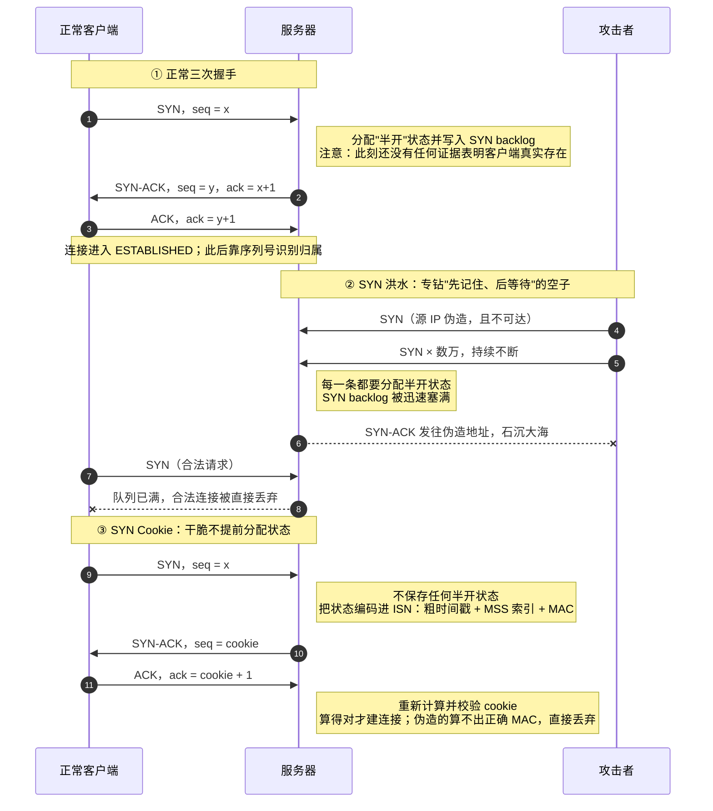
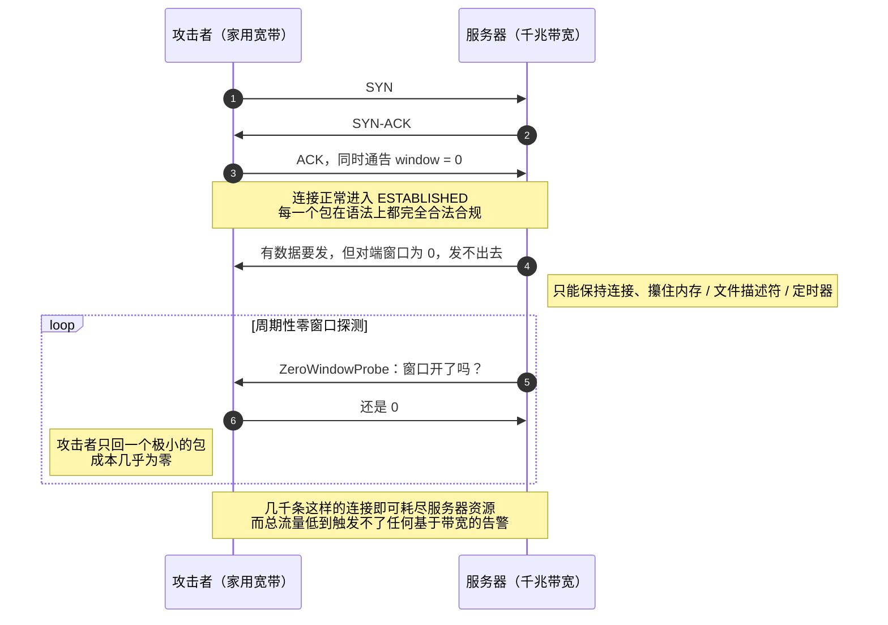
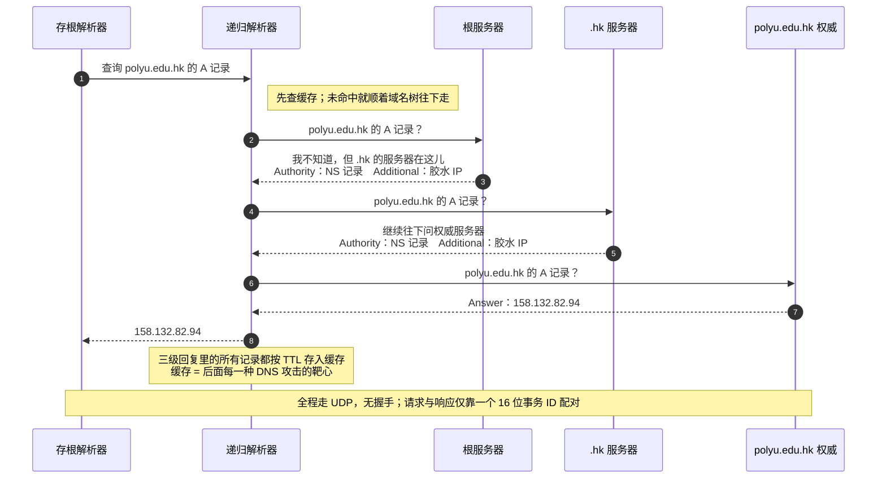
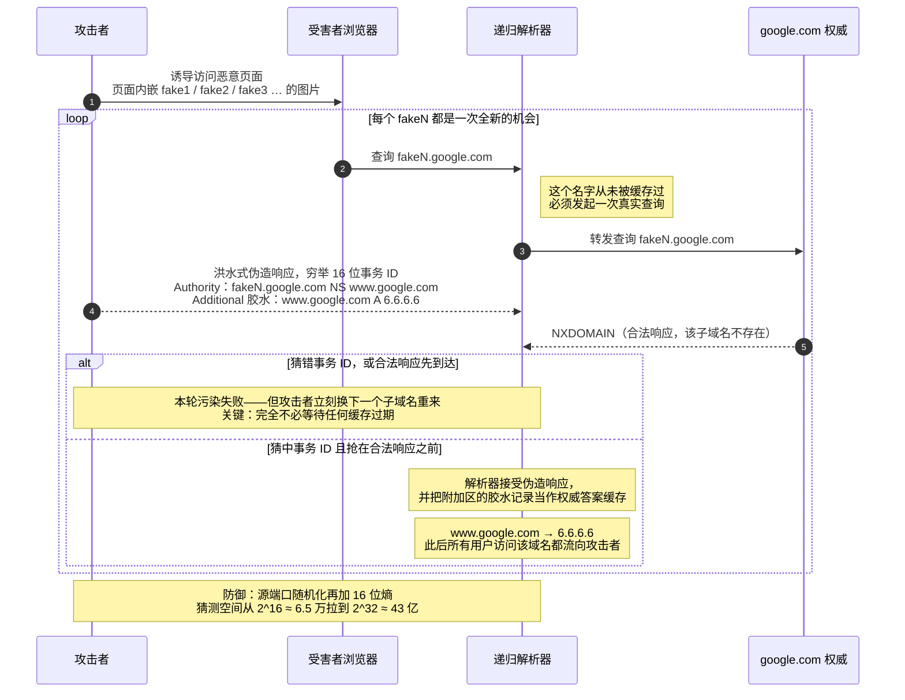

---
prev:
  text: '网络安全入门三部曲'
  link: '/exploration/network-and-security/network-security-trilogy'
next:
  text: '第二篇：密码学如何重建信任'
  link: '/exploration/network-and-security/network-security-02-cryptography-rebuilds-trust'
---

# 网络安全入门（一）：协议栈的信任危机

> 这是一套三篇的网络安全入门系列。网络安全的知识点又多又碎，但主线其实非常清晰，我把它重新组织成了循序渐进的三篇：
>
> - **第一篇（本篇）：协议栈的信任危机** —— 互联网的底层协议是怎么被攻破的，又该怎么补
> - 第二篇：密码学，我们靠什么重建信任
> - 第三篇：把信任装进真实系统（防火墙、TLS、VPN、Web 安全）
>
> 面向"懂一点计算机、但没系统学过网络安全"的读者。你只需要知道"数据在网络上是一个个数据包传输的"这个模糊印象，剩下的我会带你一步步建起来。


## 引子：一个被"善意"设计出来的危机

先讲一个容易被忽略的事实：**今天几乎所有的网络攻击，根子都不在某个程序员写错了代码，而在互联网诞生之初的一个设计取向。**

上世纪 70 年代，互联网的前身 ARPANET 在设计时，工程师们脑子里想的头号问题是：**怎么让分布在各地、由不同机构管理的异构网络，能够可靠地互相连通？** 那个年代的网络又慢又容易断，所以设计者把全部智慧押在了三个目标上——**可达性（reachability）、互操作性（interoperability）、韧性（resilience）**。

他们成功了。代价是：**安全几乎完全不在考虑范围内。**

结果就是，互联网的核心协议里埋下了一大堆"默认对方是诚实的"的隐含假设：

| 协议 | 它默认相信什么 | 于是攻击者可以…… |
|---|---|---|
| **ARP** | 局域网里谁回复"这个 IP 是我"，就真的是它 | 冒充网关，做中间人 |
| **IP** | 数据包源地址字段填的是谁，就真的来自谁 | 伪造源地址（spoofing），绕过过滤 |
| **TCP** | 拿得出正确序列号的，就是合法的通信对端 | 劫持会话、注入 RST、SYN 洪水 |
| **DNS** | 名字解析返回的答案是可信的 | 缓存投毒，把你导向恶意服务器 |
| **BGP** | 一个自治域宣称"这段 IP 归我管"，邻居就照单全收 | 前缀劫持，让整个大洲的流量绕道 |

这张表就是整个第一篇的地图。你会发现一个反复出现的模式：**协议用某个"标识符"或"状态"来判断对方是否合法，而这个标识符要么能被看见、要么能被猜到、要么根本没人验证。** 攻击就是钻这个空子；防御就是想办法让这个标识符变得不可见、不可猜，或者干脆引入密码学来做真正的证明。

我们这一篇会顺着 **OSI/TCP-IP 协议栈自底向上**爬一遍，每一层都问同一组问题：

1. 这一层是干什么的？（先把正常机制讲清楚）
2. 它默认相信了什么？（找到信任假设）
3. 攻击者怎么利用？（动机与手法）
4. 我们怎么补？（防御，这才是重点）

> **📦 扩展知识：为什么"自底向上"是理解安全的最佳顺序**
>
> 网络分层的核心思想是**封装（encapsulation）**：应用层的数据，往下每经过一层就被套上一层"信封"——加上 TCP 头、再加上 IP 头、再加上以太网头，最后变成网线上的比特流。接收方反过来一层层拆开。
>
> 安全的关键洞察在于：**每一个头部字段，都是一个可以被偷看（sniffing）或被伪造（spoofing）的攻击点。** 你在底层做的任何伪造，上层通常毫无察觉。所以从最底层开始理解，你才能明白为什么"只在应用层加个密码"往往不够——底下的地基可能早就被人动过了。
<svg viewBox="0 0 680 352" width="100%" role="img" style="font-family:var(--vp-font-family-base,system-ui);max-width:680px;display:block;margin:1.5rem auto;"><title>协议栈封装与每层的伪造点</title><desc>数据自上而下被逐层套上以太网头、IP 头、TCP 头，每一层的头部字段都对应一种伪造攻击。</desc><defs><marker id="ar1" viewBox="0 0 10 10" refX="8" refY="5" markerWidth="6" markerHeight="6" orient="auto-start-reverse"><path d="M2 1L8 5L2 9" fill="none" stroke="context-stroke" stroke-width="1.5" stroke-linecap="round" stroke-linejoin="round"/></marker></defs><rect x="55" y="56" width="110" height="46" rx="4" fill="var(--vp-c-bg-soft, #f6f6f7)" stroke="var(--vp-c-divider, #e2e2e3)" stroke-width="0.5"/><text x="110" y="83" text-anchor="middle" font-size="13" fill="var(--vp-c-text-1, #3c3c43)" font-weight="500">以太网头</text><rect x="165" y="56" width="100" height="46" rx="4" fill="var(--vp-c-tip-soft, #cfe4fd)" stroke="var(--vp-c-tip-1, #3b82f6)" stroke-width="0.5"/><text x="215" y="83" text-anchor="middle" font-size="13" fill="var(--vp-c-text-1, #3c3c43)" font-weight="500">IP 头</text><rect x="265" y="56" width="100" height="46" rx="4" fill="var(--vp-c-brand-soft, #d3f5e0)" stroke="var(--vp-c-brand-1, #10b981)" stroke-width="0.5"/><text x="315" y="83" text-anchor="middle" font-size="13" fill="var(--vp-c-text-1, #3c3c43)" font-weight="500">TCP 头</text><rect x="365" y="56" width="190" height="46" rx="4" fill="var(--vp-c-warning-soft, #fce8c3)" stroke="var(--vp-c-warning-1, #d4a017)" stroke-width="0.5"/><text x="460" y="83" text-anchor="middle" font-size="13" fill="var(--vp-c-text-1, #3c3c43)" font-weight="500">应用数据（HTTP / DNS）</text><rect x="555" y="56" width="70" height="46" rx="4" fill="var(--vp-c-bg-soft, #f6f6f7)" stroke="var(--vp-c-divider, #e2e2e3)" stroke-width="0.5"/><text x="590" y="83" text-anchor="middle" font-size="13" fill="var(--vp-c-text-1, #3c3c43)" font-weight="500">FCS</text><text x="340" y="36" text-anchor="middle" font-size="12" fill="var(--vp-c-text-2, #67676c)">发送方自上而下逐层加壳，接收方反过来逐层拆开</text><text x="340" y="126" text-anchor="middle" font-size="12" fill="var(--vp-c-text-1, #3c3c43)" font-weight="500">每一个头部字段，都是一个可被偷看或被伪造的攻击点</text><rect x="55" y="148" width="570" height="42" rx="4" fill="none" stroke="var(--vp-c-divider, #e2e2e3)" stroke-width="0.5"/><rect x="55" y="148" width="82" height="42" rx="4" fill="var(--vp-c-bg-soft, #f6f6f7)" stroke="var(--vp-c-divider, #e2e2e3)" stroke-width="0.5"/><text x="96" y="173" text-anchor="middle" font-size="13" fill="var(--vp-c-text-1, #3c3c43)" font-weight="500">链路层</text><text x="151" y="165" text-anchor="start" font-size="12" fill="var(--vp-c-text-1, #3c3c43)">源 MAC 可任意填写，无人核实</text><text x="151" y="181" text-anchor="start" font-size="12" fill="var(--vp-c-text-2, #67676c)">ARP 投毒 → 局域网中间人</text><rect x="55" y="196" width="570" height="42" rx="4" fill="none" stroke="var(--vp-c-divider, #e2e2e3)" stroke-width="0.5"/><rect x="55" y="196" width="82" height="42" rx="4" fill="var(--vp-c-tip-soft, #cfe4fd)" stroke="var(--vp-c-tip-1, #3b82f6)" stroke-width="0.5"/><text x="96" y="221" text-anchor="middle" font-size="13" fill="var(--vp-c-text-1, #3c3c43)" font-weight="500">网络层</text><text x="151" y="213" text-anchor="start" font-size="12" fill="var(--vp-c-text-1, #3c3c43)">IP 从不验证源地址</text><text x="151" y="229" text-anchor="start" font-size="12" fill="var(--vp-c-text-2, #67676c)">源地址伪造 → 反射放大、SYN 洪水</text><rect x="55" y="244" width="570" height="42" rx="4" fill="none" stroke="var(--vp-c-divider, #e2e2e3)" stroke-width="0.5"/><rect x="55" y="244" width="82" height="42" rx="4" fill="var(--vp-c-brand-soft, #d3f5e0)" stroke="var(--vp-c-brand-1, #10b981)" stroke-width="0.5"/><text x="96" y="269" text-anchor="middle" font-size="13" fill="var(--vp-c-text-1, #3c3c43)" font-weight="500">传输层</text><text x="151" y="261" text-anchor="start" font-size="12" fill="var(--vp-c-text-1, #3c3c43)">序列号就是唯一的"暗号"</text><text x="151" y="277" text-anchor="start" font-size="12" fill="var(--vp-c-text-2, #67676c)">猜中即可注入 → RST 注入、会话劫持</text><rect x="55" y="292" width="570" height="42" rx="4" fill="none" stroke="var(--vp-c-divider, #e2e2e3)" stroke-width="0.5"/><rect x="55" y="292" width="82" height="42" rx="4" fill="var(--vp-c-warning-soft, #fce8c3)" stroke="var(--vp-c-warning-1, #d4a017)" stroke-width="0.5"/><text x="96" y="317" text-anchor="middle" font-size="13" fill="var(--vp-c-text-1, #3c3c43)" font-weight="500">应用层</text><text x="151" y="309" text-anchor="start" font-size="12" fill="var(--vp-c-text-1, #3c3c43)">16 位事务 ID + 明文传输</text><text x="151" y="325" text-anchor="start" font-size="12" fill="var(--vp-c-text-2, #67676c)">DNS 缓存投毒、BGP 前缀劫持</text></svg>

<p align="center"><sub>图 1：一个数据包的封装结构，以及每一层对应的伪造点。本篇的路线就是自下而上把这张表走一遍。</sub></p>


## 第 0 层：抓包与嗅探 —— 流量是怎么被看见的

在讲任何攻击之前，得先有一双能看见网络流量的眼睛。安全研究者、攻击者、防御者，都依赖同一项基础能力：**抓包（packet sniffing）**。

正常情况下，你的网卡（NIC，网络接口卡）是个"有礼貌"的设备。以太网是广播介质，网线上的每一帧数据，网卡其实都能听到，但它会检查目标 MAC 地址：**是我的就收下，不是我的就丢弃。**

抓包的第一步，就是让网卡变得"没礼貌"——打开**混杂模式（promiscuous mode）**：

> 混杂模式：网卡不再检查目标 MAC 地址，把本地网络上**所有**经过的数据包统统收下。

这就是为什么在一个不加密的局域网里，一台机器能偷看到别人的流量。工具层面，有三件套值得认识：

- **Wireshark**：图形界面，适合有 GUI 的环境，看得直观
- **tcpdump**：命令行，适合服务器和容器环境
- **Scapy**：Python 库，可以自己编写抓包/造包工具（后面很多攻击演示都靠它）

一个 tcpdump 的例子，直观感受一下：

```bash
tcpdump -n -i eth0 -vvv "tcp port 179"
# -n   不把 IP 解析成主机名（更快、更干净）
# -i   在 eth0 这个网卡上抓
# tcp port 179  只抓 179 端口（BGP）的 TCP 包
```

那个 `"tcp port 179"` 就是所谓的 **BPF（Berkeley Packet Filter，伯克利包过滤器）** 语法。它的意义不只是"方便"——它能让内核在数据包进入协议栈之前就把不关心的包丢掉，极大提升效率。

**为什么先讲这个？** 因为"能不能被看见"是贯穿全篇的核心线索。你马上会看到：一个攻击者能不能看见你的流量，直接决定了他能做什么攻击。这就引出了整个网络安全里最重要的一组分类。


## 威胁建模：攻击者是谁、能做什么

在动手防御之前，专业的做法是先做**威胁建模（threat modeling）**。这不是玄学，它就是把安全目标变成几个具体的问题：

> **我们在保护什么？防谁？他有什么能力？**
>
> - **资产（Assets）**：身份、流量、路由状态、名字解析、凭据……
> - **安全目标（Security Goals）**：机密性、完整性、可用性……
> - **对手（Adversaries）**：本地攻击者、恶意的解析器、离路径攻击者、被攻陷的主机……
> - **能力（Capabilities）**：能观察、能注入、能伪造、能修改、还是能拒绝流量？

安全目标里，最经典的是 **CIA 三元组**（注意，跟中情局没关系）：

- **机密性（Confidentiality）**：未授权者读不到信息。*例：别人未经许可读你的私人邮件。*
- **完整性（Integrity）**：未授权者改不了信息，改了能被发现。*例：不存钱却让自己的银行余额变大。*
- **可用性（Availability）**：未授权者没法阻止合法用户使用服务。*例：用机器人抢光所有挂号名额，让真正需要的人挂不上。*

有一句话需要特别强调：**CIA 是最低基线，不是全部目标。** 现代还要考虑隐私目标——不可关联性（Unlinkability）、匿名性、认证、授权等等。第三篇讲 Tor 时会深入隐私这一支。

### 攻击者的两个坐标轴

这是本篇最该记住的一张概念图。刻画一个攻击者，用**两个独立的坐标轴**：

**坐标轴一：位置（能不能看见流量）**

| | On-path（在路径上） | Off-path（在路径外） |
|---|---|---|
| **可见性** | 能直接读到过路的流量和时序 | 看不见实时流量，只能靠推测或猜 |
| **能力** | 能拦截、修改、丢弃、延迟、重放 | 只有猜对参数才能注入伪造包 |
| **典型攻击** | SSL 剥离、会话劫持、DNS 篡改、中间人 | 盲 TCP 注入、DNS 缓存投毒、IP 伪造 |
| **主要防御** | 相互认证、TLS、完整性校验、防重放 | 不可预测的随机值、源验证、限速、反伪造 |

**坐标轴二：行为（改不改数据）**

| | Active（主动） | Passive（被动） |
|---|---|---|
| **目标** | 改消息、改身份、改路由、破坏可用性 | 学到内容、元数据、关系、行为模式 |
| **行为** | 注入、修改、丢弃、延迟、重放 | 嗅探、记录、关联时序和流量 |
| **能否被发现** | 常常能——会引发错误、完整性失败、中断 | 很难——流量和数据都没被改动 |
| **对策** | 认证、消息完整性、新鲜性校验、限速 | 加密、元数据最小化、流量填充、访问控制 |

请把这两个轴刻进脑子里。后面每讲一个攻击，你都可以问自己：**这是 on-path 还是 off-path？active 还是 passive？** 一旦你能回答这两个问题，防御思路几乎自动浮现出来。

> **📦 扩展知识：被动攻击为什么"预防比检测更重要"**
>
> 主动攻击往往会留下痕迹（校验失败、连接中断），所以你可以**事后检测**。但被动攻击——比如流量分析（traffic analysis）——即使内容全加密了，攻击者仍能从**时序、大小、频率、通信端点**推断出行为。你在深夜频繁访问某个医疗网站，即便内容加密，"你在关注某种疾病"这个事实也可能泄露。
>
> 因为被动攻击难以察觉，所以对它的哲学是：**别指望发现它，要在设计上让它做不成。** 这就是为什么现代协议会做流量填充（padding）、批处理等看似"浪费带宽"的操作。第三篇讲 Tor 的时候，你会看到这个思路被推到极致。

---

## 链路层：ARP —— 局域网里的"认脸"骗局

现在正式开始爬协议栈。最底下是**链路层**，负责在同一个局域网内、物理相连的设备之间传输数据帧。

问题来了：局域网内部通信靠的是 **MAC 地址**（网卡的硬件地址，像 `08:00:27:b8:7c:bb`），但我们平时用的是 **IP 地址**。**怎么根据 IP 找到对应的 MAC？** 这就是 **ARP（Address Resolution Protocol，地址解析协议）** 干的活。

ARP 的正常流程简单得像在教室里喊话：

1. **ARP 请求（广播）**：主机 A 想联系 `10.0.2.15`，它对全网喊："谁是 10.0.2.15？请告诉 10.0.2.4"（目标 MAC 填全 F 的广播地址）
2. **ARP 应答（单播）**：拥有该 IP 的主机私下回答："10.0.2.15 在 `00:00:00:00:00:15`"
3. A 把这个 IP→MAC 映射存进 **ARP 缓存**，下次不用再问

### ARP 的信任假设：谁应答就信谁

就在这句话里：**ARP 是无认证、无状态的。主机会接受任何 ARP 消息，而不验证发送者的身份。**

这意味着——**攻击者可以随口撒谎，而且没人会核实。** 这就是 **ARP 缓存投毒（ARP Cache Poisoning）**。

攻击手法有几种，本质都是发送伪造的 IP→MAC 映射：

- 伪造应答：发一个没人请求的应答，声称"目标 IP 对应的是我的 MAC"
- 免费 ARP（gratuitous ARP）：源 IP = 目标 IP 的自我广播，主动"通知"全网

用 Scapy 造一个免费 ARP 包，就这么几行：

```python
IP_fake = "10.9.0.99"
ether = Ether(src="aa:bb:cc:dd:ee:ff", dst="ff:ff:ff:ff:ff:ff")
arp = ARP(psrc=IP_fake, hwsrc="aa:bb:cc:dd:ee:ff",
          pdst=IP_fake, hwdst="ff:ff:ff:ff:ff:ff")
arp.op = 2   # op=2 表示这是一个"应答"
```

### 从投毒到中间人（MITM）

单纯投毒还不够精彩。真正的杀招是用它来做**中间人攻击（Man-in-the-Middle, MITM）**。

有个很贴切的类比：**一个不诚实的邮差，拆开、读取、甚至改写你的信件，然后再送出去——收发双方都毫无察觉。**

具体三步：

1. **占位**：毒化受害者 A 的 ARP 缓存，让"网关 B 的 IP"映射到"攻击者 M 的 MAC"；同时毒化网关 B 的缓存，让"A 的 IP"也映射到 M 的 MAC
2. **拦截**：现在 A 发给 B 的包、B 发给 A 的包，全都先到 M 手里
3. **读取或篡改**：M 可以偷密码、注入内容，或者神不知鬼不觉地窃听

关键细节：M 要做的不只是投毒，还得打开 **IP 转发**，把包原样（或篡改后）继续传给真正的目标，否则通信中断、受害者立刻起疑：

```bash
sysctl net.ipv4.ip_forward=1   # 打开转发，维持通信不中断
```

而且 M 需要**周期性地重发**伪造 ARP，因为真实的 ARP 应答随时可能"纠正"缓存，把 M 挤出去。
<svg viewBox="0 0 680 362" width="100%" role="img" style="font-family:var(--vp-font-family-base,system-ui);max-width:680px;display:block;margin:1.5rem auto;"><title>ARP 投毒造成的中间人攻击</title><desc>攻击者同时毒化受害者和网关的 ARP 缓存，使双方流量都先经过自己，再打开 IP 转发维持通信不中断。</desc><defs><marker id="ar2" viewBox="0 0 10 10" refX="8" refY="5" markerWidth="6" markerHeight="6" orient="auto-start-reverse"><path d="M2 1L8 5L2 9" fill="none" stroke="context-stroke" stroke-width="1.5" stroke-linecap="round" stroke-linejoin="round"/></marker></defs><path d="M 105 100 C 105 48 575 48 575 100" fill="none" stroke="var(--vp-c-text-2, #67676c)" stroke-width="1" stroke-dasharray="5 4" marker-end="url(#ar2)"/><text x="340" y="40" text-anchor="middle" font-size="12" fill="var(--vp-c-text-2, #67676c)">A 以为自己在直接和网关通信</text><rect x="40" y="100" width="130" height="52" rx="6" fill="var(--vp-c-bg-soft, #f6f6f7)" stroke="var(--vp-c-divider, #e2e2e3)" stroke-width="0.5"/><text x="105" y="115" text-anchor="middle" dominant-baseline="central" font-size="14" font-weight="500" fill="var(--vp-c-text-1, #3c3c43)">受害者 A</text><text x="105" y="137" text-anchor="middle" dominant-baseline="central" font-size="12" fill="var(--vp-c-text-2, #67676c)">10.0.2.4</text><rect x="275" y="190" width="130" height="52" rx="6" fill="var(--vp-c-danger-soft, #fbd5d5)" stroke="var(--vp-c-danger-1, #d94f4f)" stroke-width="0.5"/><text x="340" y="205" text-anchor="middle" dominant-baseline="central" font-size="14" font-weight="500" fill="var(--vp-c-text-1, #3c3c43)">攻击者 M</text><text x="340" y="227" text-anchor="middle" dominant-baseline="central" font-size="12" fill="var(--vp-c-text-2, #67676c)">10.0.2.99</text><rect x="510" y="100" width="130" height="52" rx="6" fill="var(--vp-c-bg-soft, #f6f6f7)" stroke="var(--vp-c-divider, #e2e2e3)" stroke-width="0.5"/><text x="575" y="115" text-anchor="middle" dominant-baseline="central" font-size="14" font-weight="500" fill="var(--vp-c-text-1, #3c3c43)">网关 B</text><text x="575" y="137" text-anchor="middle" dominant-baseline="central" font-size="12" fill="var(--vp-c-text-2, #67676c)">10.0.2.1</text><path d="M 172 148 L 268 196" fill="none" stroke="var(--vp-c-danger-1, #d94f4f)" stroke-width="1.5" marker-end="url(#ar2)" marker-start="url(#ar2)"/><path d="M 412 196 L 508 148" fill="none" stroke="var(--vp-c-danger-1, #d94f4f)" stroke-width="1.5" marker-end="url(#ar2)" marker-start="url(#ar2)"/><text x="340" y="166" text-anchor="middle" font-size="12" fill="var(--vp-c-danger-1, #d94f4f)" font-weight="500">双向流量实际全部绕经 M</text><rect x="40" y="282" width="190" height="56" rx="6" fill="var(--vp-c-bg-soft, #f6f6f7)" stroke="var(--vp-c-divider, #e2e2e3)" stroke-width="0.5"/><text x="135" y="299" text-anchor="middle" dominant-baseline="central" font-size="14" font-weight="500" fill="var(--vp-c-text-1, #3c3c43)">A 的 ARP 缓存被改写</text><text x="135" y="321" text-anchor="middle" dominant-baseline="central" font-size="12" fill="var(--vp-c-text-2, #67676c)">网关 IP → M 的 MAC</text><rect x="245" y="282" width="190" height="56" rx="6" fill="var(--vp-c-bg-soft, #f6f6f7)" stroke="var(--vp-c-divider, #e2e2e3)" stroke-width="0.5"/><text x="340" y="299" text-anchor="middle" dominant-baseline="central" font-size="14" font-weight="500" fill="var(--vp-c-text-1, #3c3c43)">M 打开 IP 转发</text><text x="340" y="321" text-anchor="middle" dominant-baseline="central" font-size="12" fill="var(--vp-c-text-2, #67676c)">读完原样转出，双方无感</text><rect x="450" y="282" width="190" height="56" rx="6" fill="var(--vp-c-bg-soft, #f6f6f7)" stroke="var(--vp-c-divider, #e2e2e3)" stroke-width="0.5"/><text x="545" y="299" text-anchor="middle" dominant-baseline="central" font-size="14" font-weight="500" fill="var(--vp-c-text-1, #3c3c43)">B 的 ARP 缓存被改写</text><text x="545" y="321" text-anchor="middle" dominant-baseline="central" font-size="12" fill="var(--vp-c-text-2, #67676c)">A 的 IP → M 的 MAC</text><text x="340" y="268" text-anchor="middle" font-size="12" fill="var(--vp-c-text-2, #67676c)">M 还需周期性重发伪造 ARP，否则真实应答会把缓存纠正回来</text></svg>

<p align="center"><sub>图 2：ARP 中间人的完整结构。注意"投毒"必须做两次（受害者和网关各一次），而且必须开转发——否则通信中断，受害者立刻起疑。</sub></p>


### ARP 的防御思路

注意攻击成立的**前提**：攻击者必须在**同一个局域网**内，能发以太网帧。这是个 on-path、active 攻击。防御围绕"别让局域网里的谎言得逞"：

- **动态 ARP 检测（Dynamic ARP Inspection, DAI）**：交换机检查 ARP 消息是否与可信的 IP-MAC 绑定表一致，不一致就丢弃
- **端口安全（Port Security）**：限制每个交换机端口能学习的 MAC 数量
- **VLAN 分段**：缩小广播域，把攻击者能触及的范围关小
- **静态 ARP 表项**：对关键设备（如网关）写死映射，不接受动态更新

> **📦 扩展知识：为什么局域网攻击看起来"过时"却依然致命**
>
> 你可能觉得"同一个局域网"是个很强的前提——攻击者怎么进得来？但想想：**公共 Wi-Fi、公司访客网络、被攻陷的物联网设备（智能摄像头、智能门铃）**，都可能让攻击者获得局域网内的立足点。这类案例并不少见：智能门铃被入侵、儿童智能玩具 CloudPets 泄露了 220 万条语音录音。一旦攻击者拿到局域网入场券，ARP 投毒就是他撬开一切的第一根撬棍。这也是为什么"内网也不能默认可信"——这个思想后来发展成了业界很火的**零信任（Zero Trust）**架构。


## 网络层：IP —— 一切伪造的源头

再往上一层是**网络层**，核心协议是 **IP**，负责跨网络的**寻址和路由**。

IP 的两个根本属性决定了它的脆弱：**尽力而为的交付（best-effort delivery）**，且**不负责可靠传输**。包可能丢、可能损坏、可能乱序到达。IP 头里虽然有个校验和（checksum），但那只是个**无密钥函数**，只能防随机错误，**挡不住恶意篡改**——攻击者改了内容，把校验和一起改掉就行了。

### 万恶之源：IP 源地址伪造

这是本篇需要你牢牢记住的一句话：

> **IP 从不验证源地址。一台主机可以在源地址字段里写任何 IP。**

**这一句是几乎所有伪造类攻击背后的核心思想。** SYN 洪水、反射放大、TCP RST、经典的 Mitnick 攻击……根子都在这里。

为什么这么致命？因为源地址是"我是谁"的声明，而这个声明**没有任何证明**。这就好比寄信时，信封上的寄件人地址可以随便乱写，邮局照样给你投递。

不过 TCP 和 UDP 在这件事上有区别，值得记住：

- **TCP**：三次握手是个**弱**的源验证——你必须收到 SYN-ACK 才能继续。这提高了门槛（离路径攻击者得猜序列号），但**没有消除**问题。
- **UDP**：**根本没有**任何回程可达性检查。这也是为什么后面讲的反射放大攻击几乎全是基于 UDP 的。

### ICMP：好心办坏事的诊断协议

**ICMP（Internet Control Message Protocol）** 是 IP 的辅助协议，用于报错和诊断。你熟悉的 `ping`（Echo Request/Reply，类型 8/0）和 `traceroute` 都靠它。

`traceroute` 的原理本身就很精巧，值得一提：它利用 IP 头里的 **TTL（Time To Live，生存时间）** 字段。TTL 本是防止包无限循环的"自毁计数器"——每经过一个路由器减 1，减到 0 就被丢弃，并回一个 ICMP 超时消息。traceroute 的妙招是：**故意发 TTL=1, 2, 3…… 的探测包，让每个包在更远一跳处"阵亡"，从而逐跳揭示出整条路径。**

但 ICMP 也能被武器化：

- **Smurf 攻击**：把 ICMP echo 请求发到**定向广播地址**（如 `192.168.60.255`），源地址伪造成受害者。子网里所有主机都回一个应答给受害者——一个请求放大成一片响应。
- **ICMP 重定向攻击**：伪造 ICMP 重定向消息，篡改受害主机的路由表，把流量引向攻击者。

### IP 分片：藏毒的缝隙

当一个包超过链路的 **MTU（最大传输单元）**，IP 会把它切成小的**分片（fragment）**，到目的地再重组。攻击者盯上的正是**重组逻辑的缝隙**——因为重组是有状态、耗资源的，而且不同设备（防火墙 vs 终端主机）可能用不同方式重组。

经典的分片攻击有一整套：

| 攻击 | 手法 | 后果 |
|---|---|---|
| **死亡之 Ping（Ping of Death）** | 分片单独看都合法，重组后超过 IPv4 大小上限 | 老系统缓冲区溢出、崩溃 |
| **泪滴攻击（Teardrop）** | 分片的偏移量重叠、畸形 | 重组时崩溃或挂起（DoS） |
| **分片重叠攻击** | 重叠分片携带不同数据 | 防火墙和主机重组结果不同，绕过 IDS/IPS |
| **微小分片攻击** | 切成极小的分片 | 把 TCP 端口/标志位切到不同分片里，绕过过滤规则 |

> **📦 扩展知识：Ping of Death 的现实回响**
>
> "死亡之 Ping"听起来像上古传说，但它并没有真正消失。微软后来发过一条补丁公告——**Ping of Death 以 IPv6 的形式卷土重来**。这印证了安全领域一个反复出现的规律：**老漏洞换个协议、换个实现，就能借尸还魂。** IPv4 时代修好的东西，IPv6 重新实现时可能又踩一遍同样的坑。这也是为什么资深安全工程师读到新协议时，第一反应往往是"这个老攻击在这里还成立吗？"

### IP 层的防御思路

网络层防御的关键，是给"谁能发包进来"和"从哪能发出去"装上闸门：

- **入向/出向过滤（ingress/egress filtering，即 BCP38）**：这是最重要的。运营商在网络边界检查——从我这网络出去的包，源地址必须真的属于我这个网络。**这一条从源头掐断了源地址伪造**，进而掐断了反射放大攻击。
- **反向路径转发校验（uRPF）**：路由器检查"如果要回包给这个源地址，会不会走同一个接口进来"，不一致就丢弃
- **IPsec**：给 IP 层加上加密和认证（第三篇 VPN 部分详细讲）
- **反伪造规则、网络监控**


## 传输层：TCP/UDP —— 序列号就是"暗号"

爬到**传输层**。这一层解决"端到端"的通信问题。它有两个性格截然相反的协议。

### TCP 的设计：三次握手与序列号

这里换一种讲法，叫"**我们一起来设计它**"。IP 只提供不可靠的尽力交付，那如果我们想要可靠、有序的字节流，得自己加哪些机制？顺着需求推：

- **问题：包有大小限制，长消息发不了** → TCP 自动把消息切成段（segment），接收方自动重组
- **问题：包会乱序到达** → 给每个字节标上**递增的序列号（sequence number）**，接收方按号排序
- **问题：包会丢** → 接收方对收到的包发**确认（ACK）**；发送方没收到 ACK 就重发

于是 TCP 提供了：字节流抽象、有序性、可靠性、以及端口（让一个 IP 上的多个服务共存）。

它的连接建立就是著名的**三次握手（3-way handshake）**：

1. 客户端选一个初始序列号 x，发 **SYN**（seq = x）
2. 服务器选自己的初始序列号 y，回 **SYN-ACK**（seq = y, ack = x+1）
3. 客户端回 **ACK**（ack = y+1），连接"建立"

一条 TCP 连接由 **5 元组**唯一标识：`(源IP, 目的IP, 源端口, 目的端口, 协议)`。

**这里藏着最关键的一点**：TCP 靠**序列号**来判断一个包是否属于这条连接、是否该被接受。序列号成了通信双方的"暗号"。所有 TCP 实现都要求初始序列号必须**随机**——现在你能猜到为什么了：**如果暗号能被猜中，攻击者就能伪造出"合法"的包。**

下面四个攻击，全都是在攻击这个"暗号"或 TCP 的状态机制。

### 攻击一：SYN 洪水 —— 撑爆"半开"队列

**这是一个状态耗尽攻击，不是带宽攻击**——请记住这个区分，它决定了防御思路。

回忆三次握手：服务器收到 SYN 后，必须**先记住**这个连接尝试（分配"半开"状态、发出 SYN-ACK），**然后等**客户端的最后一个 ACK。攻击就钻这个"先记住、后等待"的空子：

1. 攻击者狂发大量 SYN，源地址通常伪造或不可达
2. 服务器为每个都分配半开状态、发 SYN-ACK
3. 最后的 ACK 永远不来
4. **半开连接队列（SYN backlog）被塞满**，合法客户端再也建不了新连接

防御的思路很优雅——既然问题是"过早分配状态"，那就**别提前分配状态**。这就是 **SYN Cookie**：

> **SYN Cookie 的巧思**：服务器收到 SYN 后**不保存任何半开状态**，而是把状态**编码进它发出的 SYN-ACK 的初始序列号里**。这个序列号 = `[粗时间戳] + [MSS 索引] + [MAC=hash(密钥, 4元组, 时间)]`。当客户端的 ACK 回来时，服务器**重新计算并验证**这个 cookie。合法就建连接，伪造的因为算不对 MAC 就直接丢弃。

代价是只能塞进 MSS 一个选项，其他 TCP 选项会丢失，所以通常**只在遭受攻击时才启用**。




<p align="center"><sub>图 3：三次握手、SYN 洪水、SYN Cookie 三段对照。把它们放在一起看，能清楚看到防御思路就是"把分配状态的时机往后推"。</sub></p>


### 攻击二：TCP 重置（RST）—— 一句话掐断连接

TCP 里，**RST（Reset）标志**用来强制、异常地中断连接，且**不需要确认**。攻击者伪造一个带 RST 标志的包，让端点以为对方主动中断了连接。

要伪造成功，攻击者需要：连接的 4 元组、连接处于活动状态、以及一个**落在接收窗口内的可接受序列号**。

- **On-path 攻击者**能直接看到这些值 —— 轻松得手
- **Off-path 攻击者**只能猜，然后"喷"大量不同序列号的包碰运气

> **📦 扩展知识：RST 注入与"防火长城"**
>
> 一个很有分量的现实样本，是 **GFW（Great Firewall，防火长城）的 DNS / HTTP / HTTPS 过滤机制**。研究显示，当检测到敏感内容（比如 HTTP 请求头里的特定域名、或 TLS 握手里的 SNI 字段），一个 on-path 的审查系统会向**通信双方同时注入伪造的 RST 包**，强行掐断这条 TCP 连接。这是 TCP RST 攻击在现实世界最大规模的应用之一。它也解释了为什么后面（第三篇）的 TLS、加密 SNI、VPN、Tor 会成为对抗审查的技术焦点——**只要连接的关键信息还暴露在明文里，on-path 的审查者就能据此下手。**

### 攻击三：Sockstress —— "合法"信号的慢性谋杀

这个攻击特别能体现安全思维的精妙。它 2008 年由 Outpost24 的研究者披露，是一种**低速率、高消耗的非对称 DoS**——攻击者用一根普通家庭宽带，就能拖垮一台千兆带宽的高配服务器。

它利用的是 TCP **完全合法**的流量控制机制。TCP 里接收方通过**滑动窗口（sliding window）**告诉发送方"我还能接收多少数据"（通告窗口 rwnd）。窗口为 0 是完全合法的——表示接收方缓冲区满了。

Sockstress 的做法：

1. 正常完成三次握手，连接进入 ESTABLISHED 状态，**看起来完全合规**
2. 通告一个**窗口=0 或极小**的值
3. 服务器有数据要发却发不出去，只能**保持连接状态、周期性探测**窗口是否重新打开
4. 攻击者一直用 0 窗口回应，每条连接持续占用**内存、文件描述符、定时器**
5. 几千条这样的连接，就能耗尽资源

它为什么难防？**非对称成本 + 难以检测**：

- 攻击者只发几个带 0 窗口的 ACK，几乎零资源；服务器每条连接却要死死攥住一堆资源
- 流量极低，触发不了基于带宽的告警
- 每个包在语法上都完全合法、合规
- 很难把"一个慢速的合法客户端"和"恶意的资源占用者"区分开





<p align="center"><sub>图 4：Sockstress 全程没有任何违反协议的动作。攻防成本的不对称，全部藏在那个合法的 window = 0 里。</sub></p>


**这个例子的深意在于**：安全威胁不一定来自"违反协议"，反而可能来自"把合法机制用到异常的规模"。这类思路在安全里屡见不鲜。

### 攻击四：TCP 会话劫持 —— 冒名顶替

一旦 TCP 连接在客户端和服务器间建立，攻击者的目标是**强行接管这条已建立、甚至已认证的连接**，然后跳过验证阶段，以合法用户身份直接向服务器发命令或窃取数据。

核心还是那个"暗号"：攻击者需要拿到当前的 SEQ 和 ACK 值。

- **On-path**：直接观察到 SEQ/ACK —— 直接注入
- **Off-path**：必须推测连接标识和序列号空间 —— 难得多

历史上最著名的案例是 **Mitnick 攻击**（凯文·米特尼克，传奇黑客），他正是利用 TCP 序列号可预测这一弱点完成了会话劫持。

### TCP 攻击的统一防御

看完四个攻击，防御思路其实高度统一：

- **随机化初始序列号（ISN）和源端口**：让 off-path 攻击者猜不中"暗号"。RFC 6056 的端口随机化把猜测空间进一步扩大
- **SYN Cookie**：应对状态耗尽
- **限速、上游清洗**：应对洪水类
- **但最根本的一条是**：**TCP/UDP 的验证基于标识符和状态，而非密码学证明。随机化和挑战机制只能提高盲攻击的成本，挡不住 on-path 攻击者。真正的端到端机密性、完整性、认证，必须靠密码学协议。**

**记住这最后一句——它就是通往第二篇（密码学）的桥梁。** 传输层能做的加固是有天花板的，天花板之上必须请出密码学。TLS 和 QUIC 正是在这个"安全传输层"填补空缺的。

### UDP：更快，也更没防备

**UDP** 是 TCP 的反面：无连接、无握手、无状态、不保证可靠和有序。它更快（没有握手、拥塞控制、重传的开销），常用于视频流、游戏、VoIP 这类"快比准更重要"的场景。

但"无状态"意味着**没有身份、可注入**：

> UDP 没有 SEQ、没有 ACK、没有接收窗口来验证一个数据报。**第一个匹配的数据报就赢了。** 一个 off-path 攻击者只要知道或猜中 4 元组，就能伪造并注入 UDP 数据报。

这使 UDP 成为 **DoS 和放大攻击**的完美载体。有个生动的比喻，把 UDP 攻击的三种放大策略叫做"**把手雷变成……**"：

**策略一：一颗手雷变多颗（定向广播滥用）**
经典案例是 **Fraggle 攻击**：伪造受害者源地址，发到定向广播地址，子网内所有跑 UDP echo/chargen 的主机都回一堆包给受害者。（好消息：RFC 2644 自 1999 年起路由器默认不转发定向广播，这个已成历史。）

**策略二：可再生的手雷（协议回环）**
**UDP Ping-Pong / 应用层回环攻击**：让两个 UDP echo 服务互相无限回应对方，形成一个自我维持的流量回环。还有一个更精妙的 **DNS 服务器回环**——一个畸形的伪造 DNS 包能让两台服务器陷入无限互发。

**策略三：手雷变导弹（反射放大）—— 这是重点**

这是现代最具破坏力的 DDoS 手法。两个核心概念：

- **反射（Reflection）**：服务器的响应被发给**伪造的受害者**，而不是攻击者
- **放大（Amplification）**：响应的字节数远多于请求

衡量威胁的关键指标是**带宽放大因子（BAF）**：

```
BAF = 响应字节数 / 请求字节数
受害者收到的流量 ≈ 攻击者上行带宽 × BAF × 反射器数量
```

一句话点破要害：**BAF——而不是攻击者的带宽——才是威胁的度量指标。** 攻击者只需要一点点上行带宽，借助高 BAF 的协议就能撬动海量流量砸向受害者。

三个真实的放大攻击，放大倍数一个比一个惊人：

| 协议 | 请求大小 | 响应大小 | 放大倍数 |
|---|---|---|---|
| **DNS**（查询 ANY 记录 + DNSSEC） | ~60 字节 | ~3,000–4,000 字节 | ~60 倍 |
| **NTP**（monlist 命令） | ~234 字节 | 高达 48,000 字节 | ~200 倍 |
| **Memcached**（get 一个预存的大 value） | ~50 字节 | ~1,000,000 字节 | **~51,000 倍** |
<svg viewBox="0 0 680 372" width="100%" role="img" style="font-family:var(--vp-font-family-base,system-ui);max-width:680px;display:block;margin:1.5rem auto;"><title>UDP 反射放大攻击的流量结构</title><desc>攻击者用极小的伪造源地址请求驱动大量开放服务器，把远大于自身带宽的响应流量汇聚到受害者。</desc><defs><marker id="ar3" viewBox="0 0 10 10" refX="8" refY="5" markerWidth="6" markerHeight="6" orient="auto-start-reverse"><path d="M2 1L8 5L2 9" fill="none" stroke="context-stroke" stroke-width="1.5" stroke-linecap="round" stroke-linejoin="round"/></marker></defs><text x="196" y="34" text-anchor="middle" font-size="12" fill="var(--vp-c-text-2, #67676c)">① 小请求，源 IP 伪造成受害者</text><text x="492" y="34" text-anchor="middle" font-size="12" fill="var(--vp-c-danger-1, #d94f4f)">② 大响应，全部砸向受害者</text><rect x="40" y="150" width="120" height="56" rx="6" fill="var(--vp-c-bg-soft, #f6f6f7)" stroke="var(--vp-c-divider, #e2e2e3)" stroke-width="0.5"/><text x="100" y="167" text-anchor="middle" dominant-baseline="central" font-size="14" font-weight="500" fill="var(--vp-c-text-1, #3c3c43)">攻击者</text><text x="100" y="189" text-anchor="middle" dominant-baseline="central" font-size="12" fill="var(--vp-c-text-2, #67676c)">家用上行即可</text><rect x="265" y="60" width="150" height="44" rx="6" fill="var(--vp-c-tip-soft, #cfe4fd)" stroke="var(--vp-c-tip-1, #3b82f6)" stroke-width="0.5"/><text x="340" y="71" text-anchor="middle" dominant-baseline="central" font-size="14" font-weight="500" fill="var(--vp-c-text-1, #3c3c43)">开放 DNS 解析器</text><text x="340" y="93" text-anchor="middle" dominant-baseline="central" font-size="12" fill="var(--vp-c-text-2, #67676c)">BAF ≈ 60</text><path d="M 162 178 L 259 82" fill="none" stroke="var(--vp-c-text-2, #67676c)" stroke-width="0.8" marker-end="url(#ar3)"/><path d="M 417 82 L 514 178" fill="none" stroke="var(--vp-c-danger-1, #d94f4f)" stroke-width="3" marker-end="url(#ar3)"/><rect x="265" y="112" width="150" height="44" rx="6" fill="var(--vp-c-tip-soft, #cfe4fd)" stroke="var(--vp-c-tip-1, #3b82f6)" stroke-width="0.5"/><text x="340" y="123" text-anchor="middle" dominant-baseline="central" font-size="14" font-weight="500" fill="var(--vp-c-text-1, #3c3c43)">NTP monlist</text><text x="340" y="145" text-anchor="middle" dominant-baseline="central" font-size="12" fill="var(--vp-c-text-2, #67676c)">BAF ≈ 200</text><path d="M 162 178 L 259 134" fill="none" stroke="var(--vp-c-text-2, #67676c)" stroke-width="0.8" marker-end="url(#ar3)"/><path d="M 417 134 L 514 178" fill="none" stroke="var(--vp-c-danger-1, #d94f4f)" stroke-width="3" marker-end="url(#ar3)"/><rect x="265" y="164" width="150" height="44" rx="6" fill="var(--vp-c-tip-soft, #cfe4fd)" stroke="var(--vp-c-tip-1, #3b82f6)" stroke-width="0.5"/><text x="340" y="175" text-anchor="middle" dominant-baseline="central" font-size="14" font-weight="500" fill="var(--vp-c-text-1, #3c3c43)">Memcached</text><text x="340" y="197" text-anchor="middle" dominant-baseline="central" font-size="12" fill="var(--vp-c-text-2, #67676c)">BAF ≈ 51,000</text><path d="M 162 178 L 259 186" fill="none" stroke="var(--vp-c-text-2, #67676c)" stroke-width="0.8" marker-end="url(#ar3)"/><path d="M 417 186 L 514 178" fill="none" stroke="var(--vp-c-danger-1, #d94f4f)" stroke-width="3" marker-end="url(#ar3)"/><rect x="265" y="216" width="150" height="44" rx="6" fill="var(--vp-c-tip-soft, #cfe4fd)" stroke="var(--vp-c-tip-1, #3b82f6)" stroke-width="0.5"/><text x="340" y="227" text-anchor="middle" dominant-baseline="central" font-size="14" font-weight="500" fill="var(--vp-c-text-1, #3c3c43)">…互联网上数万台</text><text x="340" y="249" text-anchor="middle" dominant-baseline="central" font-size="12" fill="var(--vp-c-text-2, #67676c)">扫描即可找到</text><path d="M 162 178 L 259 238" fill="none" stroke="var(--vp-c-text-2, #67676c)" stroke-width="0.8" marker-end="url(#ar3)"/><path d="M 417 238 L 514 178" fill="none" stroke="var(--vp-c-danger-1, #d94f4f)" stroke-width="3" marker-end="url(#ar3)"/><rect x="520" y="150" width="120" height="56" rx="6" fill="var(--vp-c-danger-soft, #fbd5d5)" stroke="var(--vp-c-danger-1, #d94f4f)" stroke-width="0.5"/><text x="580" y="167" text-anchor="middle" dominant-baseline="central" font-size="14" font-weight="500" fill="var(--vp-c-text-1, #3c3c43)">受害者</text><text x="580" y="189" text-anchor="middle" dominant-baseline="central" font-size="12" fill="var(--vp-c-text-2, #67676c)">1.35 Tbps</text><rect x="40" y="292" width="600" height="58" rx="6" fill="var(--vp-c-bg-soft, #f6f6f7)" stroke="var(--vp-c-divider, #e2e2e3)" stroke-width="0.5"/><text x="340" y="314" text-anchor="middle" font-size="13" fill="var(--vp-c-text-1, #3c3c43)" font-weight="500">受害者收到的流量 ≈ 攻击者上行带宽 × BAF × 反射器数量</text><text x="340" y="334" text-anchor="middle" font-size="12" fill="var(--vp-c-text-2, #67676c)">威胁的度量是他能借到多少带宽，不是他自己有多少带宽</text></svg>

<p align="center"><sub>图 5：反射放大的流量结构。攻击者的上行带宽只决定"点火"规模，真正的杀伤力来自反射器数量乘以 BAF。</sub></p>


Memcached 那个尤其狠——攻击者先用真实 IP 往一台暴露在公网、无认证的 Memcached 服务器上传 1MB 垃圾数据，然后伪造受害者 IP 发一个 50 字节的 `get` 请求，服务器就把整个 1MB 甩给受害者。

> **📦 现实案例：2018 GitHub 遭遇当时最大 DDoS**
>
> 2018 年 2 月 28 日，GitHub 遭受了一次基于 Memcached 反射放大的攻击，峰值约 **1.35 Tbps、126.9 Mpps**——在当时是有记录以来最大的 DDoS 攻击。攻击者没有庞大的僵尸网络，仅靠扫描互联网上暴露的 Memcached 服务器作为反射器，就把流量放大到了每秒万亿比特级别。这个案例把"BAF 才是威胁指标"这句话诠释得淋漓尽致：**放大攻击的威力不取决于攻击者有多少带宽，而取决于他能借到多少。**

**UDP 攻击的防御**：

- **按源、按服务限速 UDP**，管控突发
- **关闭或用防火墙挡住不用的 UDP 服务**
- **绝不把开放的反射器（chargen、NTP monlist、memcached）暴露到公网**
- **入向过滤（BCP38）+ uRPF**——从源头掐掉源地址伪造，也就掐掉了反射的根
- **上游/运营商清洗与黑洞路由**应对大流量洪水


## 应用层之一：DNS —— 把名字翻译成地址的信任链

DNS（Domain Name System，域名系统）解决一个纯粹为人类服务的问题：把 `www.google.com` 这样好记的域名，翻译成 `173.194.202.138` 这样机器能路由的 IP。

它是个**分布式、层级化**的命名系统——没有任何一台服务器掌握全部答案。理解它的攻击，得先理解它优雅的层级设计。

### DNS 的解析流程

几个关键角色：

- **存根解析器（Stub Resolver）**：你设备上的 DNS 客户端，只负责向递归解析器发起请求
- **递归解析器（Recursive Resolver）**：真正干活的，替你去各级服务器查询并缓存结果（通常由 ISP 或 Google/Cloudflare 这类提供商运营）
- **根、TLD、权威名字服务器**：层级树上的各级节点

查询过程是**顺着域名树往下走**的。以查询 `polyu.edu.hk` 为例（你可以用 `dig +norecurse` 手动走一遍）：

1. 问**根服务器**（如 `198.41.0.4`）：它不知道答案，但告诉你 `.hk` 的 TLD 服务器在哪
2. 问 **`.hk` 服务器**：它给出 `polyu.edu.hk` 的权威服务器
3. 问 **`polyu.edu.hk` 权威服务器**：终于拿到 `polyu.edu.hk → 158.132.82.94`

每一步的回复里有三个关键区段：

- **Answer（回答）**：直接答案（A 记录）
- **Authority（授权）**：指向下一级服务器（NS 记录）
- **Additional（附加/胶水记录 glue）**：帮忙提供下一级服务器的 IP

为了性能，解析器会**缓存**所有记录，直到 **TTL** 过期。**记住"缓存"这个词——它是所有 DNS 攻击的靶心。**





<p align="center"><sub>图 6：一次完整的递归解析。请特别注意每一级回复里的 Additional 段（胶水记录）——它就是 Kaminsky 攻击的着力点。</sub></p>


而且有个致命的设计选择：**DNS 用 UDP 而不是 TCP**（为了快，省掉三次握手）。结合我们前面学的 UDP 弱点，你应该已经预感到危险了。DNS 靠什么匹配请求和响应？**一个 16 位的 ID 字段。** 又一个"暗号"。

### 缓存投毒：往信任链里塞假货

**缓存投毒（Cache Poisoning）**的核心：给解析器返回一个恶意记录，解析器把它缓存起来，"毒"就种下了。比如塞一个假的 A 记录，把合法域名映射到攻击者的 IP `6.6.6.6`。之后所有访问该域名的用户，流量都发给了攻击者——他就成了 MITM。

按攻击者能力，风险分层递进（又是那两个坐标轴！）：

**风险一：恶意的名字服务器**
一个恶意服务器可以直接撒谎。防御是 **Bailiwick 检查**：

> **Bailiwick 检查**（bailiwick 意为"职权范围"）：解析器只接受在该名字服务器**管辖区内**的记录。例如 `polyu.edu.hk` 的服务器可以提供 `comp.polyu.edu.hk` 的记录，但**不能**提供 `cuhk.edu.hk` 的记录；`.hk` 服务器能管 `edu.hk`、`gov.hk`，但管不了 `edu.cn`。根服务器则对所有域名都在职权范围内。

这把一个恶意服务器能造成的破坏限制在了它自己的地盘。

**风险二：MITM / on-path 攻击者**
- **MITM** 能任意增删改 DNS 响应里的记录，投毒且不被发现
- **On-path** 攻击者能看到未加密 DNS 请求的每个字段，**不用猜任何东西**，只要抢在合法响应之前把伪造响应送到即可

**风险三：off-path 攻击者**
这个最有意思，因为它得靠**猜**。攻击者看不到请求，必须猜中那个 16 位 ID：

- 如果 ID 随机：猜中概率 = 1/2¹⁶，约需 65,000 次尝试。对有耐心的攻击者来说**是可行的**
- 如果 ID 是简单递增的：攻击者可以诱骗受害者访问自己的网站，网站里嵌 ``，触发一次 DNS 查询，攻击者（控制着 attacker.com 的服务器）就能观察到当前 ID，然后推算出下一个 —— **所以 ID 必须随机**

### Kaminsky 攻击：把 off-path 攻击变得实用

这是 DNS 安全史上的里程碑，2008 年由安全研究者 Dan Kaminsky 发现。他解决了 off-path 投毒的一个致命短板。

**短板是什么？** 如果攻击者反复在网页里放 ``，浏览器只会发**一次** DNS 查询（因为结果被缓存了），攻击者只有一次机会猜 ID。猜错了就得等缓存过期才能再试——太慢了。

**Kaminsky 的洞察**：解析器会把附加区段里的**胶水记录**当作权威答案缓存下来，哪怕它们并不权威。于是攻击者可以这样刷次数：

1. 在网页里放一堆**不存在的子域名**：`fake1.google.com`, `fake2.google.com`, `fake3.google.com`……
2. 浏览器为每一个都发一次真实的 DNS 查询（因为这些域名没被缓存过，每个都是新的机会！）
3. 对每次查询，攻击者伪造响应，内容是：
   - **Authority**: `fake1.google.com. NS www.google.com.`
   - **Additional**: `www.google.com. A 6.6.6.6`
4. 只要**任何一次**猜中 ID 并抢在合法响应之前，解析器就会把 `www.google.com → 6.6.6.6` 缓存下来 —— **整个缓存被投毒**





<p align="center"><sub>图 7：Kaminsky 攻击。真正的突破不在"猜 ID"，而在那个 loop——它把一次性的赌博变成了可以无限重试的流水线。</sub></p>


关键在于：即使某次猜错，攻击者只是"污染失败"，可以立刻换下一个 `fakeN` 继续试，**不用等缓存过期**。这把原本需要极大运气的攻击，变成了只要有耐心就能成功的攻击。

### DNS 的防御手段

- **源端口随机化**：这是应对 Kaminsky 的关键。除了猜 16 位 ID，攻击者现在还得猜响应的目标端口，又增加了 16 位，总共 **2³² 种可能**，把成本从 6 万次拉到几十亿次
- **提高熵的其他招**：比如随机化域名大小写（因为问题会被原样复制进响应）
- **胶水验证（glue validation）**：不把胶水记录当权威缓存，或对它单独做一次权威查询来验证。**但这个当年没被所有软件实现**——Unbound 实现了，而最老牌、最常用的 BIND 没有（主要是"政治"原因：BIND 押注于 DNSSEC）
- **DNSSEC**：用密码学签名来验证 DNS 记录的真实性（第二篇学完密码学，第三篇会理解它怎么工作）

> **📦 扩展知识：DNS 攻击怎么变现？**
>
> 这里插一个很实际的问题：黑客投毒 DNS，图什么？一个真实的盈利模式是：**攻陷大量家用路由器 → 修改路由器里的递归解析器设置，指向攻击者的 IP → 现在可以随意投毒 → 把所有广告类域名的 DNS 请求重定向到攻击者控制的域名 → 给受害者投放攻击者选择的广告 → 把这块广告位卖钱。** 这提醒我们：网络攻击背后往往有清晰的经济动机，理解动机能帮你预判攻击者会盯上什么。而终极解药也很明确：**TLS 能防御这类攻击，因为它提供端到端的安全**——又一次指向了第三篇。


## 域间层：BGP —— 整个互联网的信任在裸奔

爬到最后，也是最惊心动魄的一层。前面讲的都是"一台主机、一个局域网"级别的攻击，而 **BGP（Border Gateway Protocol，边界网关协议）**的问题是**洲际级别**的。

### 互联网的宏观结构：自治域与域间路由

互联网是"网络的网络"——由约 **78,800 个**独立管理的网络拼起来。每一个这样的网络叫一个 **AS（Autonomous System，自治系统）**，是一片独立的行政管辖区（一个 ISP、一所大学、一家公司）。每个 AS 有自己的编号（ASN），比如香港理工大学是 AS4616，中大是 AS3661。

这些 AS 之间靠**商业合同**决定怎么互联，主要两种关系：

- **客户-提供商（Customer-Provider）**：客户付钱，提供商保证客户能被所有人访问到
- **对等（Peer-Peer）**：对等双方交换各自客户的流量，通常互不付费（settlement-free）

而 **BGP 就是 AS 之间用来交换"怎么到达某段 IP"的协议**。它是一个**路径矢量（path-vector）协议**——每个 AS 不只告诉邻居"我能到某个目的地"，还会**宣告完整的 AS 路径**（比如 `"3549 7018 88"`，表示要经过这几个 AS）。

宣告完整路径有个好处：**能快速检测环路**——一个 AS 只要在路径里看到自己的编号，就知道有环，直接丢弃。

### 核心问题：BGP 完全建立在信任之上

现在来到那句最惊人的话：

> **一个 AS 宣称"这段 IP 前缀归我管"，它的邻居就照单全收。没有任何所有权证明。**

这就意味着，只要一个 AS（无论是恶意还是配置错误）宣告了一段本不属于它的 IP，这个假路由就可能像病毒一样在全球传播。这叫**前缀劫持（Prefix Hijacking）**。

还记得网络层学的**最长前缀匹配**吗？路由器在多个匹配的路由里，会选**最具体（前缀最长）**的那个。这给了攻击者一个阴险的招数——**子前缀劫持**：

> 如果真正的所有者宣告 `12.34.0.0/16`，攻击者宣告一个**更具体**的 `12.34.158.0/24`。由于流量遵循最长匹配前缀，**每个 AS 都会为这段地址选择攻击者的假路由。**

### 现实案例：2008 年 YouTube 消失了两小时

这是理解 BGP 脆弱性的最佳案例，时间线值得完整还原。

**背景**：
- YouTube（AS 36561）拥有地址块 `208.65.152.0/22`
- 巴基斯坦电信（AS 17557）收到政府命令，要在国内封锁 YouTube

**出事经过**：
- 巴基斯坦电信为了在**国内**封锁，开始宣告一个更具体的 `208.65.153.0/24`（想把国内访问 YouTube 的流量导向一个黑洞）
- 犯了两个致命错误：
  - **AS 17557**：把这条路由宣告给了**所有人**，而不只是自己的客户
  - **AS 3491**（PCCW，它的上游）：**没有过滤** AS 17557 宣告的路由，直接放行并继续传播

**后果**：由于 `/24` 比 YouTube 真正的 `/22` 更具体，全球的路由器纷纷选择了这条假路由。**全世界访问 YouTube 的流量都被导向了巴基斯坦，然后被丢弃。** 对一些人持续了 100 分钟，对另一些人长达 2 小时。


<svg viewBox="0 0 680 428" width="100%" role="img" style="font-family:var(--vp-font-family-base,system-ui);max-width:680px;display:block;margin:1.5rem auto;"><title>2008 年 YouTube 前缀劫持事件的传播路径</title><desc>巴基斯坦电信宣告了一个比 YouTube 更具体的前缀，上游 PCCW 未做过滤，全球路由器依最长前缀匹配选中假路由。</desc><defs><marker id="ar4" viewBox="0 0 10 10" refX="8" refY="5" markerWidth="6" markerHeight="6" orient="auto-start-reverse"><path d="M2 1L8 5L2 9" fill="none" stroke="context-stroke" stroke-width="1.5" stroke-linecap="round" stroke-linejoin="round"/></marker></defs><rect x="40" y="50" width="200" height="64" rx="6" fill="var(--vp-c-brand-soft, #d3f5e0)" stroke="var(--vp-c-brand-1, #10b981)" stroke-width="0.5"/><text x="140" y="71" text-anchor="middle" dominant-baseline="central" font-size="14" font-weight="500" fill="var(--vp-c-text-1, #3c3c43)">YouTube　AS 36561</text><text x="140" y="93" text-anchor="middle" dominant-baseline="central" font-size="12" fill="var(--vp-c-text-2, #67676c)">宣告 208.65.152.0/22</text><rect x="430" y="50" width="210" height="64" rx="6" fill="var(--vp-c-danger-soft, #fbd5d5)" stroke="var(--vp-c-danger-1, #d94f4f)" stroke-width="0.5"/><text x="535" y="71" text-anchor="middle" dominant-baseline="central" font-size="14" font-weight="500" fill="var(--vp-c-text-1, #3c3c43)">巴基斯坦电信 AS 17557</text><text x="535" y="93" text-anchor="middle" dominant-baseline="central" font-size="12" fill="var(--vp-c-text-2, #67676c)">宣告 208.65.153.0/24</text><rect x="430" y="150" width="210" height="64" rx="6" fill="var(--vp-c-warning-soft, #fce8c3)" stroke="var(--vp-c-warning-1, #d4a017)" stroke-width="0.5"/><text x="535" y="171" text-anchor="middle" dominant-baseline="central" font-size="14" font-weight="500" fill="var(--vp-c-text-1, #3c3c43)">PCCW　AS 3491（上游）</text><text x="535" y="193" text-anchor="middle" dominant-baseline="central" font-size="12" fill="var(--vp-c-text-2, #67676c)">未过滤，直接放行并传播</text><path d="M 535 114 L 535 144" fill="none" stroke="var(--vp-c-danger-1, #d94f4f)" stroke-width="1.5" marker-end="url(#ar4)"/><text x="200" y="208" text-anchor="middle" font-size="12" fill="var(--vp-c-text-2, #67676c)">合法宣告 /22</text><text x="480" y="208" text-anchor="middle" font-size="12" fill="var(--vp-c-danger-1, #d94f4f)">劫持路由被全球传播</text><path d="M 140 114 L 140 218 L 280 218 L 280 240" fill="none" stroke="var(--vp-c-text-2, #67676c)" stroke-width="1.5" marker-end="url(#ar4)"/><path d="M 535 214 L 535 218 L 400 218 L 400 240" fill="none" stroke="var(--vp-c-danger-1, #d94f4f)" stroke-width="1.5" marker-end="url(#ar4)"/><rect x="200" y="246" width="280" height="64" rx="6" fill="var(--vp-c-bg-soft, #f6f6f7)" stroke="var(--vp-c-divider, #e2e2e3)" stroke-width="0.5"/><text x="340" y="267" text-anchor="middle" dominant-baseline="central" font-size="14" font-weight="500" fill="var(--vp-c-text-1, #3c3c43)">全球 BGP 路由器</text><text x="340" y="289" text-anchor="middle" dominant-baseline="central" font-size="12" fill="var(--vp-c-text-2, #67676c)">最长前缀匹配：/24 胜过 /22</text><path d="M 340 310 L 340 340" fill="none" stroke="var(--vp-c-danger-1, #d94f4f)" stroke-width="1.5" marker-end="url(#ar4)"/><rect x="170" y="346" width="340" height="62" rx="6" fill="var(--vp-c-danger-soft, #fbd5d5)" stroke="var(--vp-c-danger-1, #d94f4f)" stroke-width="0.5"/><text x="340" y="366" text-anchor="middle" dominant-baseline="central" font-size="14" font-weight="500" fill="var(--vp-c-text-1, #3c3c43)">全球流量涌向巴基斯坦后被丢弃</text><text x="340" y="388" text-anchor="middle" dominant-baseline="central" font-size="12" fill="var(--vp-c-text-2, #67676c)">YouTube 全球中断 100 分钟至 2 小时</text></svg>

<p align="center"><sub>图 8：2008 年 YouTube 劫持事件。整条链路上没有任何一步用到了"攻击技术"——两个配置错误加上一条协议规则，就够了。</sub></p>


时间线的后半段是 YouTube 的"抢救"过程，也很有教育意义：YouTube 先是宣告自己的 `/24` 来对抗，接着宣告两个更具体的 `/25`（用更长的前缀把流量抢回来），最后 AS 3491 直接断开了 AS 17557 的连接，一切才恢复正常——用当年一句流传甚广的调侃说，"猫咪冲马桶的视频终于又能看了"。

**这个案例的教训**：
- **BGP 极其脆弱**：本地的动作会造成严重的全球后果，而传播错误信息出奇地容易
- **修复靠警觉**：需要监控来发现和诊断、需要立即行动把流量抢回来、需要长期合作来封堵
- **预防更难**：要求所有 AS 都做防御性过滤？自动检测并阻止假路由？要求提供地址所有权证明？

### 更隐蔽的攻击：伪造 AS 路径

前缀劫持还算容易发现（有人在宣告不属于他的前缀）。更阴险的是在**AS 路径**上做手脚：

- **添加虚假 AS 跳数来隐藏劫持**：在路径末尾加上合法 AS 的编号（把 `"701 88"` 改成 `"701 88 3"`），让路由**看起来**是从合法所有者那里来的，从而**躲过基于前缀所有权的过滤**
- **路径缩短攻击**：删掉路径里的某些 AS（把 `"701 3715 88"` 改成 `"701 88"`），让自己看起来离互联网核心更近，从而吸引流量
- **添加虚假跳数触发环路检测**：给路径里塞进某个 AS 的编号，触发它的环路检测机制，达成对该 AS 的**定向 DoS**

这些攻击难防的原因是：**很难判断一条 AS 路径是不是在撒谎。** 即使别的 AS 基于前缀所有权做了过滤，伪造路径依然能骗过它们。

### BGP 的安全目标与防御

把 BGP 需要保障的安全目标系统列一遍，就是一份"BGP 到底哪里不安全"的完整清单：

| 安全目标 | 要回答的问题 | 难度 |
|---|---|---|
| **安全的消息交换** | 两个 AS 能否不被偷看地交换消息？防 DoS？ | 相对容易 |
| **有效的前缀所有权** | 宣告某前缀的 AS 真的拥有它吗？（源认证） | 难 |
| **AS 路径的有效性** | 路径真的是更新经过的那串 AS 吗？ | 难 |
| **符合商业合同** | 路径符合各 AS 的路由策略吗？ | 难 |
| **控制平面与数据平面一致** | 流量真的走了宣告的那条路径吗？ | 很难 |
| **防资源耗尽** | 路由器会不会因海量前缀/消息而内存或 CPU 耗尽？ | 中等 |

现实中的防御手段：

- **保护性过滤（protective filtering）**：AS 在导入路由时检查——客户宣告的前缀是不是它真的拥有、路径里有没有不该出现的大 ISP。**如果 YouTube 事件里 AS 3491 做了这一步，事故就不会发生。**
- **异常检测**：监控 BGP 更新（如 RouteViews 这类项目），发现可疑的路由变化
- **BGP 黑洞服务（Blackholing）**：识别出恶意 IP 段，通过 BGP 宣告给参与者，让大家把这些前缀关联到"空路由"直接丢弃——这其实是把 BGP 的机制**反过来用于防御**
- **BGP 的安全变体**：用密码学来提供前缀所有权和路径的真实性证明

> **📦 扩展知识：RPKI —— 给 IP 前缀发"房产证"**
>
> 上面只说了"BGP 的安全变体用密码学证明所有权"，并没有展开。这里补上业界现在真正在部署的方案——**RPKI（Resource Public Key Infrastructure，资源公钥基础设施）**。
>
> 它的思路正好呼应你即将在第二篇学到的密码学：**用数字签名给"某个 AS 拥有某段 IP 前缀"这件事发一张可验证的证书**，叫 **ROA（Route Origin Authorization，路由源授权）**。当路由器收到一条 BGP 宣告时，可以用 RPKI 验证"这个 AS 真的被授权宣告这段前缀吗"。如果验证失败（Invalid），就拒绝这条路由。
>
> 需要清醒认识的是：RPKI 主要解决**源认证**（防前缀劫持），但**它挡不住伪造 AS 路径**——那需要更强的方案（比如 BGPsec 对整条路径做逐跳签名，但部署成本极高，至今普及率很低）。这也解释了为什么 BGP 安全至今仍是互联网基础设施里一块难啃的硬骨头：**技术方案早就有了，但要让全球近 8 万个各自为政的 AS 都部署，是一个协调难题，而非纯技术难题。** 一个推动业界共同部署这些实践的倡议叫 **MANRS（Mutually Agreed Norms for Routing Security）**，值得了解。


## 收束：五个层次的防御，和一堵共同的墙

我们自底向上爬完了整个协议栈，现在回头看那张开篇的地图，应该有全新的理解了。

**贯穿全篇的一条主线**：互联网的核心协议，都在用某种**标识符或状态**来判断"对方是否合法"——ARP 用 IP-MAC 映射、IP 用源地址、TCP 用序列号、DNS 用 16 位 ID、BGP 用前缀宣告。而这些判断依据的共同弱点是：

> **要么能被看见（on-path 攻击），要么能被猜到（off-path 攻击），要么根本没人验证（伪造与劫持）。**

于是防御也呈现出清晰的层次：

1. **让它不可猜** —— 随机化（ISN、DNS ID、源端口）
2. **让它不可见** —— 加密（但这需要密码学）
3. **从源头掐断伪造** —— 入向过滤（BCP38）、Bailiwick、保护性过滤
4. **别过早付出代价** —— SYN Cookie 这类"延迟分配状态"的巧思
5. **引入真正的证明** —— 密码学（数字签名、RPKI、DNSSEC、TLS）

但你一定注意到了，**每一层的防御，到最后都撞上了同一堵墙**。TCP 那节说"真正的机密性、完整性、认证必须靠密码学协议"；DNS 那节说"TLS 提供端到端安全能解决这个问题"；BGP 那节说"安全变体用密码学证明所有权"。

**这堵墙，就是第二篇的入口。**

随机化和过滤能提高攻击成本，但它们本质上是在"提高猜中的难度"，而不是"提供不可伪造的证明"。当攻击者足够强（比如 on-path），这些手段就会失效。要真正重建信任——证明"这条消息确实来自它声称的那个人"、"这段内容没被改过"、"这段 IP 确实归这个 AS"——我们需要一套全新的、基于数学的工具。

**这套工具就是密码学。第二篇见。**

---

*系列导航：*
- ***第一篇（本篇）：协议栈的信任危机*** —— 攻击的全景地图
- *第二篇：密码学，我们靠什么重建信任* —— 从一次一密到公钥、签名，附大量现实翻车案例
- *第三篇：把信任装进真实系统* —— 防火墙、证书与 TLS、VPN 与 Tor、Web 安全*
