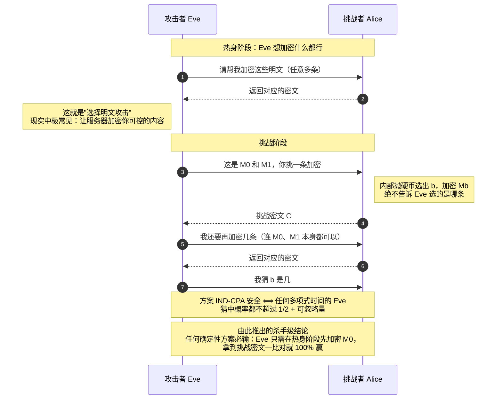
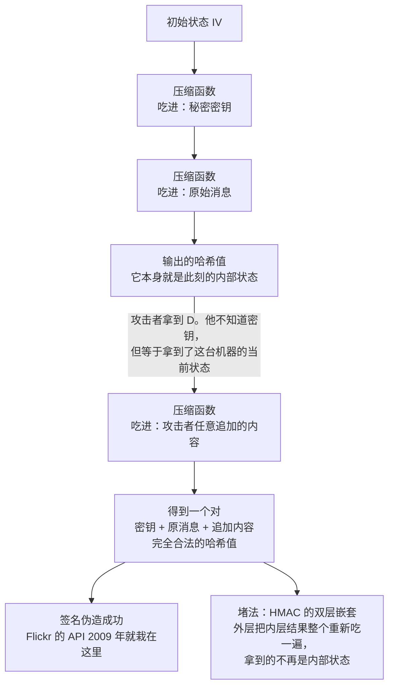
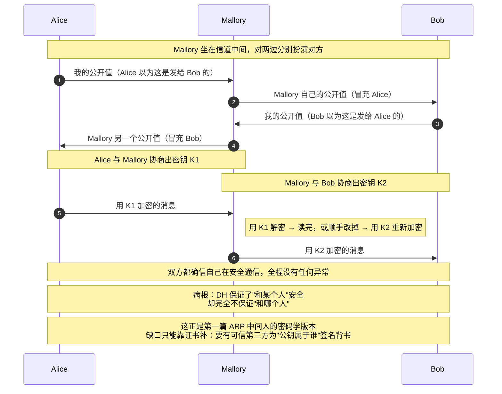
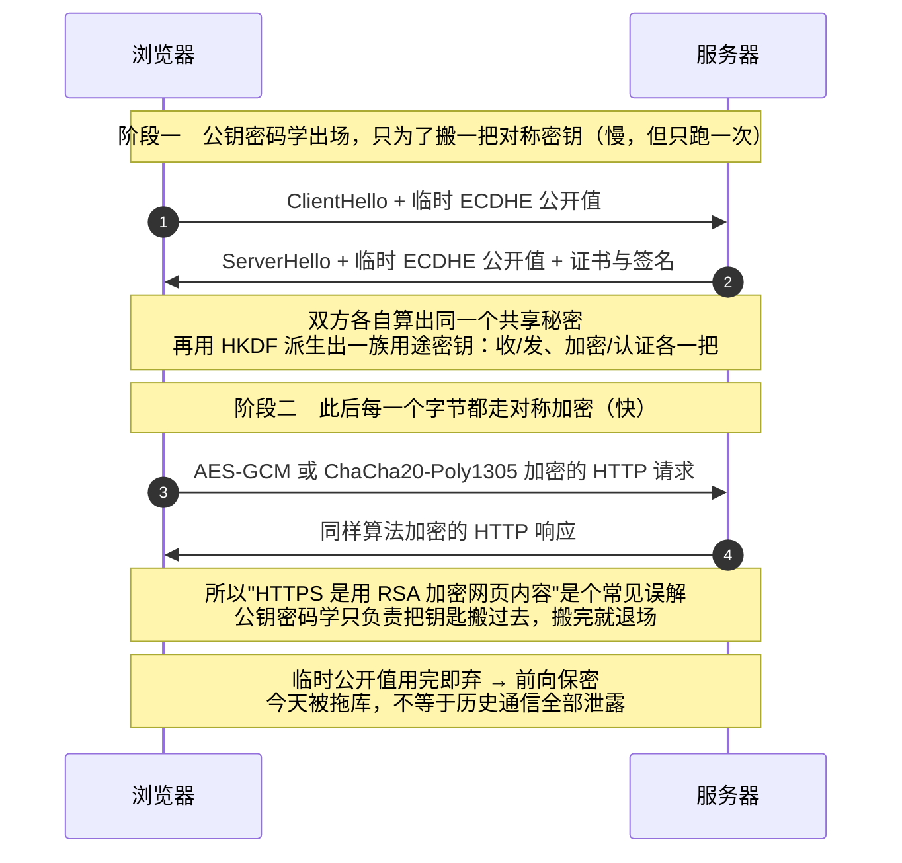
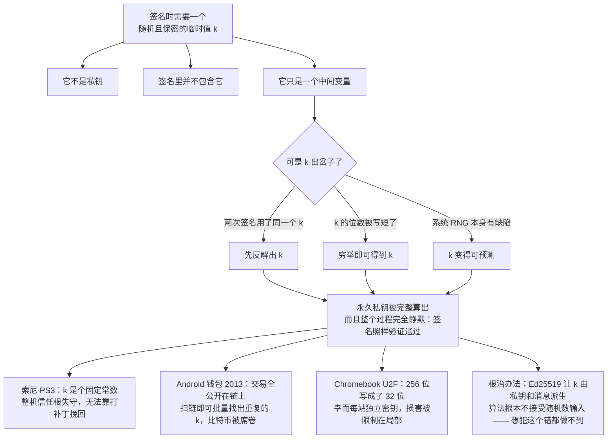

---
prev:
  text: '第一篇：协议栈的信任危机'
  link: '/exploration/network-and-security/network-security-01-trust-crisis-in-protocol-stack'
next:
  text: '第三篇：把信任装进真实系统'
  link: '/exploration/network-and-security/network-security-03-trust-in-real-systems'
---

# 网络安全入门（二）：密码学，我们靠什么重建信任

> 这是一套三篇的网络安全入门系列。
>
> - 第一篇：协议栈的信任危机 —— 互联网的底层协议是怎么被攻破的
> - **第二篇（本篇）：密码学，我们靠什么重建信任** —— 从异或到后量子，以及大量翻车现场
> - 第三篇：把信任装进真实系统（证书、TLS、VPN、Web 安全）
>
> 本篇可以独立阅读。你只需要知道"数据在网络上会被别人看到、也可能被别人改掉"这个事实，剩下的我会带你从零建起来。**不需要任何数学基础**——凡是带 `*` 的推导都是可跳过的补充，跳过完全不影响阅读。


## 引子：协议栈撞上的那堵墙

如果你读过第一篇，会记得一个反复出现的结局：**每一层协议的防御，到最后都撞上了同一堵墙。**

- TCP 那节的结论是：随机化序列号只能"提高猜中的难度"，挡不住能直接看见流量的攻击者，真正的机密性和认证**必须靠密码学协议**。
- DNS 那节的结论是：源端口随机化把攻击成本从 6 万次拉到几十亿次，但这仍然只是**提高成本**，不是**提供证明**。
- BGP 那节的结论是：一个自治域宣称"这段 IP 归我"，没人能验证——除非有一张**可验证的所有权证书**。

把这三句话叠在一起，你会看到互联网协议栈的共同困境：

> 它们全都在用**"标识符"**（源 IP、序列号、DNS 事务 ID、前缀宣告）来判断"你是不是你声称的那个人"。而标识符的问题是——**它可以被看见，也可以被伪造。**

随机化能让标识符**难猜**，过滤能让伪造**难发出去**，但没有任何一种手段能让标识符**不可伪造**。原因很简单：标识符只是一串数字，谁都能写出一串一样的数字。

密码学要解决的，正是这件事：

> **如何构造一个"只有真正的持有者才能算出来、但任何人都能验证"的东西？**

这件事在直觉上甚至有点反常识——你怎么能既公开验证方法、又不泄露秘密？但它确实可以做到，而且今天整个互联网的信任都建立在它之上。

这一篇，我们从异或（XOR）这个最简单的位运算开始，一路搭到今天银行、Signal、你的浏览器地址栏里那把小锁背后的东西。


## 开场三条约定

在动手之前，先立三条规矩。它们看起来像是行业惯例，实际上每一条都在后面决定了某个攻击成不成立。

### 约定一：出场人物

密码学界有一套沿用了四十多年的角色表，用它描述问题比用"甲方乙方"清楚得多：

| 角色 | 身份 | 能力 |
|---|---|---|
| **Alice / Bob** | 想要通信的双方 | 共享某种密钥（或各自持有公私钥） |
| **Eve**（eavesdropper） | 窃听者 | **只能读**信道上的数据 |
| **Mallory**（malicious） | 篡改者 | **能读、也能改**信道上的数据 |

Eve 和 Mallory 的区别，正好对应第一篇讲过的 **passive（被动）/ active（主动）** 两种攻击者。记住这个对应关系：**防 Eve 靠机密性（加密），防 Mallory 靠完整性（认证）。** 这一篇的整个结构就是围着这两件事转的。

### 约定二：Kerckhoffs 原则 —— 敌人知道你的系统

这是密码学最重要的一条工程原则，19 世纪就提出来了，比计算机还老：

> **Kerckhoffs 原则**：密码系统即使在攻击者完全知晓其内部设计的情况下，也应当保持安全。**唯一需要保密的，应该只有密钥。**

它有个更直白的兄弟版本，叫 **Shannon 箴言（Shannon's Maxim）**：**"敌人知道这套系统。"**

为什么必须这样假设？理由非常实际：**密钥泄露了，你可以换密钥；算法泄露了，你得把全世界跑着这套软件的每一个实例都替换掉。** 前者是一次密钥轮换，后者是一场灾难。

它的反面叫**"通过隐藏获得安全"（security through obscurity）**——指望"没人知道我怎么做的所以我很安全"。这条路在现实中翻车的次数多到可以单开一篇：

> **📦 现实案例：三个"藏起来"的算法是怎么死的**
>
> - **A5/1**（GSM 手机通话加密，1987）：算法保密了近十年，1999 年被逆向工程还原，随即被发现存在严重弱点。今天用几百美元的软件无线电设备就能实时解密老式 GSM 通话。
> - **Crypto-1**（恩智浦 Mifare Classic 门禁卡，1994）：私有流密码，2008 年被荷兰研究者逆向后发现密钥空间只有 48 位、且随机数生成器有结构缺陷，几秒钟就能克隆一张卡。当时全球有数十亿张这种卡在用，荷兰政府的交通卡系统被迫紧急整改。
> - **CSS**（DVD 内容加密，1996）：40 位密钥 + 保密算法，1999 年被逆向，一个 7 行的 Perl 脚本（著名的 `DeCSS`）就能解密任何 DVD。
>
> 共同点很清楚：**保密算法不是"额外一层保护"，而是"用一层薄纸代替真正的锁"。** 纸一旦被捅破，底下什么都没有。反过来看 AES——它的设计文档、参考实现、所有测试向量全部公开二十多年，全世界的密码学家轮番攻击，它依然站着。**这才是可信的来源。**

### 约定三：Don't roll your own crypto

密码学圈有一句被反复引用的告诫：**"Don't try this at home!"**（别在家里试）。它的意思是：

> 我们会教你密码学的**基本构件**，但你永远不应该尝试自己写密码学算法。极容易犯一个让代码失去安全性的错误——有大量我们不会覆盖的棘手边界情况，**一个小 bug 就足以摧毁整套代码的安全性**。请使用经过充分审查的现成密码库。这一篇要把你训练成的，是一个**优秀的密码学消费者**，而不是生产者。

配图是一句我很喜欢的吐槽：**"密码学是一种噩梦般的魔法数学，它甚至在乎你用的是哪种笔。"**

这句话听起来像玩笑，但读完这一篇你会发现它精确得可怕。这篇文章里绝大多数真实事故，**没有一个是数学被攻破**——全都是"笔用错了"：随机数不够随机、同一个 nonce 用了两次、比较标签时用了普通的字符串相等、密钥同时用在了两个地方。

换句话说：**每个原语都附带一份"使用契约"，而事故几乎全部来自违约，不是来自数学。**


## 密码学路线图：全景表与走法

先摆一张全景表。后面出现的每一个原语，都能挂回到它的某一格：

| | **对称密钥**（双方共享同一把密钥） | **非对称密钥**（公钥 + 私钥） |
|---|---|---|
| **机密性**<br>（别人读不到） | 一次一密<br>分组密码 + 工作模式（如 AES-CBC） | RSA 加密<br>ElGamal 加密 |
| **完整性 / 认证**<br>（别人改不了、且能确认来源） | MAC（如 HMAC） | 数字签名（如 RSA 签名） |
| **两边都要用的基础设施** | 哈希函数 · 伪随机数生成器 · 密钥交换（Diffie-Hellman）<br>密钥管理（证书） · 口令管理 | |


<svg viewBox="0 0 680 369" width="100%" role="img" style="font-family:var(--vp-font-family-base,system-ui);max-width:680px;display:block;margin:1.5rem auto;"><title>密码学工具箱地图</title><desc>按对称与非对称、机密性与完整性两个维度划分的密码学原语，以及两边共用的基础设施。</desc><defs><marker id="k1" viewBox="0 0 10 10" refX="8" refY="5" markerWidth="6" markerHeight="6" orient="auto-start-reverse"><path d="M2 1L8 5L2 9" fill="none" stroke="context-stroke" stroke-width="1.5" stroke-linecap="round" stroke-linejoin="round"/></marker></defs><rect x="160" y="45" width="235" height="32" rx="6" fill="var(--vp-c-bg-soft, #f6f6f7)" stroke="var(--vp-c-divider, #e2e2e3)" stroke-width="0.5"/><text x="277.5" y="61" text-anchor="middle" dominant-baseline="central" font-size="12" fill="var(--vp-c-text-1, #3c3c43)" font-weight="500">对称密钥（双方共享同一把）</text><rect x="405" y="45" width="235" height="32" rx="6" fill="var(--vp-c-bg-soft, #f6f6f7)" stroke="var(--vp-c-divider, #e2e2e3)" stroke-width="0.5"/><text x="522.5" y="61" text-anchor="middle" dominant-baseline="central" font-size="12" fill="var(--vp-c-text-1, #3c3c43)" font-weight="500">非对称密钥（公钥 + 私钥）</text><rect x="40" y="83" width="110" height="84" rx="6" fill="var(--vp-c-bg-soft, #f6f6f7)" stroke="var(--vp-c-divider, #e2e2e3)" stroke-width="0.5"/><text x="95" y="115" text-anchor="middle" dominant-baseline="central" font-size="13" fill="var(--vp-c-text-1, #3c3c43)" font-weight="500">机密性</text><text x="95" y="135" text-anchor="middle" dominant-baseline="central" font-size="11" fill="var(--vp-c-text-2, #67676c)">别人读不到</text><rect x="160" y="83" width="235" height="84" rx="6" fill="var(--vp-c-tip-soft, #cfe4fd)" stroke="var(--vp-c-tip-1, #3b82f6)" stroke-width="0.5"/><text x="277.5" y="107" text-anchor="middle" dominant-baseline="central" font-size="12" fill="var(--vp-c-text-2, #67676c)">一次一密（完美但不实用）</text><text x="277.5" y="125" text-anchor="middle" dominant-baseline="central" font-size="12" fill="var(--vp-c-text-2, #67676c)">分组密码 + 工作模式</text><text x="277.5" y="143" text-anchor="middle" dominant-baseline="central" font-size="11.5" fill="var(--vp-c-text-2, #67676c)">AES-CBC / AES-CTR / AES-GCM</text><rect x="405" y="83" width="235" height="84" rx="6" fill="var(--vp-c-tip-soft, #cfe4fd)" stroke="var(--vp-c-tip-1, #3b82f6)" stroke-width="0.5"/><text x="522.5" y="107" text-anchor="middle" dominant-baseline="central" font-size="12" fill="var(--vp-c-text-2, #67676c)">RSA-OAEP、ElGamal</text><text x="522.5" y="125" text-anchor="middle" dominant-baseline="central" font-size="12" fill="var(--vp-c-text-2, #67676c)">慢且只能加密短数据</text><text x="522.5" y="143" text-anchor="middle" dominant-baseline="central" font-size="11.5" fill="var(--vp-c-text-2, #67676c)">实践中一律走混合加密</text><rect x="40" y="173" width="110" height="84" rx="6" fill="var(--vp-c-bg-soft, #f6f6f7)" stroke="var(--vp-c-divider, #e2e2e3)" stroke-width="0.5"/><text x="95" y="197" text-anchor="middle" dominant-baseline="central" font-size="13" fill="var(--vp-c-text-1, #3c3c43)" font-weight="500">完整性</text><text x="95" y="215" text-anchor="middle" dominant-baseline="central" font-size="13" fill="var(--vp-c-text-1, #3c3c43)" font-weight="500">与认证性</text><text x="95" y="233" text-anchor="middle" dominant-baseline="central" font-size="11" fill="var(--vp-c-text-2, #67676c)">别人改不了</text><rect x="160" y="173" width="235" height="84" rx="6" fill="var(--vp-c-brand-soft, #d3f5e0)" stroke="var(--vp-c-brand-1, #10b981)" stroke-width="0.5"/><text x="277.5" y="197" text-anchor="middle" dominant-baseline="central" font-size="12" fill="var(--vp-c-text-2, #67676c)">MAC，实践中用 HMAC</text><text x="277.5" y="215" text-anchor="middle" dominant-baseline="central" font-size="12" fill="var(--vp-c-text-2, #67676c)">快几个数量级</text><text x="277.5" y="233" text-anchor="middle" dominant-baseline="central" font-size="11.5" fill="var(--vp-c-text-2, #67676c)">但不提供不可否认性</text><rect x="405" y="173" width="235" height="84" rx="6" fill="var(--vp-c-brand-soft, #d3f5e0)" stroke="var(--vp-c-brand-1, #10b981)" stroke-width="0.5"/><text x="522.5" y="197" text-anchor="middle" dominant-baseline="central" font-size="12" fill="var(--vp-c-text-2, #67676c)">数字签名</text><text x="522.5" y="215" text-anchor="middle" dominant-baseline="central" font-size="11.5" fill="var(--vp-c-text-2, #67676c)">RSA 签名 / ECDSA / Ed25519</text><text x="522.5" y="233" text-anchor="middle" dominant-baseline="central" font-size="11.5" fill="var(--vp-c-text-2, #67676c)">慢，但可向第三方举证</text><rect x="40" y="269" width="600" height="78" rx="6" fill="var(--vp-c-warning-soft, #fce8c3)" stroke="var(--vp-c-warning-1, #d4a017)" stroke-width="0.5"/><text x="340" y="290" text-anchor="middle" dominant-baseline="central" font-size="13" fill="var(--vp-c-text-1, #3c3c43)" font-weight="500">两边都离不开的基础设施</text><text x="340" y="308" text-anchor="middle" dominant-baseline="central" font-size="12" fill="var(--vp-c-text-2, #67676c)">哈希函数 · 伪随机数生成器 · 密钥交换（ECDHE） · 密钥管理与证书 · 口令存储</text><text x="340" y="326" text-anchor="middle" dominant-baseline="central" font-size="11.5" fill="var(--vp-c-text-2, #67676c)">本篇的真实事故几乎全出在这一行，而不是上面那四格</text></svg>

<p align="center"><sub>图 1：后面每一个原语都能挂回到这张图的某一格。最底下那条横带是重灾区——真实事故几乎都出在那里，而不是上面四格。</sub></p>


三个安全目标，可以定义得很干净：

- **机密性（Confidentiality）**：敌手读不到我们的消息。
- **完整性（Integrity）**：敌手改不了我们的消息**而不被发现**。
- **认证性（Authenticity）**：我能证明这条消息来自它声称的那个人。

两者的关系需要分清：**完整性和认证性是紧密相关但不完全相同的性质**——"在我能证明消息来自某人之前，我得先能证明消息没被改过"。

还有一个类比很好记：

- 机密性 = **把消息锁进盒子**。Eve 看得见盒子，但打不开。
- 完整性 = **在信封上贴封条**。Mallory 一旦拆开，封条就破了；而没有密钥，她造不出一个新封条。

### 分类表与因果链：这一篇的走法

上面那张表是**分类**，不是**路线**。真正的走法是一条链子——**每一站都诞生于上一站的失败**：

> **一次一密**完美，但密钥和消息一样长
> → **分组密码**把密钥缩短了，可它只吃定长数据，而且是确定性的
> → **工作模式**同时解决了长度和确定性，可它管不了内容有没有被改
> → **哈希**能查出改动，可惜它无密钥，谁都能算
> → **MAC** 补上了密钥，可它和加密怎么拼在一起极容易出错
> → **认证加密**把拼法固定下来了，但这一切都要求双方先有同一把密钥
> → **Diffie-Hellman** 让密钥能凭空商量出来，可你并不知道对面是谁
> → **这个缺口，就是第三篇的入口**

顺着这条链往下读，比顺着那张表读要顺得多。表留到读完之后用来复查，链是你现在要走的路。

不过还有两站不在这条链上，得单独交代：**伪随机数生成器**是整条链的地基——上面每一环都在默默假设"我能拿到真随机"，一旦这个假设塌了，全线跟着塌；**口令存储**则是挂在链外的一个外挂，它不解决链上任何一环的遗留问题，却是你日常最高频会亲手写到的密码学代码。

好了，从链子的第一环开始。


## 第一站：一次一密 —— 完美，然后没用

### 基础运算：异或

整个对称加密的地基是一个简单到过分的位运算——**异或（XOR，⊕）**：两位相同得 0，不同得 1。

```
0 ⊕ 0 = 0        x ⊕ 0 = x          ← 和 0 异或，原样不变
0 ⊕ 1 = 1        x ⊕ x = 0          ← 和自己异或，全归零
1 ⊕ 0 = 1        x ⊕ y = y ⊕ x      ← 可交换
1 ⊕ 1 = 0        (x ⊕ y) ⊕ x = y    ← 这条是全部魔法的来源
```

注意最后那条：**用同一个值异或两次，就回到了原点。** 这意味着异或**自己就是自己的逆运算**——加密和解密可以是同一个操作。

### 一次一密（One-Time Pad, OTP）

有了异或，最简单的加密方案自然浮现：

- **KeyGen()**：随机生成一个和消息**等长**的密钥 K
- **Enc(K, M) = K ⊕ M**：逐位异或
- **Dec(K, C) = K ⊕ C**：还是逐位异或

正确性一行就能验证：`Dec(K, Enc(K, M)) = K ⊕ (K ⊕ M) = (K ⊕ K) ⊕ M = 0 ⊕ M = M`。

### 完美安全：一次一密的信息论保证

一次一密有个几乎独一无二的性质：它的安全性**不依赖于任何计算难题**，而是可以被数学严格证明的。论证只有两行：

假设 Eve 截获了密文 C，她想知道 Alice 发的是 M₀ 还是 M₁。

- 如果发的是 M₀，那么 `C = K ⊕ M₀`，也就是说密钥是 `K = C ⊕ M₀`
- 如果发的是 M₁，那么 `C = K ⊕ M₁`，也就是说密钥是 `K = C ⊕ M₁`

**而 K 是完全随机选的，所以这两种可能性的概率完全相等。** Eve 手里的密文没有给她任何新信息——她的猜中概率精确地等于 ½，一丝一毫的优势都没有。

这里的措辞很讲究：它叫**"完美"（perfect）安全**——任何攻击者赢的概率**恰好**是 ½，而不是"½ + 一个极小的量"。哪怕给 Eve 无限的计算能力和无限的时间，她也做不了任何事。这个级别的保证，现代密码学里几乎再没有第二个。

### 密钥绝不能重用：VENONA 的教训

一次一密名字里的"一次"是死命令，不是建议。看看重用一次会发生什么：

Alice 用同一个 K 加密了两条消息：

```
C₀ = K ⊕ M₀
C₁ = K ⊕ M₁
```

Eve 在信道上看到了这两条密文。她什么都不用做，只需把它们异或起来：

```
C₀ ⊕ C₁ = (K ⊕ M₀) ⊕ (K ⊕ M₁) = M₀ ⊕ M₁
```

**K 被消掉了。** Eve 直接拿到了两条明文的异或值。这意味着：

- 她知道了 M₀ 和 M₁ 在**哪些位上相同、哪些位上不同**
- 如果她碰巧知道 M₀（比如那是一封格式固定的公函），她**立刻得到 M₁**
- 就算她不知道，她也可以猜一个 M₀，然后看算出来的 M₁ 是不是像人话——这叫**"拖拽攻击"（crib-dragging）**，对自然语言极其有效，因为语言的冗余度太高了

一次一密的完美安全，在密钥重用的瞬间就归零了。
<svg viewBox="0 0 680 386" width="100%" role="img" style="font-family:var(--vp-font-family-base,system-ui);max-width:680px;display:block;margin:1.5rem auto;"><title>密钥重用为什么是致命的</title><desc>两条消息用同一把密钥做异或加密时，把两段密文异或起来密钥会被抵消，直接暴露两条明文的异或值。</desc><defs><marker id="k2" viewBox="0 0 10 10" refX="8" refY="5" markerWidth="6" markerHeight="6" orient="auto-start-reverse"><path d="M2 1L8 5L2 9" fill="none" stroke="context-stroke" stroke-width="1.5" stroke-linecap="round" stroke-linejoin="round"/></marker></defs><rect x="160" y="46" width="360" height="38" rx="6" fill="var(--vp-c-bg-soft, #f6f6f7)" stroke="var(--vp-c-divider, #e2e2e3)" stroke-width="0.5"/><text x="340" y="65" text-anchor="middle" dominant-baseline="central" font-size="15" fill="var(--vp-c-text-1, #3c3c43)" font-weight="500">C0  =  M0 &#8853; K</text><rect x="160" y="94" width="360" height="38" rx="6" fill="var(--vp-c-bg-soft, #f6f6f7)" stroke="var(--vp-c-divider, #e2e2e3)" stroke-width="0.5"/><text x="340" y="113" text-anchor="middle" dominant-baseline="central" font-size="15" fill="var(--vp-c-text-1, #3c3c43)" font-weight="500">C1  =  M1 &#8853; K</text><text x="340" y="158" text-anchor="middle" font-size="12" fill="var(--vp-c-text-2, #67676c)">Eve 把两段密文异或起来 &#8595;</text><rect x="90" y="172" width="500" height="52" rx="6" fill="var(--vp-c-danger-soft, #fbd5d5)" stroke="var(--vp-c-danger-1, #d94f4f)" stroke-width="0.5"/><text x="340" y="198" text-anchor="middle" dominant-baseline="central" font-size="14" fill="var(--vp-c-text-1, #3c3c43)" font-weight="500">C0 &#8853; C1  =  (M0 &#8853; K) &#8853; (M1 &#8853; K)  =  M0 &#8853; M1</text><rect x="60" y="240" width="560" height="62" rx="6" fill="var(--vp-c-bg-soft, #f6f6f7)" stroke="var(--vp-c-divider, #e2e2e3)" stroke-width="0.5"/><text x="340" y="261" text-anchor="middle" dominant-baseline="central" font-size="13" fill="var(--vp-c-text-1, #3c3c43)" font-weight="500">密钥自己消失了 —— Eve 不需要任何计算能力</text><text x="340" y="281" text-anchor="middle" dominant-baseline="central" font-size="11.5" fill="var(--vp-c-text-2, #67676c)">知道其中一条明文就直接得到另一条；即使都不知道，也能靠自然语言的冗余度拖拽还原</text><rect x="40" y="316" width="142" height="46" rx="6" fill="var(--vp-c-warning-soft, #fce8c3)" stroke="var(--vp-c-warning-1, #d4a017)" stroke-width="0.5"/><text x="111" y="330" text-anchor="middle" dominant-baseline="central" font-size="12" fill="var(--vp-c-text-1, #3c3c43)" font-weight="500">VENONA 1943</text><text x="111" y="348" text-anchor="middle" dominant-baseline="central" font-size="10.5" fill="var(--vp-c-text-2, #67676c)">重印的一次性密码本</text><rect x="192" y="316" width="142" height="46" rx="6" fill="var(--vp-c-warning-soft, #fce8c3)" stroke="var(--vp-c-warning-1, #d4a017)" stroke-width="0.5"/><text x="263" y="330" text-anchor="middle" dominant-baseline="central" font-size="12" fill="var(--vp-c-text-1, #3c3c43)" font-weight="500">WEP</text><text x="263" y="348" text-anchor="middle" dominant-baseline="central" font-size="10.5" fill="var(--vp-c-text-2, #67676c)">只有 24 位的 IV</text><rect x="344" y="316" width="142" height="46" rx="6" fill="var(--vp-c-warning-soft, #fce8c3)" stroke="var(--vp-c-warning-1, #d4a017)" stroke-width="0.5"/><text x="415" y="330" text-anchor="middle" dominant-baseline="central" font-size="12" fill="var(--vp-c-text-1, #3c3c43)" font-weight="500">CTR / GCM</text><text x="415" y="348" text-anchor="middle" dominant-baseline="central" font-size="10.5" fill="var(--vp-c-text-2, #67676c)">nonce 重复使用</text><rect x="496" y="316" width="142" height="46" rx="6" fill="var(--vp-c-warning-soft, #fce8c3)" stroke="var(--vp-c-warning-1, #d4a017)" stroke-width="0.5"/><text x="567" y="330" text-anchor="middle" dominant-baseline="central" font-size="12" fill="var(--vp-c-text-1, #3c3c43)" font-weight="500">Adobe 2013</text><text x="567" y="348" text-anchor="middle" dominant-baseline="central" font-size="10.5" fill="var(--vp-c-text-2, #67676c)">ECB + 全站同一把密钥</text></svg>

<p align="center"><sub>图 2：这个公式会在 VENONA、WEP、CTR 的 nonce 重用、GCM 的 nonce 重用里反复出现——同一条病理，换了四次外衣。</sub></p>


> **📦 现实案例：VENONA —— 人类历史上最昂贵的一次密钥重用**
>
> 这不是教科书假设，而是改变了冷战格局的真实事件。
>
> 二战期间苏联情报机构使用一次一密加密外交与间谍电文，理论上牢不可破。但战时生产压力下，密码本制造厂**重复印制了部分密钥页**，导致同一份密钥被用于加密了不止一条消息。
>
> 美国陆军信号情报处从 1943 年起启动了代号 **VENONA** 的项目，正是抓住这批重复密钥，历经数十年逐步破译了约三千份电文。成果包括：确认了曼哈顿计划内部的苏联间谍克劳斯·福克斯、指认了罗森堡夫妇、以及揭开"剑桥五杰"间谍网的线索。这个项目一直秘密进行到 1980 年，直到 1995 年才解密公开。
>
> **一个理论上完美的密码系统，被一个纯粹的运营失误摧毁了三十多年。** 数学一步没错，错的是印刷厂。

### 两个工程限制：密钥生成与密钥分发

即使你严守"不重用"，一次一密还有两个致命的工程限制：

**限制一：密钥生成。** 每条消息都要一把全新的、真随机的、等长的密钥。而**真随机是昂贵的**（这个话题我们后面会专门展开）。

**限制二：密钥分发。** 这个更要命，堪称一个哲学笑话：

> 要安全地传一条 n 位的消息，你得先安全地传一把 n 位的密钥。**但如果你已经有办法安全地传这 n 位密钥了，你为什么不直接用那个办法把消息传过去？**

唯一的现实用法是"提前储备"：趁现在有安全信道（比如两个特工在安全屋里当面交换），先交换一大摞密钥本，将来在不安全的信道上使用。这也是为什么一次一密的历史用户几乎全是**间谍和外交机构**。用一句流传很广的话说：**对现实世界不实用，除非你是间谍。**

（顺带一提，一次一密还有个可爱之处：它可以**纯手工计算**，不需要任何计算机。冷战时期的特工确实是拿着纸笔和一本小册子做这件事的。）


## 第二站：IND-CPA —— 给"安全"下一个精确定义

在往下走之前，必须停下来做一件严肃的事：**给"机密性"下一个精确的定义。**

最朴素的定义是"敌手读不到我们的消息"。这个定义太含糊了，四个问题就能把它拆穿：

- 如果 Eve 能读到消息的**前一半**，读不到后一半，算安全吗？
- 如果 Eve 只推断出消息**以"亲爱的 Bob"开头**，算安全吗？
- 如果 Eve **本来就知道**消息以"此致敬礼，Alice"结尾呢？（这不算泄露，因为她早就知道）
- 如果 Eve 知道消息只可能是 **"买入"或"卖出"**，但不知道是哪个呢？

于是有了一个更好的定义：

> **密文不应该给攻击者任何关于明文的额外信息——超出他本来就知道的部分。**

这个"额外"是精髓：安全不是"什么都不知道"，而是"看了密文之后，知道的不比看之前更多"。

### IND-CPA 游戏的五个步骤

怎么把这个定义变成可以检验的东西？密码学家的答案很妙：**设计一场游戏，如果没有攻击者能赢，就是安全的。**

这个游戏叫 **IND-CPA**（Indistinguishability under Chosen Plaintext Attack，选择明文攻击下的不可区分性），流程是这样的：

1. Eve 可以任意挑选一堆明文交给 Alice，让 Alice 加密后把密文还给她（**"选择明文"** 就是指这个能力）
2. Eve 挑出两条明文 **M₀** 和 **M₁** 交给 Alice
3. Alice **偷偷地**随机选一条加密，把密文还给 Eve —— **不告诉她选的是哪条**
4. Eve 可以继续要求加密任意明文（包括 M₀ 和 M₁ 本身！）
5. 最后 Eve 猜：刚才那个密文对应的是 M₀ 还是 M₁？

> **如果对所有多项式时间的攻击者，赢的概率都 ≤ ½ + ε（ε 是可忽略的量），这个方案就是 IND-CPA 安全的。**





<p align="center"><sub>图 3：IND-CPA 游戏。注意第 4 步——允许 Eve 事后继续点单，正是这一条把"确定性方案"一票否决了。</sub></p>


½ 是瞎猜的概率。所以这个定义的实质是：**看了密文，Eve 比瞎猜好不了多少。**

### 关键结论：确定性方案必然不安全

现在用这个游戏检验一次一密。它是 IND-CPA 安全的吗？

**不是。** 攻击策略简单得离谱：在第 1 步先让 Alice 加密 M₀，记下密文；等第 3 步拿到挑战密文，比对一下——**一样就是 M₀，不一样就是 M₁**。100% 赢。

问题出在哪？出在**一次一密在密钥固定时是确定性的**：同样的输入永远产生同样的输出。于是我们得到一条定律：

> **⚠️ 任何确定性的加密方案，都不可能是 IND-CPA 安全的。**
>
> 因为攻击者永远可以通过"同一条消息加密两次，看结果是否相同"来分辨。

接下来你会看到，AES 本身不是 IND-CPA 安全的（确定性）、ECB 模式不是（确定性）、教科书版 RSA 不是（确定性）、MAC 也不是（确定性）——**每一次的病因都是同一个，每一次的药方也都是同一个：往里加随机性。**

### 定义的边界：密文长度仍会泄露

IND-CPA 安全的方案有一个公认的"合法泄露"：**明文的长度**。因为几乎所有实用的加密方案，密文长度都随明文长度变化。

听起来无伤大雅？远远不是。

> **📦 扩展知识：长度泄露有多致命 —— 加密流量分析**
>
> 这里正好可以接上第一篇讲的"**被动攻击 / 流量分析**"，你会看到理论定义里那个不起眼的"边界情况"，在现实中是一整个攻击门类。
>
> - **CRIME（2012）与 BREACH（2013）**：HTTPS 常常在加密前先压缩数据。压缩的本质是"重复内容变短"。于是攻击者可以往请求里注入猜测的字符串——**如果密文变短了，说明猜对了**（内容重复被压掉了）。靠这个逐字节试探，可以在加密连接里偷出会话 Cookie 和 CSRF Token。修复方式相当粗暴：**在 TLS 层直接禁用压缩。**
> - **加密语音识别**：使用可变比特率（VBR）编码的加密 VoIP 通话，数据包的**长度模式**会随发音的音节变化。研究者证明可以在完全不解密的情况下，识别出通话中说了哪些预设短语。
> - **HTTPS 网页指纹**：即使全程 TLS 加密，一个网站每个页面加载的**资源数量和大小组合**是相对独特的。观察者可以据此判断你访问了同一网站下的**哪一个具体页面**——比如某个医疗网站的哪个疾病条目。
>
> **这就是为什么现代注重隐私的协议会做流量填充（padding）、固定包长、加入伪流量**——这些看起来"浪费带宽"的设计，正是在堵住这个 IND-CPA 定义允许的合法缺口。


## 第三站：分组密码 —— 现代对称加密的引擎

一次一密的问题是密钥太长。我们真正想要的是：**一把短密钥（比如 128 位），能加密任意长的消息。**

第一步，先造一个能加密**固定长度**数据的强力零件。

### 分组密码的定义与三条要求

> **分组密码（Block Cipher）**：一对加解密算法，处理**固定长度**的数据块。
> - `E_K(M) → C`：输入 k 位密钥和 n 位明文，输出 n 位密文
> - `D_K(C) → M`：反过来

它需要满足三条：

**正确性：`E_K` 必须是一个置换（双射）。** 每个输入必须对应唯一的输出。理由很直白——如果两个不同的明文加密成了同一个密文，解密的时候你怎么知道该还原成哪一个？

**安全性：它应该表现得像一个"随机置换"。** 这个定义也是用游戏来给的：给 Eve 两个黑盒，一个是真正随机挑选的置换，一个是用随机密钥的 `E_K`，**Eve 分辨不出哪个是哪个**（成功概率不超过 ½ + 可忽略量）。

**效率：要快。** 分组密码主要使用异或、位移、小型查表——这些在现代 CPU 上极快。

### 128 位密钥到底有多难暴力破解？

我们算一笔账。这个数量级的感受一旦建立起来，你以后看到"密钥长度"就有直觉了。

**先看 128 位**（需要试 2¹²⁸ 种可能）：

```
好用的近似：2¹⁰ ≈ 10³
2¹²⁸ ≈ 10³⁹

假设我们有一台变态硬件，1 纳秒能试 10⁹（十亿）个密钥
    → 每秒 10¹⁸ 个密钥
需要 10³⁹ / 10¹⁸ = 10²¹ 秒
一年 ≈ 3 × 10⁷ 秒
    → 约 3 × 10¹³ 年 ≈ 30 万亿年
```

宇宙目前的年龄大约是 138 亿年，也就是 1.38 × 10¹⁰ 年。**暴力破解 128 位密钥所需的时间，是宇宙年龄的两千多倍。**

**再看 256 位**，换个更有画面感的算法：要在同样的时间内破解，你需要 **10⁵² 台**上面那种设备。假设每台只有 1 立方毫米大，它们要占据 **10⁴³ 立方米**的空间——

> 这大约是 **7 × 10¹⁵ 个太阳**的体积。作为参照，**整个银河系也就 10¹¹ 颗恒星。**

结论可以很简短：**128 位密钥？绝无可能。256 位密钥？呵呵。**

**记住这个感受**：只要密钥是真随机、真保密的，暴力破解在物理上就是不可能的。所以当你以后听说某个系统被攻破了，**几乎可以肯定不是密钥被暴力猜出来的**——一定是别的地方漏了。这条直觉在真实的安全事件分析里屡试不爽。

### DES：被同时削弱和加固的标准

**DES（数据加密标准）**，1970 年代末设计，块大小 64 位，密钥 **56 位**。

这里有一件密码学史上最有嚼头的悬案：**NSA 影响了 DES 设计的两个方面**——它以某种"神秘的方式"调整了内部结构，并且**把密钥长度从 64 位削减到了 56 位**。

削减密钥长度显然是削弱。但"调整内部结构"是什么意思？答案是反转的：

> 该算法在四十年里未被攻破。**NSA 的调整反而使它更能抵抗一种十年后才被公开发现的攻击。**

> **📦 扩展知识：DES 的双面故事 —— 你的对手可能同时在帮你和害你**
>
> 那个"十年后才被公开发现的攻击"叫**差分密码分析（differential cryptanalysis）**，由 Biham 和 Shamir 在 1990 年前后公开发表。
>
> 蹊跷的是：当研究者用这个全新方法去攻击 DES 时，发现 **DES 的 S 盒（替换表）设计得像是专门为了抵抗它而优化的**——换成随机的 S 盒，DES 会脆弱得多。
>
> 1994 年，参与 DES 设计的 IBM 研究员 Don Coppersmith 才公开承认：**IBM 团队早在 1974 年就独立发现了差分分析，而 NSA 要求他们保密**，因为这项技术当时被视为国家机密。
>
> 所以完整的故事是：**NSA 一手削弱了 DES 的密钥长度（让自己有能力暴力破解，别人没有），一手加固了 DES 的内部结构（让别人发现不了的攻击方法也伤不到它）。** 它同时是攻击者和防御者。
>
> 而那个被削弱的密钥长度，最终确实要了 DES 的命：
> - **1998 年**，电子前哨基金会（EFF）花约 25 万美元造了一台专用机器 **Deep Crack**，**56 小时**破解了一条 DES 密文——公开证明了"56 位不够用"这件长期被官方否认的事。
> - 过渡方案 **3DES**（把 DES 跑三遍）撑了二十多年，但因为块大小仍是 64 位（存在生日攻击隐患）且速度慢，**NIST 已于 2023 年底正式停止批准它用于加密**。
>
> 再算一笔账：56 位约 6.4 × 10¹⁶ 种可能，用一张现代显卡每秒试 10¹⁰ 次，**大约 70 天**就能跑完。一台家用电脑，两个多月。

### AES：今天的标准答案

**AES（高级加密标准）** 是 DES 的继任者，也是今天你能想到的几乎所有加密场景背后的引擎：

| 参数 | 值 |
|---|---|
| 密钥长度 | 128 / 192 / 256 位（**现在建议用 256**） |
| 块大小 | **恒为 128 位**（注意：不随密钥长度变化） |
| 轮数 | 128 位密钥 10 轮 / 192 位 12 轮 / 256 位 14 轮 |

说得坦率一点：**你不需要知道 AES 内部是怎么工作的，但你需要知道它的参数。** 如果你好奇，每一轮做四件事——`SubBytes()`（按字节查替换表）、`ShiftRows()`（按行循环移位）、`MixColumns()`（当成 4×4 矩阵做矩阵乘法）、`AddRoundKey()`（与本轮密钥异或）。核心思想是**混淆与扩散**：反复打乱、反复扩散，让输入的任何一位变化都迅速影响到全部输出。

有一点值得注意：**AES 并没有安全性的形式化证明**。我们说它安全，依据是**二十多年来全世界公开攻击它，没人成功**。还有一条很有分量的旁证：**NSA 用 AES-256 来保护那些他们希望未来 40 年都不被解开的机密——哪怕出现未知的研究突破。**

### 分组密码的两个硬伤：定长与确定性

1. **它是确定性的** → 由前面的定律，**不是 IND-CPA 安全的**。攻击就是那个万能套路：先让 Alice 加密 M₀ 记下密文，拿到挑战密文一比对，100% 赢。
2. **它只能加密固定长度** → AES 一次只能吃 128 位。**那比 128 位长的消息怎么办？**

这两个问题的答案，是同一个东西：**工作模式**。


## 第四站：工作模式 —— 从 ECB 到 CBC 与 CTR

这一节换一种写法，叫**"我们一起设计"**：不直接给结论，而是带你走一遍当年设计者的心路。请跟着推一遍，效果远好于死记三个模式的名字。

### 第一版尝试：ECB 模式

**问题**：AES 一次只能加密 128 位。要加密 256 位怎么办？

**最直觉的想法**：把消息切成两块，用同一把密钥各加密一次，把密文拼起来。

这就是 **ECB 模式（Electronic Code Book，电子密码本）**：

```
C₁ = E_K(P₁),  C₂ = E_K(P₂),  ...,  Cₘ = E_K(Pₘ)
密文 = C₁ || C₂ || ... || Cₘ
```

**它 IND-CPA 安全吗？** 不安全。因为它是**确定性的**——同样的明文块，永远加密成同样的密文块。

这句话听起来还挺抽象。所以密码学界有一张流传最广的教学图，一秒钟就能让人明白 ECB 有多糟：

> **🐧 企鹅图**
>
> 拿 Linux 吉祥物 Tux 的图片，用 **AES-ECB** 加密。你会看到：**企鹅还在那儿。**
>
> 颜色变了、像素乱了，但**轮廓、形状、明暗分界全部清晰可辨**。原因就是那句话：图片里大片相同的白色区域，加密后变成了大片相同的密文；轮廓处的颜色变化，加密后依然是密文的变化。**加密"泄露了明文的结构"。**
>
> 而用后面要讲的 CBC 或 CTR 模式加密同一张图，得到的是**纯粹的雪花噪点**，什么都看不出来。
>
> 原始的企鹅版本可以搜 *ECB penguin* 看看，比任何形式化定义都直观。


<svg viewBox="0 0 680 232" width="100%" role="img" style="font-family:var(--vp-font-family-base,system-ui);max-width:680px;display:block;margin:1.5rem auto;"><title>ECB 模式为什么会泄露明文结构</title><desc>相同的明文块永远加密成相同的密文块，因此原始图案在 ECB 密文中依然清晰可辨，而 CBC 或 CTR 只留下噪点。</desc><defs><marker id="k3" viewBox="0 0 10 10" refX="8" refY="5" markerWidth="6" markerHeight="6" orient="auto-start-reverse"><path d="M2 1L8 5L2 9" fill="none" stroke="context-stroke" stroke-width="1.5" stroke-linecap="round" stroke-linejoin="round"/></marker></defs><rect x="48" y="66" width="16" height="16" rx="1.5" fill="var(--vp-c-text-1, #3c3c43)" fill-opacity="0.10"/><rect x="65" y="66" width="16" height="16" rx="1.5" fill="var(--vp-c-text-1, #3c3c43)" fill-opacity="0.10"/><rect x="82" y="66" width="16" height="16" rx="1.5" fill="var(--vp-c-text-1, #3c3c43)" fill-opacity="0.72"/><rect x="99" y="66" width="16" height="16" rx="1.5" fill="var(--vp-c-text-1, #3c3c43)" fill-opacity="0.72"/><rect x="116" y="66" width="16" height="16" rx="1.5" fill="var(--vp-c-text-1, #3c3c43)" fill-opacity="0.72"/><rect x="133" y="66" width="16" height="16" rx="1.5" fill="var(--vp-c-text-1, #3c3c43)" fill-opacity="0.72"/><rect x="150" y="66" width="16" height="16" rx="1.5" fill="var(--vp-c-text-1, #3c3c43)" fill-opacity="0.10"/><rect x="167" y="66" width="16" height="16" rx="1.5" fill="var(--vp-c-text-1, #3c3c43)" fill-opacity="0.10"/><rect x="48" y="83" width="16" height="16" rx="1.5" fill="var(--vp-c-text-1, #3c3c43)" fill-opacity="0.10"/><rect x="65" y="83" width="16" height="16" rx="1.5" fill="var(--vp-c-text-1, #3c3c43)" fill-opacity="0.72"/><rect x="82" y="83" width="16" height="16" rx="1.5" fill="var(--vp-c-text-1, #3c3c43)" fill-opacity="0.72"/><rect x="99" y="83" width="16" height="16" rx="1.5" fill="var(--vp-c-text-1, #3c3c43)" fill-opacity="0.10"/><rect x="116" y="83" width="16" height="16" rx="1.5" fill="var(--vp-c-text-1, #3c3c43)" fill-opacity="0.10"/><rect x="133" y="83" width="16" height="16" rx="1.5" fill="var(--vp-c-text-1, #3c3c43)" fill-opacity="0.72"/><rect x="150" y="83" width="16" height="16" rx="1.5" fill="var(--vp-c-text-1, #3c3c43)" fill-opacity="0.72"/><rect x="167" y="83" width="16" height="16" rx="1.5" fill="var(--vp-c-text-1, #3c3c43)" fill-opacity="0.10"/><rect x="48" y="100" width="16" height="16" rx="1.5" fill="var(--vp-c-text-1, #3c3c43)" fill-opacity="0.10"/><rect x="65" y="100" width="16" height="16" rx="1.5" fill="var(--vp-c-text-1, #3c3c43)" fill-opacity="0.72"/><rect x="82" y="100" width="16" height="16" rx="1.5" fill="var(--vp-c-text-1, #3c3c43)" fill-opacity="0.72"/><rect x="99" y="100" width="16" height="16" rx="1.5" fill="var(--vp-c-text-1, #3c3c43)" fill-opacity="0.72"/><rect x="116" y="100" width="16" height="16" rx="1.5" fill="var(--vp-c-text-1, #3c3c43)" fill-opacity="0.72"/><rect x="133" y="100" width="16" height="16" rx="1.5" fill="var(--vp-c-text-1, #3c3c43)" fill-opacity="0.72"/><rect x="150" y="100" width="16" height="16" rx="1.5" fill="var(--vp-c-text-1, #3c3c43)" fill-opacity="0.72"/><rect x="167" y="100" width="16" height="16" rx="1.5" fill="var(--vp-c-text-1, #3c3c43)" fill-opacity="0.10"/><rect x="48" y="117" width="16" height="16" rx="1.5" fill="var(--vp-c-text-1, #3c3c43)" fill-opacity="0.10"/><rect x="65" y="117" width="16" height="16" rx="1.5" fill="var(--vp-c-text-1, #3c3c43)" fill-opacity="0.72"/><rect x="82" y="117" width="16" height="16" rx="1.5" fill="var(--vp-c-text-1, #3c3c43)" fill-opacity="0.72"/><rect x="99" y="117" width="16" height="16" rx="1.5" fill="var(--vp-c-text-1, #3c3c43)" fill-opacity="0.10"/><rect x="116" y="117" width="16" height="16" rx="1.5" fill="var(--vp-c-text-1, #3c3c43)" fill-opacity="0.10"/><rect x="133" y="117" width="16" height="16" rx="1.5" fill="var(--vp-c-text-1, #3c3c43)" fill-opacity="0.72"/><rect x="150" y="117" width="16" height="16" rx="1.5" fill="var(--vp-c-text-1, #3c3c43)" fill-opacity="0.72"/><rect x="167" y="117" width="16" height="16" rx="1.5" fill="var(--vp-c-text-1, #3c3c43)" fill-opacity="0.10"/><rect x="48" y="134" width="16" height="16" rx="1.5" fill="var(--vp-c-text-1, #3c3c43)" fill-opacity="0.10"/><rect x="65" y="134" width="16" height="16" rx="1.5" fill="var(--vp-c-text-1, #3c3c43)" fill-opacity="0.72"/><rect x="82" y="134" width="16" height="16" rx="1.5" fill="var(--vp-c-text-1, #3c3c43)" fill-opacity="0.72"/><rect x="99" y="134" width="16" height="16" rx="1.5" fill="var(--vp-c-text-1, #3c3c43)" fill-opacity="0.10"/><rect x="116" y="134" width="16" height="16" rx="1.5" fill="var(--vp-c-text-1, #3c3c43)" fill-opacity="0.10"/><rect x="133" y="134" width="16" height="16" rx="1.5" fill="var(--vp-c-text-1, #3c3c43)" fill-opacity="0.72"/><rect x="150" y="134" width="16" height="16" rx="1.5" fill="var(--vp-c-text-1, #3c3c43)" fill-opacity="0.72"/><rect x="167" y="134" width="16" height="16" rx="1.5" fill="var(--vp-c-text-1, #3c3c43)" fill-opacity="0.10"/><text x="116" y="172" text-anchor="middle" font-size="11.5" fill="var(--vp-c-text-2, #67676c)">明文：一个可辨认的图案</text><rect x="272" y="66" width="16" height="16" rx="1.5" fill="var(--vp-c-danger-1, #d94f4f)" fill-opacity="0.18"/><rect x="289" y="66" width="16" height="16" rx="1.5" fill="var(--vp-c-danger-1, #d94f4f)" fill-opacity="0.18"/><rect x="306" y="66" width="16" height="16" rx="1.5" fill="var(--vp-c-danger-1, #d94f4f)" fill-opacity="0.70"/><rect x="323" y="66" width="16" height="16" rx="1.5" fill="var(--vp-c-danger-1, #d94f4f)" fill-opacity="0.70"/><rect x="340" y="66" width="16" height="16" rx="1.5" fill="var(--vp-c-danger-1, #d94f4f)" fill-opacity="0.70"/><rect x="357" y="66" width="16" height="16" rx="1.5" fill="var(--vp-c-danger-1, #d94f4f)" fill-opacity="0.70"/><rect x="374" y="66" width="16" height="16" rx="1.5" fill="var(--vp-c-danger-1, #d94f4f)" fill-opacity="0.18"/><rect x="391" y="66" width="16" height="16" rx="1.5" fill="var(--vp-c-danger-1, #d94f4f)" fill-opacity="0.18"/><rect x="272" y="83" width="16" height="16" rx="1.5" fill="var(--vp-c-danger-1, #d94f4f)" fill-opacity="0.18"/><rect x="289" y="83" width="16" height="16" rx="1.5" fill="var(--vp-c-danger-1, #d94f4f)" fill-opacity="0.70"/><rect x="306" y="83" width="16" height="16" rx="1.5" fill="var(--vp-c-danger-1, #d94f4f)" fill-opacity="0.70"/><rect x="323" y="83" width="16" height="16" rx="1.5" fill="var(--vp-c-danger-1, #d94f4f)" fill-opacity="0.18"/><rect x="340" y="83" width="16" height="16" rx="1.5" fill="var(--vp-c-danger-1, #d94f4f)" fill-opacity="0.18"/><rect x="357" y="83" width="16" height="16" rx="1.5" fill="var(--vp-c-danger-1, #d94f4f)" fill-opacity="0.70"/><rect x="374" y="83" width="16" height="16" rx="1.5" fill="var(--vp-c-danger-1, #d94f4f)" fill-opacity="0.70"/><rect x="391" y="83" width="16" height="16" rx="1.5" fill="var(--vp-c-danger-1, #d94f4f)" fill-opacity="0.18"/><rect x="272" y="100" width="16" height="16" rx="1.5" fill="var(--vp-c-danger-1, #d94f4f)" fill-opacity="0.18"/><rect x="289" y="100" width="16" height="16" rx="1.5" fill="var(--vp-c-danger-1, #d94f4f)" fill-opacity="0.70"/><rect x="306" y="100" width="16" height="16" rx="1.5" fill="var(--vp-c-danger-1, #d94f4f)" fill-opacity="0.70"/><rect x="323" y="100" width="16" height="16" rx="1.5" fill="var(--vp-c-danger-1, #d94f4f)" fill-opacity="0.70"/><rect x="340" y="100" width="16" height="16" rx="1.5" fill="var(--vp-c-danger-1, #d94f4f)" fill-opacity="0.70"/><rect x="357" y="100" width="16" height="16" rx="1.5" fill="var(--vp-c-danger-1, #d94f4f)" fill-opacity="0.70"/><rect x="374" y="100" width="16" height="16" rx="1.5" fill="var(--vp-c-danger-1, #d94f4f)" fill-opacity="0.70"/><rect x="391" y="100" width="16" height="16" rx="1.5" fill="var(--vp-c-danger-1, #d94f4f)" fill-opacity="0.18"/><rect x="272" y="117" width="16" height="16" rx="1.5" fill="var(--vp-c-danger-1, #d94f4f)" fill-opacity="0.18"/><rect x="289" y="117" width="16" height="16" rx="1.5" fill="var(--vp-c-danger-1, #d94f4f)" fill-opacity="0.70"/><rect x="306" y="117" width="16" height="16" rx="1.5" fill="var(--vp-c-danger-1, #d94f4f)" fill-opacity="0.70"/><rect x="323" y="117" width="16" height="16" rx="1.5" fill="var(--vp-c-danger-1, #d94f4f)" fill-opacity="0.18"/><rect x="340" y="117" width="16" height="16" rx="1.5" fill="var(--vp-c-danger-1, #d94f4f)" fill-opacity="0.18"/><rect x="357" y="117" width="16" height="16" rx="1.5" fill="var(--vp-c-danger-1, #d94f4f)" fill-opacity="0.70"/><rect x="374" y="117" width="16" height="16" rx="1.5" fill="var(--vp-c-danger-1, #d94f4f)" fill-opacity="0.70"/><rect x="391" y="117" width="16" height="16" rx="1.5" fill="var(--vp-c-danger-1, #d94f4f)" fill-opacity="0.18"/><rect x="272" y="134" width="16" height="16" rx="1.5" fill="var(--vp-c-danger-1, #d94f4f)" fill-opacity="0.18"/><rect x="289" y="134" width="16" height="16" rx="1.5" fill="var(--vp-c-danger-1, #d94f4f)" fill-opacity="0.70"/><rect x="306" y="134" width="16" height="16" rx="1.5" fill="var(--vp-c-danger-1, #d94f4f)" fill-opacity="0.70"/><rect x="323" y="134" width="16" height="16" rx="1.5" fill="var(--vp-c-danger-1, #d94f4f)" fill-opacity="0.18"/><rect x="340" y="134" width="16" height="16" rx="1.5" fill="var(--vp-c-danger-1, #d94f4f)" fill-opacity="0.18"/><rect x="357" y="134" width="16" height="16" rx="1.5" fill="var(--vp-c-danger-1, #d94f4f)" fill-opacity="0.70"/><rect x="374" y="134" width="16" height="16" rx="1.5" fill="var(--vp-c-danger-1, #d94f4f)" fill-opacity="0.70"/><rect x="391" y="134" width="16" height="16" rx="1.5" fill="var(--vp-c-danger-1, #d94f4f)" fill-opacity="0.18"/><text x="340" y="172" text-anchor="middle" font-size="11.5" fill="var(--vp-c-text-2, #67676c)">ECB 加密后：图案还在</text><rect x="496" y="66" width="16" height="16" rx="1.5" fill="var(--vp-c-danger-1, #d94f4f)" fill-opacity="0.44"/><rect x="513" y="66" width="16" height="16" rx="1.5" fill="var(--vp-c-danger-1, #d94f4f)" fill-opacity="0.45"/><rect x="530" y="66" width="16" height="16" rx="1.5" fill="var(--vp-c-danger-1, #d94f4f)" fill-opacity="0.18"/><rect x="547" y="66" width="16" height="16" rx="1.5" fill="var(--vp-c-danger-1, #d94f4f)" fill-opacity="0.31"/><rect x="564" y="66" width="16" height="16" rx="1.5" fill="var(--vp-c-danger-1, #d94f4f)" fill-opacity="0.20"/><rect x="581" y="66" width="16" height="16" rx="1.5" fill="var(--vp-c-danger-1, #d94f4f)" fill-opacity="0.45"/><rect x="598" y="66" width="16" height="16" rx="1.5" fill="var(--vp-c-danger-1, #d94f4f)" fill-opacity="0.46"/><rect x="615" y="66" width="16" height="16" rx="1.5" fill="var(--vp-c-danger-1, #d94f4f)" fill-opacity="0.23"/><rect x="496" y="83" width="16" height="16" rx="1.5" fill="var(--vp-c-danger-1, #d94f4f)" fill-opacity="0.12"/><rect x="513" y="83" width="16" height="16" rx="1.5" fill="var(--vp-c-danger-1, #d94f4f)" fill-opacity="0.45"/><rect x="530" y="83" width="16" height="16" rx="1.5" fill="var(--vp-c-danger-1, #d94f4f)" fill-opacity="0.70"/><rect x="547" y="83" width="16" height="16" rx="1.5" fill="var(--vp-c-danger-1, #d94f4f)" fill-opacity="0.43"/><rect x="564" y="83" width="16" height="16" rx="1.5" fill="var(--vp-c-danger-1, #d94f4f)" fill-opacity="0.32"/><rect x="581" y="83" width="16" height="16" rx="1.5" fill="var(--vp-c-danger-1, #d94f4f)" fill-opacity="0.37"/><rect x="598" y="83" width="16" height="16" rx="1.5" fill="var(--vp-c-danger-1, #d94f4f)" fill-opacity="0.58"/><rect x="615" y="83" width="16" height="16" rx="1.5" fill="var(--vp-c-danger-1, #d94f4f)" fill-opacity="0.47"/><rect x="496" y="100" width="16" height="16" rx="1.5" fill="var(--vp-c-danger-1, #d94f4f)" fill-opacity="0.64"/><rect x="513" y="100" width="16" height="16" rx="1.5" fill="var(--vp-c-danger-1, #d94f4f)" fill-opacity="0.17"/><rect x="530" y="100" width="16" height="16" rx="1.5" fill="var(--vp-c-danger-1, #d94f4f)" fill-opacity="0.58"/><rect x="547" y="100" width="16" height="16" rx="1.5" fill="var(--vp-c-danger-1, #d94f4f)" fill-opacity="0.31"/><rect x="564" y="100" width="16" height="16" rx="1.5" fill="var(--vp-c-danger-1, #d94f4f)" fill-opacity="0.76"/><rect x="581" y="100" width="16" height="16" rx="1.5" fill="var(--vp-c-danger-1, #d94f4f)" fill-opacity="0.33"/><rect x="598" y="100" width="16" height="16" rx="1.5" fill="var(--vp-c-danger-1, #d94f4f)" fill-opacity="0.26"/><rect x="615" y="100" width="16" height="16" rx="1.5" fill="var(--vp-c-danger-1, #d94f4f)" fill-opacity="0.55"/><rect x="496" y="117" width="16" height="16" rx="1.5" fill="var(--vp-c-danger-1, #d94f4f)" fill-opacity="0.48"/><rect x="513" y="117" width="16" height="16" rx="1.5" fill="var(--vp-c-danger-1, #d94f4f)" fill-opacity="0.29"/><rect x="530" y="117" width="16" height="16" rx="1.5" fill="var(--vp-c-danger-1, #d94f4f)" fill-opacity="0.46"/><rect x="547" y="117" width="16" height="16" rx="1.5" fill="var(--vp-c-danger-1, #d94f4f)" fill-opacity="0.39"/><rect x="564" y="117" width="16" height="16" rx="1.5" fill="var(--vp-c-danger-1, #d94f4f)" fill-opacity="0.12"/><rect x="581" y="117" width="16" height="16" rx="1.5" fill="var(--vp-c-danger-1, #d94f4f)" fill-opacity="0.53"/><rect x="598" y="117" width="16" height="16" rx="1.5" fill="var(--vp-c-danger-1, #d94f4f)" fill-opacity="0.54"/><rect x="615" y="117" width="16" height="16" rx="1.5" fill="var(--vp-c-danger-1, #d94f4f)" fill-opacity="0.59"/><rect x="496" y="134" width="16" height="16" rx="1.5" fill="var(--vp-c-danger-1, #d94f4f)" fill-opacity="0.56"/><rect x="513" y="134" width="16" height="16" rx="1.5" fill="var(--vp-c-danger-1, #d94f4f)" fill-opacity="0.29"/><rect x="530" y="134" width="16" height="16" rx="1.5" fill="var(--vp-c-danger-1, #d94f4f)" fill-opacity="0.30"/><rect x="547" y="134" width="16" height="16" rx="1.5" fill="var(--vp-c-danger-1, #d94f4f)" fill-opacity="0.27"/><rect x="564" y="134" width="16" height="16" rx="1.5" fill="var(--vp-c-danger-1, #d94f4f)" fill-opacity="0.12"/><rect x="581" y="134" width="16" height="16" rx="1.5" fill="var(--vp-c-danger-1, #d94f4f)" fill-opacity="0.17"/><rect x="598" y="134" width="16" height="16" rx="1.5" fill="var(--vp-c-danger-1, #d94f4f)" fill-opacity="0.18"/><rect x="615" y="134" width="16" height="16" rx="1.5" fill="var(--vp-c-danger-1, #d94f4f)" fill-opacity="0.59"/><text x="564" y="172" text-anchor="middle" font-size="11.5" fill="var(--vp-c-text-2, #67676c)">CBC / CTR 加密后：只剩噪点</text><text x="340" y="44" text-anchor="middle" font-size="13" fill="var(--vp-c-text-1, #3c3c43)" font-weight="500">同一张图，三种加密方式</text><rect x="40" y="186" width="600" height="32" rx="6" fill="var(--vp-c-bg-soft, #f6f6f7)" stroke="var(--vp-c-divider, #e2e2e3)" stroke-width="0.5"/><text x="340" y="202" text-anchor="middle" dominant-baseline="central" font-size="12" fill="var(--vp-c-text-2, #67676c)">病根只有一句：ECB 是确定性的 —— 相同的明文块永远加密成相同的密文块</text></svg>

<p align="center"><sub>图 4：著名的"ECB 企鹅"实验，这里换成了一个抽象图案。中间那张才是重点：颜色全变了，图案纹丝不动。</sub></p>


### 第二版：加点随机性 → CBC 模式

**诊断**：ECB 的病根是确定性。**药方**：加随机性。

**第一步**：引入一个每次加密都不同的随机值，叫**初始化向量（IV, Initialization Vector）**。把 IV 和第一块明文异或再加密——现在第一块密文每次都不一样了。

**但问题只解决了 1/m**：后面的块还是确定性的。

**第二步（关键洞察）**：第一块密文里已经含有随机性了……**那就用它来给第二块注入随机性！** 再用第二块密文给第三块注入……像链条一样传下去。

于是我们就设计出了 **CBC 模式（Cipher Block Chaining，密文分组链接）**：

```
C₀ = IV
Cᵢ = E_K(Mᵢ ⊕ Cᵢ₋₁)

整体密文 = (IV, C₁, C₂, ..., Cₘ)     ← 注意 IV 是明文传输的，它公开但不能重复
```

**怎么解密？** 反过来推一遍（这是唯一一处小推导，跟着走就行）：

```
Cᵢ = E_K(Mᵢ ⊕ Cᵢ₋₁)                  加密的定义
D_K(Cᵢ) = D_K(E_K(Mᵢ ⊕ Cᵢ₋₁))        两边解密
D_K(Cᵢ) = Mᵢ ⊕ Cᵢ₋₁                  加解密抵消
D_K(Cᵢ) ⊕ Cᵢ₋₁ = Mᵢ                  两边异或 Cᵢ₋₁
```

**CBC 的性质**：

- **加密不能并行**：算第 i+1 块必须先等第 i 块出结果（链条是串行的）
- **解密可以并行**：解密只需要密文，而所有密文块一开始就都在手上了
- **必须填充**：AES-CBC 要求明文长度是块大小的整数倍

填充这件事的推导也很有意思。用全 0 填充？不行——万一消息本身就以 0 结尾，解填充时就分不清了。用全 1？同样的毛病。我们需要一个**能被无歧义地去掉**的方案。业界的标准答案叫 **PKCS #7**：

> **用"还差几个字节"这个数字本身来填充。** 差 1 个字节就填 `01`；差 3 个就填 `03 03 03`。解密后看最后一个字节是几，就从末尾去掉几个。
>
> 如果恰好不需要填充呢？**那就整整填满一个块**（16 个 `10`）。宁可浪费一个块，也不能有歧义。

**CBC 的安全性**：**在 IV 随机生成且从不重复的前提下**，AES-CBC 是 IND-CPA 安全的。IV 一旦重复，方案又变回确定性的了。

**IV 重用会泄露什么？** 这个细节值得记：假设加密两条消息 `P₁P₂P₃` 和 `P₁P₂P₄`（前两块相同），用了同一个 IV。因为链式结构是逐块推进的，**前两块的密文会完全相同**，直到第一个不同的明文块出现才开始分岔。所以 **CBC 的 IV 重用会泄露"两条消息的公共前缀有多长"**——是**部分**泄露。"部分"这个词马上要和 CTR 做对比。

### 第三版：用分组密码模拟一次一密 → CTR 模式

再走一遍设计过程，这次思路完全不同。

**起点**：一次一密是完美安全的，前提是密钥不重用。它唯一的问题是密钥太长、太难生成。

**灵感**：分组密码的输出，在攻击者不知道密钥的情况下**看起来是随机的**。那……**能不能用分组密码来"生产"一次一密所需的那条长长的随机密钥流？**

**做法**：不停地用分组密码加密一些值，把输出拼成一条长长的"伪密钥流"，然后拿它去异或明文。

**输入什么给分组密码？** 两部分：

- 一个随机的 **nonce**（number used once，用一次的数）——提供随机性，让每次加密的密钥流都不同
- 一个**逐块递增的计数器**——保证每个块喂给分组密码的输入都不一样，输出才互不相同

这就是 **CTR 模式（Counter，计数器模式）**：

```
Cᵢ = Mᵢ ⊕ E_K(Nonce || i)
整体密文 = (Nonce, C₁, ..., Cₘ)
```

**注意一件优雅的事**：解密时我们**只用到了分组密码的加密函数**，一次都没用解密函数。因为要还原明文，只需要重新生成同一条密钥流再异或回去。

**CTR 的性质**（对照 CBC 看）：

- **加密和解密都能并行** —— 每个块独立计算，性能上限高得多
- **不需要填充** —— 密钥流比消息长就直接截断
- **安全性**：nonce 随机且从不重复的前提下，IND-CPA 安全


<svg viewBox="0 0 680 462" width="100%" role="img" style="font-family:var(--vp-font-family-base,system-ui);max-width:680px;display:block;margin:1.5rem auto;"><title>CBC 与 CTR 两种工作模式的结构对照</title><desc>CBC 用初始向量和密文链式传递随机性，加密必须串行；CTR 用分组密码生成密钥流再与明文异或，双向都可并行。</desc><defs><marker id="k4" viewBox="0 0 10 10" refX="8" refY="5" markerWidth="6" markerHeight="6" orient="auto-start-reverse"><path d="M2 1L8 5L2 9" fill="none" stroke="context-stroke" stroke-width="1.5" stroke-linecap="round" stroke-linejoin="round"/></marker></defs><text x="40" y="28" text-anchor="start" font-size="13" fill="var(--vp-c-text-1, #3c3c43)" font-weight="500">CBC 模式：把随机性沿着链条传下去</text><rect x="40" y="82" width="62" height="28" rx="6" fill="var(--vp-c-warning-soft, #fce8c3)" stroke="var(--vp-c-warning-1, #d4a017)" stroke-width="0.5"/><text x="71" y="96" text-anchor="middle" dominant-baseline="central" font-size="12" fill="var(--vp-c-text-1, #3c3c43)" font-weight="500">IV</text><rect x="145" y="40" width="70" height="28" rx="6" fill="var(--vp-c-bg-soft, #f6f6f7)" stroke="var(--vp-c-divider, #e2e2e3)" stroke-width="0.5"/><text x="180" y="54" text-anchor="middle" dominant-baseline="central" font-size="12" fill="var(--vp-c-text-1, #3c3c43)" font-weight="500">M1</text><circle cx="180" cy="96" r="11" fill="var(--vp-c-bg-soft, #f6f6f7)" stroke="var(--vp-c-text-2, #67676c)" stroke-width="0.5"/><text x="180" y="101" text-anchor="middle" font-size="15" fill="var(--vp-c-text-1, #3c3c43)">&#8853;</text><rect x="145" y="120" width="70" height="28" rx="6" fill="var(--vp-c-tip-soft, #cfe4fd)" stroke="var(--vp-c-tip-1, #3b82f6)" stroke-width="0.5"/><text x="180" y="134" text-anchor="middle" dominant-baseline="central" font-size="13" fill="var(--vp-c-text-1, #3c3c43)" font-weight="500">E&#8342;</text><rect x="145" y="170" width="70" height="28" rx="6" fill="var(--vp-c-bg-soft, #f6f6f7)" stroke="var(--vp-c-divider, #e2e2e3)" stroke-width="0.5"/><text x="180" y="184" text-anchor="middle" dominant-baseline="central" font-size="12" fill="var(--vp-c-text-1, #3c3c43)" font-weight="500">C1</text><path d="M 180 68 L 180 84" fill="none" stroke="var(--vp-c-text-2, #67676c)" stroke-width="1.5" marker-end="url(#k4)"/><path d="M 180 107 L 180 116" fill="none" stroke="var(--vp-c-text-2, #67676c)" stroke-width="1.5" marker-end="url(#k4)"/><path d="M 180 148 L 180 166" fill="none" stroke="var(--vp-c-text-2, #67676c)" stroke-width="1.5" marker-end="url(#k4)"/><rect x="345" y="40" width="70" height="28" rx="6" fill="var(--vp-c-bg-soft, #f6f6f7)" stroke="var(--vp-c-divider, #e2e2e3)" stroke-width="0.5"/><text x="380" y="54" text-anchor="middle" dominant-baseline="central" font-size="12" fill="var(--vp-c-text-1, #3c3c43)" font-weight="500">M2</text><circle cx="380" cy="96" r="11" fill="var(--vp-c-bg-soft, #f6f6f7)" stroke="var(--vp-c-text-2, #67676c)" stroke-width="0.5"/><text x="380" y="101" text-anchor="middle" font-size="15" fill="var(--vp-c-text-1, #3c3c43)">&#8853;</text><rect x="345" y="120" width="70" height="28" rx="6" fill="var(--vp-c-tip-soft, #cfe4fd)" stroke="var(--vp-c-tip-1, #3b82f6)" stroke-width="0.5"/><text x="380" y="134" text-anchor="middle" dominant-baseline="central" font-size="13" fill="var(--vp-c-text-1, #3c3c43)" font-weight="500">E&#8342;</text><rect x="345" y="170" width="70" height="28" rx="6" fill="var(--vp-c-bg-soft, #f6f6f7)" stroke="var(--vp-c-divider, #e2e2e3)" stroke-width="0.5"/><text x="380" y="184" text-anchor="middle" dominant-baseline="central" font-size="12" fill="var(--vp-c-text-1, #3c3c43)" font-weight="500">C2</text><path d="M 380 68 L 380 84" fill="none" stroke="var(--vp-c-text-2, #67676c)" stroke-width="1.5" marker-end="url(#k4)"/><path d="M 380 107 L 380 116" fill="none" stroke="var(--vp-c-text-2, #67676c)" stroke-width="1.5" marker-end="url(#k4)"/><path d="M 380 148 L 380 166" fill="none" stroke="var(--vp-c-text-2, #67676c)" stroke-width="1.5" marker-end="url(#k4)"/><path d="M 102 96 L 167 96" fill="none" stroke="var(--vp-c-text-2, #67676c)" stroke-width="1.5" marker-end="url(#k4)"/><path d="M 215 184 L 300 184 L 300 96 L 367 96" fill="none" stroke="var(--vp-c-warning-1, #d4a017)" stroke-width="1.5" marker-end="url(#k4)"/><text x="432" y="188" text-anchor="start" font-size="16" fill="var(--vp-c-text-2, #67676c)">&#8230;</text><text x="452" y="88" text-anchor="start" font-size="11" fill="var(--vp-c-text-2, #67676c)">IV 提供随机性，明文传输</text><text x="452" y="108" text-anchor="start" font-size="11" fill="var(--vp-c-text-2, #67676c)">密文把随机性链给下一块</text><text x="452" y="128" text-anchor="start" font-size="11" fill="var(--vp-c-text-2, #67676c)">IV 重复 → 泄露公共前缀</text><text x="40" y="240" text-anchor="start" font-size="13" fill="var(--vp-c-text-1, #3c3c43)" font-weight="500">CTR 模式：用分组密码造一条伪一次一密的密钥流</text><rect x="40" y="334" width="62" height="28" rx="6" fill="var(--vp-c-bg-soft, #f6f6f7)" stroke="var(--vp-c-divider, #e2e2e3)" stroke-width="0.5"/><text x="71" y="348" text-anchor="middle" dominant-baseline="central" font-size="12" fill="var(--vp-c-text-1, #3c3c43)" font-weight="500">M1</text><rect x="245" y="334" width="62" height="28" rx="6" fill="var(--vp-c-bg-soft, #f6f6f7)" stroke="var(--vp-c-divider, #e2e2e3)" stroke-width="0.5"/><text x="276" y="348" text-anchor="middle" dominant-baseline="central" font-size="12" fill="var(--vp-c-text-1, #3c3c43)" font-weight="500">M2</text><rect x="145" y="254" width="70" height="28" rx="6" fill="var(--vp-c-warning-soft, #fce8c3)" stroke="var(--vp-c-warning-1, #d4a017)" stroke-width="0.5"/><text x="180" y="268" text-anchor="middle" dominant-baseline="central" font-size="11" fill="var(--vp-c-text-1, #3c3c43)" font-weight="500">Nonce&#8214;1</text><rect x="145" y="296" width="70" height="28" rx="6" fill="var(--vp-c-tip-soft, #cfe4fd)" stroke="var(--vp-c-tip-1, #3b82f6)" stroke-width="0.5"/><text x="180" y="310" text-anchor="middle" dominant-baseline="central" font-size="13" fill="var(--vp-c-text-1, #3c3c43)" font-weight="500">E&#8342;</text><circle cx="180" cy="348" r="11" fill="var(--vp-c-bg-soft, #f6f6f7)" stroke="var(--vp-c-text-2, #67676c)" stroke-width="0.5"/><text x="180" y="353" text-anchor="middle" font-size="15" fill="var(--vp-c-text-1, #3c3c43)">&#8853;</text><rect x="145" y="372" width="70" height="28" rx="6" fill="var(--vp-c-bg-soft, #f6f6f7)" stroke="var(--vp-c-divider, #e2e2e3)" stroke-width="0.5"/><text x="180" y="386" text-anchor="middle" dominant-baseline="central" font-size="12" fill="var(--vp-c-text-1, #3c3c43)" font-weight="500">C1</text><path d="M 180 282 L 180 292" fill="none" stroke="var(--vp-c-text-2, #67676c)" stroke-width="1.5" marker-end="url(#k4)"/><path d="M 180 324 L 180 336" fill="none" stroke="var(--vp-c-text-2, #67676c)" stroke-width="1.5" marker-end="url(#k4)"/><path d="M 180 359 L 180 368" fill="none" stroke="var(--vp-c-text-2, #67676c)" stroke-width="1.5" marker-end="url(#k4)"/><rect x="345" y="254" width="70" height="28" rx="6" fill="var(--vp-c-warning-soft, #fce8c3)" stroke="var(--vp-c-warning-1, #d4a017)" stroke-width="0.5"/><text x="380" y="268" text-anchor="middle" dominant-baseline="central" font-size="11" fill="var(--vp-c-text-1, #3c3c43)" font-weight="500">Nonce&#8214;2</text><rect x="345" y="296" width="70" height="28" rx="6" fill="var(--vp-c-tip-soft, #cfe4fd)" stroke="var(--vp-c-tip-1, #3b82f6)" stroke-width="0.5"/><text x="380" y="310" text-anchor="middle" dominant-baseline="central" font-size="13" fill="var(--vp-c-text-1, #3c3c43)" font-weight="500">E&#8342;</text><circle cx="380" cy="348" r="11" fill="var(--vp-c-bg-soft, #f6f6f7)" stroke="var(--vp-c-text-2, #67676c)" stroke-width="0.5"/><text x="380" y="353" text-anchor="middle" font-size="15" fill="var(--vp-c-text-1, #3c3c43)">&#8853;</text><rect x="345" y="372" width="70" height="28" rx="6" fill="var(--vp-c-bg-soft, #f6f6f7)" stroke="var(--vp-c-divider, #e2e2e3)" stroke-width="0.5"/><text x="380" y="386" text-anchor="middle" dominant-baseline="central" font-size="12" fill="var(--vp-c-text-1, #3c3c43)" font-weight="500">C2</text><path d="M 380 282 L 380 292" fill="none" stroke="var(--vp-c-text-2, #67676c)" stroke-width="1.5" marker-end="url(#k4)"/><path d="M 380 324 L 380 336" fill="none" stroke="var(--vp-c-text-2, #67676c)" stroke-width="1.5" marker-end="url(#k4)"/><path d="M 380 359 L 380 368" fill="none" stroke="var(--vp-c-text-2, #67676c)" stroke-width="1.5" marker-end="url(#k4)"/><path d="M 102 348 L 167 348" fill="none" stroke="var(--vp-c-text-2, #67676c)" stroke-width="1.5" marker-end="url(#k4)"/><path d="M 307 348 L 367 348" fill="none" stroke="var(--vp-c-text-2, #67676c)" stroke-width="1.5" marker-end="url(#k4)"/><text x="452" y="340" text-anchor="start" font-size="11" fill="var(--vp-c-text-2, #67676c)">计数器保证每块输入不同</text><text x="452" y="360" text-anchor="start" font-size="11" fill="var(--vp-c-text-2, #67676c)">只用到加密函数，不用解密</text><text x="452" y="380" text-anchor="start" font-size="11" fill="var(--vp-c-text-2, #67676c)">nonce 重复 → 灾难性崩盘</text><rect x="40" y="410" width="600" height="30" rx="6" fill="var(--vp-c-bg-soft, #f6f6f7)" stroke="var(--vp-c-divider, #e2e2e3)" stroke-width="0.5"/><text x="340" y="425" text-anchor="middle" dominant-baseline="central" font-size="12" fill="var(--vp-c-text-2, #67676c)">CBC：加密串行、解密可并行、必须填充　　CTR：双向都可并行、无需填充</text></svg>

<p align="center"><sub>图 5：两种模式的结构对照。看清楚 CBC 的箭头是横着串起来的（所以加密不能并行），而 CTR 每一块都是竖着独立的（所以两头都能并行）。</sub></p>


### 关键对比：IV/nonce 重用的两种死法

这里要做整节最重要的一个比较。CBC 和 CTR **理论上一样安全**，但**用错时的后果天差地别**：

| | **CBC 的 IV 重用** | **CTR 的 nonce 重用** |
|---|---|---|
| 后果 | 泄露两条消息的**公共前缀**长度 | **等价于一次一密重用密钥** |
| 严重程度 | 部分泄露 | **灾难性，全盘失守** |

为什么 CTR 这么惨？因为 CTR 的本质就是一次一密。nonce 重用意味着**同一条密钥流被用了两次**——回到最开始那个致命公式：

```
C₀ ⊕ C₁ = M₀ ⊕ M₁
```

VENONA 那一幕原样重演。

于是有了一个非常务实的选型建议，它超出了"哪个更安全"的层面：

> - 要**高性能** → CTR 更好（双向并行）
> - **偏执于安全** → CBC 更好
> - **理论上两者等价**，但用错时 CBC 只泄露部分信息，CTR 彻底崩盘
> - **考虑人的因素：系统应当在被错误实现时也尽可能安全。**

最后那句是整节的灵魂。它不是密码学命题，是**工程哲学**：既然人一定会犯错，那么"犯错后果较轻"本身就是一种可以设计的安全属性。这个思想在现代密码库设计中被称为**"误用抵抗（misuse-resistance）"**，你会在后面反复看到它。

还有一句警告：**CTR 模式的 IV 失误已经导致了多起真实世界的安全事故。** 这不是虚指：

> **📦 现实案例：nonce/IV 重用的三次真实翻车**
>
> **1. WEP（Wi-Fi 加密，1997–2004）—— 教科书级的错误示范**
> 早期 Wi-Fi 加密标准 WEP 用 RC4 流密码，nonce（它叫 IV）只有 **24 位**。24 位意味着只有约 1670 万种可能，一个繁忙的接入点跑几个小时就必然重复（生日悖论下更快）。加上 RC4 本身的弱密钥问题，2001 年起攻击手段不断进化，到 2007 年的 PTW 攻击，**抓几万个包、几分钟就能还原 WEP 密钥**。WEP 已被彻底废弃。
>
> **2. KRACK（2017）—— 攻击者主动制造 nonce 重用**
> 这个更精妙。研究者 Vanhoef 发现 WPA2 的四次握手存在缺陷：通过**重放握手中的第三条消息**，可以迫使客户端**重新安装已经在用的会话密钥**，而重装会把 nonce 计数器**归零**。结果是攻击者可以随意让受害者重复使用同一个 nonce，进而解密流量。当时几乎所有 Wi-Fi 设备都受影响。
> **注意这个思路**：攻击者不需要等你犯错，他可以**逼你犯错**。
>
> **3. Zerologon（CVE-2020-1472，2020）—— IV 直接写成全零**
> 微软 Netlogon 协议的认证流程使用 AES-CFB8，但实现中**把 IV 硬编码成了全 0**。这个错误配合 CFB8 的特性，使得攻击者只要重复发送足够次数（平均 256 次），就能以**全零的挑战值**通过认证——最终可以把域控制器的机器账户密码改成空，直接接管整个 Windows 域。CVSS 评分 10.0 满分。
>
> 三个案例，三种病因：**nonce 太短、nonce 能被重置、nonce 干脆没生成。** 但结局是同一个。

### 加密不等于防篡改：CTR 的位翻转攻击

这一点最容易被初学者忽略：

> **⚠️ 加密只提供机密性，不提供完整性和认证性。**

很多人的直觉是"加密了别人就动不了了"。**完全错误。** 拿 CTR 模式做一个具体到字节的演示，我们把它算一遍。

假设 Alice 要发一条转账指令，明文是 `Pay Mal $100`（Mal 就是 Mallory，她在等这笔钱）：

```
M      :  P    a    y         M    a    l         $    1    0    0
         0x50 0x61 0x79 0x20 0x4d 0x61 0x6c 0x20 0x24 0x31 0x30 0x30
E_K(i) :  0x8a 0xe3 0x5e 0xcf 0x3b 0x40 0x46 0x57 0xb8 0x69 0xd2 0x96   ← 密钥流
                                            ⊕
C      :  0xda 0x82 0x27 0xef 0x76 0x21 0x2a 0x77 0x9c 0x58 0xe2 0xa6
```

Mallory 截获了密文 C。她**不知道密钥**，但她**知道明文内容**（这条指令是她自己诱导 Alice 发的，或者格式是公开的）。她想把金额从 `$100` 改成 `$900`，也就是把第 10 个字节从字符 `1`（0x31）改成 `9`（0x39）。

她这样算：

```
已知：Cᵢ = Mᵢ ⊕ Padᵢ
第 10 字节：0x58 = 0x31 ⊕ Padᵢ
反解出密钥流：Padᵢ = 0x58 ⊕ 0x31 = 0x69       ← 她拿到了这一个字节的密钥流！

想要的新密文：C'ᵢ = M'ᵢ ⊕ Padᵢ = 0x39 ⊕ 0x69 = 0x50
```

她把密文第 10 个字节从 `0x58` 改成 `0x50`，其余原样放行。

Bob 收到后正常解密，得到：**`Pay Mal $900`**。


<svg viewBox="0 0 680 344" width="100%" role="img" style="font-family:var(--vp-font-family-base,system-ui);max-width:680px;display:block;margin:1.5rem auto;"><title>CTR 模式的位翻转攻击</title><desc>攻击者不知道密钥，也能通过异或运算精确改写密文中的任意字节，接收方解密后毫无察觉。</desc><defs><marker id="k5" viewBox="0 0 10 10" refX="8" refY="5" markerWidth="6" markerHeight="6" orient="auto-start-reverse"><path d="M2 1L8 5L2 9" fill="none" stroke="context-stroke" stroke-width="1.5" stroke-linecap="round" stroke-linejoin="round"/></marker></defs><text x="112" y="75" text-anchor="end" font-size="11.5" fill="var(--vp-c-text-2, #67676c)">明文</text><rect x="120" y="56" width="42" height="30" rx="2" fill="var(--vp-c-bg-soft, #f6f6f7)" stroke="var(--vp-c-divider, #e2e2e3)" stroke-width="0.5"/><text x="141" y="75" text-anchor="middle" font-size="13" fill="var(--vp-c-text-1, #3c3c43)">P</text><rect x="162" y="56" width="42" height="30" rx="2" fill="var(--vp-c-bg-soft, #f6f6f7)" stroke="var(--vp-c-divider, #e2e2e3)" stroke-width="0.5"/><text x="183" y="75" text-anchor="middle" font-size="13" fill="var(--vp-c-text-1, #3c3c43)">a</text><rect x="204" y="56" width="42" height="30" rx="2" fill="var(--vp-c-bg-soft, #f6f6f7)" stroke="var(--vp-c-divider, #e2e2e3)" stroke-width="0.5"/><text x="225" y="75" text-anchor="middle" font-size="13" fill="var(--vp-c-text-1, #3c3c43)">y</text><rect x="246" y="56" width="42" height="30" rx="2" fill="var(--vp-c-bg-soft, #f6f6f7)" stroke="var(--vp-c-divider, #e2e2e3)" stroke-width="0.5"/><text x="267" y="75" text-anchor="middle" font-size="13" fill="var(--vp-c-text-1, #3c3c43)">&#183;</text><rect x="288" y="56" width="42" height="30" rx="2" fill="var(--vp-c-bg-soft, #f6f6f7)" stroke="var(--vp-c-divider, #e2e2e3)" stroke-width="0.5"/><text x="309" y="75" text-anchor="middle" font-size="13" fill="var(--vp-c-text-1, #3c3c43)">M</text><rect x="330" y="56" width="42" height="30" rx="2" fill="var(--vp-c-bg-soft, #f6f6f7)" stroke="var(--vp-c-divider, #e2e2e3)" stroke-width="0.5"/><text x="351" y="75" text-anchor="middle" font-size="13" fill="var(--vp-c-text-1, #3c3c43)">a</text><rect x="372" y="56" width="42" height="30" rx="2" fill="var(--vp-c-bg-soft, #f6f6f7)" stroke="var(--vp-c-divider, #e2e2e3)" stroke-width="0.5"/><text x="393" y="75" text-anchor="middle" font-size="13" fill="var(--vp-c-text-1, #3c3c43)">l</text><rect x="414" y="56" width="42" height="30" rx="2" fill="var(--vp-c-bg-soft, #f6f6f7)" stroke="var(--vp-c-divider, #e2e2e3)" stroke-width="0.5"/><text x="435" y="75" text-anchor="middle" font-size="13" fill="var(--vp-c-text-1, #3c3c43)">&#183;</text><rect x="456" y="56" width="42" height="30" rx="2" fill="var(--vp-c-bg-soft, #f6f6f7)" stroke="var(--vp-c-divider, #e2e2e3)" stroke-width="0.5"/><text x="477" y="75" text-anchor="middle" font-size="13" fill="var(--vp-c-text-1, #3c3c43)">$</text><rect x="498" y="56" width="42" height="30" rx="2" fill="var(--vp-c-bg-soft, #f6f6f7)" stroke="var(--vp-c-divider, #e2e2e3)" stroke-width="0.5"/><text x="519" y="75" text-anchor="middle" font-size="13" fill="var(--vp-c-text-1, #3c3c43)">1</text><rect x="540" y="56" width="42" height="30" rx="2" fill="var(--vp-c-bg-soft, #f6f6f7)" stroke="var(--vp-c-divider, #e2e2e3)" stroke-width="0.5"/><text x="561" y="75" text-anchor="middle" font-size="13" fill="var(--vp-c-text-1, #3c3c43)">0</text><rect x="582" y="56" width="42" height="30" rx="2" fill="var(--vp-c-bg-soft, #f6f6f7)" stroke="var(--vp-c-divider, #e2e2e3)" stroke-width="0.5"/><text x="603" y="75" text-anchor="middle" font-size="13" fill="var(--vp-c-text-1, #3c3c43)">0</text><text x="112" y="107" text-anchor="end" font-size="11.5" fill="var(--vp-c-text-2, #67676c)">明文 hex</text><rect x="120" y="88" width="42" height="30" rx="2" fill="none" stroke="var(--vp-c-divider, #e2e2e3)" stroke-width="0.5"/><text x="141" y="107" text-anchor="middle" font-size="11" fill="var(--vp-c-text-2, #67676c)" font-family="var(--vp-font-family-mono,ui-monospace,monospace)">50</text><rect x="162" y="88" width="42" height="30" rx="2" fill="none" stroke="var(--vp-c-divider, #e2e2e3)" stroke-width="0.5"/><text x="183" y="107" text-anchor="middle" font-size="11" fill="var(--vp-c-text-2, #67676c)" font-family="var(--vp-font-family-mono,ui-monospace,monospace)">61</text><rect x="204" y="88" width="42" height="30" rx="2" fill="none" stroke="var(--vp-c-divider, #e2e2e3)" stroke-width="0.5"/><text x="225" y="107" text-anchor="middle" font-size="11" fill="var(--vp-c-text-2, #67676c)" font-family="var(--vp-font-family-mono,ui-monospace,monospace)">79</text><rect x="246" y="88" width="42" height="30" rx="2" fill="none" stroke="var(--vp-c-divider, #e2e2e3)" stroke-width="0.5"/><text x="267" y="107" text-anchor="middle" font-size="11" fill="var(--vp-c-text-2, #67676c)" font-family="var(--vp-font-family-mono,ui-monospace,monospace)">20</text><rect x="288" y="88" width="42" height="30" rx="2" fill="none" stroke="var(--vp-c-divider, #e2e2e3)" stroke-width="0.5"/><text x="309" y="107" text-anchor="middle" font-size="11" fill="var(--vp-c-text-2, #67676c)" font-family="var(--vp-font-family-mono,ui-monospace,monospace)">4d</text><rect x="330" y="88" width="42" height="30" rx="2" fill="none" stroke="var(--vp-c-divider, #e2e2e3)" stroke-width="0.5"/><text x="351" y="107" text-anchor="middle" font-size="11" fill="var(--vp-c-text-2, #67676c)" font-family="var(--vp-font-family-mono,ui-monospace,monospace)">61</text><rect x="372" y="88" width="42" height="30" rx="2" fill="none" stroke="var(--vp-c-divider, #e2e2e3)" stroke-width="0.5"/><text x="393" y="107" text-anchor="middle" font-size="11" fill="var(--vp-c-text-2, #67676c)" font-family="var(--vp-font-family-mono,ui-monospace,monospace)">6c</text><rect x="414" y="88" width="42" height="30" rx="2" fill="none" stroke="var(--vp-c-divider, #e2e2e3)" stroke-width="0.5"/><text x="435" y="107" text-anchor="middle" font-size="11" fill="var(--vp-c-text-2, #67676c)" font-family="var(--vp-font-family-mono,ui-monospace,monospace)">20</text><rect x="456" y="88" width="42" height="30" rx="2" fill="none" stroke="var(--vp-c-divider, #e2e2e3)" stroke-width="0.5"/><text x="477" y="107" text-anchor="middle" font-size="11" fill="var(--vp-c-text-2, #67676c)" font-family="var(--vp-font-family-mono,ui-monospace,monospace)">24</text><rect x="498" y="88" width="42" height="30" rx="2" fill="none" stroke="var(--vp-c-divider, #e2e2e3)" stroke-width="0.5"/><text x="519" y="107" text-anchor="middle" font-size="11" fill="var(--vp-c-text-2, #67676c)" font-family="var(--vp-font-family-mono,ui-monospace,monospace)">31</text><rect x="540" y="88" width="42" height="30" rx="2" fill="none" stroke="var(--vp-c-divider, #e2e2e3)" stroke-width="0.5"/><text x="561" y="107" text-anchor="middle" font-size="11" fill="var(--vp-c-text-2, #67676c)" font-family="var(--vp-font-family-mono,ui-monospace,monospace)">30</text><rect x="582" y="88" width="42" height="30" rx="2" fill="none" stroke="var(--vp-c-divider, #e2e2e3)" stroke-width="0.5"/><text x="603" y="107" text-anchor="middle" font-size="11" fill="var(--vp-c-text-2, #67676c)" font-family="var(--vp-font-family-mono,ui-monospace,monospace)">30</text><text x="112" y="139" text-anchor="end" font-size="11.5" fill="var(--vp-c-text-2, #67676c)">密钥流</text><rect x="120" y="120" width="42" height="30" rx="2" fill="var(--vp-c-bg-soft, #f6f6f7)" stroke="var(--vp-c-divider, #e2e2e3)" stroke-width="0.5"/><text x="141" y="139" text-anchor="middle" font-size="11" fill="var(--vp-c-text-2, #67676c)" font-family="var(--vp-font-family-mono,ui-monospace,monospace)">8a</text><rect x="162" y="120" width="42" height="30" rx="2" fill="var(--vp-c-bg-soft, #f6f6f7)" stroke="var(--vp-c-divider, #e2e2e3)" stroke-width="0.5"/><text x="183" y="139" text-anchor="middle" font-size="11" fill="var(--vp-c-text-2, #67676c)" font-family="var(--vp-font-family-mono,ui-monospace,monospace)">e3</text><rect x="204" y="120" width="42" height="30" rx="2" fill="var(--vp-c-bg-soft, #f6f6f7)" stroke="var(--vp-c-divider, #e2e2e3)" stroke-width="0.5"/><text x="225" y="139" text-anchor="middle" font-size="11" fill="var(--vp-c-text-2, #67676c)" font-family="var(--vp-font-family-mono,ui-monospace,monospace)">5e</text><rect x="246" y="120" width="42" height="30" rx="2" fill="var(--vp-c-bg-soft, #f6f6f7)" stroke="var(--vp-c-divider, #e2e2e3)" stroke-width="0.5"/><text x="267" y="139" text-anchor="middle" font-size="11" fill="var(--vp-c-text-2, #67676c)" font-family="var(--vp-font-family-mono,ui-monospace,monospace)">cf</text><rect x="288" y="120" width="42" height="30" rx="2" fill="var(--vp-c-bg-soft, #f6f6f7)" stroke="var(--vp-c-divider, #e2e2e3)" stroke-width="0.5"/><text x="309" y="139" text-anchor="middle" font-size="11" fill="var(--vp-c-text-2, #67676c)" font-family="var(--vp-font-family-mono,ui-monospace,monospace)">3b</text><rect x="330" y="120" width="42" height="30" rx="2" fill="var(--vp-c-bg-soft, #f6f6f7)" stroke="var(--vp-c-divider, #e2e2e3)" stroke-width="0.5"/><text x="351" y="139" text-anchor="middle" font-size="11" fill="var(--vp-c-text-2, #67676c)" font-family="var(--vp-font-family-mono,ui-monospace,monospace)">40</text><rect x="372" y="120" width="42" height="30" rx="2" fill="var(--vp-c-bg-soft, #f6f6f7)" stroke="var(--vp-c-divider, #e2e2e3)" stroke-width="0.5"/><text x="393" y="139" text-anchor="middle" font-size="11" fill="var(--vp-c-text-2, #67676c)" font-family="var(--vp-font-family-mono,ui-monospace,monospace)">46</text><rect x="414" y="120" width="42" height="30" rx="2" fill="var(--vp-c-bg-soft, #f6f6f7)" stroke="var(--vp-c-divider, #e2e2e3)" stroke-width="0.5"/><text x="435" y="139" text-anchor="middle" font-size="11" fill="var(--vp-c-text-2, #67676c)" font-family="var(--vp-font-family-mono,ui-monospace,monospace)">57</text><rect x="456" y="120" width="42" height="30" rx="2" fill="var(--vp-c-bg-soft, #f6f6f7)" stroke="var(--vp-c-divider, #e2e2e3)" stroke-width="0.5"/><text x="477" y="139" text-anchor="middle" font-size="11" fill="var(--vp-c-text-2, #67676c)" font-family="var(--vp-font-family-mono,ui-monospace,monospace)">b8</text><rect x="498" y="120" width="42" height="30" rx="2" fill="var(--vp-c-bg-soft, #f6f6f7)" stroke="var(--vp-c-divider, #e2e2e3)" stroke-width="0.5"/><text x="519" y="139" text-anchor="middle" font-size="11" fill="var(--vp-c-text-2, #67676c)" font-family="var(--vp-font-family-mono,ui-monospace,monospace)">69</text><rect x="540" y="120" width="42" height="30" rx="2" fill="var(--vp-c-bg-soft, #f6f6f7)" stroke="var(--vp-c-divider, #e2e2e3)" stroke-width="0.5"/><text x="561" y="139" text-anchor="middle" font-size="11" fill="var(--vp-c-text-2, #67676c)" font-family="var(--vp-font-family-mono,ui-monospace,monospace)">d2</text><rect x="582" y="120" width="42" height="30" rx="2" fill="var(--vp-c-bg-soft, #f6f6f7)" stroke="var(--vp-c-divider, #e2e2e3)" stroke-width="0.5"/><text x="603" y="139" text-anchor="middle" font-size="11" fill="var(--vp-c-text-2, #67676c)" font-family="var(--vp-font-family-mono,ui-monospace,monospace)">96</text><text x="112" y="171" text-anchor="end" font-size="11.5" fill="var(--vp-c-text-2, #67676c)">密文</text><rect x="120" y="152" width="42" height="30" rx="2" fill="none" stroke="var(--vp-c-divider, #e2e2e3)" stroke-width="0.5"/><text x="141" y="171" text-anchor="middle" font-size="11" fill="var(--vp-c-text-1, #3c3c43)" font-family="var(--vp-font-family-mono,ui-monospace,monospace)">da</text><rect x="162" y="152" width="42" height="30" rx="2" fill="none" stroke="var(--vp-c-divider, #e2e2e3)" stroke-width="0.5"/><text x="183" y="171" text-anchor="middle" font-size="11" fill="var(--vp-c-text-1, #3c3c43)" font-family="var(--vp-font-family-mono,ui-monospace,monospace)">82</text><rect x="204" y="152" width="42" height="30" rx="2" fill="none" stroke="var(--vp-c-divider, #e2e2e3)" stroke-width="0.5"/><text x="225" y="171" text-anchor="middle" font-size="11" fill="var(--vp-c-text-1, #3c3c43)" font-family="var(--vp-font-family-mono,ui-monospace,monospace)">27</text><rect x="246" y="152" width="42" height="30" rx="2" fill="none" stroke="var(--vp-c-divider, #e2e2e3)" stroke-width="0.5"/><text x="267" y="171" text-anchor="middle" font-size="11" fill="var(--vp-c-text-1, #3c3c43)" font-family="var(--vp-font-family-mono,ui-monospace,monospace)">ef</text><rect x="288" y="152" width="42" height="30" rx="2" fill="none" stroke="var(--vp-c-divider, #e2e2e3)" stroke-width="0.5"/><text x="309" y="171" text-anchor="middle" font-size="11" fill="var(--vp-c-text-1, #3c3c43)" font-family="var(--vp-font-family-mono,ui-monospace,monospace)">76</text><rect x="330" y="152" width="42" height="30" rx="2" fill="none" stroke="var(--vp-c-divider, #e2e2e3)" stroke-width="0.5"/><text x="351" y="171" text-anchor="middle" font-size="11" fill="var(--vp-c-text-1, #3c3c43)" font-family="var(--vp-font-family-mono,ui-monospace,monospace)">21</text><rect x="372" y="152" width="42" height="30" rx="2" fill="none" stroke="var(--vp-c-divider, #e2e2e3)" stroke-width="0.5"/><text x="393" y="171" text-anchor="middle" font-size="11" fill="var(--vp-c-text-1, #3c3c43)" font-family="var(--vp-font-family-mono,ui-monospace,monospace)">2a</text><rect x="414" y="152" width="42" height="30" rx="2" fill="none" stroke="var(--vp-c-divider, #e2e2e3)" stroke-width="0.5"/><text x="435" y="171" text-anchor="middle" font-size="11" fill="var(--vp-c-text-1, #3c3c43)" font-family="var(--vp-font-family-mono,ui-monospace,monospace)">77</text><rect x="456" y="152" width="42" height="30" rx="2" fill="none" stroke="var(--vp-c-divider, #e2e2e3)" stroke-width="0.5"/><text x="477" y="171" text-anchor="middle" font-size="11" fill="var(--vp-c-text-1, #3c3c43)" font-family="var(--vp-font-family-mono,ui-monospace,monospace)">9c</text><rect x="498" y="152" width="42" height="30" rx="2" fill="none" stroke="var(--vp-c-divider, #e2e2e3)" stroke-width="0.5"/><text x="519" y="171" text-anchor="middle" font-size="11" fill="var(--vp-c-text-1, #3c3c43)" font-family="var(--vp-font-family-mono,ui-monospace,monospace)">58</text><rect x="540" y="152" width="42" height="30" rx="2" fill="none" stroke="var(--vp-c-divider, #e2e2e3)" stroke-width="0.5"/><text x="561" y="171" text-anchor="middle" font-size="11" fill="var(--vp-c-text-1, #3c3c43)" font-family="var(--vp-font-family-mono,ui-monospace,monospace)">e2</text><rect x="582" y="152" width="42" height="30" rx="2" fill="none" stroke="var(--vp-c-divider, #e2e2e3)" stroke-width="0.5"/><text x="603" y="171" text-anchor="middle" font-size="11" fill="var(--vp-c-text-1, #3c3c43)" font-family="var(--vp-font-family-mono,ui-monospace,monospace)">a6</text><rect x="498" y="56" width="42" height="126" rx="3" fill="none" stroke="var(--vp-c-danger-1, #d94f4f)" stroke-width="1.8"/><text x="519" y="46" text-anchor="middle" font-size="13" fill="var(--vp-c-danger-1, #d94f4f)">&#8595;</text><rect x="40" y="196" width="600" height="122" rx="6" fill="var(--vp-c-bg-soft, #f6f6f7)" stroke="var(--vp-c-divider, #e2e2e3)" stroke-width="0.5"/><text x="340" y="213" text-anchor="middle" dominant-baseline="central" font-size="12" fill="var(--vp-c-text-1, #3c3c43)" font-weight="500">Mallory 不知道密钥，但知道这一字节的明文是字符 1（0x31），且看得见密文是 0x58</text><text x="340" y="235" text-anchor="middle" dominant-baseline="central" font-size="12" fill="var(--vp-c-text-2, #67676c)">① 反解出该字节的密钥流：0x58 &#8853; 0x31 = 0x69</text><text x="340" y="257" text-anchor="middle" dominant-baseline="central" font-size="12" fill="var(--vp-c-text-2, #67676c)">② 算出想要的新密文：字符 9（0x39）&#8853; 0x69 = 0x50</text><text x="340" y="279" text-anchor="middle" dominant-baseline="central" font-size="12" fill="var(--vp-c-text-2, #67676c)">③ 只把密文第 10 字节由 0x58 改成 0x50，其余原样放行</text><text x="340" y="301" text-anchor="middle" dominant-baseline="central" font-size="12" fill="var(--vp-c-danger-1, #d94f4f)" font-weight="500">Bob 解密得到 Pay Mal $900 —— 无报错、无乱码、无校验失败</text></svg>

<p align="center"><sub>图 6：位翻转攻击的全过程。Mallory 全程不知道密钥——她只是利用异或的可逆性做了一次精确的定点手术。</sub></p>


**没有任何异常。** 没有报错、没有乱码、没有校验失败。Bob 完全无法知道这条消息被改过。

要害在于：**Mallory 全程不需要知道密钥。** 她只是利用了异或的可逆性，做了一次精确的"定点手术"。这种性质叫**可延展性（malleability）**。

那 CBC 呢？稍微好一点点，但本质一样：篡改一位密文会让相关的块解密成随机乱码。但——**Bob 无法证明"这堆乱码不是 Alice 本来就发的"**。他能察觉异常，却不能证明遭到了篡改，更谈不上认证。

> **结论：机密性和完整性是两件独立的事，必须分别提供。**
>
> 这一条在 review 时很好用。看到"我们对数据做了 AES 加密所以是安全的"这种话，**第一反应应该是问：完整性呢？谁保证这段密文没被改过？**

这个问题，我们在讲完哈希和 MAC 之后回来解决。

> **📦 扩展知识：工业界的另一条腿 —— ChaCha20-Poly1305**
>
> 上面讲的对称加密是"教科书版"（AES + 模式），但今天真实跑在你手机上的，有相当一部分是另一套东西。
>
> **ChaCha20** 是 Daniel J. Bernstein 设计的一个**流密码**（Salsa20 的改进版）。它和 AES-CTR 的思路是一样的——生成密钥流然后异或——但内部构造完全不同：它只用三种操作，**加法（Add）、循环移位（Rotate）、异或（XOR）**，因此这类设计被称为 **ARX**。
>
> **为什么需要它？两个理由，都很实际：**
>
> **理由一：没有硬件加速时，AES 又慢又危险。**
> 现代 x86 和 ARM 芯片都有 **AES-NI** 之类的专用指令，AES 快得飞起。但一旦落到**没有这些指令的设备上**（老旧手机、嵌入式设备、部分低端芯片），AES 只能用软件实现——而软件实现 AES 通常要**查表**，查表意味着**访存时间随数据变化**，这就打开了**缓存时序侧信道**的大门（攻击者通过测量缓存命中来推断密钥）。要写一个既快又常数时间的软件 AES，非常困难。
> ChaCha20 的 ARX 结构**天生就是常数时间的**：加法、移位、异或的耗时都与数据无关。**安全性来自结构，而不是来自实现者的小心。** 这又是"误用抵抗"思想的一个体现。
>
> **理由二：性能。** 在没有 AES 硬件加速的设备上，ChaCha20 的软件实现通常比 AES 快数倍。
>
> **Poly1305** 是配套的认证器（一个 MAC），两者组合成 **ChaCha20-Poly1305**，是一个 AEAD 方案（这个概念下一节讲）。
>
> **它今天在哪里跑？** Google 2014 年就在 Android 版 Chrome 上部署了它；它是 **TLS 1.3 的核心密码套件之一**；**WireGuard**（现代 VPN 协议）**只用它**，连算法协商都不提供；**OpenSSH** 也支持它。
>
> **该选哪个？** 实践中的答案很简单：**有 AES 硬件加速就用 AES-GCM，没有就用 ChaCha20-Poly1305。** 好消息是你通常不需要自己选——TLS 会根据双方能力自动协商。


## 第五站：哈希函数 —— 数据的指纹

现在换赛道，从"别人读不到"转向"别人改不了"。第一个工具是**哈希函数**。

### 哈希函数的定义与三条性质

> **哈希函数 H(M)**：输入**任意长度**的消息，输出**固定长度**（n 位）的哈希值。

好记的类比：**哈希是一段数据的"指纹"**。1GB 的文档，压成 32 字节的指纹。指纹相同，文件几乎必然相同；指纹不同，文件必然不同。

它需要满足：

**① 单向性 / 抗原像（One-way, Preimage Resistance）**
给你一个输出 y，找不出**任何**一个 x 使得 H(x) = y。
注意这个细节：攻击者只需要找到**任意一个**能哈希成 y 的输入，**不必是原来那个**。所以这条比"还原原文"要求更强。

**② 抗碰撞（Collision Resistance）**
找不出**任何一对**不同的输入 x ≠ x'，使得 H(x) = H(x')。

这里有个必须先接受的事实：**碰撞一定存在。** 因为输入空间是无限的、输出空间是有限的（2ⁿ 个），根据**鸽笼原理**，必然有无数对输入撞在一起。我们要的不是"没有碰撞"，而是**"找不到碰撞"**。

**③ 不可预测性（"随机预言机"假设）**
输入改动一位，输出应该**完全变样**，看不出任何规律。

还有一条介于两者之间的性质：**抗第二原像**——给定一个**具体的** x，找不到另一个 x' 使得两者哈希相同。它比抗碰撞弱（抗碰撞是"随便找一对"，这个是"针对给定的这一个找一个"）。

### 常见哈希函数的现状

| 算法 | 输出 | 状态 |
|---|---|---|
| **MD5** | 128 位 | **彻底破了**，绝对不要用于任何安全用途 |
| **SHA-1** | 160 位 | **2017 年被彻底攻破**（此前多年已知有弱点却仍在使用） |
| **SHA-2**（SHA-256/384/512） | 256/384/512 位 | **当前标准**，未被攻破（但部分变体存在长度扩展问题） |
| **SHA-3**（Keccak） | 256/384/512 位 | **当前标准**，注意：它**不是**用来取代 SHA-2 的，而是一种**构造完全不同**的备份 |

最后一行需要解释一下：SHA-3 的存在体现了一种**"不把鸡蛋放一个篮子"**的战略思维。SHA-1 和 SHA-2 都属于 Merkle–Damgård 构造家族，万一这个构造被发现根本性缺陷，两者可能同时倒下。SHA-3 用的是完全不同的**海绵结构（sponge）**，作为保险。你会看到同一个思路在后量子标准里再次出现。

> **📦 现实案例：哈希碰撞不是学术玩具 —— 三次真实的攻击**
>
> "找到两个哈希相同的文件"听起来完全无害。看完这三个案例你会改变看法。
>
> **1. 伪造 CA 证书（2008）—— 用 200 台 PS3 造一张"合法"的证书**
> 一组研究者利用 MD5 的**选择前缀碰撞**，做了一件事：构造两份内容不同但 MD5 相同的证书请求——一份是无害的普通网站证书，一份是**中间 CA 证书**（拥有给任意域名签发证书的权力）。他们把无害的那份提交给当时仍在用 MD5 签名的 CA（RapidSSL）签署，然后**把签名搬到另一份上**。因为哈希相同，签名照样验证通过。
> **他们由此获得了一个被全世界浏览器信任的中间 CA。** 计算平台是 200 台联网的 PlayStation 3。这个演示直接推动了整个行业淘汰 MD5 签名证书。
>
> **2. Flame 恶意软件（2012）—— 冒充微软下发更新**
> 这次是国家级行为体干的，而且更狠。Flame 是一个针对中东地区的高度复杂的间谍软件。它的传播方式令人震惊：**利用一个此前未知的 MD5 选择前缀碰撞技术，伪造了一张微软终端服务授权服务的证书**，从而能够**签署看起来来自微软官方的代码**，并通过 **Windows Update 机制**在局域网内传播自己。
> 密码学家 Marc Stevens 分析后确认，攻击者使用的碰撞变体在当时的公开文献中**从未出现过**——这意味着对方独立研发了超越学术界公开水平的密码分析能力。
> **一个"哈希碰撞"，变成了一条冒充微软官方的代码分发通道。**
>
> **3. SHAttered（2017）与 SHAmbles（2020）—— SHA-1 之死**
> 2017 年 2 月，Google 与 CWI 研究所公布了 SHA-1 的**首个实际碰撞**：两份内容不同、显示效果完全不同的 PDF 文件，SHA-1 哈希值完全相同。代价是约 6500 CPU 年 + 110 GPU 年的计算量。
> 三年后的 **SHAmbles（2020）** 更致命——它实现的是**选择前缀碰撞**（威力远大于普通碰撞），成本降到约 **4.5 万美元**，并直接演示了伪造 **PGP/GnuPG 信任网**中的身份认证。
> 成本曲线一直在往下走。**这就是为什么"这个算法现在还没被完全攻破"从来不是继续使用它的理由**——迁移需要数年，而攻击成本每年都在下降。

### 长度扩展攻击：不违反定义，却足以伪造签名

这是个特别值得玩味的知识点：

> **长度扩展攻击（Length Extension Attack）**：给定 `H(x)` 和 x 的长度（**但不知道 x 本身**），攻击者可以计算出 `H(x || m)`——m 是他任意选择的内容。

有一句提醒非常到位：**它并不违反哈希函数的任何性质，但在某些场景下极不理想。**

确实——单向性没被破（他不知道 x）、抗碰撞没被破。可它依然能造成灾难。原因在于 Merkle–Damgård 构造的工作方式：它把消息分块，逐块吃进去更新一个内部状态，**最后的哈希值就是最终的内部状态**。所以攻击者拿到哈希值，等于**拿到了那台机器的当前状态**，他可以直接**接着往下喂**。

**SHA-256 存在这个问题；SHA-3 不存在**（海绵结构在输出前有一步"截断"，攻击者拿不到完整状态）。





<p align="center"><sub>图 7：长度扩展攻击。它不违反哈希函数的任何一条性质，却足以伪造签名——因为输出的哈希值本身就是那台机器的内部状态。</sub></p>


> **📦 现实案例：Flickr API 的签名被伪造（2009）**
>
> 很多 Web API 需要验证请求没被篡改。一个非常自然（但错误）的做法是：
>
> ```
> 签名 = H(共享密钥 || 请求参数)
> ```
>
> 看起来很合理：攻击者不知道密钥，就造不出正确的签名。
>
> **但长度扩展攻击正好破这个结构。** 攻击者手里有一个合法请求和它的签名 `H(secret || params)`，虽然不知道 `secret`，但他可以直接算出 `H(secret || params || 恶意参数)`——**一个对"原参数 + 他追加的参数"完全合法的签名。**
>
> 2009 年，研究者 Thai Duong 和 Juliano Rizzo 正是用这个方法攻破了 Flickr 的 API 签名机制，可以伪造任意 API 调用。同期还有多个知名服务栽在同一个坑里。
>
> **这就是为什么你不能"自己拼一个 MAC 出来"。** 正确的做法是用 HMAC——下一节你会看到，HMAC 的双层嵌套结构，正是为了堵死这个洞。

### 哈希提供完整性吗？—— 取决于你怎么用

下面两个场景是一组对照，差别在哪值得看清楚。

**场景一：软件下载校验 ✅ 有效**

Mozilla 发布 Firefox 安装包，同时**在自己的官网上公布安装包的哈希值**。Alice 从某个镜像站下载后，自己算一遍哈希，和官网上的对比。如果她下到的是被植入后门的版本，哈希必然对不上。

**为什么有效？** 因为威胁模型是：**攻击者能篡改下载的文件，但不能篡改官网上的哈希值。** 哈希值走的是一条**独立且可信**的通道。

**场景二：直接在信道上发"消息 + 哈希" ❌ 完全无效**

Alice 通过不安全信道给 Bob 发 `M, H(M)`。Mallory 在中间把消息改成 M'，**顺手把哈希也改成 H(M')**。Bob 收到后一算，完美匹配。

**为什么无效？** 病根一句话点破：

> **哈希是无密钥（unkeyed）函数。** 没有任何秘密参与运算，**所以任何人都能对任何值算出哈希。**

这句话解释了两个场景的全部差别。**哈希本身不提供完整性；它只是把"保护一大段数据的完整性"这个问题，缩小成了"保护 32 个字节的完整性"。** 那 32 个字节仍然需要一条你能信任的路径。

顺带一提，这一点其实在第一篇里已经出现过了：IP 头里的校验和（checksum）也是个无密钥函数，所以它挡得住随机传输错误，**挡不住恶意篡改**——攻击者改了内容，把校验和一起改掉就是了。**同一个病，同一个理。**

**那怎么办？给哈希加上密钥。** 这就是 MAC。


## 第六站：MAC —— 给消息盖上只有你能盖的封印

我们还在对称密钥的世界里：**Alice 和 Bob 共享一把密钥，攻击者不知道。**

目标是：附上一段信息，**证明"这条消息是由持有密钥的人发出的"**，而且这段信息**只有持有密钥的人才能生成**。

### MAC 的定义与用法

> **MAC（Message Authentication Code，消息认证码）**
> - `KeyGen() → K`
> - `MAC(K, M) → T`：输入密钥和**任意长度**消息，输出**固定长度**的标签 T

用法就三步：

1. Alice 发送 `M` 和 `T = MAC(K, M)`
2. Bob 收到后，**自己算一遍** `MAC(K, M)`
3. 和收到的 T 对比，**相同则确信消息未被篡改**

### 安全定义：EU-CPA

和加密的 IND-CPA 对应，MAC 的安全性也用游戏定义，叫 **EU-CPA**（Existential Unforgeability under Chosen Plaintext Attack，选择明文攻击下的存在性不可伪造）：

1. Mallory 可以任意选消息让 Alice 帮她算 MAC，要多少要多少
2. 最后 Mallory 要拿出一对 `(M', T')`，其中 **M' 不能是她之前问过的**
3. 如果 T' 是 M' 的合法标签，**Mallory 赢**

> **一个安全的 MAC 应该让 Mallory 赢的概率可以忽略：即使她能骗 Alice 为任意多条她选定的消息生成标签，她也造不出一条 Alice 从未发过的消息的合法标签。**

### 从 NMAC 到 HMAC：怎么造一个 MAC

**直觉**：哈希输出看起来随机且不可预测，那**把密钥和消息拼在一起哈希**不就行了？

`MAC(K, M) = H(K || M)`？

**不行——你已经知道为什么了：长度扩展攻击。** 攻击者能从 `H(K || M)` 推出 `H(K || M || M')`，直接伪造成功。

**第一个正确答案：NMAC** —— 用**两把**密钥、**两层**哈希：

```
NMAC(K₁, K₂, M) = H(K₁ || H(K₂ || M))
```

**为什么两层就安全了？** 因为外层哈希把内层的结果**完整地吃进去又重新哈希了一遍**，攻击者拿到的最终输出**不再是"内层那台机器的状态"**，也就无法接着往下喂。**长度扩展被堵死。**

**但 NMAC 有两个实用问题**：需要两把密钥，且两把密钥都必须**恰好等于哈希输出的长度**。

**最终答案：HMAC** —— 用一把密钥，通过巧妙的方式派生出两把：

```
HMAC(K, M) = H( (K' ⊕ opad) || H( (K' ⊕ ipad) || M ) )
```

- `K'` 是把 K 调整到哈希输出长度的版本：**太短就补 0，太长就先哈希一下**
- `ipad`（内层填充）是字节 `0x36` 重复到 K' 的长度
- `opad`（外层填充）是字节 `0x5c` 重复到 K' 的长度

只要 opad 和 ipad 不同，`K' ⊕ opad` 和 `K' ⊕ ipad` 就是两把不同的密钥。这里有个有意思的细节：

> 理论上 opad 和 ipad **只需要差一位**就够了。但设计者出于**偏执**，选了两个差异极大的位模式（`0x36` = `00110110`，`0x5c` = `01011100`）。

这种"理论够了但我再多给点余量"的态度，是密码学工程里很典型的文化。

### MAC 到底提供了什么、没提供什么

这个三问三答请记牢，它划定了 MAC 的能力边界：

**① 提供完整性吗？—— 提供。** 攻击者无法在篡改消息后还能通过验证。

**② 提供认证性吗？—— 有条件地提供。**
一条消息有合法 MAC，说明它来自**某个持有密钥的人**，但**你无法缩小到具体是谁**。
如果密钥只有两个人有，那么对 Bob 来说是成立的：**"标签合法，而且不是我发的，那只能是 Alice。"**

这里藏着一个很重要、却常被略过的推论：

> **⚠️ MAC 不提供不可否认性（non-repudiation）。**
>
> 因为 Bob 也有密钥，**Bob 自己也能伪造出任何一条"来自 Alice"的消息**。所以 Bob 没法拿着这条消息去向第三方（比如法官）证明"这是 Alice 说的"——Alice 可以理直气壮地说"是你自己造的"。
>
> **这正是数字签名存在的理由之一**，我们后面会讲到。选 MAC 还是选签名，很多时候取决于你需不需要这个性质。

**③ 提供机密性吗？—— 不提供。**
MAC 是**确定性的** → 由那条定律，不可能 IND-CPA 安全。而且 MAC 一般不保证不泄露消息信息（HMAC 恰好不泄露，但它仍然是确定性的）。

> **📦 扩展知识：验证 MAC 的时候，你比较标签的方式可能出卖你**
>
> 这是"密码学是一种在乎你用哪种笔的魔法"的最佳注脚。
>
> 假设 Bob 这样验证：
> ```python
> if received_tag == computed_tag:   # 危险！
>     accept()
> ```
>
> 绝大多数语言里，字符串/字节数组的 `==` 是**短路比较**：从第一个字节开始比，**一旦发现不同就立刻返回**。这意味着——**比较所用的时间，泄露了"前几个字节匹配上了"。**
>
> 攻击者于是可以逐字节爆破：固定后面的字节，穷举第一个字节（256 种），**哪一个让服务器多花了一点点时间，哪一个就是对的**；然后攻第二个字节……原本需要 2²⁵⁶ 次的伪造，被降到了 256 × 32 = 8192 次左右。
>
> **这在现实中发生过**：2009 年 Nate Lawson 发现 Google 的密码库 Keyczar 存在这个漏洞；同类问题在 Java 的 `Arrays.equals`、各种 API 网关、以及无数自研的签名校验代码里反复出现。
>
> **正确做法**：使用**常数时间比较**——不管有没有匹配上，都把所有字节比完。典型实现是把所有字节的异或结果"或"起来，最后判断是否为 0：
> ```python
> hmac.compare_digest(received_tag, computed_tag)   # Python 标准库
> ```
> 几乎每种语言的标准库都提供了这个函数。**你需要做的只是知道它存在，并且永远用它。**
>
> **数学没错，算法没错，一个 `==` 就够了。**


## 第七站：认证加密 —— 把两件事同时做对

现在我们手里有：能提供机密性的加密（AES-CBC/CTR），和能提供完整性的 MAC（HMAC）。前面已经证明了**两者缺一不可**。那么——**怎么把它们组合起来？**

再来一次 "Let's design it together"。

### 加密与 MAC 的三种组合方式

**第一次尝试**：Alice 发送 `Enc(K₁, M)` 和 `MAC(K₂, M)`

- 完整性？**有。** 攻击者伪造不出合法 MAC。
- 机密性？**没有！** 因为 MAC 是确定性的、不是 IND-CPA 安全的——**MAC 本身就泄露了明文的信息**（同样的明文永远产生同样的标签，攻击者一比对就知道你重发了同一条消息）。

这个反例特别好，它说明：**把一个安全的东西和一个安全的东西拼在一起，结果可能是不安全的。**

**第二次尝试（Encrypt-then-MAC）**：对**密文**做 MAC

```
Enc(K₁, M)  ||  MAC(K₂, Enc(K₁, M))
```

- 完整性？**有。**
- 机密性？**有。** MAC 可能泄露密文的信息，但密文本来就是公开的，无所谓。

**第三次尝试（MAC-then-Encrypt）**：把 MAC 也加密进去

```
Enc(K₁, M || MAC(K₂, M))
```

- 完整性？**有。**
- 机密性？**有。** 所有东西都被加密了。


<svg viewBox="0 0 680 375" width="100%" role="img" style="font-family:var(--vp-font-family-base,system-ui);max-width:680px;display:block;margin:1.5rem auto;"><title>加密与 MAC 的三种组合方式</title><desc>Encrypt-then-MAC 先验标签后解密，是唯一被证明通用安全的组合；MAC-then-Encrypt 必须先解密才能验证，催生了一整类填充预言机攻击。</desc><defs><marker id="k6" viewBox="0 0 10 10" refX="8" refY="5" markerWidth="6" markerHeight="6" orient="auto-start-reverse"><path d="M2 1L8 5L2 9" fill="none" stroke="context-stroke" stroke-width="1.5" stroke-linecap="round" stroke-linejoin="round"/></marker></defs><rect x="40" y="42" width="190" height="36" rx="6" fill="var(--vp-c-brand-soft, #d3f5e0)" stroke="var(--vp-c-brand-1, #10b981)" stroke-width="0.5"/><text x="135" y="60" text-anchor="middle" dominant-baseline="central" font-size="13" fill="var(--vp-c-text-1, #3c3c43)" font-weight="500">Encrypt-then-MAC</text><rect x="40" y="90" width="190" height="78" rx="6" fill="var(--vp-c-bg-soft, #f6f6f7)" stroke="var(--vp-c-divider, #e2e2e3)" stroke-width="0.5"/><text x="135" y="111" text-anchor="middle" dominant-baseline="central" font-size="12" fill="var(--vp-c-text-2, #67676c)">C = Enc(K1, M)</text><text x="135" y="129" text-anchor="middle" dominant-baseline="central" font-size="12" fill="var(--vp-c-text-2, #67676c)">T = MAC(K2, C)</text><text x="135" y="147" text-anchor="middle" dominant-baseline="central" font-size="12" fill="var(--vp-c-text-2, #67676c)">发送 C 与 T</text><rect x="40" y="180" width="190" height="100" rx="6" fill="var(--vp-c-brand-soft, #d3f5e0)" stroke="var(--vp-c-brand-1, #10b981)" stroke-width="0.5"/><text x="135" y="198.5" text-anchor="middle" dominant-baseline="central" font-size="11.5" fill="var(--vp-c-text-2, #67676c)">验证时先查 T，不对就直接丢</text><text x="135" y="219.5" text-anchor="middle" dominant-baseline="central" font-size="11.5" fill="var(--vp-c-text-2, #67676c)">攻击者的输入进不了解密函数</text><text x="135" y="240.5" text-anchor="middle" dominant-baseline="central" font-size="11.5" fill="var(--vp-c-brand-1, #10b981)" font-weight="500">IPsec 采用</text><text x="135" y="261.5" text-anchor="middle" dominant-baseline="central" font-size="11.5" fill="var(--vp-c-brand-1, #10b981)" font-weight="500">唯一被证明通用安全</text><path d="M 135 78 L 135 86" fill="none" stroke="var(--vp-c-text-2, #67676c)" stroke-width="1.5" marker-end="url(#k6)"/><path d="M 135 168 L 135 176" fill="none" stroke="var(--vp-c-text-2, #67676c)" stroke-width="1.5" marker-end="url(#k6)"/><rect x="245" y="42" width="190" height="36" rx="6" fill="var(--vp-c-danger-soft, #fbd5d5)" stroke="var(--vp-c-danger-1, #d94f4f)" stroke-width="0.5"/><text x="340" y="60" text-anchor="middle" dominant-baseline="central" font-size="13" fill="var(--vp-c-text-1, #3c3c43)" font-weight="500">MAC-then-Encrypt</text><rect x="245" y="90" width="190" height="78" rx="6" fill="var(--vp-c-bg-soft, #f6f6f7)" stroke="var(--vp-c-divider, #e2e2e3)" stroke-width="0.5"/><text x="340" y="111" text-anchor="middle" dominant-baseline="central" font-size="12" fill="var(--vp-c-text-2, #67676c)">T = MAC(K2, M)</text><text x="340" y="129" text-anchor="middle" dominant-baseline="central" font-size="12" fill="var(--vp-c-text-2, #67676c)">C = Enc(K1, M&#8214;T)</text><text x="340" y="147" text-anchor="middle" dominant-baseline="central" font-size="12" fill="var(--vp-c-text-2, #67676c)">发送整段密文 C</text><rect x="245" y="180" width="190" height="100" rx="6" fill="var(--vp-c-danger-soft, #fbd5d5)" stroke="var(--vp-c-danger-1, #d94f4f)" stroke-width="0.5"/><text x="340" y="198.5" text-anchor="middle" dominant-baseline="central" font-size="11.5" fill="var(--vp-c-text-2, #67676c)">必须先解密才能验证</text><text x="340" y="219.5" text-anchor="middle" dominant-baseline="central" font-size="11.5" fill="var(--vp-c-text-2, #67676c)">攻击者可反复喂伪造输入</text><text x="340" y="240.5" text-anchor="middle" dominant-baseline="central" font-size="11.5" fill="var(--vp-c-danger-1, #d94f4f)" font-weight="500">TLS &#8804; 1.2 采用</text><text x="340" y="261.5" text-anchor="middle" dominant-baseline="central" font-size="11.5" fill="var(--vp-c-danger-1, #d94f4f)" font-weight="500">Padding Oracle 系列攻击</text><path d="M 340 78 L 340 86" fill="none" stroke="var(--vp-c-text-2, #67676c)" stroke-width="1.5" marker-end="url(#k6)"/><path d="M 340 168 L 340 176" fill="none" stroke="var(--vp-c-text-2, #67676c)" stroke-width="1.5" marker-end="url(#k6)"/><rect x="450" y="42" width="190" height="36" rx="6" fill="var(--vp-c-warning-soft, #fce8c3)" stroke="var(--vp-c-warning-1, #d4a017)" stroke-width="0.5"/><text x="545" y="60" text-anchor="middle" dominant-baseline="central" font-size="13" fill="var(--vp-c-text-1, #3c3c43)" font-weight="500">Encrypt-and-MAC</text><rect x="450" y="90" width="190" height="78" rx="6" fill="var(--vp-c-bg-soft, #f6f6f7)" stroke="var(--vp-c-divider, #e2e2e3)" stroke-width="0.5"/><text x="545" y="111" text-anchor="middle" dominant-baseline="central" font-size="12" fill="var(--vp-c-text-2, #67676c)">C = Enc(K1, M)</text><text x="545" y="129" text-anchor="middle" dominant-baseline="central" font-size="12" fill="var(--vp-c-text-2, #67676c)">T = MAC(K2, M)</text><text x="545" y="147" text-anchor="middle" dominant-baseline="central" font-size="12" fill="var(--vp-c-text-2, #67676c)">两段并列发送</text><rect x="450" y="180" width="190" height="100" rx="6" fill="var(--vp-c-warning-soft, #fce8c3)" stroke="var(--vp-c-warning-1, #d4a017)" stroke-width="0.5"/><text x="545" y="198.5" text-anchor="middle" dominant-baseline="central" font-size="11.5" fill="var(--vp-c-text-2, #67676c)">MAC 直接对明文计算</text><text x="545" y="219.5" text-anchor="middle" dominant-baseline="central" font-size="11.5" fill="var(--vp-c-text-2, #67676c)">而 MAC 本身是确定性的</text><text x="545" y="240.5" text-anchor="middle" dominant-baseline="central" font-size="11.5" fill="var(--vp-c-warning-1, #d4a017)" font-weight="500">SSH 采用</text><text x="545" y="261.5" text-anchor="middle" dominant-baseline="central" font-size="11.5" fill="var(--vp-c-warning-1, #d4a017)" font-weight="500">不满足 IND-CPA</text><path d="M 545 78 L 545 86" fill="none" stroke="var(--vp-c-text-2, #67676c)" stroke-width="1.5" marker-end="url(#k6)"/><path d="M 545 168 L 545 176" fill="none" stroke="var(--vp-c-text-2, #67676c)" stroke-width="1.5" marker-end="url(#k6)"/><rect x="40" y="296" width="600" height="58" rx="6" fill="var(--vp-c-bg-soft, #f6f6f7)" stroke="var(--vp-c-divider, #e2e2e3)" stroke-width="0.5"/><text x="340" y="315" text-anchor="middle" dominant-baseline="central" font-size="12" fill="var(--vp-c-text-1, #3c3c43)" font-weight="500">Krawczyk 2001 证明：三者中只有 Encrypt-then-MAC 在通用情况下可证明安全</text><text x="340" y="335" text-anchor="middle" dominant-baseline="central" font-size="11.5" fill="var(--vp-c-text-2, #67676c)">TLS 1.3 的做法最干脆 —— 把另外两类密码套件全部删除，只保留 AEAD</text></svg>

<p align="center"><sub>图 8：三种组合方式。右两列的区别不在"安不安全"，而在"出错时会不会把攻击者放进解密函数"。</sub></p>


### 为什么必须选 Encrypt-then-MAC

两个方案理论上都是安全的。但推荐是明确的，理由分两层：

**理论缺陷**：MAC-then-Encrypt 对**选择密文攻击**不安全。

**工程缺陷（这条更重要）**：

> MAC-then-Encrypt 的问题在于，**你必须先解密，才能知道有没有被篡改。**
>
> - 攻击者可以随意提交任意伪造的输入，**而你总是不得不先把它解密一遍**
> - **把攻击者选定的输入喂进解密函数，会引发侧信道泄露**

而 Encrypt-then-MAC 是**先验签、后解密**：MAC 不对，**根本不进解密函数**，直接丢弃。攻击者连门都进不来。

> **结论：永远使用 Encrypt-then-MAC，因为它对错误更健壮。**

再一次，**"对错误更健壮"** 成为了选型的决定性理由。这个思路你应该已经很熟悉了。

> **📦 扩展知识：三大协议各选了一个，然后我们看到了结果**
>
> 这不是理论演习。历史上三个最重要的安全协议，恰好各选了一种组合方式，然后被现实"对照实验"了三十年：
>
> | 协议 | 选择 | 结局 |
> |---|---|---|
> | **IPsec** | **Encrypt-then-MAC** ✅ | 从未因这个组合出过安全事故 |
> | **SSH** | Encrypt-and-MAC（分别对明文做，并列发送）⚠️ | 有理论问题，实践中出过被动泄露类漏洞 |
> | **TLS ≤ 1.2** | **MAC-then-Encrypt** ❌ | **被反复攻破** |
>
> 2001 年，密码学家 Hugo Krawczyk 发表论文，从理论上证明了 **Encrypt-then-MAC 是三者中唯一在通用情况下可证明安全的组合**。
>
> 而 TLS 为它的选择付出的代价，是一长串以攻击命名的年份：
>
> - **Padding Oracle 攻击**：CBC 模式需要填充；解密后要检查填充是否合法。如果服务器对"填充错误"和"MAC 错误"给出**可区分的响应**（不同报错、甚至只是不同的响应时间），攻击者就获得了一个"神谕"——他可以逐字节地问出明文。Vaudenay 在 **2002 年**就发表了这个攻击。
> - **ASP.NET（2010，MS10-070）**：Duong 和 Rizzo 用 Padding Oracle 攻破了 ASP.NET 的加密机制，可以解密表单认证 Cookie、甚至下载 `web.config`。微软发布了紧急带外补丁。
> - **Lucky 13（2013）**：把神谕缩小到了**时间差**上——即使服务器的报错信息完全一致，MAC 计算的耗时差异（微秒级）仍然泄露了填充是否正确。
> - **POODLE（2014）**：利用 SSL 3.0 中 CBC 填充**内容不被 MAC 覆盖**的缺陷，配合降级攻击，逐字节解密 Cookie。它直接终结了 SSL 3.0。
>
> **注意这一整串攻击的共同根源**：它们全都要求"服务器必须先解密才能验证"。如果 TLS 当初选了 Encrypt-then-MAC，这一整个门类的攻击**根本不会存在**。
>
> 最终的解决方案是釜底抽薪：**TLS 1.3 直接删除了所有 MAC-then-Encrypt 的密码套件，只允许 AEAD。**

### 密钥重用：一个用途，一把密钥

在讲最终方案前，先立一条规矩。你注意到上面所有公式里都是 `K₁` 和 `K₂` 吗？这不是排版讲究。

> **密钥重用（Key Reuse）**：在**两种不同的用途**上使用同一把密钥。

**注意区分**：同一个用途下多次使用同一把密钥**不算**重用（比如用同一把密钥给多条消息算 HMAC，这完全正常）。

为什么不能跨用途复用？因为**不同算法可能相互干扰**。举的例子是——如果你用一个基于分组密码的 MAC 算法，又用同一把密钥跑分组密码的工作模式，那么底层的分组密码可能不再安全。而且必须诚实地补一句：**思考这类攻击本身就很困难。**

正因为难，才有了那条简单粗暴但极其有效的规矩：

> **最简单的解决方案：不要复用密钥。一个用途，一把密钥。**

一组判断题，可以拿来自测：

| 场景 | 是否可以用同一把密钥 |
|---|---|
| 加密一段数据，同时给它算 MAC | ❌ 不同用途 → 不同密钥 |
| MAC 一条 Alice→Bob 的消息，和一条 Bob→Alice 的消息 | ❌ 不同用途 → 不同密钥（**方向也算用途！**） |
| 加密 Alice 的文件 A，和加密 Alice 的文件 B | ✅ 同一用途 → 可以 |

第二行特别值得注意：**连通信方向都要分开密钥。** 否则攻击者可以把 Alice 发的消息**原样反弹回给 Alice**，而她会认为这是 Bob 发来的（这叫**反射攻击**）。

实践中你不需要真的管理一大堆密钥——用 **KDF（密钥派生函数，如 HKDF）** 从一把主密钥派生出一族用途密钥即可。TLS 就是这么做的：一次握手得到一个主密钥，然后派生出"客户端加密密钥、服务端加密密钥、客户端 MAC 密钥、服务端 MAC 密钥"等等。

### 终极方案：AEAD

组合两个算法总归容易出错。那有没有一个**从设计之初就同时提供两者**的方案？有。

> **AEAD（Authenticated Encryption with Associated Data，带关联数据的认证加密）**：一个算法同时提供
> - 明文的**机密性 + 完整性**
> - 额外"关联数据"的**完整性**（关联数据不加密，但受保护）

那个"关联数据"是什么用途？典型的用法是**上下文**（比如内存地址、报文头、序号）——**这些信息需要以明文形式存在（比如路由器要读报文头），但你不希望它被篡改。** 把它作为关联数据喂进去，改动它就会导致认证失败。

这个设计解决了一类很隐蔽的攻击：数据本身没被改，但**被挪到了错误的位置**。比如把"扇区 5 的加密数据"复制到"扇区 9"——如果扇区号作为关联数据参与认证，这种搬运立刻会被发现。

**最主流的 AEAD 实现是 GCM（Galois/Counter Mode，伽罗瓦计数器模式）**：

- 本质是 CTR 模式 + 一个基于伽罗瓦域乘法的认证器
- **极快**：加密完全并行；伽罗瓦乘法虽不能并行但非常快；现代 CPU 有专用指令
- **缺点一**：**IV 重用会同时丧失机密性、完整性和认证性**——比 CTR 更惨（CTR 只丢机密性）
- **缺点二**：**伽罗瓦运算的实现困难且容易搞砸**

总结起来是：

> **GCM 提供了完整性和机密性，但如果你误用它，后果比 CTR 模式还糟。**

> **📦 现实案例：真的有人在重用 GCM 的 nonce**
>
> 2016 年，一组研究者（Böck、Zauner 等）做了一件很实在的事：**扫描互联网上的 HTTPS 服务器，检查有没有人在 AES-GCM 里重复使用 nonce。**
>
> 他们找到了。虽然数量不多（约一百多台），但其中**包括一些知名厂商的网络设备**，而且后果是真实的：研究者演示了完整的攻击链——恢复认证密钥、伪造消息、向受害者的加密会话中**注入任意内容**。
>
> 根源在于 GCM 的 nonce 只有 96 位，而且规范鼓励使用"计数器式"nonce 而非随机 nonce（随机 96 位在大量消息下有碰撞风险）。计数器一旦因为设备重启、状态未持久化、或多机共享密钥而重置——就完了。
>
> **这催生了一个专门的补救设计：AES-GCM-SIV。** 它的思路是"**nonce 误用抵抗**"：nonce 从明文和密钥中派生出来，即使 nonce 重复，最坏情况也只是泄露"这两条消息相同"，而**不会崩盘**。
>
> 你看，"误用抵抗"已经从一种设计品味，变成了一整类算法的设计目标。

### 对称密码学小结

到这里，对称密钥的世界就完整了。总结成一张速查表：

| 你需要 | 用什么 | 致命红线 |
|---|---|---|
| 只要机密性 | AES-CBC / AES-CTR | IV/nonce 绝不重复 |
| 只要完整性/认证 | HMAC-SHA256 | 密钥不跨用途复用；**常数时间比较标签** |
| 两者都要（推荐默认） | **AES-GCM** 或 **ChaCha20-Poly1305** | nonce 绝不重复 |
| 手工组合两者 | **必须 Encrypt-then-MAC** | 两把独立密钥 |

**但整个对称世界有一个从头到尾都没解决的问题：**

> **Alice 和 Bob 一开始是怎么拿到那把共享密钥的？**

我们从一次一密开始就把这件事挂起来了。现在必须面对它了。而在面对它之前，还有一个更底层的问题：

**我们一路上说了无数次"随机生成"——可计算机真的会生成随机数吗？**


## 第八站：随机数 —— 整栋楼的地基

先承认一件事：**这一节讲的东西，是前面所有内容的共同前提。**

回头数数我们说过多少次"随机"：随机的一次一密密钥、随机的 AES 密钥、随机的 IV、随机的 nonce、随机的 DSA 里的 k、随机的 RSA 素数……**只要随机性是假的，上面所有东西全部失效。**

而计算机是**确定性机器**。它天生不会产生随机。

### 真随机 vs 伪随机

**真随机**必须来自物理过程的采样：CPU 上的热噪声电路、鼠标移动的微小抖动、磁盘寻道的时间偏差、键盘敲击间隔……

这些东西的共同特点是：**慢，而且贵**（用密码学的话说是"熵率低"）。你没法靠它每秒生成几百兆的随机数据。

于是有了折中：

> **PRNG（Pseudorandom Number Generator，伪随机数生成器）**：一个算法，**用一点点真随机，生成大量看起来随机的输出。**（在标准文档里也叫 DRBG，确定性随机比特生成器）

用法是三步：
1. 用昂贵的物理过程生成一小撮真随机（**熵**）
2. 把它作为 PRNG 的输入（**种子**）
3. 之后就靠 PRNG 快速、廉价地生产随机数

**PRNG 是确定性的**——同样的种子必然产生同样的序列。但对**看不到内部状态**的攻击者来说，输出与真随机**在计算上不可区分**——有个说法很传神：**差不多就跟它真是随机的一样好。**

### PRNG 的接口与三条性质

一个 PRNG 有三个函数：

- `Seed(randomness)`：用真随机比特初始化内部状态
- `Reseed(randomness)`：用**现有状态 + 新的真随机比特**更新内部状态
- `Generate(n)`：生成 n 个伪随机比特（并按需更新内部状态）

**性质一：不可能真随机。** 这个论证很简洁：如果种子是 s 位，那么最多只有 **2ˢ 种可能的输出序列**。而如果输出是 2s 位长，可能的序列有 2^(2s) 种。**绝大多数序列，这个 PRNG 永远也生不出来。**

所以我们退而求其次：**安全的 PRNG 是与真随机"计算上不可区分"的**——攻击者拿到一条真随机序列和一条 PRNG 输出，分不出哪条是哪条（成功率不超过 ½ + 可忽略量）。有一个等价的说法更直观：**攻击者无法预测 PRNG 未来的输出。**

**性质二：播种要尽可能贪婪。** 原则很简单：**用上所有可获得的熵源。**
- 只要**有一个**源是好的，结果就是好的
- 如果各个源相互独立，总熵是各源之和，**所以多加熵源永远无害、可能有益**
- **Reseed** 用于在获得新熵时继续注入

**性质三：回滚抵抗（Rollback Resistance）。** 这条不是必需的，但极其有用：

> **回滚抵抗**：即使攻击者拿到了 PRNG 的当前内部状态（比如攻进机器 dump 了内存），他也**推不出之前的状态和之前的输出**。

有个场景很有画面感：

> Alice 用同一个 PRNG 生成了她的比特币私钥（离线存进了"冷钱包"），也生成了其他杂七杂八的东西。后来 Mallory 黑进 Alice 的机器，拿到了 PRNG 的当前内部状态。
> **如果这个 PRNG 没有回滚抵抗，Mallory 可以往回推出之前的输出——包括那把比特币私钥。**

冷钱包的全部意义就是"私钥从未联网"。回滚抵抗保证了这个承诺不被"生成它的那台机器后来被黑了"这件事毁掉。

### 两个标准实现：CTR-DRBG 与 HMAC-DRBG

- **CTR-DRBG**：用分组密码的 CTR 模式生成伪随机比特。
  `Generate(m) = E_K(IV||1) | E_K(IV||2) | E_K(IV||3) | ...`
  思路和 CTR 加密一模一样——反正 CTR 模式的输出本来就"看起来随机"，那就直接把这条密钥流当随机数用。
- **HMAC-DRBG**：反复应用 HMAC 生成伪随机比特。
  安全性论证特别漂亮：**如果你能把 HMAC-DRBG 的输出和随机区分开，那你就区分开了 HMAC 和随机；如果你能从当前状态推出旧输出，那你就逆转了哈希函数。** 换句话说：**破了 HMAC-DRBG，等于破了 HMAC 或它底层的哈希函数。**

这种"把新方案的安全性**归约**到已被广泛信任的旧原语上"，是现代密码学最标准的论证方式。你会在整个领域反复看到它。

### 一个日常应用：UUID

一个很接地气的场景：你有一堆对象（比如文件），需要给每个分配一个名字，要求**唯一且不可预测**。

解法：**取一个足够长的随机值就行了。** 如果值够长，两次生成撞上的概率小到可以当成 0。

这就是 **UUID（通用唯一标识符）**：128 位随机值，通常写成 `00112233-4455-6677-8899-aabbccddeeff`。

**注意"不可预测"这个要求。** 很多系统用自增 ID（1, 2, 3...），这在功能上够用，但在安全上是个洞——攻击者可以**枚举**（"我的订单是 10086，那 10085 是谁的？"）。这类漏洞在 Web 安全里有个专门的名字，叫**不安全的直接对象引用（IDOR）**，至今仍是最常见的漏洞类型之一。用 UUID 能从根上避免枚举。

### 随机数是怎么翻车的

这一节的现实案例特别多，因为**随机数是整个体系里最容易出错、也最难被发现出错的环节**——错误的随机数看起来和正确的一模一样。

> **📦 现实案例：随机数灾难四连**
>
> **1. Netscape 的 SSL（1995）—— 密码学在互联网上的第一次公开翻车**
> 早期 Netscape 浏览器的 SSL 实现，用 **当前时间 + 进程 ID + 父进程 ID** 作为随机种子。伯克利的两个研究生 Ian Goldberg 和 David Wagner 逆向后发现：这些值的熵**加起来还不到 47 位，而且大部分可以被猜到**（时间可以估算，PID 范围有限）。他们在**一分钟内**就恢复了会话密钥。
> **教训**：熵源必须是**不可预测的**，而不只是"看起来变来变去的"。时间戳变化很快，但它完全可预测。
>
> **2. Debian OpenSSL（2008，CVE-2008-0166）—— 一行注释引发的两年灾难**
> 一位 Debian 维护者在用内存检查工具 Valgrind 排查警告时，注释掉了 OpenSSL 中两行"使用未初始化内存"的代码——那看起来像个 bug，实际上是**故意用未初始化内存作为熵源**之一。
> 后果：**随机数生成器的熵实际上只剩下进程 ID**。而 Linux 的 PID 最大是 32768。
> **也就是说，2006 年 9 月到 2008 年 5 月之间，所有在 Debian/Ubuntu 上生成的 SSH 密钥、SSL 证书、OpenVPN 密钥，总共只有 32768 种可能。** 攻击者可以把所有可能的密钥**全部预先算出来，做成一张表**，然后对着任何一个受影响的公钥直接查表得到私钥。
> 这次事件的清理工作持续了数年——因为受影响的密钥被部署到了世界各地的服务器上，而很多管理员根本不知道自己中招了。
>
> **3. Android SecureRandom（2013）—— 比特币被凭空取走**
> 这个案例放到签名那一节详细展开。简单说：Android 的 `SecureRandom` 有缺陷，不仅熵低，**有时还会返回重复的值**。多个比特币钱包 App 因此用同一个 k 签了多笔交易，私钥被算出，钱被取走。
>
> **4. Dual_EC_DRBG —— 当"标准"本身可能是陷阱**
> 这是最值得深思的一个。
> Dual_EC_DRBG 是 NIST 在 2006 年标准化的一个基于椭圆曲线的 PRNG。**2007 年**，微软的两位研究者 Shumow 和 Ferguson 在一次会议上指出：这个算法用了两个常数点 P 和 Q，**如果有人知道它们之间的某个数学关系，就能在观察少量输出后预测未来的全部输出**——也就是一个完美的后门。而 NIST 标准**没有解释这两个常数是怎么来的**。
> 当时这只是"理论上的疑虑"。**2013 年斯诺登文件公布后**，情况变了：文件显示 NSA 曾推动在某个加密标准中植入弱点。随后有报道称 **RSA Security 公司收取了一千万美元，将 Dual_EC_DRBG 设为其 BSAFE 密码库的默认 PRNG。**
> **NIST 于 2014 年正式撤回了该算法。**
>
> **这个案例的意义超出了技术本身：**
> - 它说明"符合标准"不等于"安全"
> - 它解释了为什么密码学界如此看重 **"无所隐藏的数字"（nothing-up-my-sleeve numbers）**——即算法里的常数必须来自明显无法操纵的来源（比如 π 的小数位、某个自然常数的哈希）。SHA-2 的常数取自前几个质数的立方根小数部分，就是这个思路
> - 它也解释了为什么后面要讲的 **Curve25519** 会把"参数生成过程完全可解释"作为核心卖点

> **📦 扩展知识：今天你该怎么获取随机数？**
>
> 结论先行：**用操作系统给你的那个，不要自己造，也不要用编程语言里那个"随机"函数。**
>
> - **正确**：Linux/macOS 用 `getrandom(2)` 或读 `/dev/urandom`；Windows 用 `BCryptGenRandom`；各语言的密码学安全接口（Python 的 `secrets` / `os.urandom`，Java 的 `SecureRandom`，Go 的 `crypto/rand`，Node 的 `crypto.randomBytes`）
> - **错误**：`rand()`、`Math.random()`、Python 的 `random` 模块、Java 的 `java.util.Random`。**这些是为模拟和游戏设计的统计学随机，不是密码学随机**——它们的内部状态通常可以从少量输出中反推出来
>
> 几个值得知道的坑：
> - **`/dev/random` vs `/dev/urandom` 的历史争论**：老教材会告诉你"`/dev/random` 更安全因为它会阻塞等待熵"。**现代共识是：这个建议已经过时。** 一旦 CSPRNG 被正确播种过一次，`/dev/urandom` 就足够安全，而阻塞会导致真实的可用性问题（服务器启动时卡死）。现代 Linux 的 `getrandom()` 解决了这个问题：只在**首次播种前**阻塞。
> - **不要只信任 RDRAND**：现代 CPU 提供硬件随机数指令，但它是**闭源黑盒**。Linux 内核的做法是把它作为**熵源之一混入**，而不是直接输出——即使它有后门，也不会单独毁掉整个池子。
> - **虚拟机克隆**：从同一个快照克隆出的多台虚拟机，**熵池状态是相同的**，可能生成相同的密钥。云环境需要专门处理（现代 hypervisor 和内核都有相应机制）。
> - **嵌入式设备启动瞬间**：路由器、IoT 设备刚开机时几乎没有熵，如果此时生成密钥，很可能是可预测的。有研究扫描全网 SSH/TLS 主机，发现了**大量重复的公钥**——根源正在于此。

好，地基打完了。现在回到那个被我们挂了很久的问题。


## 第九站：Diffie-Hellman —— 在敌人眼皮底下商量出一个秘密

问题重述：**Alice 和 Bob 从未见过面，他们之间的信道被 Eve 完整监听。他们能约定出一个只有他们俩知道的秘密吗？**

直觉上这是不可能的。Eve 听到了他们说的每一个字，凭什么她不知道结论？

1976 年，Whitfield Diffie 和 Martin Hellman 给出了答案。这个答案后来被认为是密码学两千年历史上最重要的突破。

### 混色比喻：混合容易，分离极难

先用一个比喻。理解了它，数学部分就只是走形式。

**规则**：混合两种颜料很容易；但从混合色里**分离**出原色，极其困难。

1. Alice 和 Bob 公开约定一个共同的**基础色：绿色 G**（Eve 也看得见，无所谓）
2. Alice 私下选一个**秘密色：琥珀色 A**；Bob 私下选一个**秘密色：蓝色 B**
3. Alice 把 G 和 A 混合，得到 **GA**，公开发给 Bob
4. Bob 把 G 和 B 混合，得到 **GB**，公开发给 Alice
5. **Alice** 收到 GB，往里加入自己的 A → 得到 **GAB**
   **Bob** 收到 GA，往里加入自己的 B → 得到 **GAB**
6. **两人手里是同一个颜色 GAB，而这个颜色从未在信道上出现过。**

**Eve 有什么？** 她看到了 G、GA、GB。她能混出 **GA + GB = GAGB**——注意这**多了一份 G**，和 GAB 不是同一个颜色。

**她做不到的是**：从 GA 里把 A 分离出来。

这个"正着算容易、反着算极难"的性质，就是**单向函数**。整个公钥密码学都建立在它之上。

### 数学形式：离散对数与 DH 假设

现在把颜料换成数字。**"混合"变成模幂运算，"分离"变成求离散对数。**

公开参数：一个大质数 **p**（比如 2048 位）和一个数 **g**。

> **离散对数问题**：给定 g、p 和 `gᵃ mod p`（a 是随机选的），**计算上很难求出 a**。
>
> **Diffie-Hellman 假设**：给定 g、p、`gᵃ mod p`、`gᵇ mod p`，**没有多项式时间的攻击者能把 `gᵃᵇ mod p` 和一个随机值区分开。**

为什么难？原因是：**已知的最好办法是先算出 a，再算 (gᵇ)ᵃ mod p——但这就要解离散对数，而那是困难的。**

这里要堵一个新手常犯的错：**把两个值乘起来不管用**，因为 `gᵃ × gᵇ = gᵃ⁺ᵇ ≠ gᵃᵇ`。指数是加起来，不是乘起来。

**协议本身只有三步**：

| | Alice | 信道（Eve 全都看得见） | Bob |
|---|---|---|---|
| 1 | 生成秘密 **a**，计算 `gᵃ mod p` | `gᵃ mod p` → | |
| 2 | | ← `gᵇ mod p` | 生成秘密 **b**，计算 `gᵇ mod p` |
| 3 | 计算 `(gᵇ)ᵃ = gᵃᵇ mod p` | | 计算 `(gᵃ)ᵇ = gᵃᵇ mod p` |

**共享密钥 = gᵃᵇ mod p。** Eve 只有 gᵃ 和 gᵇ，算不出 gᵃᵇ。


<svg viewBox="0 0 680 417" width="100%" role="img" style="font-family:var(--vp-font-family-base,system-ui);max-width:680px;display:block;margin:1.5rem auto;"><title>Diffie-Hellman 密钥交换</title><desc>双方各自持有私有指数，交换模幂结果后可算出同一个共享秘密，而全程监听的攻击者因离散对数困难无法推出它。</desc><defs><marker id="k7" viewBox="0 0 10 10" refX="8" refY="5" markerWidth="6" markerHeight="6" orient="auto-start-reverse"><path d="M2 1L8 5L2 9" fill="none" stroke="context-stroke" stroke-width="1.5" stroke-linecap="round" stroke-linejoin="round"/></marker></defs><rect x="250" y="24" width="180" height="30" rx="6" fill="var(--vp-c-bg-soft, #f6f6f7)" stroke="var(--vp-c-divider, #e2e2e3)" stroke-width="0.5"/><text x="340" y="39" text-anchor="middle" dominant-baseline="central" font-size="12" fill="var(--vp-c-text-1, #3c3c43)" font-weight="500">公开：大质数 p 与生成元 g</text><text x="40" y="76" text-anchor="start" font-size="11.5" fill="var(--vp-c-text-2, #67676c)">混色比喻：混合颜料容易、把混合色分离回原色极难 —— 数学上就是模幂容易、离散对数难</text><rect x="40" y="90" width="150" height="56" rx="6" fill="var(--vp-c-tip-soft, #cfe4fd)" stroke="var(--vp-c-tip-1, #3b82f6)" stroke-width="0.5"/><text x="115" y="108" text-anchor="middle" dominant-baseline="central" font-size="13" fill="var(--vp-c-text-1, #3c3c43)" font-weight="500">Alice</text><text x="115" y="128" text-anchor="middle" dominant-baseline="central" font-size="11.5" fill="var(--vp-c-text-2, #67676c)">私有随机数 a</text><rect x="490" y="90" width="150" height="56" rx="6" fill="var(--vp-c-tip-soft, #cfe4fd)" stroke="var(--vp-c-tip-1, #3b82f6)" stroke-width="0.5"/><text x="565" y="108" text-anchor="middle" dominant-baseline="central" font-size="13" fill="var(--vp-c-text-1, #3c3c43)" font-weight="500">Bob</text><text x="565" y="128" text-anchor="middle" dominant-baseline="central" font-size="11.5" fill="var(--vp-c-text-2, #67676c)">私有随机数 b</text><path d="M 195 118 L 485 118" fill="none" stroke="var(--vp-c-tip-1, #3b82f6)" stroke-width="1.5" marker-end="url(#k7)"/><text x="340" y="111" text-anchor="middle" font-size="12" fill="var(--vp-c-text-1, #3c3c43)" font-weight="500">g&#8319; mod p</text><path d="M 485 152 L 195 152" fill="none" stroke="var(--vp-c-tip-1, #3b82f6)" stroke-width="1.5" marker-end="url(#k7)"/><text x="340" y="172" text-anchor="middle" font-size="12" fill="var(--vp-c-text-1, #3c3c43)" font-weight="500">g&#7495; mod p</text><rect x="245" y="190" width="190" height="52" rx="6" fill="var(--vp-c-danger-soft, #fbd5d5)" stroke="var(--vp-c-danger-1, #d94f4f)" stroke-width="0.5"/><text x="340" y="206" text-anchor="middle" dominant-baseline="central" font-size="12" fill="var(--vp-c-text-1, #3c3c43)" font-weight="500">Eve 看得见 g、g&#8319;、g&#7495;</text><text x="340" y="226" text-anchor="middle" dominant-baseline="central" font-size="11.5" fill="var(--vp-c-text-2, #67676c)">却算不出 g&#8319;&#7495;</text><path d="M 115 146 L 115 264" fill="none" stroke="var(--vp-c-text-2, #67676c)" stroke-width="1.5" marker-end="url(#k7)"/><path d="M 565 146 L 565 264" fill="none" stroke="var(--vp-c-text-2, #67676c)" stroke-width="1.5" marker-end="url(#k7)"/><rect x="40" y="270" width="150" height="56" rx="6" fill="var(--vp-c-bg-soft, #f6f6f7)" stroke="var(--vp-c-divider, #e2e2e3)" stroke-width="0.5"/><text x="115" y="288" text-anchor="middle" dominant-baseline="central" font-size="12" fill="var(--vp-c-text-1, #3c3c43)" font-weight="500">Alice 算 (g&#7495;)&#8319;</text><text x="115" y="308" text-anchor="middle" dominant-baseline="central" font-size="11.5" fill="var(--vp-c-text-2, #67676c)">= g&#8319;&#7495; mod p</text><rect x="490" y="270" width="150" height="56" rx="6" fill="var(--vp-c-bg-soft, #f6f6f7)" stroke="var(--vp-c-divider, #e2e2e3)" stroke-width="0.5"/><text x="565" y="288" text-anchor="middle" dominant-baseline="central" font-size="12" fill="var(--vp-c-text-1, #3c3c43)" font-weight="500">Bob 算 (g&#8319;)&#7495;</text><text x="565" y="308" text-anchor="middle" dominant-baseline="central" font-size="11.5" fill="var(--vp-c-text-2, #67676c)">= g&#8319;&#7495; mod p</text><path d="M 115 326 L 115 336 L 262 336 L 262 341" fill="none" stroke="var(--vp-c-brand-1, #10b981)" stroke-width="1.5" marker-end="url(#k7)"/><path d="M 565 326 L 565 336 L 418 336 L 418 341" fill="none" stroke="var(--vp-c-brand-1, #10b981)" stroke-width="1.5" marker-end="url(#k7)"/><rect x="200" y="345" width="280" height="50" rx="6" fill="var(--vp-c-brand-soft, #d3f5e0)" stroke="var(--vp-c-brand-1, #10b981)" stroke-width="0.5"/><text x="340" y="360" text-anchor="middle" dominant-baseline="central" font-size="13" fill="var(--vp-c-text-1, #3c3c43)" font-weight="500">共享密钥 g&#8319;&#7495; mod p</text><text x="340" y="380" text-anchor="middle" dominant-baseline="central" font-size="11.5" fill="var(--vp-c-text-2, #67676c)">它从未在信道上出现过</text></svg>

<p align="center"><sub>图 9：Diffie-Hellman。共享密钥从未在信道上出现过——Eve 录下了全部流量，也拿不到它。</sub></p>


有了这把共享的对称密钥，前面整个对称密码学的工具箱就可以开工了。

### 副产品：前向保密

如果 Alice 和 Bob **每次通信都重新跑一遍 DH，用完就把 a、b、K 全部丢掉**，这叫 **DHE（Diffie-Hellman Ephemeral，临时 DH）**，K 被称为**会话密钥**。

这带来一个极强的性质：

> **前向保密（Forward Secrecy）**：如果 Eve **现在**录下了整段加密通信，**将来**才拿到了双方的所有秘密，她**仍然解不开**当初录下的内容。

为什么？因为**没有任何人保存过 a、b 或 K**。Eve 的录音里只有 gᵃ mod p 和 gᵇ mod p，而从它们推出 gᵃᵇ 需要解离散对数。

**这个性质的现实价值极大。** 它意味着"**今天被拖库，不等于历史通信全部泄露**"。国家级监听机构长期记录加密流量、等待将来某天拿到私钥的策略，会被前向保密废掉。这也是为什么现代 TLS **强制要求**使用 DHE/ECDHE。

### DH 的三个问题，与致命的中间人攻击

三个问题分别是：

**① 不需双方在线是做不到的。** DHE 是个**主动协议**，Alice 和 Bob 必须**同时在线**互相交换。那如果 Bob 想加密一个文件、留给 Alice 以后再看呢？做不到。

**② 它不提供认证。** 这一句要逐字读：

> **"你和某个人交换了密钥，但 Diffie-Hellman 对'你和谁交换了密钥'不做任何保证——那个人可能是 Mallory！"**

**③ 因此，它挡不住中间人攻击（MITM）。** 这是致命的那个。

Mallory 站在中间，对 Alice 假装自己是 Bob，对 Bob 假装自己是 Alice：

```
Alice  ←--- DH ---→  Mallory  ←--- DH ---→  Bob
       共享密钥 K₁              共享密钥 K₂
```

Alice 和 Mallory 建立了一个密钥，Bob 和 Mallory 建立了另一个。Mallory 用 K₁ 解密 Alice 的消息、读完（或改完）再用 K₂ 加密发给 Bob。**双方都以为自己在和对方安全通信，而全程被 Mallory 读写。**





<p align="center"><sub>图 10：DH 挡不住中间人。这张图是整个系列的枢纽——它标出了密码学自己补不上的那个缺口，也就是第三篇的入口。</sub></p>


**这正是第一篇里 ARP 投毒中间人攻击的密码学版本。** 换了一层楼，同一个病——**你无法确认对面是谁。**

**这就是密码学最后一块、也是最难的一块拼图：** 加密解决了"别人读不到"，MAC/签名解决了"别人改不了"，DH 解决了"怎么协商密钥"，但**"我怎么知道对面真的是我要找的那个人"** 还悬在那里。

答案是**证书与公钥基础设施（PKI）**，那是第三篇的内容。先记住这个缺口的形状。

### ECDH：同样的思路，换个"乘法"

还有一个重要的推广。离散对数之所以困难，是因为模运算里的指数运算会"绕回来"（循环）。而**任何具有这种循环性质的数学群，都能拿来做 Diffie-Hellman。**

**椭圆曲线**就是这样一种群——它提供了一种"另类的乘法"。好消息是：**你不需要理解椭圆曲线背后的数学。**

用椭圆曲线做的 DH 叫 **ECDH**，好处是**底层问题更难解，所以密钥可以更短**：

> **3072 位的 DHE ≈ 384 位的 ECDHE**

短八倍。这在带宽、计算量、存储上都是巨大的优势，尤其对移动设备和物联网。这也是为什么今天新系统几乎都用椭圆曲线。

> **📦 现实案例：Logjam（2015）—— 算法没错，参数错了**
>
> 这个案例特别值得学，因为它展示了一种全新的失败模式：**算法本身完全正确，但"大家用了同一组参数"导致集体沦陷。**
>
> **背景**：1990 年代美国的出口管制要求出口版软件使用弱密码，于是 TLS 里保留了一批"出口级"密码套件，包括 512 位的 DH。二十年后，这些代码还在。
>
> **攻击第一步（降级）**：一个中间人可以篡改握手消息，**把服务器和客户端骗到 512 位的出口级 DH 上**——即使双方本来都支持强的。这一步就叫 Logjam。
>
> **攻击第二步（预计算）**，这才是真正精彩的地方：
> 破解离散对数的最好算法（数域筛法）有个特点——**绝大部分计算量只依赖于质数 p，与具体的 gᵃ 无关。** 也就是说，对某个 p 做一次巨大的预计算（可能耗时数月），之后**针对使用这个 p 的每一次密钥交换，都能在几分钟内破解。**
>
> **而现实是：大量服务器共用同一批默认质数。** 研究者发现，仅仅两个 512 位的质数就覆盖了当时约 92% 支持出口级 DH 的 HTTPS 服务器。
>
> **推论令人不安**：研究者估算，对一个 **1024 位**的质数做同样的预计算，成本在国家级机构的预算范围内（数亿美元级）。而当时互联网上大量 VPN（IPsec/IKE）和 SSH 服务器都在用少数几个标准化的 1024 位质数。
>
> **这可能解释了斯诺登文件中提到的"NSA 能够解密大量 VPN 流量"是如何做到的**——不是破解了算法，而是对少数几个人人都在用的质数做了一次性的天量预计算。
>
> **教训有三条**：
> 1. **不用的旧算法一定要删掉，不能只是"不优先使用"**——降级攻击会把它翻出来
> 2. **共用参数会把"个体安全"变成"集体风险"**
> 3. **密码学的成本模型要按"摊销"来算**：一次预计算 + 无数次快速破解

> **📦 扩展知识：工业界今天用什么 —— X25519**
>
> 上面讲了 ECDH 的原理，但没说今天实际用的是哪条曲线。答案是 **Curve25519**（用它做密钥交换时称为 **X25519**），由 Daniel J. Bernstein 于 2005 年设计。
>
> **为什么它取代了 NIST 的 P-256？** 理由几乎全都关于"**误用抵抗**"：
>
> - **参数来源完全可解释**。曲线方程是 `y² = x³ + 486662x² + x`，模数是 `2²⁵⁵ - 19`（名字的来源）。每一个常数的选择理由都被公开论证过。对比之下，NIST P-256 的参数来自一个**未经解释的随机种子**——在 Dual_EC_DRBG 之后，"未解释的常数"成了整个社区的敏感词。
> - **不需要点验证**。使用 NIST 曲线时，如果实现者忘记检查对方发来的点是否真的在曲线上，就会遭到**无效曲线攻击**（攻击者发一个不在曲线上的点，可以逐步套出你的私钥）。X25519 的设计使得**任意 32 字节输入都是合法的**，这个错误在结构上不可能犯。
> - **天然常数时间**。它的运算方式（Montgomery 阶梯）不含依赖数据的分支，抗时序侧信道。
> - **实现简单**。整个 X25519 可以用几百行代码实现完，且没有"忘了做就出事"的步骤。
>
> **今天它在哪儿？** TLS 1.3 最常用的密钥交换、**Signal 协议**、**WireGuard**、**OpenSSH**、**Tor**、以及苹果和谷歌的大量内部系统。
>
> 这个案例很能说明现代密码学的价值取向：**一个理论强度相当的算法，如果能让实现者更难犯错，它就是更好的算法。**

> **📦 扩展知识：后量子 —— 悬在 DH 和 RSA 头上的剑**
>
> 有一件事必须讲，因为它正在真实地改变行业。
>
> **1994 年，Peter Shor 提出了一个量子算法**，可以在多项式时间内解决**大整数分解**和**离散对数**问题。
>
> 回头看看：
> - RSA 的安全性 = 分解大整数很难 → **被 Shor 算法破**
> - Diffie-Hellman 的安全性 = 离散对数很难 → **被 Shor 算法破**
> - 椭圆曲线（ECDH/ECDSA）= 椭圆曲线上的离散对数很难 → **同样被破**
>
> **也就是说，今天所有主流的公钥密码学，在足够大的量子计算机面前会同时失效。**
>
> 好消息是**对称密码学受影响小得多**。Grover 算法能把暴力搜索的复杂度开个平方根，相当于把密钥长度**减半**——AES-128 降到约 64 位有效强度（不够了），但 **AES-256 降到 128 位，仍然安全**。这也是为什么现在推荐 AES-256 而不是 AES-128。哈希函数同理，SHA-256 仍然够用。
>
> **威胁模型的关键叫"先收割，后解密"（Harvest Now, Decrypt Later）**：攻击者**今天**就可以录下你的加密流量存起来，等十年后有了量子计算机再解密。所以对于需要长期保密的数据（医疗记录、国家机密、商业秘密），**威胁是现在时，不是将来时。** 注意：前向保密**保护不了**你——因为攻击者破的不是"事后拿到私钥"，而是直接从录下的 gᵃ、gᵇ 里算出 gᵃᵇ。
>
> **进展**：NIST 经过八年公开征集与评审，于 **2024 年 8 月**发布了首批三个后量子标准：
>
> | 标准 | 算法 | 用途 | 前身 |
> |---|---|---|---|
> | **FIPS 203** | **ML-KEM** | 密钥封装（替代 DH/ECDH） | CRYSTALS-Kyber |
> | **FIPS 204** | **ML-DSA** | 数字签名（主力） | CRYSTALS-Dilithium |
> | **FIPS 205** | **SLH-DSA** | 数字签名（保守备份） | SPHINCS+ |
>
> 注意 **SLH-DSA 的定位**——它基于**哈希函数**而非格问题。前两个都依赖格密码学的困难假设，万一格假设将来出问题，它们会一起倒下；而 SLH-DSA 只依赖哈希，可以独立存活。**这正是 SHA-3 那个"不同构造做备份"思路的又一次应用。**（代价是签名巨大，可达数万字节。）
>
> NIST 后续还选定了 **HQC** 作为基于不同数学假设的备份 KEM，并在推进更多签名标准。
>
> **部署状况**：主流浏览器（Chrome、Firefox）已在 TLS 1.3 中默认启用**混合密钥交换**——同时跑 X25519 和 ML-KEM，把两个共享秘密用 KDF 合成一个。**只要其中任何一个还安全，整体就安全。** 这是典型的过渡期稳妥设计。NIST 的迁移路线图（IR 8547）计划在 2035 年前逐步淘汰所有易受量子攻击的算法。
>
> **给你的实际建议**：不需要恐慌，但如果你在设计一个需要长期保密的系统，"**密码敏捷性（crypto-agility）**"应该成为架构要求——让算法可以被替换，而不是硬编码在系统各处。这一课，Logjam 已经教过一次了。


## 第十站：公钥加密 —— RSA 与 ElGamal

Diffie-Hellman 解决了密钥协商，但它有个限制：**双方必须同时在线**。我们还想要一种能力：**Bob 公开一把"锁"，任何人都能用它锁东西给 Bob，但只有 Bob 能打开。**

这就是**公钥加密**。

> **公钥加密（Public-Key Encryption）**
> - `KeyGen() → PK, SK`：生成一对公钥 PK 和私钥 SK
> - `Enc(PK, M) → C`：**用公钥加密**
> - `Dec(SK, C) → M`：**用私钥解密**
>
> 安全性要求和对称加密一样：**IND-CPA**。

### RSA：密钥生成、加解密与安全性

RSA（Rivest–Shamir–Adleman，1977）是最著名的公钥加密方案。它的密钥生成是这样的：

```
1. 随机选两个大质数 p 和 q
   （高效做法：随机取数，然后用素性测试检查）
2. 计算 N = pq          ← N 通常是 2048 到 4096 位
3. 选一个 e，要求 e 与 (p-1)(q-1) 互质，且 2 < e < (p-1)(q-1)
4. 计算 d = e⁻¹ mod (p-1)(q-1)
   （高效做法：扩展欧几里得算法）

公钥：N 和 e          私钥：d
```

加解密简单得惊人：

```
Enc(e, N, M) = Mᵉ mod N
Dec(d, C)    = C ᵈ mod N
```

**为什么这能对上？** 需要 `M^(ed) ≡ M mod N`。这个可以用**欧拉定理**证明（`a^φ(N) ≡ 1 mod N`，而 `φ(pq) = (p-1)(q-1)`）：

> *（这段推导可以跳过）*
>
> ```
> 由密钥生成：ed ≡ 1 mod (p-1)(q-1)，即 ed ≡ 1 mod φ(N)
> 所以 ed = kφ(N) + 1（k 为某整数）
>
> M^(ed) = M^(kφ(N)+1) = (M^φ(N))^k × M ≡ 1^k × M ≡ M  (mod N)
> ```

**安全性**：

> **RSA 问题**：给定 N 和 `C = Mᵉ mod N`，求 M 是困难的。
>
> 目前最好的办法是**分解 N**（是否存在更简单的方法，至今未知）。而分解大整数和 RSA 问题的已知最好算法都是**指数时间**的。

### 教科书 RSA 为什么不安全：OAEP 填充

这里必须给一个明确警告：**照上面的形式直接使用 RSA 加密，是不安全的。**

**第一个原因你已经能自己说出来了：它是确定性的。** 同一个 M 永远加密成同一个 C → **不是 IND-CPA 安全的**。（还有其他更微妙的问题，比如小指数攻击、共模攻击等。）

**解决方案：加一个概率性的填充方案。**

标准答案是 **OAEP（Optimal Asymmetric Encryption Padding，最优非对称加密填充）**。注意这个区别：

> **这里的"填充"和对称加密里的填充完全不是一回事。** 对称加密的填充（PKCS#7）是为了**补齐长度**；OAEP 的填充是为了**引入随机性**。

OAEP 的做法（G 和 H 是哈希函数）：

```
1. 把 M 后面补 k₁ 个 0            ← 解填充时要检查这些 0，改动会被发现
2. 生成一个随机的 k₀ 位字符串 r    ← 随机性来源
3. X = (M || 00...0) ⊕ G(r)
4. Y = r ⊕ H(X)
5. 结果 = X || Y
```

**解填充**：先算 `r = Y ⊕ H(X)`，再算 `M || 00...0 = X ⊕ G(r)`，最后**验证末尾确实是 k₁ 个 0**，不是就报错。

这里有个有意思的结构：**尽管 G 和 H 是不可逆的哈希，我们依然能用异或反向推出它们的输入。** 这种结构叫 **Feistel 网络**，DES 的内部就用了它。

**记住结论：用 RSA 加密就用 RSA-OAEP。**

> **📦 现实案例：Bleichenbacher 攻击 —— 一个活了二十年的漏洞**
>
> OAEP 之前的标准填充叫 **PKCS #1 v1.5**。1998 年，Daniel Bleichenbacher 发现了对它的一个经典攻击，机制和前面讲的 Padding Oracle 一模一样：
>
> **如果服务器在收到填充格式错误的密文时，给出的响应和填充正确时可区分**（不同的错误码、不同的响应时间、甚至只是连接是否被重置），攻击者就获得了一个"神谕"。反复提交精心构造的密文并观察响应，他可以**在大约一百万次查询内，解密出一条他截获的密文**——而全程不需要私钥。
>
> 这个攻击太经典，以至于有了个外号叫**"百万消息攻击"**。
>
> **然后是更难堪的部分：** 2017 年，一组研究者做了一次全网复查，把这个 1998 年的攻击**原封不动地又跑了一遍**，起名 **ROBOT**（Return Of Bleichenbacher's Oracle Threat）。结果：**当时全球前 100 的网站里有约四分之一存在此漏洞**，包括 Facebook 和 PayPal。有些实现"修"了十九年，但只是把明显的错误消息去掉了，**时序差异还在**。
>
> **两个教训：**
> 1. **有缺陷的设计不会因为被修补过就变安全**——TLS 1.3 的做法是直接**移除 RSA 密钥传输**，只保留 (EC)DHE。**删掉，而不是修补。**
> 2. **"我们修过那个漏洞"和"那个漏洞真的没了"是两回事。** 侧信道尤其如此，因为它无法通过功能测试发现。

> **📦 现实案例：ROCA（2017）—— 七十五万张身份证被迫作废**
>
> 这个案例展示了另一种失败：**算法没问题，但生成密钥的方式有结构性缺陷。**
>
> 英飞凌（Infineon）的加密芯片被广泛用于 TPM 安全芯片、智能卡和身份证。为了加快 RSA 素数生成，它使用了一个**特殊构造的算法**来产生质数，而不是纯随机搜索。
>
> 研究者发现：这个构造使得生成的质数落在一个**远小于预期的集合**里。后果是——**只要拿到公钥，就能在可接受的时间内分解出私钥。** 2048 位密钥的分解成本被估算在数万美元的云计算量级（1024 位则只需几十美元）。
>
> **影响范围触目惊心**：
> - **爱沙尼亚**约 **75 万张**电子身份证受影响。这个国家的电子政务高度依赖数字签名——身份证被用于报税、投票、签合同。政府被迫紧急吊销证书并大规模远程更新。
> - 大量笔记本电脑的 TPM 芯片、Yubikey 4 系列安全密钥、以及多国的电子护照受波及。
>
> **教训**：**在密码学里"优化"是极其危险的动作。** 那些看起来只是"更快地做同一件事"的改动，可能悄悄破坏了安全性所依赖的数学假设。这也再一次呼应了那条铁律——**不要自己写密码学。**

### ElGamal：把 Diffie-Hellman 改造成加密

引入方式很自然：**DH 很好，但它协商出来的 `gᵃᵇ mod p` 是个随机值，你没法直接用它"发送"一条你想发的消息。** 那能不能改造一下，让它直接支持加解密？

**ElGamal 加密**就是这个改造：

```
KeyGen():
  Bob 生成私钥 b，公钥 B = gᵇ mod p          ← Bob 提前完成他那半个 DH

Enc(B, M):
  Alice 生成随机 r，计算 R = gʳ mod p        ← Alice 完成她那半个 DH
  Alice 计算 C₂ = M × Bʳ mod p               ← 用共享秘密"乘"上消息
  发送 (C₁ = R, C₂)

Dec(b, C₁, C₂):
  Bob 计算 C₂ × C₁⁻ᵇ = M × gᵇʳ × g⁻ᵇʳ = M mod p
```

直觉很清楚：**Bob 的那半 DH 提前公开了（这就是他的公钥），Alice 现场补上她那半，算出共享秘密，用它把消息"盖住"。**

**安全性**直接来自 DH 假设：Eve 看到 `gᵇ`、`gʳ` 和 `M × gᵇʳ`，但她推不出 `gᵇʳ`，所以拿不到 M。

**它的问题：可延展性（malleability）。** 攻击者虽然读不懂消息，但可以把 C₂ 乘以 2，接收方解密出来就变成了 **2M**。

**这是不是很眼熟？** 这和 CTR 模式那个 `Pay Mal $100 → $900` 是**同一类问题的不同形态**：加密提供机密性，**不提供完整性**。无论对称还是非对称都一样。

所以要加一句警告：**ElGamal 需要额外的填充和修改才能安全使用。**

### 混合加密：现实世界的标准做法

公钥加密有两个绕不过去的短板：

1. **只能加密很短的消息**（受模数 N 限制）
2. **慢**——比对称加密慢好几个数量级

说白了：**公钥加密不适合加密大数据。**

于是有了**混合加密（Hybrid Encryption）**，它是一个几乎不像妥协的妥协：

```
1. 随机生成一把对称密钥 K
2. 用 K 做对称加密，加密真正的（可能很大的）消息    ← 快
3. 用公钥加密加密 K 本身（只有一两百比特）           ← 只需处理很短的数据
4. 把两段密文一起发出去
```

**你同时得到了公钥加密的便利（不需要预共享密钥）和对称加密的性能。**

结论是：**几乎所有密码系统都在用混合加密。**




<p align="center"><sub>图 11：一次 HTTPS 连接的真实分工。公钥密码学只在阶段一露面，之后全程都是对称加密在干活。</sub></p>

 TLS 是，PGP 是，Signal 是，你手机上的加密备份也是。

**下次有人问你"HTTPS 是用 RSA 加密网页内容的吗"，你可以准确地回答：不是。RSA/ECDHE 只负责在握手阶段把一把对称密钥安全地建立起来；此后传输的每一个字节，都是用 AES 或 ChaCha20 加密的。**


## 第十一站：数字签名 —— 只有我能写，人人都能验

对称世界里，完整性靠 MAC。但 MAC 有个前提：**双方共享同一把密钥**。这带来两个麻烦：

1. **密钥怎么共享？**（我们绕了一大圈才解决）
2. **MAC 无法向第三方证明来源**（因为验证者自己也能伪造）

公钥密码学给出了对称的答案：

> **数字签名**：**只有私钥持有者能签名，而所有人都能用公钥验证。**

注意它和公钥加密恰好是镜像的：
- **公钥加密**：**所有人**都能用公钥加密，**只有**私钥持有者能解密
- **数字签名**：**只有**私钥持有者能签名，**所有人**都能用公钥验证

### 数字签名的定义

```
KeyGen() → PK, SK           PK 是验证密钥（公开），SK 是签名密钥（私有）
Sign(SK, M) → sig
Verify(PK, M, sig) → {0, 1} 合法返回 1，非法返回 0
```

安全性要求是 **EU-CPA**——和 MAC 一样：即使攻击者能让你签任意多条他选的消息，他也造不出一条你从未签过的消息的合法签名。

**实践中永远是"先哈希，再签名"**：

```
Sign(SK, M) 实际做的是 Sign(SK, H(M))
```

理由有两个：**哈希让你能签任意长的消息**（签名算法本身通常只能处理固定短长度）；而且快得多。

### 签名的杀手锏：不可否认性

这是签名相对于 MAC 最重要的增量，前面埋过伏笔，现在收：

| | **MAC** | **数字签名** |
|---|---|---|
| 密钥 | 双方共享同一把 | 签名方私钥 / 验证方公钥 |
| 谁能生成 | **任何持有密钥的人**（包括验证者） | **只有私钥持有者** |
| 谁能验证 | 只有持有密钥的人 | **任何人** |
| 能否向第三方举证 | **不能**（验证者自己也能造） | **能** |
| 速度 | **快得多**（几个数量级） | 慢 |

> **不可否认性（Non-repudiation）**：签名者事后无法抵赖"这不是我签的"，因为只有他有私钥。

这个性质是电子合同、代码签名、证书体系、区块链交易的基础。**没有它，"数字签名"就只是个比喻；有了它，它才具备法律意义上的"签名"含义。**

反过来，**如果你不需要不可否认性，通常应该用 MAC**——它快几个数量级。选型的关键问题是："我需要向一个**不持有密钥的第三方**证明来源吗？"

### RSA 签名

RSA 签名的构造有一种数学上的美感。回忆 RSA 的核心恒等式：

```
M^(ed) ≡ M mod N
```

关键在于：**先用 e 还是先用 d，在数学上没有任何区别！**

- 正常加密：用 **e**（公钥）加密 → 用 **d**（私钥）解密
- **签名：用 d 加密 → 那么任何人都能用 e "解密"**

于是：

```
Sign(d, M)           = H(M)ᵈ mod N
Verify(e, N, M, sig) = 检查 H(M) ≡ sigᵉ mod N
```

Alice 用私钥 d 对哈希做运算，谁都能用公钥 e 验回去。而**给定 x 和 xᵈ mod N，无法反推出 d**，所以私钥是安全的。

### DSA / ECDSA：致命的临时值 k

另一族签名方案基于 Diffie-Hellman，叫 **DSA**（椭圆曲线版本叫 **ECDSA**）。算法细节这里略过，但有一件事必须讲透，因为**这是密码学里最容易致命的一份"使用契约"**：

> 签名时，Alice 需要生成一个**随机的、保密的值 k**。
>
> - **k 不是 Alice 的私钥**
> - **k 有时被叫作 nonce，但它不是**——它必须是**随机的**，而不只是"不重复"
> - **签名本身不包含 k**
>
> **⚠️ 而这是红线：**
> - **知道了 k 的攻击者，可以直接算出 Alice 的私钥**
> - **如果 Alice 在两次签名中重用了 k，攻击者可以先算出 k，再算出她的私钥**

这条契约的要命之处在于：**k 不是密钥，签名里也不含 k，它只是个中间变量。** 一个"临时变量"泄露或重复，会导致**永久私钥全盘失守**。

而更可怕的是——**这个失败是完全静默的**。用重复 k 签出来的签名，**验证完全通过**，功能测试完全正常，没有任何报警。

下面三个真实案例，分别代表了三种不同的犯错方式。

> **📦 现实案例一：索尼 PlayStation 3 —— 把随机数写成了常数**
>
> **背景**：PS3 用数字版权管理（DRM）阻止未授权代码运行，机制是**只运行经过签名的代码**，签名算法是 ECDSA。这个设计本身是完全正确的——只要私钥不泄露，谁也造不出能在 PS3 上跑的程序。
>
> **导火索**：PS3 原本有一个"安装其他操作系统"（可以跑 Linux）的功能，后来被索尼在固件更新中移除了。有一句评论非常传神：**这对逆向工程师来说简直是猫薄荷。**（"想让人对一个设备产生兴趣，最好的办法就是把 Linux 从它上面拿掉。"）
>
> **翻车点**：黑客团队 fail0verflow 在 2010 年底的 27C3 大会上公布：索尼用于签署固件的一把认证密钥，**在多个签名中重用了同一个 k**。
>
> 更准确地说——**索尼的实现里，k 根本就不是随机生成的，而是一个固定值。** 安全圈后来常用 xkcd 那则漫画来调侃它：一个"随机数生成函数"的实现体是 `return 4;`，注释写着"由掷骰子决定，保证随机"。
>
> **后果**：私钥被直接算了出来。这意味着任何人都能签署出 PS3 认为"官方合法"的代码。**整个主机的信任根被摧毁，而且无法通过打补丁挽回**——因为受影响的是根密钥本身。索尼随后对公布密钥的研究者提起诉讼，引发了安全社区一场大规模的争议。
>
> **教训**：一条正确的密码学设计（只运行签名代码），被一个随机数生成的实现错误彻底废掉。**再一次：数学没错。**

> **📦 现实案例二：Android 比特币钱包（2013）—— 系统级 API 不可靠**
>
> **翻车点**：Android 系统的 `SecureRandom` 函数**并不安全**——它不仅熵低，**有时还会返回重复的值**。
>
> **为什么后果这么严重**：比特币交易用 ECDSA 签名，而**所有交易都公开发布在区块链上**。这意味着：
>
> 1. 有缺陷的 RNG 导致多笔交易使用了同一个 k
> 2. 攻击者只需要**扫描整条区块链**，寻找"用同一个 k 签的两笔交易"——这是一个纯粹的数据分析任务，成本极低
> 3. 找到一对，就能算出 k，进而算出私钥
> 4. **而在比特币里，私钥就是钱本身**——拿到私钥就能把地址里的所有余额转走
>
> 攻击者确实这么做了：有人系统性地扫描全链，把所有存在此缺陷的地址里的比特币席卷一空。数十枚比特币被盗（按今天的价格计算是极大的数字），Google 随后紧急发布了修复，多家钱包厂商要求用户重新生成地址。
>
> **教训有两层**：
> - **公开可验证的系统会放大密码学错误。** 区块链的透明性是它的优点，但也意味着**每一个签名错误都是永久公开、可被批量搜索的**。
> - **即使是操作系统提供的"安全"API，也可能是坏的。** 这个案例里开发者做的每一件事都"符合最佳实践"——他们调用了系统的 `SecureRandom`，而不是自己造。可它坏了。

> **📦 现实案例三：Chromebook 的 U2F 安全密钥 —— 位数写错了**
>
> **背景**：Chromebook 内置 U2F（通用第二因子）安全密钥硬件，用签名让用户登录网站，算法是 **256 位 ECDSA**。
>
> **翻车点**：安全硬件里有个 bug——**本该使用 256 位的 k，因为一个错误变成了 32 位。**
>
> 32 位意味着只有约 43 亿种可能。**攻击者拿到一个签名，把所有可能的 k 试一遍即可**——现代硬件上是几秒钟的事。算出 k，就算出私钥。
>
> **幸运的是损害有限**：因为设计上每个签名只对**一个特定网站**的登录有效，而且**每个网站使用各自独立的私钥**。所以攻破一个不会波及其他。
>
> 这个细节值得留意：它是**纵深防御（defense in depth）**和**权限最小化**的胜利。设计者当初做"每站一个密钥"这个决定时，大概率不是为了防御这个 bug——但它确实把一次严重事故限制成了局部事故。**好的架构会在你没预料到的地方救你一命。**
>
> 一句话总结：**相比 RSA 签名，DSA 和 ECDSA 对错误的实现格外脆弱。**

三个案例，三种病因：**常数 k、坏掉的系统 RNG、位数写错**。




<p align="center"><sub>图 12：一个"临时变量"如何毁掉永久私钥。最后一格给出了根治办法：让错误在结构上不可能发生。</sub></p>

而后果都一样：**永久私钥泄露**。

这就引出一个自然的问题——**既然 k 这么容易出错，为什么不干脆别让它出错？**

> **📦 扩展知识：Ed25519 —— 把这个坑从设计上填掉**
>
> 工业界的答案非常干脆：**不要让实现者提供随机数。**
>
> **RFC 6979：确定性 ECDSA（打补丁的方案）**
> 既然 k 必须"每次不同且不可预测"，那就**从私钥和消息本身派生它**：
> ```
> k = HMAC(私钥, 消息哈希)
> ```
> - **每次不同**：因为不同消息产生不同的 k ✅
> - **不可预测**：因为需要私钥才能算 ✅
> - **不需要任何随机数生成器** ✅
>
> 比特币生态在 2013 年事件后广泛采用了这个方案。
>
> **Ed25519：从根上重新设计（更好的方案）**
> Bernstein 等人设计的 **Ed25519**（基于 Edwards 曲线 Curve25519，RFC 8032）把确定性**写进了算法规范本身**——不是"你可以这样做"，而是"**标准就是这样规定的**"。实现者**没有机会**提供一个坏的随机数，因为算法压根不接受随机数输入。
>
> Ed25519 的其他优点：
> - **快**：签名和验证都比 ECDSA 快，且支持批量验证
> - **无分支、常数时间**：抗时序侧信道
> - **签名和公钥都很小**（64 字节签名 / 32 字节公钥）
> - **不需要点验证**，不存在无效曲线攻击
>
> **今天它在哪儿**：**OpenSSH**（现在生成密钥的默认推荐）、**Signal**、**Tor**、**Git 提交签名**、**WireGuard**、**Linux 内核模块签名**、TLS 1.3 支持。
>
> **注意这个思路的转变**：
> - 老思路：**"文档里写清楚 k 必须随机，实现者请务必照做。"** → 索尼没做到，Android 没做到，Chromebook 没做到。
> - 新思路：**"算法本身不接受 k，你想犯这个错都做不到。"**
>
> **最好的安全设计，是让错误在结构上不可能发生。**


## 第十二站：口令存储 —— 唯一追求"慢"的密码学

开篇那张全景表的最后一格写着**口令管理**，前面一直没有展开。但这是软件工程师**最高频会遇到**的密码学场景，而且它有一个特别的地方：**这里的目标和前面所有内容都相反。**

前面我们一直在追求**"快"**——加密要 >1 Gbps，签名验证要毫秒级。而口令存储追求的是：**慢，越慢越好。**

### 为什么普通哈希不够用

**第一层认识：绝对不能存明文。** 这个不用解释。

**第二层：那我存 `SHA-256(密码)` 呢？** 毕竟哈希是单向的，拿到哈希也还原不出密码。

**问题在于：人类的密码熵极低。** 用户不会选 `9f2a8b...`，他们选 `password123`、`qwerty`、`生日`。攻击者不需要"逆转哈希"，他只需要**把常见密码挨个哈希一遍去比对**——这叫**字典攻击**。

而 SHA-256 的"快"在这里变成了致命伤：**现代显卡每秒可以计算数百亿次 SHA-256。** 一个 8 位的常见密码，几分钟就能穷举。

更糟的是**彩虹表**：攻击者可以**提前**把常见密码的哈希算好存成一张巨表，拖到库之后直接查表。

**第三层：加盐（salt）。**

> **盐**：为**每个用户**生成一个**随机的、公开存储的**值，和密码一起哈希。
> `存储：salt, H(salt || password)`

盐解决了两个问题：
- **彻底废掉彩虹表**——攻击者的预计算表得针对每一个盐重做一遍
- **相同密码产生不同哈希**——攻击者无法从库里看出"这一万个人用了同一个密码"

**注意：盐不需要保密**，它和哈希存在一起就行。它的作用是**强制攻击者逐个击破，而不能批量处理**。

（相关概念：**胡椒（pepper）**——一个所有用户共用、但**存在数据库之外**（如环境变量或 HSM）的秘密值。它的价值在于：**只拖走数据库还不够**，攻击者还得再攻破应用服务器。）

**第四层：让哈希变慢。** 这才是真正的解药。

### 慢哈希的四代演进

| 算法 | 年份 | 核心抗性 | 说明 |
|---|---|---|---|
| **PBKDF2** | 2000 | 计算慢（迭代） | 把哈希重复几十万次。**问题：对 GPU/ASIC 几乎无抵抗**，因为它内存占用极小，可以海量并行 |
| **bcrypt** | 1999 | 计算慢 + 少量内存 | 基于 Blowfish，有可调的"工作因子"。**至今仍是可接受的选择**（但注意它有 72 字节的密码长度上限） |
| **scrypt** | 2009 | **内存硬（memory-hard）** | 首个明确要求大量内存的设计。**思路极关键**：GPU 有几千个核心但显存有限，把每次计算的内存需求拉高，并行度就被压下来了 |
| **Argon2** | 2015 | 内存硬 + 可调多维度 | **口令哈希竞赛（PHC）冠军**，可分别调节时间、内存、并行度。**Argon2id** 是当前的首选推荐 |

**注意 scrypt 引入的思想转折**：早期思路是"让它算得慢"，但攻击者可以用专用硬件（ASIC）把"算得慢"变回"算得快"。**内存硬**的思路是——**内存是昂贵的、难以并行堆砌的物理资源**。这把攻防的成本比从"算力"重新锚定到了"硬件成本"上。

**给你的实际建议**：新系统用 **Argon2id**；如果环境不支持，用 **bcrypt**（工作因子 ≥ 12）；参数应该调到"在你的服务器上验证一次耗时约 0.25–1 秒"——**慢到用户无感，但让攻击者的成本提高几个数量级。**


<svg viewBox="0 0 680 400" width="100%" role="img" style="font-family:var(--vp-font-family-base,system-ui);max-width:680px;display:block;margin:1.5rem auto;"><title>口令存储方案的四层演进</title><desc>从明文到无盐快哈希、加盐快哈希，再到内存硬的慢哈希，每一层解决前一层的一个具体缺陷。</desc><defs><marker id="k8" viewBox="0 0 10 10" refX="8" refY="5" markerWidth="6" markerHeight="6" orient="auto-start-reverse"><path d="M2 1L8 5L2 9" fill="none" stroke="context-stroke" stroke-width="1.5" stroke-linecap="round" stroke-linejoin="round"/></marker></defs><rect x="40" y="44" width="600" height="62" rx="6" fill="none" stroke="var(--vp-c-divider, #e2e2e3)" stroke-width="0.5"/><rect x="50" y="53" width="150" height="44" rx="6" fill="var(--vp-c-danger-soft, #fbd5d5)" stroke="var(--vp-c-danger-1, #d94f4f)" stroke-width="0.5"/><text x="125" y="75" text-anchor="middle" dominant-baseline="central" font-size="11.5" fill="var(--vp-c-text-1, #3c3c43)" font-weight="500">明文存储</text><text x="214" y="70" text-anchor="start" font-size="12" fill="var(--vp-c-text-1, #3c3c43)">拖库即全部沦陷，无任何缓冲</text><text x="214" y="90" text-anchor="start" font-size="11" fill="var(--vp-c-text-2, #67676c)">Adobe 2013 更离谱：用 ECB 模式的 3DES 加密而非哈希，还明文存了密码提示</text><path d="M 340 106 L 340 114" fill="none" stroke="var(--vp-c-text-2, #67676c)" stroke-width="1.5" marker-end="url(#k8)"/><rect x="40" y="114" width="600" height="62" rx="6" fill="none" stroke="var(--vp-c-divider, #e2e2e3)" stroke-width="0.5"/><rect x="50" y="123" width="150" height="44" rx="6" fill="var(--vp-c-danger-soft, #fbd5d5)" stroke="var(--vp-c-danger-1, #d94f4f)" stroke-width="0.5"/><text x="125" y="136.5" text-anchor="middle" dominant-baseline="central" font-size="11.5" fill="var(--vp-c-text-1, #3c3c43)" font-weight="500">快哈希</text><text x="125" y="153.5" text-anchor="middle" dominant-baseline="central" font-size="11.5" fill="var(--vp-c-text-1, #3c3c43)" font-weight="500">无盐</text><text x="214" y="140" text-anchor="start" font-size="12" fill="var(--vp-c-text-1, #3c3c43)">GPU 每秒可算数百亿次 SHA-256，彩虹表还能提前算好</text><text x="214" y="160" text-anchor="start" font-size="11" fill="var(--vp-c-text-2, #67676c)">LinkedIn 2012：650 万条无盐 SHA-1，社区几天内破解大半</text><path d="M 340 176 L 340 184" fill="none" stroke="var(--vp-c-text-2, #67676c)" stroke-width="1.5" marker-end="url(#k8)"/><rect x="40" y="184" width="600" height="62" rx="6" fill="none" stroke="var(--vp-c-divider, #e2e2e3)" stroke-width="0.5"/><rect x="50" y="193" width="150" height="44" rx="6" fill="var(--vp-c-warning-soft, #fce8c3)" stroke="var(--vp-c-warning-1, #d4a017)" stroke-width="0.5"/><text x="125" y="206.5" text-anchor="middle" dominant-baseline="central" font-size="11.5" fill="var(--vp-c-text-1, #3c3c43)" font-weight="500">快哈希</text><text x="125" y="223.5" text-anchor="middle" dominant-baseline="central" font-size="11.5" fill="var(--vp-c-text-1, #3c3c43)" font-weight="500">+ 每用户随机盐</text><text x="214" y="210" text-anchor="start" font-size="12" fill="var(--vp-c-text-1, #3c3c43)">彩虹表彻底失效，相同口令也不再产生相同哈希</text><text x="214" y="230" text-anchor="start" font-size="11" fill="var(--vp-c-text-2, #67676c)">但攻击者仍能逐个账户高速爆破 —— 速度才是根本问题</text><path d="M 340 246 L 340 254" fill="none" stroke="var(--vp-c-text-2, #67676c)" stroke-width="1.5" marker-end="url(#k8)"/><rect x="40" y="254" width="600" height="62" rx="6" fill="none" stroke="var(--vp-c-divider, #e2e2e3)" stroke-width="0.5"/><rect x="50" y="263" width="150" height="44" rx="6" fill="var(--vp-c-brand-soft, #d3f5e0)" stroke="var(--vp-c-brand-1, #10b981)" stroke-width="0.5"/><text x="125" y="276.5" text-anchor="middle" dominant-baseline="central" font-size="11.5" fill="var(--vp-c-text-1, #3c3c43)" font-weight="500">慢哈希</text><text x="125" y="293.5" text-anchor="middle" dominant-baseline="central" font-size="11.5" fill="var(--vp-c-text-1, #3c3c43)" font-weight="500">Argon2id / bcrypt</text><text x="214" y="280" text-anchor="start" font-size="12" fill="var(--vp-c-text-1, #3c3c43)">内存硬 + 可调工作因子，把单次验证压到 0.25–1 秒</text><text x="214" y="300" text-anchor="start" font-size="11" fill="var(--vp-c-text-2, #67676c)">Ashley Madison 的 bcrypt 挡住了，却栽在一段遗留的 MD5 代码上</text><rect x="40" y="330" width="600" height="48" rx="6" fill="var(--vp-c-bg-soft, #f6f6f7)" stroke="var(--vp-c-divider, #e2e2e3)" stroke-width="0.5"/><text x="340" y="344" text-anchor="middle" dominant-baseline="central" font-size="12" fill="var(--vp-c-text-1, #3c3c43)" font-weight="500">口令哈希要慢；密钥派生（HKDF）不需要慢 —— 两者目标不同，别混用</text><text x="340" y="364" text-anchor="middle" dominant-baseline="central" font-size="11.5" fill="var(--vp-c-text-2, #67676c)">参数调到单次验证 0.25–1 秒：用户无感，攻击者成本上升几个数量级</text></svg>

<p align="center"><sub>图 13：口令存储的四层演进。每一层都在修补上一层的一个具体缺陷，而最后一层的目标和前面所有内容都相反——它追求慢。</sub></p>


> **📦 现实案例：三次教科书级的口令泄露**
>
> **1. LinkedIn（2012）—— 无盐 SHA-1 的代价**
> 650 万个密码哈希被公开。用的是 **无盐的 SHA-1**。结果：社区在**几天之内**就破解出了绝大部分——因为无盐意味着彩虹表和批量破解全部有效。
> 更糟的是四年后的续集：2016 年，同一次泄露的完整数据浮出水面，**实际受影响的是 1.17 亿个账户**。LinkedIn 在四年里都没搞清楚自己被拿走了多少。
> **教训**：**盐是最基础的一步，而它在 2012 年就已经是常识了。**
>
> **2. Adobe（2013）—— 用错了原语，而且错得富有创意**
> 约 1.53 亿个账户泄露。Adobe 的做法堪称"每一个能犯的错都犯了"：
> - **他们用的是加密，不是哈希。** 用 **3DES** 加密密码——这意味着**密码是可以被还原的**（哈希不可逆才是重点）
> - 用的是 **ECB 模式**——还记得那只企鹅吗？**相同的密码加密成完全相同的密文。** 于是任何人拿到库，都能立刻看出"这 190 万人用了同一个密码"
> - **所有用户共用同一把密钥**
> - **而且，密码提示（password hint）是明文存储的**
>
> 组合起来的后果非常荒诞：把"最常见的那个密文"和"这批用户的明文提示"放在一起看——有人的提示写着"就是 123456"——**你就能解出这个密文对应的密码，然后一次性还原所有用同一个密码的人。**
>
> 安全社区据此做出了著名的 **"Adobe 填字游戏"**，用密码提示当线索来"填"出密码。这是一次把密码学原语用错得如此彻底，以至于变成了行为艺术的事故。
> **教训**：**口令要哈希，不要加密。** 这两件事的目标根本不同——加密的目的是"以后能还原"，而口令存储的全部意义正是"永远不要能还原"。
>
> **3. Ashley Madison（2015）—— 做对了 99%，被剩下的 1% 毁掉**
> 这个案例最值得学，因为它**主体部分做得很好**：3600 万账户的密码用 **bcrypt（工作因子 12）** 存储。破解组织 CynoSure Prime 评估后认为，按这个强度全部破解需要**数百年**。
>
> **然后他们在源代码里发现了一段遗留代码。** 早期版本为了某个功能，还额外存了一个 token：
> ```
> $loginkey = MD5(用户名的小写 + 密码的小写)
> ```
> **一次 MD5，而且还把大小写抹平了**——这直接把密码的搜索空间砍掉了一大截。
>
> 结果：**约 1100 万个密码在几天内被破解出来。** 一个为了方便而留下的辅助字段，绕过了整套精心设计的 bcrypt 防线。
>
> **教训**：**密码学系统的强度等于其最薄弱环节的强度，而最薄弱的那一环往往不在你以为的地方。** 它可能在一段没人记得的遗留代码里、一个"临时"的调试接口里、一个为了兼容旧版本而保留的字段里。**做安全审计时，要找的正是这种东西。**

### 口令哈希与密钥派生的区别

**口令哈希（Password Hashing）** 和 **密钥派生（Key Derivation）** 长得很像，但目的不同：

- **口令哈希**（bcrypt / Argon2）：目的是**验证**。存起来，将来用于比对。**要慢。**
- **密钥派生 KDF**（HKDF）：目的是**从一个已经高熵的秘密（比如 DH 协商出的 `gᵃᵇ`）派生出多把用途密钥**。输入本身已经是随机的，**不需要慢**。

（`PBKDF2` 名字里虽然有 KDF，但它做的是前一件事——"从口令派生密钥"，输入是低熵的，所以它必须慢。）

TLS 用 HKDF 从主密钥派生出一族密钥，这就是我们前面讲"一个用途一把密钥"时说的实践方式。


## 收束：密码学到底给了我们什么

### 速查总表：需求、方案与红线

| 你想要 | 对称方案 | 非对称方案 | 使用契约（红线） |
|---|---|---|---|
| **机密性** | AES-CBC / AES-CTR | RSA-OAEP / ElGamal | IV/nonce 绝不重复；不用教科书 RSA |
| **完整性 + 认证** | HMAC | RSA / Ed25519 签名 | 常数时间比较；k 绝不重用 |
| **两者兼得** | **AES-GCM / ChaCha20-Poly1305** | 签名 + 混合加密 | nonce 绝不重复 |
| **协商密钥** | —— | **ECDHE（X25519）** | 用临时密钥换前向保密；**但不防 MITM** |
| **确认对方是谁** | —— | **❓ 还没解决** | → **第三篇** |
| **存口令** | **Argon2id / bcrypt** | —— | 加盐；调到 0.25–1 秒 |

而所谓**优秀的密码学消费者**，并不需要能证明 AES 是安全的。他只需要在 review 一段代码时，本能地问出这几句：**这个 nonce 从哪来的、会不会重复？加密了，那完整性谁保证？这个随机数是 `SecureRandom` 还是 `Math.random()`？比较标签用的是什么函数？这把密钥还被用在别的地方吗？这个算法，现在还是推荐的吗？**

能把这几个问题问出口，你就已经站在前面那些事故的前面了。

### 统一视角：信任问题归约为密钥管理

如果要用一句话概括：

> **密码学把各种各样的信任问题，全部归约成了同一个问题：密钥管理。**

- 想让别人读不到？→ **要有一把只有你俩知道的密钥**
- 想证明消息没被改？→ **要有一把只有你俩知道的密钥**
- 想让全世界验证你的身份？→ **要有一把只有你知道的私钥，和一把大家都能拿到的正确公钥**

**注意最后一个"正确"。** 我们绕了一大圈，最后的缺口是：**你怎么确定手里这把公钥，真的属于你以为的那个人？** Diffie-Hellman 挡不住 Mallory，正是因为这个。

**这个缺口就是第三篇的入口。** 答案叫**证书**——用一个你已经信任的第三方，来给"这把公钥属于这个身份"这件事**签名背书**。而这又引出新的问题：你凭什么信任那个第三方？如果它作恶怎么办？证书怎么撤销？这一整套体系叫 **PKI**，它是 TLS 的骨架，也是你浏览器地址栏那把小锁的全部含义。

---

*系列导航：*
- *第一篇：协议栈的信任危机 —— 攻击的全景地图*
- ***第二篇（本篇）：密码学，我们靠什么重建信任***
- *第三篇：把信任装进真实系统 —— 防火墙、证书与 TLS、VPN 与 Tor、Web 安全*
