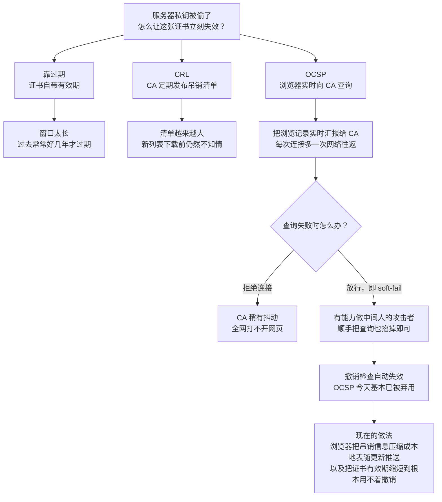
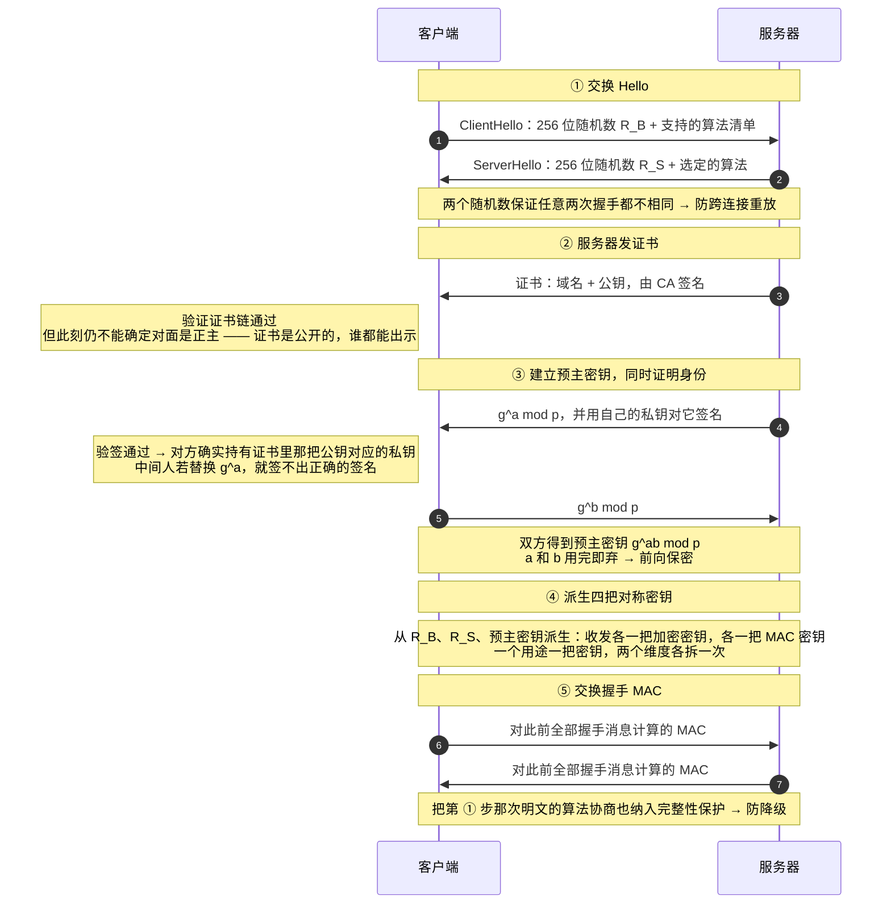
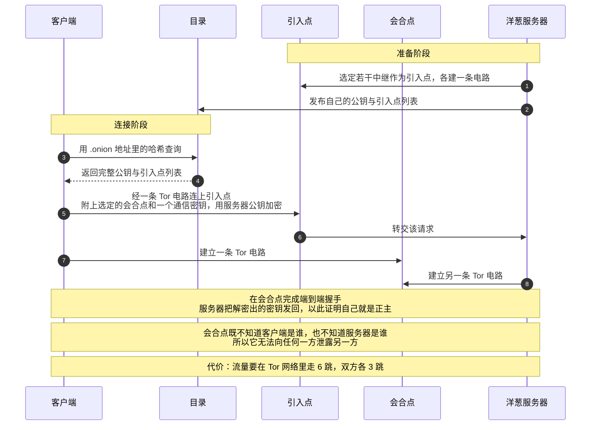
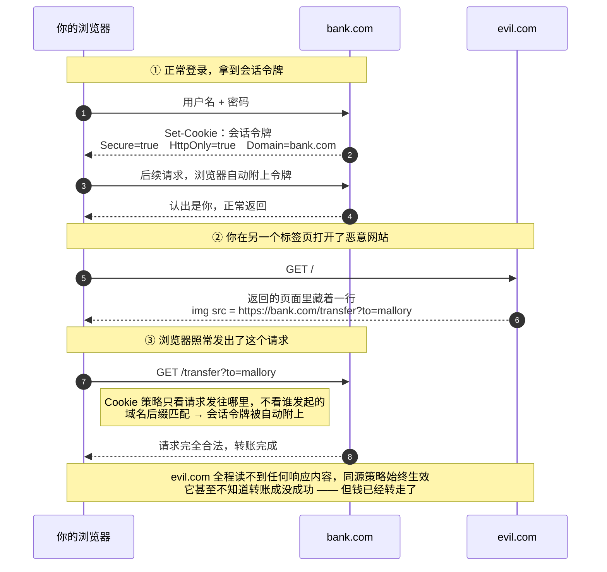

---
prev:
  text: '第二篇：密码学如何重建信任'
  link: '/exploration/network-and-security/network-security-02-cryptography-rebuilds-trust'
next: false
---

# 网络安全入门（三）：把信任装进真实系统

> 这是一套三篇的网络安全入门系列。
>
> - 第一篇：协议栈的信任危机 —— 互联网的底层协议是怎么被攻破的
> - 第二篇：密码学，我们靠什么重建信任 —— 从异或到后量子
> - **第三篇（本篇）：把信任装进真实系统** —— 防火墙、证书、TLS、VPN、Tor 与浏览器安全
>
> 本篇可以独立阅读。前两篇的结论我会在需要时用一两句话交代清楚，不需要回头翻。


## 引子：从工具到系统

前两篇各自撞在一堵墙上，而且是同一堵。

第一篇爬完了整个协议栈，结论是：**每一层协议都在用某种"标识符"判断你是不是你** —— ARP 用 IP-MAC 映射、IP 用源地址、TCP 用序列号、DNS 用 16 位事务 ID、BGP 用前缀宣告。而标识符的问题在于它只是一串数字，谁都能写出一模一样的一串。随机化能让它难猜，过滤能让伪造难发出去，但没有任何一种手段能让它**不可伪造**。

第二篇造出了那个"不可伪造"的东西 —— 数字签名、MAC、密钥交换。然后在最后一站又撞墙了：Diffie-Hellman 能让两个陌生人在敌人眼皮底下商量出一个只有他俩知道的秘密，**但它对"你到底和谁商量了这个秘密"不做任何保证**。中间人 Mallory 可以对 Alice 假装是 Bob、对 Bob 假装是 Alice，两边都以为自己在安全通信。

所以第三篇要做的，是把这些工具装进真实系统。而这件事比听起来难得多，因为**真实系统里没有"安全"这个开关**。你能做的只有一件事：

> **在某个地方画一条线，线内的算可信，线外的不算。**

这条线有个名字，叫**信任边界（trust boundary）**。接下来六站，每一站都是在不同的地方画这条线：

- **防火墙**把线画在**网络位置**上 —— 你在内网，你就可信
- **证书**把线画在**第三方**上 —— 有 CA 签名，你就可信
- **TLS** 把线画在**这条连接**上 —— 握手成功了，这条连接就可信
- **VPN** 把线画在**隧道**上 —— 你在隧道里，你就可信
- **Tor** 把线画在**"谁在跟谁说话"**上 —— 没人能同时看见两端，你就安全
- **同源策略**把线画在 **origin** 上 —— 同一个源，才算自己人

六条线，六种画法。而这一篇真正的主题，是它们**分别是怎么被走过去的**。


<svg viewBox="0 0 680 432" width="100%" role="img" style="font-family:var(--vp-font-family-base,system-ui);max-width:680px;display:block;margin:1.5rem auto;"><title>六条信任边界总览</title><desc>防火墙、证书、TLS、VPN、Tor、同源策略分别把信任边界画在网络位置、第三方、连接、隧道、通信关系和源上。</desc><defs><marker id="b1" viewBox="0 0 10 10" refX="8" refY="5" markerWidth="6" markerHeight="6" orient="auto-start-reverse"><path d="M2 1L8 5L2 9" fill="none" stroke="context-stroke" stroke-width="1.5" stroke-linecap="round" stroke-linejoin="round"/></marker></defs><text x="340" y="34" text-anchor="middle" font-size="13" fill="var(--vp-c-text-1, #3c3c43)" font-weight="500">每一站，都是在不同的地方画同一条线</text><rect x="40" y="50" width="600" height="44" rx="6" fill="none" stroke="var(--vp-c-divider, #e2e2e3)" stroke-width="0.5"/><rect x="50" y="56" width="140" height="32" rx="6" fill="var(--vp-c-bg-soft, #f6f6f7)" stroke="var(--vp-c-divider, #e2e2e3)" stroke-width="0.5"/><text x="120" y="72" text-anchor="middle" dominant-baseline="central" font-size="12.5" fill="var(--vp-c-text-1, #3c3c43)" font-weight="500">防火墙</text><text x="206" y="69" text-anchor="start" font-size="12" fill="var(--vp-c-text-1, #3c3c43)" font-weight="500">边界画在「网络位置」上</text><text x="206" y="85" text-anchor="start" font-size="11" fill="var(--vp-c-text-2, #67676c)">判据：你在内网，你就可信</text><rect x="40" y="102" width="600" height="44" rx="6" fill="none" stroke="var(--vp-c-divider, #e2e2e3)" stroke-width="0.5"/><rect x="50" y="108" width="140" height="32" rx="6" fill="var(--vp-c-tip-soft, #cfe4fd)" stroke="var(--vp-c-tip-1, #3b82f6)" stroke-width="0.5"/><text x="120" y="124" text-anchor="middle" dominant-baseline="central" font-size="12.5" fill="var(--vp-c-text-1, #3c3c43)" font-weight="500">证书 / PKI</text><text x="206" y="121" text-anchor="start" font-size="12" fill="var(--vp-c-text-1, #3c3c43)" font-weight="500">边界画在「第三方」上</text><text x="206" y="137" text-anchor="start" font-size="11" fill="var(--vp-c-text-2, #67676c)">判据：有受信 CA 的签名，你就可信</text><rect x="40" y="154" width="600" height="44" rx="6" fill="none" stroke="var(--vp-c-divider, #e2e2e3)" stroke-width="0.5"/><rect x="50" y="160" width="140" height="32" rx="6" fill="var(--vp-c-tip-soft, #cfe4fd)" stroke="var(--vp-c-tip-1, #3b82f6)" stroke-width="0.5"/><text x="120" y="176" text-anchor="middle" dominant-baseline="central" font-size="12.5" fill="var(--vp-c-text-1, #3c3c43)" font-weight="500">TLS</text><text x="206" y="173" text-anchor="start" font-size="12" fill="var(--vp-c-text-1, #3c3c43)" font-weight="500">边界画在「这一条连接」上</text><text x="206" y="189" text-anchor="start" font-size="11" fill="var(--vp-c-text-2, #67676c)">判据：握手成功了，这条连接就可信</text><rect x="40" y="206" width="600" height="44" rx="6" fill="none" stroke="var(--vp-c-divider, #e2e2e3)" stroke-width="0.5"/><rect x="50" y="212" width="140" height="32" rx="6" fill="var(--vp-c-brand-soft, #d3f5e0)" stroke="var(--vp-c-brand-1, #10b981)" stroke-width="0.5"/><text x="120" y="228" text-anchor="middle" dominant-baseline="central" font-size="12.5" fill="var(--vp-c-text-1, #3c3c43)" font-weight="500">VPN / IPSec</text><text x="206" y="225" text-anchor="start" font-size="12" fill="var(--vp-c-text-1, #3c3c43)" font-weight="500">边界画在「隧道」上</text><text x="206" y="241" text-anchor="start" font-size="11" fill="var(--vp-c-text-2, #67676c)">判据：你在隧道里，你就可信</text><rect x="40" y="258" width="600" height="44" rx="6" fill="none" stroke="var(--vp-c-divider, #e2e2e3)" stroke-width="0.5"/><rect x="50" y="264" width="140" height="32" rx="6" fill="var(--vp-c-brand-soft, #d3f5e0)" stroke="var(--vp-c-brand-1, #10b981)" stroke-width="0.5"/><text x="120" y="280" text-anchor="middle" dominant-baseline="central" font-size="12.5" fill="var(--vp-c-text-1, #3c3c43)" font-weight="500">Tor</text><text x="206" y="277" text-anchor="start" font-size="12" fill="var(--vp-c-text-1, #3c3c43)" font-weight="500">边界画在「谁在跟谁说话」上</text><text x="206" y="293" text-anchor="start" font-size="11" fill="var(--vp-c-text-2, #67676c)">判据：没人能同时看见两端，你就安全</text><rect x="40" y="310" width="600" height="44" rx="6" fill="none" stroke="var(--vp-c-divider, #e2e2e3)" stroke-width="0.5"/><rect x="50" y="316" width="140" height="32" rx="6" fill="var(--vp-c-warning-soft, #fce8c3)" stroke="var(--vp-c-warning-1, #d4a017)" stroke-width="0.5"/><text x="120" y="332" text-anchor="middle" dominant-baseline="central" font-size="12.5" fill="var(--vp-c-text-1, #3c3c43)" font-weight="500">同源策略</text><text x="206" y="329" text-anchor="start" font-size="12" fill="var(--vp-c-text-1, #3c3c43)" font-weight="500">边界画在「origin」上</text><text x="206" y="345" text-anchor="start" font-size="11" fill="var(--vp-c-text-2, #67676c)">判据：同一个源，才算自己人</text><rect x="40" y="372" width="600" height="44" rx="6" fill="var(--vp-c-bg-soft, #f6f6f7)" stroke="var(--vp-c-divider, #e2e2e3)" stroke-width="0.5"/><text x="340" y="394" text-anchor="middle" dominant-baseline="central" font-size="12" fill="var(--vp-c-text-1, #3c3c43)" font-weight="500">六条线，六种画法 —— 而这一篇真正的主题，是它们分别是怎么被走过去的</text></svg>

<p align="center"><sub>图 1：这一篇的地图。六站读下来，可以随时回到这张图确认自己站在哪一条边界上。</sub></p>


最后一站会给出一个相当反直觉的结局：有一种攻击既不伪造身份、也不破解加密、也不越过任何一条边界，却照样能把你银行账户里的钱转走。留到那时再说。


## 第一站：防火墙 —— 把世界分成内外

最古老、也最直觉的安全思路：**既然逐台加固每一台机器太难，那就在网络的入口设一道关卡，用一道防线保护后面所有设备。**

这就是**防火墙（firewall）**。它的位置决定了它的价值：所有进出的流量都必须经过它，所以它是**唯一一个能看见全局的地方**。

### 防火墙的对手：DoS 与 DDoS

防火墙最直接的对手是 **DoS（Denial of Service，拒绝服务）** —— 破坏"可用性"的攻击，让合法用户用不了服务。

动机五花八门：竞争对手为了让自己的服务显得更可靠、犯罪团伙要挟勒索、政治表态、战争手段，以及纯粹为了报复或好玩（在线游戏里尤其常见）。

网络层的 DoS 有两条打法，区别不小：

- **打满带宽**：服务器上下行只有 10 MB/s，攻击者就发 20 MB/s。用**尽可能大的包**。
- **打满处理能力**：服务器每秒只能处理 10 个包，攻击者就发 20 个。用**尽可能小的包**。

第二种更阴险 —— 你的带宽监控可能一切正常，机器却已经跪了。

而 **DDoS（Distributed DoS，分布式拒绝服务）** 是它的放大版：控制一大批被攻陷的机器（**僵尸网络 / botnet**）一起发难。这不只是带宽变大，更要命的是**流量来自成千上万个真实 IP**，让"按源地址过滤"这条最简单的防线直接失效。

防御思路只有两大类：

**思路一：过量配置（over-provisioning）。** 买比实际需要多得多的带宽和设备，让攻击者更难压垮你。听起来很笨，但它是唯一对**所有**攻击类型都有效的办法 —— 现代 CDN 和抗 D 服务本质上就是把这件事做到极致。

**思路二：包过滤。** 找出攻击流量的特征，把它丢掉。丢弃来自攻击者 IP 的包、或者在攻击流量里找模式。

思路二有个明显的软肋，而且第一篇已经埋过伏笔了：**攻击者可以伪造源 IP**，让包看起来来自成千上万个不同地址。这时候按源地址过滤就废了。所以真正的解法不在受害者这边，而在**源头网络的反伪造机制**（第一篇讲过的入向过滤 BCP38）—— 这是整个系列反复出现的一个模式：**很多问题只能在离它最近的地方解决，而不是在受害的地方。**

### 防火墙的第一原则：默认拒绝

防火墙不是一堆规则的集合，它是**一份安全策略的执行者**。策略先行，规则随后。

一个标准家庭网络的策略长这样：

- **出向策略**：允许所有出向流量 —— 内网用户想连什么服务都行
- **入向策略**：只放行一部分
  - 允许**作为出向连接响应**的入向流量
  - 允许进入某些受信任服务的流量（比如你自己开的 SSH）
  - **拒绝其他一切**

最后那句是整个安全领域最重要的默认值之一，叫**默认拒绝（default deny）**：不是"列出坏的然后挡掉"，而是"列出好的然后放行，其余全挡"。

两者的差别是根本性的：**黑名单要求你知道所有的坏东西**（不可能），**白名单只要求你知道自己需要什么**（可行）。你在后面的同源策略、CSRF 防御、零信任里会一次次看到同一条原则。

### 无状态包过滤：不保留历史的逐包判断

最简单的实现叫**无状态包过滤（stateless packet filter）**：**没有历史，所有判断只能依据当前这一个包里的信息。**

现在问题来了：策略里说"允许作为出向连接响应的入向流量"—— **可你怎么知道一个入向的包是不是某个出向连接的响应？** 你没有历史。

**TCP 有个取巧的办法**：看 ACK 标志位。

- 允许带 ACK 标志的入向包
- 拒绝不带 ACK 标志的入向包

因为 TCP 三次握手里，第一个包（SYN）是不带 ACK 的。所以"不带 ACK 的入向包"必然是有人想主动连进来。而如果内网机器收到一个它从没发起过的 ACK 包，它会直接忽略或者回一个 RST。

**UDP 就没这个运气了。** UDP 没有连接概念，所谓"连接"是应用层自己实现的，包里根本没有可供判断的字段。

> **用无状态包过滤器过滤 UDP，是不可能的。**

这一句解释了一件现实中你可能觉得奇怪的事：为什么很多网络环境对 UDP 服务的限制格外粗暴（要么全开要么全关）。不是管理员懒，是无状态设备真的没得选。

### 有状态包过滤：跟踪连接状态

于是有了更好的做法：**让过滤器自己记账。**

**有状态包过滤（stateful packet filter）** 会跟踪当前所有活跃的进出连接，规则定义哪些连接被允许。最终动作还是"转发或丢弃"，但判断依据从"这一个包"变成了"这一个包 + 这条连接的历史"。

规则写起来是这样的：

```
allow tcp connection 4.5.5.4:* -> 3.1.1.2:80    允许 4.5.5.4 连到 3.1.1.2 的 80 端口
allow tcp connection *:*/int -> *:80/ext        允许所有出向的 80 端口连接
allow tcp connection *:*/int -> *:*/ext         允许所有出向连接
allow tcp connection *:*/ext -> 1.2.2.3:80      允许外部连入 1.2.2.3 的 80 端口
```

`/int` 和 `/ext` 分别表示内网和外网，方向在规则里是一等公民。

有状态过滤器还能更进一步，**跟踪具体应用的状态** —— 解析并跟踪 HTTP 的请求与响应、跟踪一条 FTP 连接里传了哪些文件。

不过一旦开始跟踪应用，就得付出代价。考虑这么一条规则：**"允许所有入向 FTP 连接，但拒绝以 root 登录的"**。防火墙需要记住什么？

- 源 IP、目的 IP、源端口、目的端口
- 这是不是一条 FTP 连接
- 这条 FTP 连接现在处于什么状态、执行了什么命令
- **用户名**

最后一项是个陷阱：**如果不加限制地存用户名，攻击者只要发一个超长的用户名，就能把防火墙自己的内存吃光。** 一台用来防 DoS 的设备，反倒成了 DoS 的靶子。

> **要跟踪应用，防火墙必须对"怎么存状态"非常小心。** 任何"为了安全而记住的东西"，都可能变成新的攻击面。

### 绕过包过滤器的三种手法

这一节是防火墙这一站最重要的部分，因为它揭示了边界防御的结构性弱点。

先看一条极简策略：**拒绝一切包含字符串 `root` 的连接。**

**攻击一：拆开。** TCP 会把消息切成多个包，接收端按序列号重组。攻击者只要把 `root` 拆在两个包里 —— 一个包结尾是 `ro`，下一个包开头是 `ot` —— **任何单个包里都不含 `root`，防火墙一个都拦不住**，而接收端重组之后拿到的是完整的 `root`。

**攻击二：打乱顺序。** 更进一步，把这些包乱序发出去。现在防火墙要想发现问题，就**必须自己完整重建 TCP 连接、重组字节流** —— 也就是说，它得把接收端做的事再做一遍。

**攻击三：TTL 戏法。** 这一招最漂亮。攻击者对同一个序列号发两份不同的包：

```
Seq = 4, TTL = 12     ← 内容无害，TTL 小，刚够到防火墙就在半路耗尽
Seq = 4, TTL = 32     ← 内容恶意，TTL 大，一路抵达服务器
Seq = 5, TTL = 12
Seq = 5, TTL = 32
...
```

关键在于把**无害那一份**的 TTL 调得刚好够到防火墙、却到不了服务器。防火墙把它收进了自己的重组缓冲，服务器却从未见过它；而**恶意那一份** TTL 足够大，一路抵达终点。于是防火墙看到的字节流和服务器看到的字节流**是两份不同的东西** —— 防火墙以为放行的是一段无害内容，服务器实际收到的是攻击载荷。

这一招极难防：

- **TTL 本来就天然变化**，因为不同的包可能走不同的路由，你无法把"TTL 异常"当成攻击特征
- **穷举所有可能的组合需要指数级的空间**
- **防火墙无法预知哪些包能到达目的地、哪些会在半路被丢弃**


<svg viewBox="0 0 680 392" width="100%" role="img" style="font-family:var(--vp-font-family-base,system-ui);max-width:680px;display:block;margin:1.5rem auto;"><title>TTL 戏法造成的解析差异</title><desc>攻击者对同一序列号发出两份内容不同的包，无害的一份 TTL 小、只到防火墙，恶意的一份 TTL 大、直达服务器，使两者重组出不同的字节流。</desc><defs><marker id="b2" viewBox="0 0 10 10" refX="8" refY="5" markerWidth="6" markerHeight="6" orient="auto-start-reverse"><path d="M2 1L8 5L2 9" fill="none" stroke="context-stroke" stroke-width="1.5" stroke-linecap="round" stroke-linejoin="round"/></marker></defs><rect x="40" y="108" width="118" height="52" rx="6" fill="var(--vp-c-danger-soft, #fbd5d5)" stroke="var(--vp-c-danger-1, #d94f4f)" stroke-width="0.5"/><text x="99" y="134" text-anchor="middle" dominant-baseline="central" font-size="13" fill="var(--vp-c-text-1, #3c3c43)" font-weight="500">攻击者</text><rect x="281" y="108" width="118" height="52" rx="6" fill="var(--vp-c-bg-soft, #f6f6f7)" stroke="var(--vp-c-divider, #e2e2e3)" stroke-width="0.5"/><text x="340" y="134" text-anchor="middle" dominant-baseline="central" font-size="13" fill="var(--vp-c-text-1, #3c3c43)" font-weight="500">防火墙</text><rect x="522" y="108" width="118" height="52" rx="6" fill="var(--vp-c-bg-soft, #f6f6f7)" stroke="var(--vp-c-divider, #e2e2e3)" stroke-width="0.5"/><text x="581" y="134" text-anchor="middle" dominant-baseline="central" font-size="13" fill="var(--vp-c-text-1, #3c3c43)" font-weight="500">服务器</text><text x="220" y="96" text-anchor="middle" font-size="11" fill="var(--vp-c-text-2, #67676c)">seq=4　TTL=12　内容无害</text><path d="M 160 116 L 275 116" fill="none" stroke="var(--vp-c-text-2, #67676c)" stroke-width="1.5" marker-end="url(#b2)"/><path d="M 401 116 L 452 116" fill="none" stroke="var(--vp-c-text-2, #67676c)" stroke-width="1.2" stroke-dasharray="4 4"/><g stroke="var(--vp-c-danger-1, #d94f4f)" stroke-width="2" stroke-linecap="round"><line x1="458" y1="110" x2="470" y2="122"/><line x1="470" y1="110" x2="458" y2="122"/></g><text x="478" y="120" text-anchor="start" font-size="10.5" fill="var(--vp-c-text-2, #67676c)">TTL 在半路耗尽</text><text x="220" y="176" text-anchor="middle" font-size="11" fill="var(--vp-c-danger-1, #d94f4f)">seq=4　TTL=32　内容恶意</text><path d="M 160 152 L 275 152" fill="none" stroke="var(--vp-c-danger-1, #d94f4f)" stroke-width="1.5" marker-end="url(#b2)"/><path d="M 401 152 L 516 152" fill="none" stroke="var(--vp-c-danger-1, #d94f4f)" stroke-width="1.5" marker-end="url(#b2)"/><rect x="40" y="214" width="280" height="84" rx="6" fill="var(--vp-c-bg-soft, #f6f6f7)" stroke="var(--vp-c-divider, #e2e2e3)" stroke-width="0.5"/><text x="180" y="238" text-anchor="middle" dominant-baseline="central" font-size="12.5" fill="var(--vp-c-text-1, #3c3c43)" font-weight="500">防火墙重组出的字节流</text><text x="180" y="256" text-anchor="middle" dominant-baseline="central" font-size="12" fill="var(--vp-c-text-2, #67676c)">seq4 无害　seq5 无害</text><text x="180" y="274" text-anchor="middle" dominant-baseline="central" font-size="12" fill="var(--vp-c-brand-1, #10b981)" font-weight="500">规则未命中 → 放行</text><rect x="360" y="214" width="280" height="84" rx="6" fill="var(--vp-c-danger-soft, #fbd5d5)" stroke="var(--vp-c-danger-1, #d94f4f)" stroke-width="0.5"/><text x="500" y="238" text-anchor="middle" dominant-baseline="central" font-size="12.5" fill="var(--vp-c-text-1, #3c3c43)" font-weight="500">服务器重组出的字节流</text><text x="500" y="256" text-anchor="middle" dominant-baseline="central" font-size="12" fill="var(--vp-c-text-2, #67676c)">seq4 恶意　seq5 恶意</text><text x="500" y="274" text-anchor="middle" dominant-baseline="central" font-size="12" fill="var(--vp-c-danger-1, #d94f4f)" font-weight="500">攻击载荷被执行</text><rect x="40" y="314" width="600" height="56" rx="6" fill="var(--vp-c-bg-soft, #f6f6f7)" stroke="var(--vp-c-divider, #e2e2e3)" stroke-width="0.5"/><text x="340" y="332" text-anchor="middle" dominant-baseline="central" font-size="12.5" fill="var(--vp-c-text-1, #3c3c43)" font-weight="500">同一份流量，两个组件重组出了两份不同的内容</text><text x="340" y="352" text-anchor="middle" dominant-baseline="central" font-size="11.5" fill="var(--vp-c-text-2, #67676c)">这种「解析差异」是整整一类漏洞的来源：只要两个组件对同一份数据的理解有分歧，中间就有缝可钻</text></svg>

<p align="center"><sub>图 2：TTL 戏法。攻击者没有伪造任何字段，也没有违反任何协议——他只是让两个组件读到了不同的东西。</sub></p>


**这三种绕过有一个共同点：它们全都源于同一个结构性事实 —— 防火墙看到的世界，和终端看到的世界，不是同一个。** 这个差异有个专门的名字，叫**解析差异（parser differential）**，它是安全领域一整类漏洞的来源：只要两个组件对同一份数据的理解有分歧，中间就有缝可钻。

### 代理防火墙：建立两条连接，而非转发数据包

既然"转发包"会带来解析差异，那就别转发了。

**代理防火墙（proxy firewall）** 的做法是：**建立两条 TCP 连接** —— 一条连源、一条连目的地，自己在中间搬运数据。

它本质上就是一个光明正大的中间人。好处非常直接：

- **它直接拿到完整的 TCP 字节流**，不存在重组问题，前面三种绕过手段全部失效
- 它可以随意伪装两端的地址

代价也很直接：**性能开销大、必须理解协议、而且它自己成了一个高价值目标** —— 它看得见所有明文。

再往上一层是**应用层代理防火墙**：某些协议允许在应用层做代理，比如 HTTP 代理会替用户发出 HTTP 请求、再把响应交回给客户端。企业里常见的"上网行为管理"就是这类东西。

### 防火墙的根本局限：网络位置不再等于信任

防火墙的全部逻辑建立在一个假设上：

> **网络位置等于信任级别。你在内网，你就是自己人。**

这个假设在 1990 年代基本成立 —— 那时候公司的机器都在办公室里，物理边界和网络边界重合。今天它已经彻底不成立了：员工在家办公、手机连着公司 Wi-Fi、云上的服务分布在三个大洲、供应商的系统直连你的内网。

**"内网"这个概念本身正在消失。** 而更麻烦的是，一旦攻击者用任何方式在内网获得一个立足点，防火墙对他就完全无效了 —— 它是一道墙，不是一张网。

> **📦 现实案例：Target 2013 —— 一家空调公司的账号，值 4000 万张信用卡**
>
> 2013 年底，美国零售商 Target 泄露了约 **4000 万张支付卡**信息和 7000 万条客户记录，最终付出了数亿美元的赔偿与整改成本，CEO 和 CIO 双双去职。
>
> 攻击的起点相当出人意料：**攻击者先攻陷了 Target 的一家空调（HVAC）供应商**，从那里拿到了供应商用于提交账单和项目管理的凭证。这套凭证的合法用途仅限于一个外部门户 —— 但它足以让攻击者**站到网络边界的内侧**。
>
> 进去之后，攻击者在内网横向移动，最终把恶意软件部署到了收银机（POS 终端）上，从内存里抓取刷卡时的明文卡号。
>
> **整个过程没有攻破任何一道防火墙。** 攻击者是走正门进来的，用的是一份合法凭证。防火墙尽职地完成了它的工作 —— 而它的工作恰恰是"放行来自内侧的流量"。
>
> 这个案例后来成了**网络分段（segmentation）**的经典教材：一个空调供应商的账号，本就不该有任何路径能通向支付系统所在的网段。

> **📦 扩展知识：零信任 —— 干脆不画这条线**
>
> 既然"网络位置 = 信任"这个假设已经破产，业界给出的答案是把它整个丢掉。
>
> **零信任（Zero Trust）** 的核心只有一句话：**永不信任，始终验证（never trust, always verify）**。不再有"内网"和"外网"之分，每一次访问请求都要重新回答三个问题：
>
> - **你是谁？** —— 强身份认证，通常要求多因素（MFA）
> - **你从什么设备来？** —— 设备是否受管、补丁是否最新、有没有被标记为异常
> - **你现在需要访问什么？** —— 只授予完成这件事所需的最小权限，且时效有限
>
> 关键的转变在于：**信任不再是一次性授予的状态，而是每次请求都要重新计算的决策。** 一份被盗的凭证不再等于一张长期通行证。
>
> 这个思路最有名的落地是 Google 的 **BeyondCorp**（2011 年起建设，起因正是遭遇了针对性攻击），以及美国 NIST 在 2020 年发布的 **SP 800-207** 标准文档。今天大部分企业的"零信任改造"实际做的是：把应用从 VPN 后面搬出来，改成通过身份感知代理访问，并对每次访问做持续评估。
>
> 需要泼一盆冷水：零信任**不是一个可以买来装上的产品**，尽管市场上有大量产品这么宣传。它是一套架构原则，落地意味着重做身份体系、设备管理和授权模型 —— 大多数组织需要数年时间，而且永远不会真正"完成"。


## 第二站：证书 —— 怎么确认一把公钥属于谁

第二篇结束在一个悬而未决的问题上：

> **你怎么确定手里这把公钥，真的属于你以为的那个人？**

这不是个小问题。整个公钥密码学的全部价值都压在这一句上 —— 如果你拿到的"Bob 的公钥"其实是 Mallory 的，那么你加密的每一条消息都是发给 Mallory 的，你验证通过的每一个签名都是 Mallory 签的，而**密码学本身没有出任何差错**。

### 公钥分发的循环困境

最自然的想法是：**给公钥签个名，防止它被掉包。**

然后你立刻会掉进一个循环：

> 如果 Bob 自己给他的公钥签名，你需要 **Bob 的公钥**来验证这个签名。
> 可 Bob 的公钥，正是你一开始想要验证的东西。

这个循环无解，而且它揭示了一件更普遍的事：

> **你无法从"什么都不信"出发获得信任。你必须先信点什么。**

那个"先信的东西"有个名字，叫**信任锚（trust anchor）** —— 一个你**完全信任**的实体。有了它，你才能开始信任别人。

这是整个系列里最哲学、也最实用的一句话。它意味着**任何安全系统的底层，都必然有一个无法被系统内部证明的假设**。你能做的不是消灭这个假设，而是让它尽可能小、尽可能明确、尽可能可审计。

### 尝试一：可信目录

最简单的信任锚设计：搞一个中央的**可信目录（Trusted Directory, TD）**，谁的公钥都能从这儿查。

- 目录有自己的公私钥对
- 它的公钥被**硬编码**进所有电脑、手机、操作系统 —— 这就是那个"先信的东西"
- 你问它要 Bob 的公钥，它返回一份**证书**

这里出现了整站的核心概念：

> **证书（certificate）：对某人公钥的一份签名背书。**
>
> 一份证书至少包含两样东西：**这个人的身份**，以及**他的公钥**。整份内容由信任锚签名。

用第二篇的记号写就是：`{"Bob 的公钥是 PK_B"}` 用目录的私钥签名。

（顺带提醒一个第二篇的细节：**签名消息必须连同原文一起发送，不能只发签名。** 签名是对原文的背书，不是原文的替代品。）

你需要信任什么？两件事：**你正确地拿到了目录的公钥**，以及**目录不会在没核实身份的情况下给人签名**。

这个方案的问题也很清楚：

- **不可扩展**：全世界有几十亿把公钥，一台服务器扛不住
- **单点失败**：目录被黑或者宕机，整个密码学体系跟着完蛋

### 尝试二：层级化的信任委托

真实世界的解法是把信任**分层委托**下去。

想象一个校园场景：**李教授**是根信任锚，他把签名权委托给**罗教授**，罗教授再为学生的身份签名。你信任李教授，于是通过这条链，你也能信任那个学生。

这就是 **CA（Certificate Authority，证书颁发机构）**体系：

- **根 CA（root CA）** 是信任锚，它的公钥被硬编码进操作系统和设备
- 根 CA 可以给**中间 CA（intermediate CA）**签发证书，把签名权委托下去
- 中间 CA 再给最终实体（比如某个网站）签发证书
- **每一级委托都可以限制证书的适用范围**

还有一个关键的工程性质：**签发证书是离线任务** —— 证书是提前一次性造好的，之后只是在用户请求时把它取出来发送。这意味着根 CA 的私钥**可以完全离线保存**（现实中确实如此：装在断网的硬件安全模块里，锁在带监控的保险库中，动用时需要多人到场）。


<svg viewBox="0 0 680 412" width="100%" role="img" style="font-family:var(--vp-font-family-base,system-ui);max-width:680px;display:block;margin:1.5rem auto;"><title>证书的层级信任链</title><desc>根证书颁发机构作为信任锚，其公钥硬编码在操作系统中，向下委托给中间机构，再由中间机构为网站签发证书。</desc><defs><marker id="b3" viewBox="0 0 10 10" refX="8" refY="5" markerWidth="6" markerHeight="6" orient="auto-start-reverse"><path d="M2 1L8 5L2 9" fill="none" stroke="context-stroke" stroke-width="1.5" stroke-linecap="round" stroke-linejoin="round"/></marker></defs><rect x="180" y="46" width="320" height="62" rx="6" fill="var(--vp-c-brand-soft, #d3f5e0)" stroke="var(--vp-c-brand-1, #10b981)" stroke-width="0.5"/><text x="340" y="67" text-anchor="middle" dominant-baseline="central" font-size="13.5" fill="var(--vp-c-text-1, #3c3c43)" font-weight="500">根 CA</text><text x="340" y="87" text-anchor="middle" dominant-baseline="central" font-size="11.5" fill="var(--vp-c-text-2, #67676c)">信任锚 —— 一切信任的起点</text><rect x="180" y="146" width="320" height="62" rx="6" fill="var(--vp-c-tip-soft, #cfe4fd)" stroke="var(--vp-c-tip-1, #3b82f6)" stroke-width="0.5"/><text x="340" y="167" text-anchor="middle" dominant-baseline="central" font-size="13.5" fill="var(--vp-c-text-1, #3c3c43)" font-weight="500">中间 CA</text><text x="340" y="187" text-anchor="middle" dominant-baseline="central" font-size="11.5" fill="var(--vp-c-text-2, #67676c)">被委托的签名权，可限制适用范围</text><rect x="180" y="246" width="320" height="62" rx="6" fill="var(--vp-c-bg-soft, #f6f6f7)" stroke="var(--vp-c-divider, #e2e2e3)" stroke-width="0.5"/><text x="340" y="267" text-anchor="middle" dominant-baseline="central" font-size="13.5" fill="var(--vp-c-text-1, #3c3c43)" font-weight="500">网站证书</text><text x="340" y="287" text-anchor="middle" dominant-baseline="central" font-size="11.5" fill="var(--vp-c-text-2, #67676c)">域名 + 公钥，由中间 CA 签名</text><path d="M 340 108 L 340 140" fill="none" stroke="var(--vp-c-text-2, #67676c)" stroke-width="1.5" marker-end="url(#b3)"/><path d="M 340 208 L 340 240" fill="none" stroke="var(--vp-c-text-2, #67676c)" stroke-width="1.5" marker-end="url(#b3)"/><text x="352" y="128" text-anchor="start" font-size="11" fill="var(--vp-c-text-2, #67676c)">签发</text><text x="352" y="228" text-anchor="start" font-size="11" fill="var(--vp-c-text-2, #67676c)">签发</text><text x="168" y="64" text-anchor="end" font-size="10.5" fill="var(--vp-c-text-2, #67676c)">公钥硬编码进</text><text x="168" y="80" text-anchor="end" font-size="10.5" fill="var(--vp-c-text-2, #67676c)">操作系统与浏览器</text><text x="168" y="98" text-anchor="end" font-size="10.5" fill="var(--vp-c-text-2, #67676c)">私钥完全离线保存</text><text x="512" y="170" text-anchor="start" font-size="10.5" fill="var(--vp-c-text-2, #67676c)">签发是离线任务</text><text x="512" y="188" text-anchor="start" font-size="10.5" fill="var(--vp-c-text-2, #67676c)">所以根私钥可以</text><text x="512" y="206" text-anchor="start" font-size="10.5" fill="var(--vp-c-text-2, #67676c)">锁进保险库</text><path d="M 150 292 L 150 76" fill="none" stroke="var(--vp-c-warning-1, #d4a017)" stroke-width="1.2" stroke-dasharray="5 4" marker-end="url(#b3)"/><text x="144" y="200" text-anchor="end" font-size="11" fill="var(--vp-c-warning-1, #d4a017)">验证方向</text><text x="150" y="300" text-anchor="middle" font-size="10" fill="var(--vp-c-text-2, #67676c)">　</text><rect x="40" y="330" width="600" height="62" rx="6" fill="var(--vp-c-warning-soft, #fce8c3)" stroke="var(--vp-c-warning-1, #d4a017)" stroke-width="0.5"/><text x="340" y="343" text-anchor="middle" dominant-baseline="central" font-size="12.5" fill="var(--vp-c-text-1, #3c3c43)" font-weight="500">浏览器隐式信任大约 100 到 200 个根 CA</text><text x="340" y="361" text-anchor="middle" dominant-baseline="central" font-size="11.5" fill="var(--vp-c-text-2, #67676c)">任何一个被攻破，攻击者就能为任何域名签发看起来完全合法的证书</text><text x="340" y="379" text-anchor="middle" dominant-baseline="central" font-size="11.5" fill="var(--vp-c-warning-1, #d4a017)" font-weight="500">你的安全性，取决于其中最弱的那一个</text></svg>

<p align="center"><sub>图 3：信任链。注意验证方向和签发方向相反——你从手里的证书往上追，一直追到那个被硬编码进系统的根。</sub></p>


同时，为了不让所有鸡蛋放一个篮子里，现代系统采用**多信任锚**：

> **现代浏览器隐式信任大约 100 到 200 个根证书颁发机构。**

这个数字就是这条边界的定价。

### 证书体系的三个现实问题

**问题一：怎么撤销？**

如果服务器的私钥被偷了怎么办？我们希望把对应的证书标记为失效。但 TLS 证书虽然有过期时间，**过去常常好几年才过期**。

三条路：

- **靠过期**：证书自带有效期，时间到了自动失效。简单，但窗口太长。
- **CRL（Certificate Revocation List，证书吊销列表）**：CA 定期发布一份"这些证书作废了"的清单，并用自己的私钥签名。浏览器定期下载。
- **OCSP（Online Certificate Status Protocol，在线证书状态协议）**：浏览器直接问 CA"这张证书还有效吗"，CA 签名回答 good 或 revoked。

CRL 的缺点很扎实：**列表会变得非常大**（部分靠缩短有效期缓解 —— 证书过期了就不用再列在上面了），而且**在用户下载新列表之前，他并不知道哪些证书已经作废**。

还有一个让人头疼的设计问题：**如果 CA 不可用怎么办？**

- **安全默认（fail-safe default）**：假设所有证书都无效？那谁都连不上了。
- 用旧列表？如果旧列表里缺了刚刚吊销的证书，就有风险。

而且这里存在一个直接的攻击：**攻击者可以主动 DoS 掉 CA，逼迫浏览器走"不可用"的分支。**

> **📦 扩展知识：撤销为什么至今仍是一团糟**
>
> OCSP 现在**基本已经不再使用了**，这背后的故事很值得讲，因为它是一个"安全机制败给现实约束"的典型。
>
> **第一个问题：隐私。** 浏览器每访问一个 HTTPS 网站就要问一次 CA"这张证书还好吗"—— 这等于**把你的浏览记录实时汇报给 CA**。
>
> **第二个问题：性能。** 每次连接前多一次网络往返，直接拖慢首屏。
>
> **第三个问题（最致命）：软失败。** 如果 OCSP 查询超时或失败，浏览器怎么办？拒绝连接的话，CA 稍有抖动全网就打不开网页；于是所有浏览器都选择了**放行（soft-fail）**。而这意味着 —— **一个能做中间人的攻击者，只要顺手把 OCSP 查询也掐掉，撤销检查就自动失效了。** 一个只在攻击者不捣乱时才生效的安全机制，等于没有。
>
> 后续的补救和演进：
>
> - **OCSP Stapling**：由服务器自己定期去 CA 取一份签名的状态声明，"钉"在 TLS 握手里发给浏览器。解决了隐私和性能，但需要服务器配合，普及率长期不高。
> - **CRLite / OneCRL / CRLSets**：浏览器厂商自己把全网的吊销信息压缩成一个很小的结构（Firefox 的 CRLite 用布隆过滤器级联，可以把数千万条吊销记录压到几 MB），随浏览器更新推送。**把实时查询变成了本地查表。**
> - **真正的解法是短期证书**：既然撤销这么难，那就让证书活得足够短，短到根本用不着撤销。Let's Encrypt 的证书 90 天有效，业界正在推进更短的期限。**这是一种典型的工程智慧 —— 解决不了这个问题，就让这个问题变得不重要。**
>
> CA/浏览器论坛在近年通过了逐步把最长证书有效期压缩到 47 天的路线（分阶段执行），方向已经很明确了。





<p align="center"><sub>图 4：撤销的三条路，以及它们各自的失败模式。最右那条分支是全篇最重要的一个反面教材，收束时会再回来。</sub></p>


**问题二：CA 会犯错。**

如果 CA 签错了呢？签出一份 `{"Bob 的公钥是 PK_Mallory"}`？

这不是假设。**Verisign 曾经误签过一份证书，把一个普通互联网用户的公钥认证成了微软的。**

**问题三：那 100 到 200 个根 CA，凭什么都值得信任？**

这是整条边界最脆弱的地方。一个 CA 可能签发恶意证书（比如声称攻击者的公钥属于 Google），原因可能是：

- **这个 CA 被黑了**
- **有人花钱买通了这个 CA**

而这里有一个残酷的算术：**你的安全性取决于这 100 到 200 个 CA 里最弱的那一个。** 任何一个被攻破，攻击者就能给**任何域名**签发看起来完全合法的证书。

> **📦 现实案例：DigiNotar 2011 —— 一家 CA 的死亡，和 30 万伊朗人的邮箱**
>
> DigiNotar 是一家荷兰的证书颁发机构，也为荷兰政府提供服务。
>
> 2011 年，攻击者入侵了它。事后的完整调查报告显示，**攻击者取得了该公司全部八台证书签发服务器的完全控制权**，并且可能还签发了一些至今未被识别出来的伪造证书。
>
> 已确认被伪造的证书里包括 `*.google.com`。这张证书被用于对**约 30 万名伊朗用户**的 Gmail 流量实施中间人攻击 —— 受害者的浏览器地址栏里显示的是一把正常的锁，证书链完整有效，一切看起来都没问题。
>
> 后果是双向的：
>
> - **所有浏览器厂商把 DigiNotar 从受信任 CA 列表中移除。** 一家 CA 的全部价值就是"别人信任它"，失去信任等于失去一切 —— DigiNotar 在几个月内宣告破产。
> - 荷兰政府被迫接管其运营，因为大量政府服务依赖它签发的证书。
>
> **这个案例说明了 TLS 的 CA 生态实际上是靠什么维系的：人的关系和商业后果。** CA 之所以有动力守规矩，不是因为技术上做不了坏事，而是因为**浏览器厂商随时可以把它从名单里划掉**。这是一套建立在"核威慑"之上的信任体系。
>
> 类似的事后来还发生过：2017 年，Google 因为发现 Symantec 存在数万张签发流程不合规的证书，宣布逐步降低对其信任，最终迫使 Symantec 把整个 CA 业务卖给了 DigiCert。

### 缓解手段：证书钉扎与证书透明度

**手段一：证书钉扎（certificate pinning）。**

浏览器限制**每个网站只能由特定的 CA 签发证书**。比如只有 Google 指定的那家 CA 才能为 Google 的域名签名。

这样一来，伪造某个特定网站的证书，就必须攻破**那一个特定的 CA**，而不是任意一个。攻击面从"100 个里最弱的一个"缩小到了"这一个"。

（实践中，浏览器层面的 HPKP 因为太容易把自己锁死已经被废弃了；但钉扎的思想在移动 App 里依然是主流做法 —— 银行和支付类 App 普遍会把自己的证书或公钥钉死在客户端里。）

**手段二：证书透明度（Certificate Transparency, CT）。**

思路和钉扎完全不同，而且更漂亮：**不阻止 CA 乱签，而是让它无法隐瞒。**

- CA 必须把签发的每一张证书都提交到**公开日志**里
- 日志用**哈希链**记录所有已签发的证书
- 服务器可以要求浏览器**只接受来自实施了透明度的 CA 的证书**
- 一旦某个 CA 签发了坏证书，**这件事从公开日志里是可以被发现的**

> **📦 扩展知识：CT 的哈希链，就是第二篇那个哈希函数**
>
> CT 日志的技术核心是一棵 **Merkle 树（默克尔树）** —— 一种把大量数据组织成哈希树的结构，树根是一个固定长度的哈希值。
>
> 它提供两个第二篇讲过的哈希性质直接推出来的保证：
>
> - **只能追加，不能篡改**：如果有人想从日志里删掉或修改一条记录，树根的哈希就会变。而树根是被日志运营方**签名并公开发布**的。
> - **可以高效证明"某条记录确实在里面"**：不需要下载整个日志，只需要 log₂(n) 个哈希值组成的一条路径。一个有一亿条记录的日志，证明只需要约 27 个哈希值。
>
> 这是第二篇那句"密码学把信任问题归约成密钥管理"的一次漂亮应用：**CT 没有让任何人变得更可信，它只是让不诚实的行为无法被隐藏。**
>
> 实际效果相当显著。Google 从 2018 年起要求所有新签发的证书必须有 CT 记录，否则 Chrome 直接不认。今天任何人都可以在 `crt.sh` 这样的站点上，查到互联网上为任意域名签发过的所有证书 —— 很多组织用它来监控"有没有人在给我的域名偷偷签证书"。**监控本身成了一种防御。**

### 让证书变得便宜：Let's Encrypt

TLS 要求每个网站都获取并维护证书，这带来两重成本：**证书本身可能要花钱**，以及**管理开销**。这两件事在很长一段时间里是 HTTPS 普及的主要障碍 —— 很多小网站的理由很朴素："我又不收款，不值得每年花钱买证书。"

**Let's Encrypt** 把这个障碍拆掉了。它是目前世界上最大的证书颁发机构，**免费签发证书**，并且把获取流程做到了尽可能简单。

它验证你确实拥有这个域名的方式非常聪明，而且整个流程可以完全自动化：

1. 服务器请求一张证书
2. Let's Encrypt 给服务器一个文件，要求它把这个文件放到网站上
3. 服务器把文件上传到网站的指定路径
4. Let's Encrypt 去访问那个 URL，**确认文件确实出现在了那里** —— 这就证明了请求者控制着这个域名 —— 然后签发证书

整个过程叫 **ACME 协议**，配上 `certbot` 之类的客户端，从申请到自动续期一行命令搞定。

结果是显著的：HTTPS 在全网页面加载中的占比，从 2014 年前后的三成左右，涨到了今天的九成以上。**把一件安全的事变便宜、变自动，比劝人重视安全有效得多。**


## 第三站：TLS —— 把整个工具箱拼成一条安全信道

现在所有零件都齐了：第二篇给了加密、MAC、签名、密钥交换、随机数，第二站给了证书。**TLS（Transport Layer Security）就是把它们拼装起来的那份图纸。**

地址栏里那把小锁的全部含义，就是这份图纸执行成功了。

TLS 的位置很讲究：它坐在 TCP 之上、应用协议之下。HTTP 套上它就成了 HTTPS，SMTP 套上它就成了加密邮件传输 —— **应用层几乎不用改代码**。这个分层设计是它能席卷整个互联网的关键原因。

### 握手：五个步骤，每一步解决一个具体问题

TLS 连接的开头是一次**握手（handshake）**，之后才是真正的数据传输。假设底层的 TCP 连接已经建好了。

**第一步：交换 Hello。**

- 客户端发 `ClientHello`：一个 **256 位的随机数 R_B**（客户端随机数），加上一份自己支持的密码算法清单
- 服务器回 `ServerHello`：一个 **256 位的随机数 R_S**（服务器随机数），以及**从客户端清单里选定的算法**

这两个随机数的作用是**防重放攻击**。它们每次握手都重新随机生成，这就保证了**任意两次握手绝不会完全相同**。后面你会看到它们怎么发挥作用。

（注意算法协商这个动作 —— 它给了后面一整类"降级攻击"可乘之机，稍后细说。）

**第二步：服务器发证书。**

服务器把自己的证书发过来：**域名 + 公钥，由某个 CA 签名**。客户端验证证书链上的签名。

现在客户端知道了服务器的公钥。但有一件事必须说清楚：

> **此时客户端仍然不能确定自己在和合法服务器通话。**
>
> 因为**证书是公开的 —— 任何人都可以出示任何人的证书**。我现在就可以把 google.com 的证书下载下来发给你，那不能证明我是 Google。

证书只证明了"这个公钥属于这个域名"，**没有证明"对面这个人持有对应的私钥"**。这两件事的区别，正是第三步要解决的。

**第三步：建立预主密钥 —— 也就是第二篇那个缺口的补丁。**

这一步同时干两件事：**证明对方是正主**，以及**协商出一个共享秘密**。

用 DHE（临时 Diffie-Hellman）的流程是这样的：

```
1. 服务器生成秘密 a，计算 g^a mod p
2. 服务器用自己的私钥对 g^a mod p 签名，把值和签名一起发出
3. 客户端验证签名
   → 这就证明了服务器确实持有证书里那把公钥对应的私钥
4. 客户端生成秘密 b，计算 g^b mod p 发回
5. 双方现在共享一个预主密钥（premaster secret）：g^ab mod p
```

**关键在第 2 步。** 第二篇的结尾说，Diffie-Hellman 挡不住中间人，因为它"保证了和某个人安全，却不保证和哪个人"。而 TLS 的补法干净利落：

> **让服务器用私钥给自己那一半 DH 值签名。**
>
> Mallory 想插到中间，就得替换掉 `g^a`，可她签不出对应的签名 —— 她没有服务器的私钥。而客户端手里有证书，证书里有公钥，签名一验就露馅。

**证书解决了"这把公钥属于谁"，签名解决了"对面持有这把私钥"，两件事凑齐，中间人就没了立足之地。** 这是整个系列里前后呼应得最紧的一处：第一篇提出问题、第二篇造出工具、第三篇装配完成。

同时，因为用的是**临时**的 a 和 b，会话结束就丢弃，TLS 因此获得了**前向保密**（下面单独说）。

**第四步：派生对称密钥。**

双方各自从 **R_B、R_S、PS（预主密钥）** 这三个值派生出对称密钥 —— 通常的做法是拿这三个值去给一个伪随机数生成器播种。**三个值里任何一个变了，派生出的密钥就完全不同。**

一共派生出**四把**密钥：

| 密钥 | 用途 |
|---|---|
| **C_B** | 加密客户端 → 服务器的消息 |
| **C_S** | 加密服务器 → 客户端的消息 |
| **I_B** | 为客户端 → 服务器的消息做 MAC |
| **I_S** | 为服务器 → 客户端的消息做 MAC |

客户端和服务器都知道全部四把。

这里可以直接对上第二篇那条规矩：**一个用途，一把密钥。** 加密和认证要分开（不同算法可能相互干扰），收和发也要分开（否则攻击者可以把你发的消息原样弹回给你，而你会以为那是对方发来的）。TLS 一次性把两个维度都拆开了，于是就是 2×2 = 4 把。

**第五步：交换握手 MAC。**

双方对**到此为止的所有握手消息**计算 MAC 并交换。任何对握手过程的篡改都会被这一步发现。

（顺带澄清一个新手常见的困惑：这里的 MAC 是**消息认证码**，和第一篇讲的网卡 **MAC 地址**毫无关系，只是英文缩写撞车了。）

第五步的意义比它看起来大得多。回想第一步的算法协商 —— 那是明文进行的，中间人完全可以篡改，把双方骗到弱算法上。而第五步的握手 MAC **把整个协商过程也纳入了完整性保护**：如果有人动过手脚，双方算出的 MAC 对不上，握手直接失败。





<p align="center"><sub>图 5：TLS 五步握手。第 ③ 步那个签名，就是第二篇结尾留下的中间人缺口的补丁。</sub></p>


### 两种重放，两种防法

**跨连接的重放**：攻击者录下你昨天的整段 TLS 会话，今天原样重放。

防法就是第一步那两个随机数：每次握手的 R_B、R_S 都不同 → 派生出的对称密钥不同 → 昨天的密文今天根本解不开。

**连接内部的重放**：攻击者把你这条连接里的某条消息复制一份再发一遍（比如那条"转账 100 元"）。

防法是在加密消息里加**记录号（record number）**：每条消息用一个唯一的记录号，重放会导致记录号重复，接收方立刻识别。

这里有个容易混的点值得点清楚：

> **TLS 记录号不是 TCP 序列号。**
>
> - **记录号**是**加密的**，用于**安全**
> - **TCP 序列号**是**明文的**，用于**正确性**，工作在下面一层
>
> 第一篇讲过 TCP 序列号可以被 off-path 攻击者猜中并注入 —— 而 TLS 的记录号在加密层里面，猜不着也改不了。**两层各管各的事，这正是分层设计的价值。**

### 前向保密

> **前向保密（forward secrecy）**：窃听者现在录下加密连接，**将来**才拿到那些秘密值，他依然解不开当初录下的内容。

TLS 因为使用 DHE，**提供有保证的前向保密**：预主密钥在会话结束后就被删除，所以即使攻击者后来拿到了服务器的私钥，他也无法还原当时的会话密钥。

这句话需要拆开体会一下。服务器的私钥是长期的、可能被偷的、可能被法院命令交出的；而会话密钥是临时的、用完即焚的。**把长期秘密和会话秘密解耦，是 TLS 最重要的设计决策之一。** 它意味着"今天被拖库"不等于"过去十年的通信全部泄露"。

而这套设计能成立，恰恰依赖第三步那个签名：**因为服务器的 DH 分量是被签过名的，攻击者无法在没有服务器私钥的情况下对 DH 交换做中间人。** 前向保密和抗中间人，在这里是同一个机制的两个侧面。

### 效率：真正的开销是延迟，不是计算

一个常见的误解是"HTTPS 会让网站变慢"。实际的成本分布是这样的：

- **公钥密码学**：**开销很小**。整个连接只做一次 Diffie-Hellman。
- **对称密码学**：**基本免费**。现代硬件有 AES 专用指令，性能影响可以忽略不计。
- **延迟**：**这才是真正的代价**。必须完成整个握手，才能发出第一条消息 —— 多出来的是**网络往返时间**，不是计算时间。

看清了这一点，你就明白为什么 TLS 后续版本的优化几乎全在减少往返次数上。

> **📦 扩展知识：TLS 1.3 砍掉了什么**
>
> TLS 1.3（2018 年定稿）是一次相当激进的重构，它体现了一种成熟的安全工程观：**删除，而不是修补。**
>
> **砍掉的东西：**
>
> - **所有非 AEAD 的密码套件**。第二篇讲过 MAC-then-Encrypt 引出的 Padding Oracle、Lucky 13、POODLE 一整个攻击家族 —— TLS 1.3 的做法不是把它们一个个修好，而是把这类套件**整个删除**，只保留 AES-GCM、ChaCha20-Poly1305 这样的认证加密。
> - **RSA 密钥传输**。旧版 TLS 允许客户端用服务器公钥加密预主密钥直接发过去 —— 这种方式**没有前向保密**（拿到私钥就能解开所有历史流量），而且是第二篇讲的 Bleichenbacher / ROBOT 攻击的温床。TLS 1.3 只允许 (EC)DHE。
> - **压缩**。第二篇提过的 CRIME 攻击利用了"压缩会泄露长度"。
> - **重协商**、静态 DH、自定义 DH 参数（Logjam 的根源）、MD5 和 SHA-1 签名……
>
> 结果是密码套件从 TLS 1.2 时代的几十种，缩减到了**五种**。可选项越少，配错的可能就越小 —— 这是第二篇那条"误用抵抗"思路在协议层面的体现。
>
> **加上的东西：**
>
> - **1-RTT 握手**：把密钥交换和 Hello 合并，握手从两个往返压缩到一个。
> - **握手加密**：从服务器证书开始，握手的后半段就已经是加密的了。旁观者看不到你连的是哪个网站的证书。
> - **0-RTT（早期数据）**：如果你之前连过这台服务器，可以在第一个包里就带上应用数据，握手延迟归零。
>
> **但 0-RTT 有个必须知道的代价：它无法防重放。** 早期数据不受"每次握手随机数不同"的保护，攻击者录下来重发一次，服务器可能会执行两遍。所以规范明确要求：**0-RTT 只能用于幂等操作**（比如 GET 一个页面），绝不能用于转账、下单这类会改变状态的请求。
>
> 这是一个诚实的取舍案例：**为了性能，明确地、有边界地放弃了一项安全属性，并把边界写进了规范。** 这比假装没有代价要好得多。

> **📦 现实案例：Heartbleed（2014）—— 协议没问题，代码有问题**
>
> 2014 年 4 月公开的 Heartbleed 是 TLS 历史上影响最广的事故之一，而它一个字都没碰到 TLS 协议本身。
>
> 问题出在 OpenSSL 对 TLS **心跳扩展**的实现里。心跳的机制很简单：一方发一段数据和"这段数据有多长"，另一方原样回传，用于保持连接活跃。
>
> 而 OpenSSL 的代码**没有检查"声称的长度"和"实际的长度"是否一致**。于是攻击者可以发一个字节的数据，却声称长度是 64KB —— 服务器就会老老实实地把那一个字节，**加上它内存里紧随其后的 64KB 内容**，一起回传。
>
> 那 64KB 里可能有什么？其他用户的会话 cookie、明文密码、以及**服务器的私钥本身**。而且**整个过程不留任何日志痕迹**。
>
> 两个结论：
>
> - **它证明了"协议被证明安全"和"这个实现是安全的"是两回事。** 第二篇反复出现的那条规律 —— 事故几乎从不发生在数学层面 —— 在这里换了个形式重演：也几乎从不发生在协议层面。
> - **它是前向保密价值的最好广告。** 私钥泄露后，那些使用了 DHE 的连接，历史流量依然是安全的；而那些还在用 RSA 密钥传输的连接，攻击者只要之前录过流量，现在可以全部解开。

> **📦 现实案例：降级攻击 —— 把对方骗回二十年前**
>
> 第一步的算法协商是明文的，这就带来一个思路：**中间人篡改协商，把双方骗到一个双方其实都不想用的弱算法上。**
>
> - **FREAK（2015）**：把服务器骗回使用 1990 年代美国出口管制时期遗留的 512 位"出口级 RSA"。这些代码二十年没人用，但一直没删。
> - **Logjam（2015）**：第二篇详细讲过。同样是降级到 512 位的出口级 Diffie-Hellman，配合"大量服务器共用同一批质数"的事实，把一次性的天量预计算变成了可以反复使用的解密能力。
> - **POODLE（2014）**：诱使客户端从 TLS 降级回 SSL 3.0，再利用 SSL 3.0 的 CBC 填充缺陷逐字节解密 Cookie。
>
> 握手 MAC（第五步）本来就是为了防降级设计的，但它挡不住一种情况：**如果被降级到的那个弱算法本身就能被攻破，攻击者可以先破解、再伪造出正确的 MAC。**
>
> **所以真正的教训不是"要做握手完整性保护"，而是那句已经出现过好几次的话：不用的旧算法必须删掉，而不是留着但不优先使用。** 只要它还在代码里，降级攻击就有把它翻出来的办法。

### TLS 保护不了什么

这条边界画在"这一条连接"上，所以边界之外的东西它一概管不着。三件事必须清楚：

**① 端点。** TLS 保护的是数据**在路上**的安全。如果服务器被攻陷、或者你自己的电脑上装了恶意软件，数据在两端都是明文的。**加密管道两头的房子着火了，管道再结实也没用。**

**② 元数据。** 加密隐藏了内容，但没有隐藏**通信这件事本身**：你的 IP、对方的 IP、连接时间、数据量、时序模式，全都是明文可见的。第二篇讲过的流量分析在这里依然有效 —— 观察者可能不知道你读了哪封邮件，但知道你在什么时间访问了哪个医疗网站、停留了多久、加载了多少资源。

**③ 你要连的域名。** 这一条最出人意料。TLS 握手里有一个叫 **SNI（Server Name Indication）**的字段，用来告诉服务器"我要访问的是哪个域名"—— 因为一台服务器上可能托管着几百个网站，它得先知道你要哪个，才知道该发哪张证书。

而 **SNI 在传统 TLS 里是明文的**。也就是说，任何一个能看到你流量的人，都能准确知道你访问了哪些网站，即使内容全程加密。这个字段长期以来是网络审查和流量监控最方便的抓手。

补丁叫 **ECH（Encrypted Client Hello）**，思路是用一把从 DNS 记录里取到的公钥，把整个 ClientHello 加密起来。它正在逐步部署（Cloudflare 和 Firefox 已经支持），但它有个绕不开的依赖：**你得先能安全地拿到那条 DNS 记录** —— 于是又指回了加密 DNS（DoH / DoT）。

**安全属性之间的这种相互依赖非常典型：你很少能单独修好一个洞，因为每个洞的补丁都需要另一个洞先被补上。**


## 第四站：VPN 与 IPSec —— 把整段网络搬进管道

TLS 保护的是**一条连接**。但有时候你想要的不是一条连接，而是**整个网络**。

### 动机：如何穿过防火墙

回到第一站那道墙。它的策略是"拒绝一切主动连入的流量"—— 这对安全很好，可对出差在外的员工很糟：他需要访问公司内网的文件服务器，而防火墙把他挡在外面。

**VPN（Virtual Private Network，虚拟专用网络）** 就是为这件事发明的：

> **一套协议，让你通过一条外部连接直接访问内部网络。**它在互联网上建立一条**加密隧道**，让内网流量可以安全地跨越公网传输。

最好的直觉是：**这条加密隧道相当于一根被模拟出来的网线，把你"插"进了那个网络内部。** 你的机器会拿到一个内网 IP，行为上就和坐在办公室里一样。

而防火墙的配合方式很有意思：**防火墙放行 VPN 流量，而 VPN 流量里可以隧道任意内容。**

**VPN 本质上是防火墙给自己开的一扇合法后门。** 它把"谁能进来"这个判断，从"你在哪个网络位置"整体转移成了"你有没有 VPN 凭证"。这是一次信任边界的搬家 —— 而搬家之后，那份 VPN 凭证的价值就等于整个内网。第一站那个 Target 案例里的供应商凭证，本质上就是这么用的。

### IPSec：在 IP 层做加密

VPN 可以在不同层实现。**IPSec** 是在**网络层**（也就是 IP 层）做这件事的标准方案 —— 它的位置比 TLS 低一层，所以它保护的不是某个应用的某条连接，而是**流经这台机器的 IP 包本身**。

**先理解一个核心概念：安全关联（SA, Security Association）。**

> **SA 是发送方与接收方之间一条单向的逻辑连接**，为这条连接上承载的流量提供安全服务。

注意"**单向**"两个字 —— 双向通信需要两条 SA。这又是第二篇那条"一个用途一把密钥"的体现：来和去用不同的密钥。

一条 SA 由三个参数唯一确定：

- **SPI（Security Parameters Index，安全参数索引）**：一个 32 位数值，**携带在 IPSec 头里**，让对端知道该用哪条 SA 来处理这个包
- **目的 IP 地址**
- **安全协议标识**：表明这是 AH 还是 ESP 的 SA

所有 SA 存在一张 **SAD（Security Association Database）**里，每条记录包含：SPI、序列号计数器、序列号溢出标志、**抗重放窗口**、AH 信息（认证算法、密钥、密钥有效期）、ESP 信息（加密与认证算法、密钥、初始化向量、有效期）、SA 生存期、以及 IPSec 工作模式。

这张表里有几项直接对应第二篇的内容：**密钥有效期**（密钥不能永久使用）、**初始化向量**（nonce 绝不重复）、**抗重放窗口**（用序列号识别重放）。**IPSec 的数据结构，本身就是一份密码学工程的检查清单。**

**入向处理**的逻辑很干脆：

1. 判断这是普通 IP 包还是带 IPSec 头的包
2. 如果是受保护的包，去 SAD 里查找匹配的 SA
3. **查不到就直接丢弃**
4. 查到了就做对应的 AH 或 ESP 处理，然后剥掉 IP 头，把包体交给上层

第 3 步又是**默认拒绝**。

### 两种协议：AH 与 ESP

- **AH（Authentication Header，认证头）**：只提供**认证和完整性**，不加密。
- **ESP（Encapsulating Security Payload，封装安全载荷）**：提供**机密性、认证、完整性、抗重放服务，以及有限的流量机密性**。

ESP 的包结构分四段：

| 部分 | 内容 |
|---|---|
| **ESP 头** | SPI + 序列号 |
| **ESP 载荷** | IV + 数据 |
| **ESP 尾** | 流量机密性填充、填充、填充长度、下一个头 |
| **ESP 认证数据** | ICV（完整性校验值） |

这里有个设计细节要单独说：

> **ESP 头不加密。** 因为如果把它也加密了，**接收方就找不到 SPI，也就不知道该用哪把密钥来解密。**

这是一个漂亮的"鸡生蛋"问题的解法：**总得有一小块信息留在明文里，用来告诉对方怎么读剩下的部分。** 你在 TLS 的 SNI 上刚见过同一个问题，在 ESP 这里它以另一种形式出现。**任何加密系统都有这么一小块"必须公开的元数据"，而它往往就是隐私泄露的入口。**

（顺带说，那个"流量机密性填充"就是第二篇讲的**填充**在这里的应用 —— 通过塞入无意义的字节让包长度不再反映真实内容长度，对抗流量分析。它只能提供"有限的"保护，因为完全消除长度信息的代价太大。）

### 两种模式：传输模式与隧道模式

这是 IPSec 最容易混淆的一对概念，但区别其实非常清楚。

**传输模式（Transport Mode）**：

- **保护上层协议**，也就是 IP 包的载荷（一个 TCP 段、UDP 段或 ICMP 包）
- 用于**两台主机之间的端到端通信**
- IPSec 头被插在 IP 头（及其选项）之后、TCP 头之前
- 加密的是**载荷部分**（TCP 头和数据）加上 ESP 尾

```
[ 原 IP 头 ][ ESP 头 ][ TCP 头 + 数据 ][ ESP 尾 ][ ICV ]
                      └──────── 加密 ────────┘
```

注意：**原来的 IP 头暴露在外面**，所以源和目的地址依然可见。

**隧道模式（Tunnel Mode）**：

- **保护整个 IP 包**
- **整个原始数据报被加密**，然后当作**新的外层 IP 包的载荷**，前面再加一个新的外层 IP 头
- 用于**通过一对安全网关连接两个网络**
- 当 SA 的一端或两端是安全网关（防火墙、路由器）时使用

```
[ 新 IP 头 ][ ESP 头 ][ 原 IP 头 + TCP 头 + 数据 ][ ESP 尾 ][ ICV ]
                      └──────────── 加密 ────────────┘
```


<svg viewBox="0 0 680 402" width="100%" role="img" style="font-family:var(--vp-font-family-base,system-ui);max-width:680px;display:block;margin:1.5rem auto;"><title>IPSec 传输模式与隧道模式的报文结构对照</title><desc>传输模式只加密上层载荷，原 IP 头暴露在外；隧道模式把整个原始数据报加密，外面再套一个新的 IP 头。</desc><defs><marker id="b6" viewBox="0 0 10 10" refX="8" refY="5" markerWidth="6" markerHeight="6" orient="auto-start-reverse"><path d="M2 1L8 5L2 9" fill="none" stroke="context-stroke" stroke-width="1.5" stroke-linecap="round" stroke-linejoin="round"/></marker></defs><text x="50" y="36" text-anchor="start" font-size="12.5" fill="var(--vp-c-text-1, #3c3c43)" font-weight="500">传输模式：保护上层载荷，用于两台主机之间的端到端通信</text><rect x="50" y="48" width="100" height="44" rx="4" fill="var(--vp-c-bg-soft, #f6f6f7)" stroke="var(--vp-c-divider, #e2e2e3)" stroke-width="0.5"/><text x="100" y="75" text-anchor="middle" font-size="11.5" fill="var(--vp-c-text-1, #3c3c43)" font-weight="500">原 IP 头</text><rect x="150" y="48" width="80" height="44" rx="4" fill="var(--vp-c-bg-soft, #f6f6f7)" stroke="var(--vp-c-divider, #e2e2e3)" stroke-width="0.5"/><text x="190" y="75" text-anchor="middle" font-size="11.5" fill="var(--vp-c-text-1, #3c3c43)" font-weight="500">ESP 头</text><rect x="230" y="48" width="220" height="44" rx="4" fill="var(--vp-c-danger-soft, #fbd5d5)" stroke="var(--vp-c-danger-1, #d94f4f)" stroke-width="0.5"/><text x="340" y="75" text-anchor="middle" font-size="11.5" fill="var(--vp-c-text-1, #3c3c43)" font-weight="500">TCP 头 + 数据</text><rect x="450" y="48" width="90" height="44" rx="4" fill="var(--vp-c-danger-soft, #fbd5d5)" stroke="var(--vp-c-danger-1, #d94f4f)" stroke-width="0.5"/><text x="495" y="75" text-anchor="middle" font-size="11.5" fill="var(--vp-c-text-1, #3c3c43)" font-weight="500">ESP 尾</text><rect x="540" y="48" width="90" height="44" rx="4" fill="var(--vp-c-bg-soft, #f6f6f7)" stroke="var(--vp-c-divider, #e2e2e3)" stroke-width="0.5"/><text x="585" y="75" text-anchor="middle" font-size="11.5" fill="var(--vp-c-text-1, #3c3c43)" font-weight="500">ICV</text><path d="M 230 100 L 230 108 L 540 108 L 540 100" fill="none" stroke="var(--vp-c-danger-1, #d94f4f)" stroke-width="1.2"/><text x="385" y="124" text-anchor="middle" font-size="11" fill="var(--vp-c-danger-1, #d94f4f)">加密范围</text><text x="50" y="146" text-anchor="start" font-size="11" fill="var(--vp-c-text-2, #67676c)">原 IP 头暴露在外 —— 通信双方的地址仍然可见</text><text x="50" y="196" text-anchor="start" font-size="12.5" fill="var(--vp-c-text-1, #3c3c43)" font-weight="500">隧道模式：保护整个 IP 包，用于通过一对安全网关连接两个网络</text><rect x="50" y="208" width="100" height="44" rx="4" fill="var(--vp-c-bg-soft, #f6f6f7)" stroke="var(--vp-c-divider, #e2e2e3)" stroke-width="0.5"/><text x="100" y="235" text-anchor="middle" font-size="11.5" fill="var(--vp-c-text-1, #3c3c43)" font-weight="500">新 IP 头</text><rect x="150" y="208" width="80" height="44" rx="4" fill="var(--vp-c-bg-soft, #f6f6f7)" stroke="var(--vp-c-divider, #e2e2e3)" stroke-width="0.5"/><text x="190" y="235" text-anchor="middle" font-size="11.5" fill="var(--vp-c-text-1, #3c3c43)" font-weight="500">ESP 头</text><rect x="230" y="208" width="220" height="44" rx="4" fill="var(--vp-c-danger-soft, #fbd5d5)" stroke="var(--vp-c-danger-1, #d94f4f)" stroke-width="0.5"/><text x="340" y="235" text-anchor="middle" font-size="11.5" fill="var(--vp-c-text-1, #3c3c43)" font-weight="500">原 IP 头 + TCP 头 + 数据</text><rect x="450" y="208" width="90" height="44" rx="4" fill="var(--vp-c-danger-soft, #fbd5d5)" stroke="var(--vp-c-danger-1, #d94f4f)" stroke-width="0.5"/><text x="495" y="235" text-anchor="middle" font-size="11.5" fill="var(--vp-c-text-1, #3c3c43)" font-weight="500">ESP 尾</text><rect x="540" y="208" width="90" height="44" rx="4" fill="var(--vp-c-bg-soft, #f6f6f7)" stroke="var(--vp-c-divider, #e2e2e3)" stroke-width="0.5"/><text x="585" y="235" text-anchor="middle" font-size="11.5" fill="var(--vp-c-text-1, #3c3c43)" font-weight="500">ICV</text><path d="M 230 260 L 230 268 L 540 268 L 540 260" fill="none" stroke="var(--vp-c-danger-1, #d94f4f)" stroke-width="1.2"/><text x="385" y="284" text-anchor="middle" font-size="11" fill="var(--vp-c-danger-1, #d94f4f)">加密范围</text><text x="50" y="306" text-anchor="start" font-size="11" fill="var(--vp-c-text-2, #67676c)">原 IP 头被一起加密 —— 外部只看到两台网关在通信</text><rect x="40" y="328" width="600" height="56" rx="6" fill="var(--vp-c-bg-soft, #f6f6f7)" stroke="var(--vp-c-divider, #e2e2e3)" stroke-width="0.5"/><text x="340" y="346" text-anchor="middle" dominant-baseline="central" font-size="12" fill="var(--vp-c-text-1, #3c3c43)" font-weight="500">ESP 头始终不加密 —— 因为接收方需要先读到 SPI，才知道该用哪把密钥解密</text><text x="340" y="366" text-anchor="middle" dominant-baseline="central" font-size="11.5" fill="var(--vp-c-text-2, #67676c)">任何加密系统都有这么一小块必须公开的元数据，而它往往就是隐私泄露的入口</text></svg>

<p align="center"><sub>图 6：两种模式的报文结构。差别只有一处——原 IP 头在里面还是在外面，而这一处决定了外部能不能看到真正的通信双方。</sub></p>


**关键差别在于：隧道模式把原始 IP 头也藏了起来。** 外部观察者只能看到"网关 A 在和网关 B 通信"，看不到真正的通信双方是谁。

这正是"站点到站点 VPN"的工作方式：北京办公室和上海办公室各有一台网关，两地的机器互相通信时完全无感，实际上流量在公网上是加密的，而外人只看到两个网关之间有一条持续的加密流。

### 代理：把"谁在跟谁说话"藏起来

VPN 和 IPSec 保护的是**内容**。但还有另一类需求：**隐藏关系本身**。

场景是这样的：Alice 想给 Bob 发消息，要求是 —— **Bob 不该知道消息来自 Alice**，而且**窃听者 Eve 不能推断出 Alice 在和 Bob 通信**。

> **代理（proxy）**：一个替我们转发流量的第三方。

做法是：Alice 把"收件人 Bob"和消息一起**加密**后发给代理，代理解开后把消息转发给 Bob。

```
Alice → Proxy:   From: Alice  To: Proxy   E(K_proxy, (Bob, Message))
Proxy → Bob:     From: Proxy  To: Bob     Message
```

关键在于**收件人的名字被加密了**，所以窃听者**永远看不到一个同时含有 Alice 和 Bob 身份的数据包**。而 Bob 收到的消息来自代理，没有任何迹象表明它来自 Alice。

代理和 VPN 有着同样的三个现实问题：

- **性能**：每个包都要多走几跳
- **成本**：商业 VPN 大约每年 80 到 200 美元
- **信任代理** —— 这一条才是要害

> **代理能同时看到发送方和接收方的身份。而攻击者可能有办法说服代理交出你的身份。**

这一条要想透：**用 VPN 或代理并不会让你"变得匿名"，它只是把你需要信任的对象，从你的 ISP 换成了 VPN 服务商。** ISP 至少受当地法规约束、有明确的商业实体和责任；而一家注册在境外、宣称"绝对不记日志"的 VPN 公司，你验证不了它的任何一句话。

> **📦 现实案例：免费 VPN 的商业模式就是你**
>
> 一条朴素的推理：运营 VPN 需要真实的带宽和服务器成本。如果你没付钱，那么钱从哪来？
>
> 已经曝光过的答案包括：**把用户流量转卖为"住宅代理"节点**（你的网络成了别人爬虫或刷单的出口，而流量记录挂在你名下）、**注入或替换广告**、**收集并出售浏览数据**。多家安全机构对应用商店里的免费 VPN 做过批量分析，发现相当比例存在流量分析库、权限过度、甚至根本没有真正加密的情况。
>
> 还有一类更隐蔽的问题：**同一家母公司在应用商店里运营着十几个看起来互不相干的 VPN 品牌**，隐私政策各说各话，实际共用一套后端。
>
> **结论不是"付费 VPN 就一定可信"** —— 付费的也一样无法验证。真正的结论是：**VPN 解决的是"在不可信网络上传输"的问题（比如咖啡店 Wi-Fi），它从来不解决"对抗一个有能力找上门的对手"的问题。** 用对场景，它很有用；用错场景，它只是给了你一种虚假的安全感。

> **📦 扩展知识：WireGuard —— 第二篇那些算法的一次集中落地**
>
> IPSec 功能强大，但也以复杂著称：AH 和 ESP、两种模式、庞大的算法协商空间、难以配置。**WireGuard** 是 2016 年后出现的现代 VPN 协议，它的设计哲学几乎是 IPSec 的反面，而且每一条都能对上第二篇的内容：
>
> - **不做算法协商**。它把算法**写死**：**ChaCha20-Poly1305** 做认证加密、**X25519** 做密钥交换、**Ed25519** 做签名、BLAKE2s 做哈希。
>   这意味着 —— **不存在降级攻击，因为没有可降的级。** 你在这一站前面刚看过 FREAK、Logjam、POODLE 全都源于"协商"这个动作。WireGuard 的回答是：那就别协商了。想换算法？升级协议版本，整体替换。
> - **代码量极小**。核心实现约四千行，而 IPSec 与 OpenVPN 的相关代码在数十万行量级。**能被完整审计的代码，和不能被完整审计的代码，是两种东西。**
> - **默认沉默**。没有正确密钥的数据包一律丢弃且不回应任何东西 —— 从网络上扫描不出这台机器在跑 WireGuard。
> - 2020 年被合并进 **Linux 内核主线**。
>
> 它的代价是灵活性：不支持复杂的企业策略、动态 IP 分配需要额外方案、也不适合需要频繁更换算法的场景。
>
> **但它示范了一种越来越主流的取舍：宁可少给几个选项，也不要让使用者有配错的机会。** 从 TLS 1.3 砍掉密码套件，到 Ed25519 不接受随机数输入，再到 WireGuard 拒绝协商 —— 这是同一种思路在三个层面上的反复出现。


## 第五站：Tor —— 当一个代理不够用

单个代理的问题已经很清楚了：**它知道一切。** 它同时看得见你和你的通信对象。

**那就别只用一个。**

> **Tor（The Onion Router，洋葱路由器）**：一个使用多个代理（称为**中继**）来实现匿名通信的网络。

### Tor 的组成部分

- **Tor 网络**：由大量 Tor 中继组成，负责转发数据包
- **目录服务器**：列出所有 Tor 中继及其公钥
- **Tor 浏览器**：一个配置好连接 Tor 网络的浏览器（基于 Firefox）
- **洋葱服务**：只能通过 Tor 网络访问的服务器
- **Tor 网桥**：一类特殊中继，用于隐藏"某个用户正在连接 Tor"这个事实本身

### 电路的建立过程

Tor 客户端默认用 **3 个中继**组成一条**电路（circuit）**：

1. 向目录服务器查询中继列表
2. 从中挑选 3 个中继
3. 与**第一个中继**建立端到端的 TLS 连接
4. **通过第一个中继**，与第二个中继建立端到端的 TLS 连接
5. **通过前两个中继**，与第三个中继建立端到端的 TLS 连接
6. **通过第三个中继**，与目标网站建立 HTTPS 连接

这个"逐跳建立、层层嵌套"的过程是整个设计的精华。第 4 步里藏着关键性质：

> **中继 1 只是在转发 TLS 数据包。它并不知道这些包的内容。**

于是每个中继知道的信息被严格切开了：

| 谁 | 知道什么 | 不知道什么 |
|---|---|---|
| **入口中继** | 你是谁（你的 IP） | 你要访问哪里 |
| **中间中继** | 前一跳和后一跳是谁 | 你是谁，你访问哪里 |
| **出口中继** | 你要访问哪里 | 你是谁 |
| **目标网站** | 有人来访问了（出口的 IP） | 你是谁 |

**没有任何单个节点同时知道"你是谁"和"你在访问什么"。** 这就是"洋葱"这个名字的含义 —— 数据被裹上多层加密，每经过一个中继就剥掉一层。


<svg viewBox="0 0 680 398" width="100%" role="img" style="font-family:var(--vp-font-family-base,system-ui);max-width:680px;display:block;margin:1.5rem auto;"><title>Tor 电路中各节点的知情范围</title><desc>三跳电路把信息严格切分，使得没有任何单个节点同时知道用户身份和访问目标。</desc><defs><marker id="b7" viewBox="0 0 10 10" refX="8" refY="5" markerWidth="6" markerHeight="6" orient="auto-start-reverse"><path d="M2 1L8 5L2 9" fill="none" stroke="context-stroke" stroke-width="1.5" stroke-linecap="round" stroke-linejoin="round"/></marker></defs><rect x="40" y="44" width="90" height="44" rx="6" fill="var(--vp-c-tip-soft, #cfe4fd)" stroke="var(--vp-c-tip-1, #3b82f6)" stroke-width="0.5"/><text x="85" y="66" text-anchor="middle" dominant-baseline="central" font-size="12.5" fill="var(--vp-c-text-1, #3c3c43)" font-weight="500">你</text><rect x="150" y="44" width="110" height="44" rx="6" fill="var(--vp-c-bg-soft, #f6f6f7)" stroke="var(--vp-c-divider, #e2e2e3)" stroke-width="0.5"/><text x="205" y="66" text-anchor="middle" dominant-baseline="central" font-size="12.5" fill="var(--vp-c-text-1, #3c3c43)" font-weight="500">入口中继</text><rect x="280" y="44" width="110" height="44" rx="6" fill="var(--vp-c-bg-soft, #f6f6f7)" stroke="var(--vp-c-divider, #e2e2e3)" stroke-width="0.5"/><text x="335" y="66" text-anchor="middle" dominant-baseline="central" font-size="12.5" fill="var(--vp-c-text-1, #3c3c43)" font-weight="500">中间中继</text><rect x="410" y="44" width="110" height="44" rx="6" fill="var(--vp-c-bg-soft, #f6f6f7)" stroke="var(--vp-c-divider, #e2e2e3)" stroke-width="0.5"/><text x="465" y="66" text-anchor="middle" dominant-baseline="central" font-size="12.5" fill="var(--vp-c-text-1, #3c3c43)" font-weight="500">出口中继</text><rect x="540" y="44" width="100" height="44" rx="6" fill="var(--vp-c-tip-soft, #cfe4fd)" stroke="var(--vp-c-tip-1, #3b82f6)" stroke-width="0.5"/><text x="590" y="66" text-anchor="middle" dominant-baseline="central" font-size="12.5" fill="var(--vp-c-text-1, #3c3c43)" font-weight="500">目标网站</text><path d="M 130 66 L 146 66" fill="none" stroke="var(--vp-c-text-2, #67676c)" stroke-width="1.2" marker-end="url(#b7)"/><path d="M 260 66 L 276 66" fill="none" stroke="var(--vp-c-text-2, #67676c)" stroke-width="1.2" marker-end="url(#b7)"/><path d="M 390 66 L 406 66" fill="none" stroke="var(--vp-c-text-2, #67676c)" stroke-width="1.2" marker-end="url(#b7)"/><path d="M 520 66 L 536 66" fill="none" stroke="var(--vp-c-text-2, #67676c)" stroke-width="1.2" marker-end="url(#b7)"/><text x="174" y="116" text-anchor="start" font-size="11" fill="var(--vp-c-text-1, #3c3c43)" font-weight="500">知道</text><text x="412" y="116" text-anchor="start" font-size="11" fill="var(--vp-c-text-1, #3c3c43)" font-weight="500">不知道</text><rect x="40" y="126" width="600" height="40" rx="6" fill="none" stroke="var(--vp-c-divider, #e2e2e3)" stroke-width="0.5"/><rect x="50" y="131" width="110" height="30" rx="6" fill="var(--vp-c-bg-soft, #f6f6f7)" stroke="var(--vp-c-divider, #e2e2e3)" stroke-width="0.5"/><text x="105" y="146" text-anchor="middle" dominant-baseline="central" font-size="11.5" fill="var(--vp-c-text-1, #3c3c43)" font-weight="500">入口中继</text><text x="174" y="150" text-anchor="start" font-size="11.5" fill="var(--vp-c-text-1, #3c3c43)">你的 IP 地址</text><text x="412" y="150" text-anchor="start" font-size="11.5" fill="var(--vp-c-text-2, #67676c)">你要访问哪里</text><rect x="40" y="172" width="600" height="40" rx="6" fill="none" stroke="var(--vp-c-divider, #e2e2e3)" stroke-width="0.5"/><rect x="50" y="177" width="110" height="30" rx="6" fill="var(--vp-c-bg-soft, #f6f6f7)" stroke="var(--vp-c-divider, #e2e2e3)" stroke-width="0.5"/><text x="105" y="192" text-anchor="middle" dominant-baseline="central" font-size="11.5" fill="var(--vp-c-text-1, #3c3c43)" font-weight="500">中间中继</text><text x="174" y="196" text-anchor="start" font-size="11.5" fill="var(--vp-c-text-1, #3c3c43)">前一跳和后一跳是谁</text><text x="412" y="196" text-anchor="start" font-size="11.5" fill="var(--vp-c-text-2, #67676c)">你是谁、你访问哪里</text><rect x="40" y="218" width="600" height="40" rx="6" fill="none" stroke="var(--vp-c-divider, #e2e2e3)" stroke-width="0.5"/><rect x="50" y="223" width="110" height="30" rx="6" fill="var(--vp-c-bg-soft, #f6f6f7)" stroke="var(--vp-c-divider, #e2e2e3)" stroke-width="0.5"/><text x="105" y="238" text-anchor="middle" dominant-baseline="central" font-size="11.5" fill="var(--vp-c-text-1, #3c3c43)" font-weight="500">出口中继</text><text x="174" y="242" text-anchor="start" font-size="11.5" fill="var(--vp-c-text-1, #3c3c43)">你要访问哪里、以及内容</text><text x="412" y="242" text-anchor="start" font-size="11.5" fill="var(--vp-c-text-2, #67676c)">你是谁</text><rect x="40" y="264" width="600" height="40" rx="6" fill="none" stroke="var(--vp-c-divider, #e2e2e3)" stroke-width="0.5"/><rect x="50" y="269" width="110" height="30" rx="6" fill="var(--vp-c-bg-soft, #f6f6f7)" stroke="var(--vp-c-divider, #e2e2e3)" stroke-width="0.5"/><text x="105" y="284" text-anchor="middle" dominant-baseline="central" font-size="11.5" fill="var(--vp-c-text-1, #3c3c43)" font-weight="500">目标网站</text><text x="174" y="288" text-anchor="start" font-size="11.5" fill="var(--vp-c-text-1, #3c3c43)">出口中继的 IP</text><text x="412" y="288" text-anchor="start" font-size="11.5" fill="var(--vp-c-text-2, #67676c)">你是谁</text><rect x="40" y="316" width="600" height="62" rx="6" fill="var(--vp-c-brand-soft, #d3f5e0)" stroke="var(--vp-c-brand-1, #10b981)" stroke-width="0.5"/><text x="340" y="329" text-anchor="middle" dominant-baseline="central" font-size="12.5" fill="var(--vp-c-text-1, #3c3c43)" font-weight="500">没有任何单个节点，同时知道"你是谁"和"你在访问什么"</text><text x="340" y="347" text-anchor="middle" dominant-baseline="central" font-size="11.5" fill="var(--vp-c-text-2, #67676c)">但出口中继看得见内容 —— 走 HTTP 它可以读取和修改，走 HTTPS 它读不到也改不了</text><text x="340" y="365" text-anchor="middle" dominant-baseline="central" font-size="11.5" fill="var(--vp-c-brand-1, #10b981)" font-weight="500">所以 Tor 不能替代 HTTPS：Tor 隐藏"谁"，TLS 保护"什么"</text></svg>

<p align="center"><sub>图 7：Tor 的知情切分。每个节点都只掌握拼图的一块，而没有任何一块能单独指认你。</sub></p>


### 出口节点：一个必须正视的中间人

上面那张表里有一行需要单独展开：

> **出口节点能看到消息内容和接收方，但看不到发送方。**
>
> **出口节点就是一个不折不扣的中间人攻击者。**

具体后果取决于你用的是什么协议：

- **如果你没用 TLS（走 HTTP）**：出口节点**可以看到并修改**全部流量
- **如果你用了 TLS（走 HTTPS）**：出口节点**看不到也改不了**

所以有一条实践结论：**Tor 不能替代 HTTPS，它们解决的是不同层面的问题。** Tor 隐藏"是谁在访问"，TLS 保护"访问的内容"。缺了任何一个，另一个都不完整。

> **📦 现实案例：2007 年，一个瑞典人靠五个出口节点抓到了上百个大使馆邮箱密码**
>
> 安全研究者 Dan Egerstad 做了一件事：他自己运行了几个 Tor 出口节点，然后**只是记录流经的明文流量**。
>
> 结果他收集到了约一百个邮箱账号的登录凭证，其中包括多国**驻外使馆、政府部门和国际组织**的账号。他随后公开了其中一部分，引发了一场不小的外交尴尬。
>
> **他没有攻破 Tor 的任何一部分。** Tor 的匿名性完好无损 —— 他确实不知道这些流量来自谁。他利用的是使用者的一个致命误解：**以为"用了 Tor"就等于"安全了"，于是继续用明文协议登录邮箱。**
>
> 这个案例的价值在于它精确地划出了 Tor 的边界：**Tor 保护的是"谁"，不是"什么"。** 你把明文交给出口节点，它当然看得见。

### 洋葱服务：让服务器也匿名

有时候需要匿名的是**服务器**。

麻烦在于：正常的域名会解析成 IP 地址，而 IP 地址会暴露服务器位置。Tor 的解法是**换一套命名系统**：

> 用**服务公钥的哈希**来标识服务器，编码成一个 `.onion` 地址。

比如 `https://facebookcorewwwi.onion` —— Facebook 为了得到这个人类可读的地址，**暴力搜索了大量密钥对，直到找出一个哈希值恰好看起来像单词的**。（这个操作本身就是第二篇哈希那一节的一个有趣注脚：哈希不可逆，所以你没法"设计"一个想要的哈希，只能不停地试。）

连接洋葱服务比普通访问复杂，因为**客户端需要知道往哪儿发包，而服务器又想保持匿名**。解法是引入一个**会合点（rendezvous point）**——一台地址已知的中继。

完整流程是这样的：

**服务器侧的准备：**
1. 服务器选择若干中继作为**引入点（introduction point）**
2. 服务器把自己的公钥和引入点列表发布到目录

**客户端的连接：**
1. 客户端用 `.onion` 地址里的哈希去查目录，拿到服务器的**完整公钥**和引入点列表
2. 客户端挑一个引入点，通过一条 Tor 电路连过去
3. 客户端选定一个**会合点**和一个通信密钥，**用服务器的公钥加密**后发给引入点，由引入点转交服务器
4. 客户端和服务器**各自建立一条 Tor 电路连到会合点**，做一次端到端的 TLS 握手，服务器把解密出的密钥发给客户端以证明自己的身份





<p align="center"><sub>图 8：洋葱服务的会合流程。客户端要知道往哪儿发包，服务器又想保持匿名——会合点就是这个矛盾的解法。</sub></p>


**会合点的巧妙之处在于：它既不知道客户端的身份，也不知道服务器的身份**，所以它无法向任何一方泄露另一方。

代价是性能：**流量要在 Tor 网络里走 6 跳**（双方各 3 跳）。

于是 Tor 还提供了**非隐藏洋葱服务**：服务器可以选择跳过自己这一侧的电路，直接连到会合点。

| | 隐藏洋葱服务 | 非隐藏洋葱服务 |
|---|---|---|
| 服务器匿名性 | 有 | **没有** |
| 性能 | 6 跳，慢 | 与普通服务相当 |
| 是否受出口节点带宽限制 | 是 | **否** |
| 是否依赖出口节点诚实 | 是 | **否，安全性反而更好** |

最后一行值得注意：**放弃服务器匿名，反而换来了更好的安全性** —— 因为流量再也不经过出口节点，那个中间人被彻底移除了。这正是 Facebook、DuckDuckGo 这类公开服务提供 `.onion` 版本的原因：**他们不需要隐藏自己，他们需要的是让访问者不必信任出口节点。**

### 威胁模型：Tor 防的是局部对手

这一节比前面所有内容都重要，因为**大多数人对 Tor 的误解都源于没搞清它的威胁模型**。

Tor 的目标是：

- **安全性**：客户端匿名 + 抗审查（服务器匿名是可选的）
- **性能**：低延迟 —— 通信必须够快

而它的能力边界是：

> **Tor 保护匿名性，是针对局部对手（local adversary）的。**
>
> - 一个 on-path 攻击者能看到 Alice 向某个 Tor 中继发了消息，但**看不到消息的最终目的地**
> - 服务器**不知道客户端的身份**

"**局部**"这个限定词是要害。它的言外之意是：

> **Tor 不保护你对抗一个能同时观察网络两端的全局对手。**

如果某个对手能同时看到"Alice 向 Tor 发出的流量"和"从某个出口流向目标网站的流量"，他可以通过**时序和流量大小的相关性**把两端对上 —— 你在 10:00:01 发出了 4KB，出口在 10:00:04 也发出了大约 4KB，这样的巧合出现几十次，身份就基本确定了。这类攻击叫**流量关联（traffic correlation）**。

而"低延迟"这个性能目标，恰恰是让流量关联可行的原因：**要真正打败时序分析，就必须引入随机延迟和批量混淆，而那会让 Tor 慢到没人愿意用。** 这是一个无法两全的取舍，Tor 明确选择了可用性。

> **📦 现实案例：哈佛炸弹威胁案（2013）—— 匿名需要人群**
>
> 2013 年 12 月，哈佛大学期末考试期间收到炸弹威胁邮件。发件人做得相当谨慎：他用了 **Tor**，还用了一个匿名邮件服务。邮件内容本身查不出任何线索。
>
> 但调查人员换了个思路：**他们不去追那封邮件，而是去查校园网络的日志 —— 在那个时间段，谁在连接 Tor 网络？**
>
> 名单很短。因为在哈佛校园网上使用 Tor 的人本来就不多，而在那个具体时间点使用的人更少。交叉比对之后，一名学生浮出水面，随后认罪。
>
> **Tor 的密码学没有任何问题。** 攻击者知道的仅仅是"你在用 Tor"——这一条本身就足够了。
>
> **这个案例说明了匿名的本质：匿名不是一种技术属性，而是一种统计属性。** 你的匿名性取决于**你藏在多大的人群里**。一个人群里只有你一个人在用 Tor，那么"匿名的 Tor 用户"和"你"就是同一个集合。
>
> Tor 官方的**网桥（bridge）**机制正是为了对付这个问题 —— 它使用未公开列出的中继，让"你在连 Tor"这件事本身也不易被察觉。而更进一步的**可插拔传输（pluggable transport）**会把 Tor 流量伪装成普通 HTTPS 或视频流。

### 权衡：性能、可用性与人群规模

**好处：免费。** Tor 的经费主要来自美国政府。

而这里的说法很有意思：**用户"付出"的方式，是提供流量让其他用户藏在里面。**

> 你并不希望自己是网络上唯一的 Tor 用户。

这句话把匿名系统的经济学讲透了：**每多一个用户，所有人的匿名性都变强一点。** 匿名是一种由使用者共同生产的公共品 —— 这和绝大多数安全技术都不一样。（也正因如此，"美国政府资助 Tor"并不像听起来那么矛盾：一个只有情报人员使用的匿名网络，等于没有匿名性。）

**代价一：性能。** 延迟显著变差，因为包要在网络里多跳好几次。

**代价二：完整的匿名需要牺牲可用性。**

- **所有 Tor 浏览器必须使用完全相同的配置** —— 所以它不保存历史记录
- 它甚至**建议你不要改变浏览器窗口大小**

最后这条听起来很怪，但道理和上面完全一样：**如果你的窗口尺寸是 1447×863，而全网只有你一个人是这个尺寸，那么这个尺寸就成了你的身份证。** 这类通过配置组合识别用户的技术叫**浏览器指纹（browser fingerprinting）**，它不需要 Cookie，也不需要你登录 —— 屏幕分辨率、字体列表、时区、显卡型号、音频处理的微小差异，组合起来足以在数十亿人里唯一定位一个人。

**Tor 的解决办法很彻底：让所有用户看起来一模一样。** 这也解释了为什么它必须牺牲个性化 —— **在匿名系统里，任何"为你定制"的东西都是一个泄露渠道。**


## 第六站：浏览器 —— 最后一道边界，也是最反直觉的一道

前五站都在网络上做事。最后一站要换个地方：**你自己的浏览器里。**

这一站的结局会有点出人意料，所以先把舞台搭好。

### Web 基础：URL、HTTP 与 HTML

- **URL** 指定要访问的资源：`https://comp.polyu.edu.hk:443/assets/lock.PNG` —— 协议、域名、端口、路径。端口省略时，HTTP 默认 80，HTTPS 默认 443。
- **HTTP** 是一个**无状态、明文**的应用层协议。请求包含方法、URL、头部和主体；响应包含状态码、头部和主体。
  - **GET**：不改变服务器状态的请求（"取"信息）。**GET 请求不携带数据主体。**
  - **POST**：更新服务器状态的请求（"发"信息）。**POST 可以携带数据。**
- **HTML** 描述结构，**CSS** 描述样式，**JavaScript** 让页面能执行代码。
- **iframe** 可以在一个页面里嵌入另一个完整的页面：

```html
<iframe src="https://www.polyu.edu.hk" height="200" width="300"></iframe>
```

浏览器会向那个地址发一个 GET 请求，并把返回的网页显示在一个 200×300 像素的框里。

**注意 HTTP 那个"无状态"。** 它意味着服务器天生记不住你是谁 —— 每个请求都是全新的、互不相干的。这个特性会在后面变成整站的关键。

### 浏览器面对的威胁

浏览器面对一个相当特殊的处境：**它要在同一个进程里，同时运行来自成百上千个互不信任的来源的代码。** 你打开的每个标签页都可能是任何人写的。

于是有了这条要求：

> **一个恶意网站，不应该能够篡改我们与其他网站的交互。**
>
> 具体说：如果你访问了 `evil.com`，那个网站的主人不应该能读到你 Gmail 里的邮件，或者用你的账号买东西。

保护机制叫**同源策略**。

### 同源策略：把边界画在 origin 上

> **同源策略（Same-Origin Policy, SOP）**：一条阻止某个网站篡改其他无关网站的规则。
>
> **由浏览器强制执行。**

每个网页有一个由它的 URL 决定的 **origin（源）**，由三部分组成：

- **协议**
- **域名**
- **端口**

> **两个网页同源，当且仅当协议、域名、端口三者全部完全匹配。**

关键在"完全匹配"四个字 —— **把它当成字符串比较**，三个字符串必须相等。这带来一些初学者觉得反直觉的结果：

| 第一个 | 第二个 | 同源？ |
|---|---|---|
| `http://comp.polyu.edu.hk` | `https://comp.polyu.edu.hk` | **否** —— 协议不同，`http ≠ https` |
| `http://comp.polyu.edu.hk` | `http://polyu.edu.hk` | **否** —— 域名不同，子域名不算同源 |
| `http://comp.polyu.edu.hk` | `http://comp.polyu.edu.hk:8000` | **否** —— 端口不同，`80 ≠ 8000` |

第二行是关键：**子域名和父域名不同源。** `comp.polyu.edu.hk` 上的脚本，不能碰 `polyu.edu.hk` 的页面。这是刻意的严格 —— 大学里任何一个学生的个人主页被攻陷，都不该波及主站。

不同源的网页**不能相互交互**。如果 `polyu.edu.hk` 用 iframe 嵌入了 `google.com`，那么内层框架碰不到外层，外层也碰不到内层。你看得见它，但你摸不着它。

**三个必须知道的例外：**

**例外一：JavaScript 以加载它的那个页面的 origin 运行。**

如果 `polyu.edu.hk` 从 `google.com` 引入了一段 JavaScript，那段 JavaScript 拥有的是 **`polyu.edu.hk` 的 origin**，不是 google 的。

直觉上可以理解成：**`polyu.edu.hk` 把这段 JavaScript"复制粘贴"到了自己页面上。**

这条例外的分量极重。它意味着 —— **你在页面里每引入一个第三方脚本（分析工具、广告 SDK、字体、聊天插件），就等于把你网站的完整权限交给了那个第三方。** 如果那个脚本的服务器被攻陷，你的网站也就被攻陷了。这类攻击叫**供应链攻击**，而防御手段（子资源完整性 SRI、内容安全策略 CSP）本质上都是在给这条例外重新加上限制。

**例外二：网页可以获取并显示其他源的图片。**

但页面里的 JavaScript **只能知道图片的尺寸和大小，无法真正读取或操作图片内容**。

"能显示，但读不到"这个设计非常微妙 —— 它保住了 Web 上跨站引用图片的基本能力，同时不让脚本把别人的图片内容偷走。而"尺寸可知"这个小小的漏网之鱼，历史上曾被用来做各种侧信道推断。

**例外三：网站可以主动同意有限的共享。**

- **CORS（跨源资源共享）**：由服务器通过响应头明确声明"我允许哪些源来读我"
- **JavaScript 的 `postMessage` 函数**：让两个不同源的窗口以受控的方式互发消息

注意这两个都是**主动放开**，而不是默认放开 —— 又是默认拒绝。


<svg viewBox="0 0 680 342" width="100%" role="img" style="font-family:var(--vp-font-family-base,system-ui);max-width:680px;display:block;margin:1.5rem auto;"><title>同源策略与它的三个例外</title><desc>同源要求协议、域名、端口三者完全匹配；三个例外分别涉及脚本继承源、跨源图片显示，以及网站主动放开的共享。</desc><defs><marker id="b9" viewBox="0 0 10 10" refX="8" refY="5" markerWidth="6" markerHeight="6" orient="auto-start-reverse"><path d="M2 1L8 5L2 9" fill="none" stroke="context-stroke" stroke-width="1.5" stroke-linecap="round" stroke-linejoin="round"/></marker></defs><rect x="170" y="36" width="340" height="56" rx="6" fill="var(--vp-c-tip-soft, #cfe4fd)" stroke="var(--vp-c-tip-1, #3b82f6)" stroke-width="0.5"/><text x="340" y="54" text-anchor="middle" dominant-baseline="central" font-size="13.5" fill="var(--vp-c-text-1, #3c3c43)" font-weight="500">同源策略</text><text x="340" y="74" text-anchor="middle" dominant-baseline="central" font-size="11.5" fill="var(--vp-c-text-2, #67676c)">协议 + 域名 + 端口，三者完全匹配才算同源</text><path d="M 135 92 L 135 122" fill="none" stroke="var(--vp-c-text-2, #67676c)" stroke-width="1.2" marker-end="url(#b9)"/><rect x="40" y="128" width="190" height="44" rx="6" fill="var(--vp-c-danger-soft, #fbd5d5)" stroke="var(--vp-c-danger-1, #d94f4f)" stroke-width="0.5"/><text x="135" y="150" text-anchor="middle" dominant-baseline="central" font-size="12.5" fill="var(--vp-c-text-1, #3c3c43)" font-weight="500">例外一</text><rect x="40" y="178" width="190" height="92" rx="6" fill="var(--vp-c-bg-soft, #f6f6f7)" stroke="var(--vp-c-divider, #e2e2e3)" stroke-width="0.5"/><text x="135" y="192.5" text-anchor="middle" dominant-baseline="central" font-size="11" fill="var(--vp-c-text-2, #67676c)">引入的 JavaScript</text><text x="135" y="213.5" text-anchor="middle" dominant-baseline="central" font-size="11" fill="var(--vp-c-text-2, #67676c)">以加载它的页面的 origin 运行</text><text x="135" y="234.5" text-anchor="middle" dominant-baseline="central" font-size="11" fill="var(--vp-c-text-2, #67676c)">等于把网站的完整权限</text><text x="135" y="255.5" text-anchor="middle" dominant-baseline="central" font-size="11" fill="var(--vp-c-text-2, #67676c)">交给了那个第三方</text><path d="M 340 92 L 340 122" fill="none" stroke="var(--vp-c-text-2, #67676c)" stroke-width="1.2" marker-end="url(#b9)"/><rect x="245" y="128" width="190" height="44" rx="6" fill="var(--vp-c-bg-soft, #f6f6f7)" stroke="var(--vp-c-divider, #e2e2e3)" stroke-width="0.5"/><text x="340" y="150" text-anchor="middle" dominant-baseline="central" font-size="12.5" fill="var(--vp-c-text-1, #3c3c43)" font-weight="500">例外二</text><rect x="245" y="178" width="190" height="92" rx="6" fill="var(--vp-c-bg-soft, #f6f6f7)" stroke="var(--vp-c-divider, #e2e2e3)" stroke-width="0.5"/><text x="340" y="192.5" text-anchor="middle" dominant-baseline="central" font-size="11" fill="var(--vp-c-text-2, #67676c)">可以获取并显示</text><text x="340" y="213.5" text-anchor="middle" dominant-baseline="central" font-size="11" fill="var(--vp-c-text-2, #67676c)">其他源的图片</text><text x="340" y="234.5" text-anchor="middle" dominant-baseline="central" font-size="11" fill="var(--vp-c-text-2, #67676c)">但脚本只能读到尺寸</text><text x="340" y="255.5" text-anchor="middle" dominant-baseline="central" font-size="11" fill="var(--vp-c-text-2, #67676c)">读不到图片内容</text><path d="M 545 92 L 545 122" fill="none" stroke="var(--vp-c-text-2, #67676c)" stroke-width="1.2" marker-end="url(#b9)"/><rect x="450" y="128" width="190" height="44" rx="6" fill="var(--vp-c-brand-soft, #d3f5e0)" stroke="var(--vp-c-brand-1, #10b981)" stroke-width="0.5"/><text x="545" y="150" text-anchor="middle" dominant-baseline="central" font-size="12.5" fill="var(--vp-c-text-1, #3c3c43)" font-weight="500">例外三</text><rect x="450" y="178" width="190" height="92" rx="6" fill="var(--vp-c-bg-soft, #f6f6f7)" stroke="var(--vp-c-divider, #e2e2e3)" stroke-width="0.5"/><text x="545" y="192.5" text-anchor="middle" dominant-baseline="central" font-size="11" fill="var(--vp-c-text-2, #67676c)">网站可以主动放开</text><text x="545" y="213.5" text-anchor="middle" dominant-baseline="central" font-size="11" fill="var(--vp-c-text-2, #67676c)">CORS 响应头 / postMessage</text><text x="545" y="234.5" text-anchor="middle" dominant-baseline="central" font-size="11" fill="var(--vp-c-text-2, #67676c)">默认拒绝，显式放行</text><text x="545" y="255.5" text-anchor="middle" dominant-baseline="central" font-size="11" fill="var(--vp-c-text-2, #67676c)">控制权在服务器手上</text><rect x="40" y="286" width="600" height="44" rx="6" fill="var(--vp-c-warning-soft, #fce8c3)" stroke="var(--vp-c-warning-1, #d4a017)" stroke-width="0.5"/><text x="340" y="308" text-anchor="middle" dominant-baseline="central" font-size="12" fill="var(--vp-c-text-1, #3c3c43)" font-weight="500">例外一是供应链攻击的入口：第三方脚本的服务器被攻陷，你的网站也就被攻陷了</text></svg>

<p align="center"><sub>图 9：同源策略和它的三个例外。例外一的分量最重，它是今天绝大多数前端供应链风险的源头。</sub></p>


### Cookie：为无状态的 HTTP 装上记忆

HTTP 是无状态的，可网站显然需要记住你。**Cookie** 就是那块记忆。

一个 Cookie 长这样：

| 字段 | 示例 | 含义 |
|---|---|---|
| **Name** | `Theme` | 名字 |
| **Value** | `Dark` | 值 |
| **Domain** | `polyu.edu.hk` | 该发给哪些域名 |
| **Path** | `/comp` | 该发给哪些路径 |
| **Secure** | `True` | 为真时，**只在 HTTPS 请求里发送**，HTTP 请求不带 |
| **HttpOnly** | `False` | 为真时，**浏览器里的 JavaScript 不许访问这个 Cookie** |
| **Expires** | `11 Jul 2024 20:00:00` | 过期时间；时间一到浏览器就删掉它 |

`Secure` 和 `HttpOnly` 是纯粹的安全字段，作用一会儿就会清楚。

**Cookie 策略：一套由浏览器执行的规则。** 它回答两个问题：收到一个 Cookie 该不该接受？发请求时该不该带上它？

而这里有一句必须重点强调的话：

> **Cookie 策略和同源策略是两回事。**（这一点令人困惑，但它是真的。）

**这道裂缝，就是整个 CSRF 攻击生长的地方。**

**规则一：什么时候接受一个 Cookie？**

域名为 X 的服务器，可以设置一个 Domain 属性为 Y 的 Cookie，当且仅当：

1. **Y 是 X 的域名后缀**（X 以 Y 结尾；X 在层级上等于或低于 Y；X 比 Y 更具体或相等）
2. **并且 Y 不是顶级域名（TLD）**

Path 属性**没有任何限制**，浏览器接受任何值。

举例：

- `mail.google.com` **可以**设置 `Domain=mail.google.com` 或 `Domain=google.com`
- `google.com` **可以**设置 `Domain=google.com`
- `google.com` **不能**设置 `Domain=com` —— 因为 `com` 是顶级域名

最后一条是至关重要的一道护栏：**如果允许给 TLD 设 Cookie，那么任何一个 `.com` 网站都能给所有 `.com` 网站塞 Cookie。**

**规则二：什么时候把 Cookie 带上？**

浏览器发送这个 Cookie，当且仅当**两个条件同时成立**：

1. **Domain 属性是服务器域名的后缀**
2. **Path 属性是服务器路径的前缀**

有个很好用的速查法：

> **把域名右对齐 —— Cookie 的域名应该是服务器域名的后缀。**
> **把路径左对齐 —— Cookie 的路径应该是服务器路径的前缀。**
>
> 或者更快：**把 Cookie 的 domain 和 path 直接拼起来，和请求的 URL 从第一个单斜杠处对齐。**

```
请求 URL：  https://comp.polyu.edu.hk/courses/web/security.html
Cookie：             polyu.edu.hk/courses            ← 域名是后缀 ✓ 路径是前缀 ✓ 发送

请求 URL：  https://comp.polyu.edu.hk/courses/web/security.html
Cookie：             polyu.edu.hk/library            ← 路径不是前缀 ✗ 不发送
```

**关于 Domain 属性的直觉**：如果设成 `google.com`，可以理解为它代表 `google.com` 或 `*.google.com` 或 `*.*.google.com` ……也就是**它自己以及它下面的一整棵子树**。


<svg viewBox="0 0 680 306" width="100%" role="img" style="font-family:var(--vp-font-family-base,system-ui);max-width:680px;display:block;margin:1.5rem auto;"><title>浏览器发送 Cookie 的匹配规则</title><desc>只有当 Cookie 的域名是服务器域名的后缀，且路径是服务器路径的前缀时，浏览器才会附上这个 Cookie。</desc><defs><marker id="b10" viewBox="0 0 10 10" refX="8" refY="5" markerWidth="6" markerHeight="6" orient="auto-start-reverse"><path d="M2 1L8 5L2 9" fill="none" stroke="context-stroke" stroke-width="1.5" stroke-linecap="round" stroke-linejoin="round"/></marker></defs><text x="340" y="34" text-anchor="middle" font-size="12.5" fill="var(--vp-c-text-1, #3c3c43)" font-weight="500">域名右对齐，路径左对齐 —— 都满足才发送</text><line x1="352" y1="52" x2="352" y2="230" stroke="var(--vp-c-tip-1, #3b82f6)" stroke-width="1" stroke-dasharray="4 4"/><rect x="40" y="56" width="600" height="34" rx="4" fill="var(--vp-c-tip-soft, #cfe4fd)" stroke="var(--vp-c-tip-1, #3b82f6)" stroke-width="0.5"/><text x="52" y="78" text-anchor="start" font-size="11" fill="var(--vp-c-text-1, #3c3c43)" font-weight="500">请求 URL</text><text x="346" y="78" text-anchor="end" font-size="12" fill="var(--vp-c-text-1, #3c3c43)" font-family="var(--vp-font-family-mono,ui-monospace,monospace)">comp.polyu.edu.hk</text><text x="356" y="78" text-anchor="start" font-size="12" fill="var(--vp-c-text-1, #3c3c43)" font-family="var(--vp-font-family-mono,ui-monospace,monospace)">/courses/web/</text><rect x="40" y="106" width="600" height="34" rx="4" fill="var(--vp-c-bg-soft, #f6f6f7)" stroke="var(--vp-c-divider, #e2e2e3)" stroke-width="0.5"/><text x="52" y="128" text-anchor="start" font-size="11" fill="var(--vp-c-text-2, #67676c)">Cookie 1</text><text x="346" y="128" text-anchor="end" font-size="12" fill="var(--vp-c-text-1, #3c3c43)" font-family="var(--vp-font-family-mono,ui-monospace,monospace)">polyu.edu.hk</text><text x="356" y="128" text-anchor="start" font-size="12" fill="var(--vp-c-text-1, #3c3c43)" font-family="var(--vp-font-family-mono,ui-monospace,monospace)">/courses</text><text x="492" y="128" text-anchor="start" font-size="11" fill="var(--vp-c-brand-1, #10b981)" font-weight="500">✓ 发送</text><rect x="40" y="148" width="600" height="34" rx="4" fill="none" stroke="var(--vp-c-divider, #e2e2e3)" stroke-width="0.5"/><text x="52" y="170" text-anchor="start" font-size="11" fill="var(--vp-c-text-2, #67676c)">Cookie 2</text><text x="346" y="170" text-anchor="end" font-size="12" fill="var(--vp-c-text-1, #3c3c43)" font-family="var(--vp-font-family-mono,ui-monospace,monospace)">polyu.edu.hk</text><text x="356" y="170" text-anchor="start" font-size="12" fill="var(--vp-c-text-1, #3c3c43)" font-family="var(--vp-font-family-mono,ui-monospace,monospace)">/library</text><text x="492" y="170" text-anchor="start" font-size="11" fill="var(--vp-c-danger-1, #d94f4f)" font-weight="500">✗ 路径不是前缀</text><rect x="40" y="190" width="600" height="34" rx="4" fill="var(--vp-c-bg-soft, #f6f6f7)" stroke="var(--vp-c-divider, #e2e2e3)" stroke-width="0.5"/><text x="52" y="212" text-anchor="start" font-size="11" fill="var(--vp-c-text-2, #67676c)">Cookie 3</text><text x="346" y="212" text-anchor="end" font-size="12" fill="var(--vp-c-text-1, #3c3c43)" font-family="var(--vp-font-family-mono,ui-monospace,monospace)">mail.polyu.edu.hk</text><text x="356" y="212" text-anchor="start" font-size="12" fill="var(--vp-c-text-1, #3c3c43)" font-family="var(--vp-font-family-mono,ui-monospace,monospace)">/courses</text><text x="492" y="212" text-anchor="start" font-size="11" fill="var(--vp-c-danger-1, #d94f4f)" font-weight="500">✗ 域名不是后缀</text><rect x="40" y="240" width="600" height="52" rx="6" fill="var(--vp-c-danger-soft, #fbd5d5)" stroke="var(--vp-c-danger-1, #d94f4f)" stroke-width="0.5"/><text x="340" y="256" text-anchor="middle" dominant-baseline="central" font-size="12.5" fill="var(--vp-c-text-1, #3c3c43)" font-weight="500">这套规则完全不看请求是谁发起的，只看请求发往哪里</text><text x="340" y="276" text-anchor="middle" dominant-baseline="central" font-size="11.5" fill="var(--vp-c-text-2, #67676c)">同源策略看协议、看端口、不认子域名 —— Cookie 策略三条都相反。CSRF 就长在这道裂缝上</text></svg>

<p align="center"><sub>图 10：Cookie 的匹配规则。把它和同源策略并排看，那道被 CSRF 利用的裂缝就一目了然了。</sub></p>


把这两套规则和同源策略并排放一下：

| | 同源策略 | Cookie 策略 |
|---|---|---|
| 看协议吗 | **看**（http ≠ https） | **不看**（除非设了 Secure） |
| 看端口吗 | **看** | **不看** |
| 子域名算自己人吗 | **不算** | **算**（后缀匹配） |
| 谁触发的请求重要吗 | 重要 | **不重要** ← 这就是那道裂缝 |

**最后一行是整站的核心。** 浏览器在决定"要不要带上这个 Cookie"时，只看**请求要发往哪里**，完全不看**这个请求是谁发起的**。

### 会话认证：用随机令牌代替反复登录

现在看看登录是怎么实现的。

**第一次访问网站时：**
1. 你带着用户名和密码发一个请求
2. 如果正确，服务器给你一个装着**会话令牌（session token）**的 Cookie
3. 服务器把这个令牌和你关联起来

**之后每次请求：**
1. 浏览器**自动**把会话令牌 Cookie 附在请求里
2. 服务器检查令牌，知道这个请求来自你
3. **不需要再输一次用户名和密码**

**登出（或会话超时）时：** 浏览器和服务器都把令牌删掉。

会话令牌的 Cookie 属性该怎么设？

| 字段 | 设置 | 理由 |
|---|---|---|
| **Domain / Path** | 尽可能窄 | 只在真正需要认证的请求上发送，别到处乱撒 |
| **Secure** | `True` | 只走 HTTPS，避免明文泄露 |
| **HttpOnly** | `True` | **JavaScript 不能读它** —— 万一页面被注入了恶意脚本，令牌也偷不走 |
| **Expires** | 会话超时时刻 | 缩短被盗后的可用窗口 |

而安全性的要害只有一句：

> **如果攻击者偷到了你的会话令牌，他就能以你的身份登录。** 他把你的令牌附在自己的请求上，服务器会认为这些请求来自你。

所以三方各有责任：

- **服务器**必须**随机且安全地**生成会话令牌 —— 这直接对应第二篇讲的 PRNG。用自增 ID 或时间戳做会话令牌，等于把所有人的账号一起送出去。
- **浏览器**必须确保恶意网站偷不走令牌 —— 靠 Cookie 策略和同源策略隔离。
- **浏览器**还必须确保**不把令牌发给错误的网站** —— 靠 Cookie 策略。

到这里，防线看起来相当完整了。TLS 保证传输安全，证书保证服务器身份，同源策略隔离网站，HttpOnly 挡住脚本，Secure 挡住明文。

然后来看最后一种攻击。

### CSRF：不窃取身份，而是借用身份

把前面两件事放在一起：

1. **会话令牌 Cookie 用来把一个请求和一个用户关联起来**
2. **浏览器会在每个相关请求里自动附上相关的 Cookie**

第 2 条里的"**自动**"是为了方便 —— 否则你每点一个链接都得重新登录。但它也意味着：**浏览器并不区分这个请求是你主动发的，还是别人诱导你发的。**

> **CSRF（Cross-Site Request Forgery，跨站请求伪造）**：一种利用基于 Cookie 的认证机制、以受害者身份执行操作的攻击。

**攻击三步：**

1. **用户向服务器完成认证** —— 拿到一个装着有效会话令牌的 Cookie
2. **攻击者诱骗受害者向服务器发出一个恶意请求**
3. **服务器接受了这个来自受害者的恶意请求** —— 因为**Cookie 是自动附上的**，服务器看到的是一个完全合法的、来自你的请求

具体一点：你刚在 `bank.com` 上登录完，然后打开了一个标签页访问 `evil.com`。那个页面里藏着一行：

```html

```

浏览器看到 `` 就会发一个 GET 请求过去，而按照 Cookie 策略 —— 请求发往 `bank.com`，Cookie 的 domain 是 `bank.com`，**后缀匹配，那就带上** —— 你的会话令牌被老老实实地附了上去。

如果是 POST，攻击者的 JavaScript 可以自动填写并提交一个表单，效果一样。





<p align="center"><sub>图 11：CSRF 全过程。请对照看每一步——没有任何一步是非法的，而这正是它难防的原因。</sub></p>


**现在看看这次攻击到底破坏了什么：**

- TLS 有没有被攻破？**没有。** 请求走的是正常的 HTTPS。
- 证书有没有问题？**没有。** 你连的确实是真正的银行。
- 同源策略有没有被绕过？**没有。** `evil.com` 上的脚本自始至终读不到 `bank.com` 的任何响应内容 —— 它甚至不知道转账成没成功。
- 会话令牌有没有被偷？**没有。** 它一直安安稳稳地待在 Cookie 罐里，`HttpOnly` 也拦住了脚本。
- 有人冒充你了吗？**没有。** 那个请求是**你的浏览器**、用**你的身份**、发出去的。

**每一道边界都完好无损，而钱转走了。**

**攻击者根本不需要越过边界。他只需要让边界内的人替他做事。**

### CSRF 防御

先说一个容易搞错的前提：

> **CSRF 防御由服务器实现，不是由浏览器实现。**

因为浏览器的行为（自动附带 Cookie）在它自己的逻辑里是完全正确的 —— 它没法知道你的哪个点击是"本意"。只有服务器能区分。

**防御一：CSRF 令牌。**

思路很直接：**在请求里加一个攻击者不知道的秘密值。**

> **CSRF 令牌**：服务器提供给用户的一个秘密值。服务器只在这个值被正确附上时才接受请求。

以 HTML 表单为例：

- 用户每次向合法网站请求一个表单时，服务器把 CSRF 令牌作为一个**隐藏表单字段**塞进 HTML 里（用户看不见，但它在那儿）
- 用户提交表单时，请求会包含所有表单字段 —— 包括这个令牌
- **攻击者的 JavaScript 造不出合法的表单，因为他不知道令牌**
- 攻击者可以去取一个属于**他自己**的令牌，但那个令牌只对他有效，对受害者无效

这里有一条绝对不能违反的规则：

> **CSRF 令牌绝不能通过 Cookie 发送给服务器。**
>
> 必须放在别的地方 —— 请求头、GET 参数、或者 POST 主体。

原因值得想清楚：**如果令牌放在 Cookie 里，那么它也会被浏览器自动附上** —— 而"自动附上"恰恰是这个攻击的病根。你等于用一把和锁同一个抽屉里的钥匙去锁门。

**防御二：SameSite Cookie 属性。**

思路更釜底抽薪：**给 Cookie 加一个标志，让它对 CSRF 免疫。** 这个标志要求：**跨站请求不携带这个 Cookie。**

> **`SameSite=Strict`**：这个 Cookie 只在**Cookie 的域名与发起该请求的网页的源域名完全一致**时才发送。
>
> 例子：如果 `https://evil.com/` 导致你的浏览器向 `https://bank.com/transfer?to=mallory` 发出请求，那么设了 `SameSite=Strict` 的 `bank.com` Cookie **不会被发送** —— 因为源域名（`evil.com`）和 Cookie 域名（`bank.com`）不同。

这个改动的本质是：**它给 Cookie 策略补上了"谁发起的请求"这个维度** —— 也就是前面那张对照表里空着的那一格。

**防御三：Referer 头（以及它为什么不好用）。**

浏览器发请求时会带一个 `Referer` 头，标明"这个请求是从哪个页面发出来的"。服务器检查它就能识别跨站请求。

听起来完美，但它有三个问题：

**问题一：泄露隐私。** 如果你在一个机密网站上点了链接，`Referer` 可能会暴露 `http://intranet.corp.apple.com/projects/iphone/competitors.html` 这样的地址。向广告商发请求时，`Referer` 会告诉广告商你是在哪个页面上看到这个广告的。

**问题二：它可能在半路被删掉。** 你公司的防火墙可能会在请求出网前把这个头去掉；浏览器也可能因为你的隐私设置把它移除。

**问题三（最要命）：这个头是可选的。** 那么请求根本没带这个头时该怎么办？

- **允许没有 Referer 的请求？** 不够安全 —— CSRF 可能仍然可行。
- **拒绝没有 Referer 的请求？** 不够可用 —— 合法请求会被误杀。

> 这需要考虑**安全默认（fail-safe default）** —— **而这里没有明确的答案。**

这个悬而未决的问题，在收束里还会回来。

> **📦 现实案例：CSRF 改掉你家路由器的 DNS —— 第一篇那个变现模式的入口**
>
> 第一篇讲 DNS 时提过一个盈利链条：攻陷大量家用路由器 → 改掉路由器里的 DNS 设置指向攻击者 → 随意投毒 → 把广告类域名重定向到自己控制的域名 → 卖广告位赚钱。
>
> 当时留了个问题没答：**攻击者是怎么攻陷成千上万台家用路由器的？** 它们大多躲在 NAT 后面，从公网根本连不上。
>
> 答案就是 CSRF。
>
> 家用路由器的管理界面通常在 `192.168.1.1` 这样的内网地址上，**而你的浏览器是能访问它的**。攻击者只要让你打开一个网页，页面里藏一段脚本，向路由器的配置接口发请求：
>
> ```
> http://192.168.1.1/setup.cgi?dns1=6.6.6.6
> ```
>
> 如果你的路由器还保持着出厂默认口令、或者你的浏览器里恰好有一个尚未过期的管理会话，这个请求就会成功。**攻击者本人从来没有接触过你的路由器 —— 是你的浏览器替他动的手。**
>
> 这类攻击在 2014 至 2016 年间大规模发生过，巴西是重灾区，一次行动中就有数十万台路由器的 DNS 被改写。研究者把这类攻击叫做 **"路由器钓鱼"（router pharming）**。
>
> **两个值得带走的点：**
> - **内网并不比公网更安全 —— 只要用户的浏览器能到达它。** 浏览器是一台跨越了所有网络边界的机器，而它听命于任何一个网页。这是第一站那个"网络位置等于信任"假设最彻底的一次破产。
> - **两篇文章隔了一整个密码学的距离，攻击链却是接着的。** 现实中的攻击很少只用一种技术。

> **📦 扩展知识：SameSite 默认值的变化，以及它没能解决的部分**
>
> `SameSite` 刚出现时是个**可选**属性，也就是说绝大多数网站根本没设。这等于把防御的责任推给了每一个开发者 —— 历史证明这从来行不通。
>
> 于是 Chrome 从 2020 年起做了一件很重要的事：**把默认值从"不限制"改成了 `SameSite=Lax`**，其他主流浏览器陆续跟进。
>
> `Lax` 比 `Strict` 宽松一点：它允许**顶级导航的 GET 请求**携带 Cookie（也就是你从别的网站点链接跳过来时，仍然是登录状态 —— 否则用户体验会很糟），但**跨站的 POST、iframe、img、脚本发起的请求一律不带**。
>
> 这个默认值的改变，一次性消灭了绝大多数经典 CSRF。**它是"安全默认值"这个理念最成功的一次大规模实践 —— 不是教育开发者，而是改掉默认行为。**
>
> 但它没有解决全部问题：
>
> - **`Lax` 仍然放行跨站的顶级 GET 导航。** 所以如果一个网站把改变状态的操作做成了 GET（比如 `/logout` 或 `/delete?id=5`），依然可能被利用。**这也再次说明了 GET 与 POST 的语义约定不只是风格问题 —— GET 必须是不改变服务器状态的。**
> - **同站不同源仍然算"同站"。** `SameSite` 判断的是"站点"（大致是注册域名），不是同源策略那个严格的 origin。所以 `evil.example.com` 对 `bank.example.com` 来说是同站的 —— 一个被攻陷的子域名依然能发起攻击。
> - **纵深防御依然必要。** 主流框架（Django、Rails、Spring、Laravel）默认开启 CSRF 令牌，是有道理的。

> **📦 扩展知识：XSS —— 从内部把同源策略拆掉**
>
> 同源策略假定"来自这个源的代码，就是这个源的主人写的"。**跨站脚本攻击（XSS）** 打破的正是这个假定。
>
> 如果一个网站把用户提交的内容不加处理就放进页面 —— 比如评论区允许提交 `<script>` —— 那么攻击者写的代码就会**以这个网站的 origin 运行**。同源策略此时不但帮不上忙，反而成了帮凶：它会忠实地认定这段恶意脚本是自己人，允许它读取本源的一切。
>
> 有了 XSS，前面讲的所有防御大半失效：可以读取页面里的 CSRF 令牌、可以以你的身份发任意请求、可以改写页面骗你输入密码。`HttpOnly` 能保住 Cookie 不被直接读取，但攻击者根本不需要读 —— 他在你的页面里，直接发请求就行了。
>
> **XSS 之于 Web 安全，相当于第二篇里的"端点被攻陷"之于 TLS：边界内部一旦沦陷，边界本身就失去了意义。** 主要防御是输出转义、内容安全策略（CSP），以及不要用字符串拼接生成 HTML。


## 收束：六条边界，和一个共同的问题

### 六条边界的横向对照

| 这一站 | 边界画在哪 | "可信"的判据 | 攻击者怎么站到正确的一侧 |
|---|---|---|---|
| **防火墙** | 网络位置 | 你在内网 | 拿一份供应商凭证走正门；拆分载荷；用 TTL 制造解析差异 |
| **证书 / PKI** | 第三方 | 有受信 CA 的签名 | 攻破 100 到 200 个 CA 中的**任意一个** |
| **TLS** | 这一条连接 | 握手完成了 | 攻端点（Heartbleed）；降级到弱算法；或者不解密，只读元数据 |
| **VPN / IPSec** | 隧道 | 流量在隧道里 | 就在隧道出口等着 —— 你把信任交给了运营隧道的人 |
| **Tor** | 谁在跟谁说话 | 没有单个节点看得见全貌 | 同时观察两端做流量关联；守在出口读明文；或者只需知道"你在用 Tor" |
| **同源策略** | origin | 请求来自同一个源 | **根本不越界** —— 让边界内的人自己发出那个请求 |

把这张表竖着读，会看到一件事：

> **每一条边界都在回答同一个问题 ——"我凭什么信任你"。而每一条给出的答案，都是某种"位置"：你在哪个网络里、谁给你签的名、你在哪条连接上、你在不在隧道里、你从哪个源来。**
>
> **而位置，是可以走过去的。**

走过去的方式各不相同：买通一个供应商、攻破一家 CA、在出口节点架一台服务器、或者只是让你打开一个网页。但形状是同一个 —— **攻击者不打破规则，他满足规则。**

这就是**零信任**的全部动机。它的答案不是"把边界画得更好"，而是**取消把信任绑定在位置上这件事本身**：不再问"你在边界的哪一侧"，而是每一次请求都重新问一遍"你是谁、你用什么设备、你现在要做什么、你有没有资格"。

### 边界的真正强度：不确定时倒向哪一边

回头看这一篇，有一个问题反复出现，而它每次出现时的措辞都不太一样，所以很容易被漏掉：

**当边界无法做出判断时，它倒向哪一边？**

把这些时刻收集起来看：

| 场景 | 不确定时怎么办 | 结果 |
|---|---|---|
| 防火墙收到一个没有规则匹配的包 | **默认拒绝** | 有效 |
| IPSec 在 SAD 里查不到对应的 SA | **直接丢弃** | 有效 |
| CA 的吊销服务查询失败 | **放行（soft-fail）** | **形同虚设** |
| CRL 服务器不可用 | 用旧列表？全部拒绝？ | **至今没有好答案** |
| 请求里没有 `Referer` 头 | 允许？拒绝？ | **至今没有明确答案** |
| 网站没有显式设置 `SameSite` | 曾经是"不限制"，现在是 `Lax` | **改掉默认值，一次性消灭了大部分 CSRF** |

这张表里藏着这一篇最实用的一条经验：

> **一道边界的真正强度，不取决于它在正常情况下如何判断，而取决于它在不确定时倒向哪一边。**

OCSP 是最好的反面教材。它的密码学没有任何问题，逻辑也完全正确 —— 但因为它在查询失败时选择放行，一个有能力做中间人的攻击者只要顺手掐掉那次查询，整个撤销机制就自动失效了。**一个只在攻击者不捣乱时才生效的安全机制，等于不存在。**

而 `SameSite` 默认值的改变是最好的正面教材：**没有教育任何人，没有发布任何指南，只是把默认行为改了一下** —— 然后一整类攻击基本消失了。

**所以下次你评估任何一个安全设计，除了问"它正常时怎么工作"，更要问一句：它失败时怎么办？** 大多数真实事故都发生在这个问题没有被认真回答的地方。

### 三篇的共同结论

如果要用三句话概括这个系列：

> **第一篇：标识符是可以被伪造的。** 协议栈的每一层都在用某个字段判断"你是不是你"，而字段只是数字。
>
> **第二篇：信任最终归约为密钥管理。** 密码学能造出不可伪造的东西，但它把所有问题都推给了同一件事 —— 谁持有密钥，以及那把公钥到底属于谁。
>
> **第三篇：边界是可以被走过去的。** 把密钥装进真实系统，意味着在某处划一条线；而线的两侧，从来不像画线的人想象的那么分明。

三篇走下来，你应该已经不太可能相信"我们用了加密所以是安全的"这种句子了。**安全不是一个可以达成的状态，它是一组你必须持续回答的问题**：谁在被信任、凭什么、这份信任能不能撤销、以及——出错的时候会怎样。

---

*系列导航：*
- *第一篇：协议栈的信任危机 —— 攻击的全景地图*
- *第二篇：密码学，我们靠什么重建信任*
- ***第三篇（本篇）：把信任装进真实系统***
